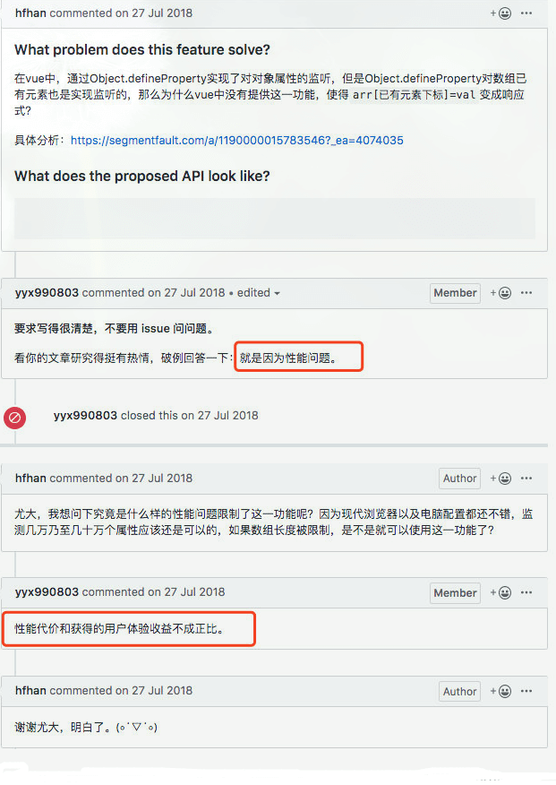
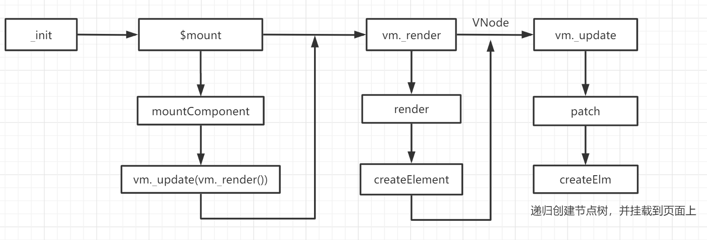

# JavaScript · 框架 React/Vue（17题）

## 说说 vue3 中的响应式设计原理


**参考答案：**

Vue 3 中的响应式原理可谓是非常之重要，通过学习 Vue3 的响应式原理，不仅能让我们学习到 Vue.js 的一些设计模式和思想，还能帮助我们提高项目开发效率和代码调试能力。


一、Vue 3 响应式使用

1. Vue 3 中的使用

当我们在学习 Vue 3 的时候，可以通过一个简单示例，看看什么是 Vue 3 中的响应式：

```JavaScript
<!-- HTML 内容 -->
<div id="app">
    <div>Price: {{price}}</div>
    <div>Total: {{price * quantity}}</div>
    <div>getTotal: {{getTotal}}</div>
</div>
```

```JavaScript
const app = Vue.createApp({ // ① 创建 APP 实例
    data() {
        return {
            price: 10,
            quantity: 2
        }
    },
    computed: {
        getTotal() {
            return this.price * this.quantity * 1.1
        }
    }
})
app.mount('#app')  // ② 挂载 APP 实例
```

通过创建 APP 实例和挂载 APP 实例即可，这时可以看到页面中分别显示对应数值： 


当我们修改 `price` 或 `quantity` 值的时候，页面上引用它们的地方，内容也能正常展示变化后的结果。这时，我们会好奇为何数据发生变化后，相关的数据也会跟着变化，那么我们接着往下看。

1. 实现单个值的响应式

在普通 JS 代码执行中，并不会有响应式变化，比如在控制台执行下面代码：

```JavaScript
let price = 10, quantity = 2;
const total = price * quantity;
console.log(`total: ${total}`); // total: 20
price = 20;
console.log(`total: ${total}`); // total: 20
```

从这可以看出，在修改 `price` 变量的值后， `total` 的值并没有发生改变。

那么如何修改上面代码，让 `total` 能够自动更新呢？我们其实可以将修改 `total` 值的方法保存起来，等到与 `total` 值相关的变量（如 `price` 或 `quantity` 变量的值）发生变化时，触发该方法，更新 `total` 即可。我们可以这么实现：

```JavaScript
let price = 10, quantity = 2, total = 0;
const dep = new Set(); // ① 
const effect = () => { total = price * quantity };
const track = () => { dep.add(effect) };  // ②
const trigger = () => { dep.forEach( effect => effect() )};  // ③

track();
console.log(`total: ${total}`); // total: 0
trigger();
console.log(`total: ${total}`); // total: 20
price = 20;
trigger();
console.log(`total: ${total}`); // total: 40
```

上面代码通过 3 个步骤，实现对 `total` 数据进行响应式变化：

① 初始化一个 `Set` 类型的 `dep` 变量，用来存放需要执行的副作用（ `effect` 函数），这边是修改 `total` 值的方法；

② 创建 `track()` 函数，用来将需要执行的副作用保存到 `dep` 变量中（也称收集副作用）；

③ 创建 `trigger()` 函数，用来执行 `dep` 变量中的所有副作用；

在每次修改 `price` 或 `quantity` 后，调用 `trigger()` 函数执行所有副作用后， `total` 值将自动更新为最新值。


3. 实现单个对象的响应式

通常，我们的对象具有多个属性，并且每个属性都需要自己的 `dep`。我们如何存储这些？比如：

```JavaScript
let product = { price: 10, quantity: 2 };
```

从前面介绍我们知道，我们将所有副作用保存在一个 `Set` 集合中，而该集合不会有重复项，这里我们引入一个 `Map` 类型集合（即 `depsMap` ），其 `key` 为对象的属性（如： `price` 属性）， `value` 为前面保存副作用的 `Set` 集合（如： `dep` 对象），大致结构如下图：


实现代码：

```JavaScript
let product = { price: 10, quantity: 2 }, total = 0;
const depsMap = new Map(); // ① 
const effect = () => { total = product.price * product.quantity };
const track = key => {     // ②
  let dep = depsMap.get(key);
  if(!dep) {
    depsMap.set(key, (dep = new Set()));
  }
  dep.add(effect);
}

const trigger = key => {  // ③
  let dep = depsMap.get(key);
  if(dep) {
    dep.forEach( effect => effect() );
  }
};

track('price');
console.log(`total: ${total}`); // total: 0
effect();
console.log(`total: ${total}`); // total: 20
product.price = 20;
trigger('price');
console.log(`total: ${total}`); // total: 40
```

上面代码通过 3 个步骤，实现对 `total` 数据进行响应式变化：

① 初始化一个 `Map` 类型的 `depsMap` 变量，用来保存每个需要响应式变化的对象属性（`key` 为对象的属性， `value` 为前面 `Set` 集合）；

② 创建 `track()` 函数，用来将需要执行的副作用保存到 `depsMap` 变量中对应的对象属性下（也称收集副作用）；

③ 创建 `trigger()` 函数，用来执行 `dep` 变量中指定对象属性的所有副作用；

这样就实现监听对象的响应式变化，在 `product` 对象中的属性值发生变化， `total` 值也会跟着更新。


4.实现多个对象的响应式

如果我们有多个响应式数据，比如同时需要观察对象 `a` 和对象 `b` 的数据，那么又要如何跟踪每个响应变化的对象？

这里我们引入一个 [WeakMap 类型](https://developer.mozilla.org/zh-CN/docs/Web/JavaScript/Reference/Global_Objects/WeakMap)的对象，将需要观察的对象作为 `key` ，值为前面用来保存对象属性的 Map 变量。代码如下：

```JavaScript
let product = { price: 10, quantity: 2 }, total = 0;
const targetMap = new WeakMap();     // ① 初始化 targetMap，保存观察对象
const effect = () => { total = product.price * product.quantity };
const track = (target, key) => {     // ② 收集依赖
  let depsMap = targetMap.get(target);
  if(!depsMap){
    targetMap.set(target, (depsMap = new Map()));
  }
  let dep = depsMap.get(key);
  if(!dep) {
    depsMap.set(key, (dep = new Set()));
  }
  dep.add(effect);
}

const trigger = (target, key) => {  // ③ 执行指定对象的指定属性的所有副作用
  const depsMap = targetMap.get(target);
  if(!depsMap) return;
    let dep = depsMap.get(key);
  if(dep) {
    dep.forEach( effect => effect() );
  }
};

track(product, 'price');
console.log(`total: ${total}`); // total: 0
effect();
console.log(`total: ${total}`); // total: 20
product.price = 20;
trigger(product, 'price');
console.log(`total: ${total}`); // total: 40
```

上面代码通过 3 个步骤，实现对 `total` 数据进行响应式变化：

① 初始化一个 `WeakMap` 类型的 `targetMap` 变量，用来要观察每个响应式对象；

② 创建 `track()` 函数，用来将需要执行的副作用保存到指定对象（ `target` ）的依赖中（也称收集副作用）；

③ 创建 `trigger()` 函数，用来执行指定对象（ `target` ）中指定属性（ `key` ）的所有副作用；

这样就实现监听对象的响应式变化，在 `product` 对象中的属性值发生变化， `total` 值也会跟着更新。


二、Proxy 和 Reflect

在上一节内容中，介绍了如何在数据发生变化后，自动更新数据，但存在的问题是，每次需要手动通过触发 `track()` 函数搜集依赖，通过 `trigger()` 函数执行所有副作用，达到数据更新目的。

这一节将来解决这个问题，实现这两个函数自动调用。

1. 如何实现自动操作

这里我们引入 JS 对象访问器的概念，解决办法如下：

- 在读取（GET 操作）数据时，自动执行 `track()` 函数自动收集依赖；
- 在修改（SET 操作）数据时，自动执行 `trigger()` 函数执行所有副作用；

那么如何拦截 GET 和 SET 操作？接下来看看 Vue2 和 Vue3 是如何实现的：

- 在 Vue2 中，使用 ES5 的 [`Object.defineProperty()`](https://developer.mozilla.org/zh-CN/docs/Web/JavaScript/Reference/Global_Objects/Object/defineProperty) 函数实现；
- 在 Vue3 中，使用 ES6 的 [`Proxy`](https://developer.mozilla.org/zh-CN/docs/Web/JavaScript/Reference/Global_Objects/Proxy) 和 [`Reflect`](https://developer.mozilla.org/zh-CN/docs/Web/JavaScript/Reference/Global_Objects/Reflect) API 实现；

需要注意的是：Vue3 使用的 `Proxy` 和 `Reflect` API 并不支持 IE。

[`Object.defineProperty()`](https://developer.mozilla.org/zh-CN/docs/Web/JavaScript/Reference/Global_Objects/Object/defineProperty) 函数这边就不多做介绍，可以阅读文档，下文将主要介绍 [`Proxy`](https://developer.mozilla.org/zh-CN/docs/Web/JavaScript/Reference/Global_Objects/Proxy) 和 [`Reflect`](https://developer.mozilla.org/zh-CN/docs/Web/JavaScript/Reference/Global_Objects/Reflect) API。

1. 如何使用 Reflect

通常我们有三种方法读取一个对象的属性：

1. 使用 `.` 操作符：`leo.name` ；
2. 使用 `[]` ： `leo['name']` ；
3. 使用 `Reflect` API： `Reflect.get(leo, 'name')` 。

这三种方式输出结果相同。

1. 如何使用 Proxy

Proxy 对象用于创建一个对象的代理，从而实现基本操作的拦截和自定义（如属性查找、赋值、枚举、函数调用等）。语法如下：

```JavaScript
const p = new Proxy(target, handler)
```

参数如下：

- target : 要使用 Proxy 包装的目标对象（可以是任何类型的对象，包括原生数组，函数，甚至另一个代理）。
- handler : 一个通常以函数作为属性的对象，各属性中的函数分别定义了在执行各种操作时代理 `p` 的行为。

我们通过官方文档，体验一下 [Proxy API](https://developer.mozilla.org/zh-CN/docs/Web/JavaScript/Reference/Global_Objects/Proxy)：

```JavaScript
let product = { price: 10, quantity: 2 };
let proxiedProduct = new Proxy(product, {
    get(target, key){
      console.log('正在读取的数据：',key);
    return target[key];
  }
})
console.log(proxiedProduct.price); 
// 正在读取的数据： price
// 10
```

这样就保证我们每次在读取 `proxiedProduct.price` 都会执行到其中代理的 get 处理函数。

然后结合 Reflect 使用，只需修改 get 函数：

```JavaScript
    get(target, key, receiver){
      console.log('正在读取的数据：',key);
    return Reflect.get(target, key, receiver);
  }
```

输出结果还是一样。

接下来增加 set 函数，来拦截对象的修改操作：

```JavaScript
let product = { price: 10, quantity: 2 };
let proxiedProduct = new Proxy(product, {
  get(target, key, receiver){
    console.log('正在读取的数据：',key);
    return Reflect.get(target, key, receiver);
  },
  set(target, key, value, receiver){
    console.log('正在修改的数据：', key, ',值为：', value);
    return Reflect.set(target, key, value, receiver);
  }
})
proxiedProduct.price = 20;
console.log(proxiedProduct.price); 
// 正在修改的数据： price ,值为： 20
// 正在读取的数据： price
// 20
```

这样便完成 get 和 set 函数来拦截对象的读取和修改的操作。为了方便对比 Vue 3 源码，我们将上面代码抽象一层，使它看起来更像 Vue3 源码：

```JavaScript
function reactive(target){
  const handler = {  // ① 封装统一处理函数对象
    get(target, key, receiver){
      console.log('正在读取的数据：',key);
      return Reflect.get(target, key, receiver);
    },
    set(target, key, value, receiver){
      console.log('正在修改的数据：', key, ',值为：', value);
      return Reflect.set(target, key, value, receiver);
    }
  }
  
  return new Proxy(target, handler); // ② 统一调用 Proxy API
}

let product = reactive({price: 10, quantity: 2}); // ③ 将对象转换为响应式对象
product.price = 20;
console.log(product.price); 
// 正在修改的数据： price ,值为： 20
// 正在读取的数据： price
// 20
```

这样输出结果仍然不变。

4.修改 track 和 trigger 函数

通过上面代码，我们已经实现一个简单 `reactive()` 函数，用来将普通对象转换为响应式对象。但是还缺少自动执行 `track()` 函数和 `trigger()` 函数，接下来修改上面代码：

```JavaScript
const targetMap = new WeakMap();
let total = 0;
const effect = () => { total = product.price * product.quantity };
const track = (target, key) => { 
  let depsMap = targetMap.get(target);
  if(!depsMap){
    targetMap.set(target, (depsMap = new Map()));
  }
  let dep = depsMap.get(key);
  if(!dep) {
    depsMap.set(key, (dep = new Set()));
  }
  dep.add(effect);
}

const trigger = (target, key) => {
  const depsMap = targetMap.get(target);
  if(!depsMap) return;
    let dep = depsMap.get(key);
  if(dep) {
    dep.forEach( effect => effect() );
  }
};

const reactive = (target) => {
  const handler = {
    get(target, key, receiver){
      console.log('正在读取的数据：',key);
      const result = Reflect.get(target, key, receiver);
      track(target, key);  // 自动调用 track 方法收集依赖
      return result;
    },
    set(target, key, value, receiver){
      console.log('正在修改的数据：', key, ',值为：', value);
      const oldValue = target[key];
      const result = Reflect.set(target, key, value, receiver);
      if(oldValue != result){
         trigger(target, key);  // 自动调用 trigger 方法执行依赖
      }
      return result;
    }
  }
  
  return new Proxy(target, handler);
}

let product = reactive({price: 10, quantity: 2}); 
effect();
console.log(total); 
product.price = 20;
console.log(total); 
// 正在读取的数据： price
// 正在读取的数据： quantity
// 20
// 正在修改的数据： price ,值为： 20
// 正在读取的数据： price
// 正在读取的数据： quantity
// 40
```


三、activeEffect 和 ref

在上一节代码中，还存在一个问题： `track` 函数中的依赖（ `effect` 函数）是外部定义的，当依赖发生变化， `track` 函数收集依赖时都要手动修改其依赖的方法名。

比如现在的依赖为 `foo` 函数，就要修改 `track` 函数的逻辑，可能是这样：

```JavaScript
const foo = () => { /**/ };
const track = (target, key) => {     // ②
  // ...
  dep.add(foo);
}
```

那么如何解决这个问题呢？

1. 引入 activeEffect 变量

接下来引入 `activeEffect` 变量，来保存当前运行的 effect 函数。

```JavaScript
let activeEffect = null;
const effect = eff => {
  activeEffect = eff; // 1. 将 eff 函数赋值给 activeEffect
  activeEffect();     // 2. 执行 activeEffect
  activeEffect = null;// 3. 重置 activeEffect
}
```

然后在 `track` 函数中将 `activeEffect` 变量作为依赖：

```JavaScript
const track = (target, key) => {
    if (activeEffect) {  // 1. 判断当前是否有 activeEffect
        let depsMap = targetMap.get(target);
        if (!depsMap) {
            targetMap.set(target, (depsMap = new Map()));
        }
        let dep = depsMap.get(key);
        if (!dep) {
            depsMap.set(key, (dep = new Set()));
        }
        dep.add(activeEffect);  // 2. 添加 activeEffect 依赖
    }
}
```

使用方式修改为：

```JavaScript
effect(() => {
    total = product.price * product.quantity
});
```

这样就可以解决手动修改依赖的问题，这也是 Vue3 解决该问题的方法。完善一下测试代码后，如下：

```JavaScript
const targetMap = new WeakMap();
let activeEffect = null; // 引入 activeEffect 变量

const effect = eff => {
  activeEffect = eff; // 1. 将副作用赋值给 activeEffect
  activeEffect();     // 2. 执行 activeEffect
  activeEffect = null;// 3. 重置 activeEffect
}

const track = (target, key) => {
    if (activeEffect) {  // 1. 判断当前是否有 activeEffect
        let depsMap = targetMap.get(target);
        if (!depsMap) {
            targetMap.set(target, (depsMap = new Map()));
        }
        let dep = depsMap.get(key);
        if (!dep) {
            depsMap.set(key, (dep = new Set()));
        }
        dep.add(activeEffect);  // 2. 添加 activeEffect 依赖
    }
}

const trigger = (target, key) => {
    const depsMap = targetMap.get(target);
    if (!depsMap) return;
    let dep = depsMap.get(key);
    if (dep) {
        dep.forEach(effect => effect());
    }
};

const reactive = (target) => {
    const handler = {
        get(target, key, receiver) {
            const result = Reflect.get(target, key, receiver);
            track(target, key);
            return result;
        },
        set(target, key, value, receiver) {
            const oldValue = target[key];
            const result = Reflect.set(target, key, value, receiver);
            if (oldValue != result) {
                trigger(target, key);
            }
            return result;
        }
    }

    return new Proxy(target, handler);
}

let product = reactive({ price: 10, quantity: 2 });
let total = 0, salePrice = 0;
// 修改 effect 使用方式，将副作用作为参数传给 effect 方法
effect(() => {
    total = product.price * product.quantity
});
effect(() => {
    salePrice = product.price * 0.9
});
console.log(total, salePrice);  // 20 9
product.quantity = 5;
console.log(total, salePrice);  // 50 9
product.price = 20;
console.log(total, salePrice);  // 100 18
```

思考一下，如果把第一个 `effect` 函数中 `product.price` 换成 `salePrice` 会如何：

```JavaScript
effect(() => {
    total = salePrice * product.quantity
});
effect(() => {
    salePrice = product.price * 0.9
});
console.log(total, salePrice);  // 0 9
product.quantity = 5;
console.log(total, salePrice);  // 45 9
product.price = 20;
console.log(total, salePrice);  // 45 18
```

得到的结果完全不同，因为 `salePrice` 并不是响应式变化，而是需要调用第二个 `effect` 函数才会变化，也就是 `product.price` 变量值发生变化。


2.引入 ref 方法

熟悉 Vue3 Composition API 的朋友可能会想到 Ref，它接收一个值，并返回一个响应式可变的[ Ref 对象](https://v3.cn.vuejs.org/api/refs-api.html)，其值可以通过 `value` 属性获取。

> ref：接受一个内部值并返回一个响应式且可变的 ref 对象。ref 对象具有指向内部值的单个 property .value。

官网的使用示例如下：

```JavaScript
const count = ref(0)
console.log(count.value) // 0

count.value++
console.log(count.value) // 1
```

我们有 2 种方法实现 ref 函数：

1. 使用 `reactive` 函数

```JavaScript
const ref = intialValue => reactive({value: intialValue});
```

这样是可以的，虽然 Vue3 不是这么实现。

2.使用对象的属性访问器（计算属性）

属性方式包括：[getter](https://developer.mozilla.org/zh-CN/docs/Web/JavaScript/Reference/Functions/get) 和 [setter](https://developer.mozilla.org/zh-CN/docs/Web/JavaScript/Reference/Functions/set)。

```JavaScript
const ref = raw => {
  const r = {
    get value(){
      track(r, 'value');
      return raw;
    },
    
    set value(newVal){
            raw = newVal;
      trigger(r, 'value');
    }
  }
  return r;
}
```

使用方式如下：

```JavaScript
let product = reactive({ price: 10, quantity: 2 });
let total = 0, salePrice = ref(0);
effect(() => {
    salePrice.value = product.price * 0.9
});
effect(() => {
    total = salePrice.value * product.quantity
});
console.log(total, salePrice.value); // 18 9
product.quantity = 5;
console.log(total, salePrice.value); // 45 9
product.price = 20;
console.log(total, salePrice.value); // 90 18
```

在 Vue3 中 ref 实现的核心也是如此。


四、实现简易 Computed 方法

用过 Vue 的同学可能会好奇，上面的 `salePrice` 和 `total` 变量为什么不使用 `computed` 方法呢？

没错，这个可以的，接下来一起实现个简单的 `computed` 方法。

```JavaScript
const computed = getter => {
    let result = ref();
    effect(() => result.value = getter());
    return result;
}

let product = reactive({ price: 10, quantity: 2 });
let salePrice = computed(() => {
    return product.price * 0.9;
})
let total = computed(() => {
    return salePrice.value * product.quantity;
})

console.log(total.value, salePrice.value);
product.quantity = 5;
console.log(total.value, salePrice.value);
product.price = 20;
console.log(total.value, salePrice.value);
```

这里我们将一个函数作为参数传入 `computed` 方法，`computed` 方法内通过 `ref` 方法构建一个 ref 对象，然后通过 `effct` 方法，将 `getter` 方法返回值作为 `computed` 方法的返回值。

这样我们实现了个简单的 `computed` 方法，执行效果和前面一样。


五、源码学习建议

1. 构建 reactivity.cjs.js

这一节介绍如何去从[ Vue 3 仓库](https://github.com/vuejs/vue-next)打包一个 Reactivity 包来学习和使用。

准备流程如下：

1. 从[ Vue 3 仓库](https://github.com/vuejs/vue-next)下载最新 Vue3 源码；

```JavaScript
git clone https://github.com/vuejs/vue-next.git
```

1. 安装依赖：

```JavaScript
yarn install
```

1. 构建 Reactivity 代码：

```JavaScript
yarn build reactivity
```

1. 复制 reactivity.cjs.js 到你的学习 demo 目录：
2. 学习 demo 中引入：

```JavaScript
const { reactive, computed, effect } = require("./reactivity.cjs.js");
```

2.Vue3 Reactivity 文件目录

在源码的 `packages/reactivity/src`目录下，有以下几个主要文件：

1. effect.ts：用来定义 `effect` / `track` / `trigger` ；
2. baseHandlers.ts：定义 Proxy 处理器（ get 和 set）；
3. reactive.ts：定义 `reactive` 方法并创建 ES6 Proxy；
4. ref.ts：定义 reactive 的 ref 使用的对象访问器；
5. computed.ts：定义计算属性的方法；


---

## Vue中，created和mounted两个钩子之间调用时间差值受什么影响？


**参考答案：**

`created` 和 `mounted` 这两个生命周期钩子，分别在实例创建和挂载的不同阶段被调用。

它们之间的时间差值主要受以下几个因素的影响：

1. 模板编译时间：

   - 当实例被创建时，Vue 会编译模板（或将模板转换为渲染函数），这个过程在 `created` 钩子之前完成。如果模板非常复杂或包含大量指令、组件，这个过程会更耗时，从而延长 `created` 和 `mounted` 之间的时间差。
2. 虚拟 DOM 渲染时间：

   - 在 `mounted` 钩子调用之前，Vue 会将虚拟 DOM 渲染为实际的 DOM 元素。渲染复杂的组件树或处理大量数据绑定会增加这段时间。
3. 异步操作：

   - 如果在 `created` 钩子中发起了异步操作（如 API 请求），这些操作本身不会直接影响 `created` 和 `mounted` 的时间差，但如果这些操作涉及数据更新，可能会间接增加挂载时间。
4. 浏览器性能：

   - 浏览器的性能和设备的硬件配置也会影响模板编译和 DOM 渲染的速度，从而影响这两个钩子之间的时间差。
5. 其他钩子执行时间：

   - 在 `beforeCreate`、`created`、`beforeMount` 等钩子中执行的代码也会影响到 `mounted` 钩子的触发时间。如果这些钩子中有大量计算或耗时操作，也会增加时间差。

总结起来，`created` 和 `mounted` 之间的时间差主要受到模板编译、虚拟 DOM 渲染的复杂性、异步操作、浏览器性能及其他生命周期钩子中执行代码的影响。在编写 Vue 应用时，优化这些方面可以减少 `created` 和 `mounted` 之间的时间差，提高应用性能。


---

## vue中，推荐在哪个生命周期发起请求？


**参考答案：**

推荐在 `mounted` 生命周期钩子中发起请求。这样做有几个重要的理由：

1. 确保 DOM 已经被渲染：

   - `mounted` 钩子在组件的 DOM 已经被插入文档之后调用。这意味着你可以确保所有的 DOM 元素都已经存在，如果你的请求结果需要直接操作或依赖这些 DOM 元素，那么在 `mounted` 中发起请求是安全的。
2. 避免不必要的请求：

   - 在 `created` 钩子中发起请求有时会导致在组件还没有挂载时请求数据。如果组件在请求完成之前被销毁，可能会引发内存泄漏或不必要的资源浪费。因此，等待组件挂载完成再发起请求可以减少这些潜在问题。
3. 处理组件状态：

   - 在 `mounted` 钩子中发起请求，能够确保你有机会在请求开始前处理组件的状态（例如设置加载状态），并且在请求完成后更新组件的状态（例如显示数据或处理错误）。

尽管 `mounted` 是推荐的生命周期钩子，但也有一些特定场景可能需要在 `created` 钩子中发起请求，例如：

- SSR（服务器端渲染）：在服务器端渲染中，Vue 实例的 `mounted` 钩子不会被调用，因为 DOM 并不会被真正挂载。在这种情况下，你可能需要在 `created` 钩子中发起请求。
- 依赖数据初始化：如果组件在挂载之前就需要某些数据来初始化，可以在 `created` 钩子中发起请求，以确保数据在组件挂载时已经可用。


代码示例

```JavaScript
export default {
  data() {
    return {
      items: [],
      loading: false,
      error: null
    };
  },
  mounted() {
    this.fetchData();
  },
  methods: {
    async fetchData() {
      this.loading = true;
      try {
        const response = await axios.get('/api/items');
        this.items = response.data;
      } catch (error) {
        this.error = error;
      } finally {
        this.loading = false;
      }
    }
  }
};
```

---

## React Portals 有什么用？


**参考答案：**

React Portals 是 React 提供的一种机制，用于将子组件渲染到父组件 DOM 层次结构之外的位置。它在处理一些特殊情况下的 UI 布局或交互时非常有用。以下是一些使用 React Portals 的常见情况：

1. 在模态框中使用： 当你需要在应用的根 DOM 结构之外显示模态框（对话框）时，React Portals 可以帮助你将模态框的内容渲染到根 DOM 之外的地方，而不影响布局。
2. 处理 z-index 问题： 在一些复杂的布局中，可能存在 z-index 的层级关系导致组件无法按照预期的方式叠加显示。使用 React Portals 可以将组件渲染到具有更高 z-index 的容器中，以解决这些问题。
3. 在全局位置显示组件： 如果你希望某个组件在页面的固定位置显示，而不受父组件的定位影响，React Portals 可以将该组件渲染到 body 或其他容器中。
4. 在动画中使用： 当你需要在页面中的某个位置执行动画时，React Portals 可以帮助你将动画的内容渲染到离该位置更近的 DOM 结构中，以提高动画性能。

使用 React Portals 的基本步骤如下：

```JavaScript
import React from 'react';
import ReactDOM from 'react-dom';

function MyPortalComponent() {
  return ReactDOM.createPortal(
    // 子组件的内容
    <div>
      This is rendered using a portal!
    </div>,
    // 渲染目标的 DOM 元素
    document.getElementById('portal-root')
  );
}

// 在应用的根组件中渲染 MyPortalComponent
function App() {
  return (
    <div>
      {/* 此处的内容在正常的 DOM 结构中 */}
      <p>This is a normal component.</p>

      {/* 使用 React Portals 渲染到 'portal-root' 元素外 */}
      <MyPortalComponent />
    </div>
  );
}

export default App;
```

在上面的例子中，`MyPortalComponent` 中的内容会被渲染到具有 id 为 'portal-root' 的 DOM 元素外。


---

## react 和 react-dom 是什么关系？


**参考答案：**

`react` 和 `react-dom` 是 React 库的两个主要部分，它们分别负责处理不同的事务。它们之间的关系可以理解为：

1. `react`： 这是 React 库的核心部分，包含了 React 的核心功能，如组件、状态、生命周期等。它提供了构建用户界面所需的基本构建块。当你编写 React 组件时，你实际上是在使用 `react` 包。
2. `react-dom`： 这是 React 专门为 DOM 环境提供的包，它包含了与浏览器 DOM 相关的功能。`react-dom` 提供了用于在浏览器中渲染 React 组件的方法，包括 `ReactDOM.render`。在 Web 开发中，`react-dom` 被用于将 React 应用渲染到浏览器的 DOM 中。

基本上，`react` 和 `react-dom` 是为了分离 React 的核心功能，以便更好地处理不同的环境和平台。这种分离使得 React 更加灵活，可以适应不同的渲染目标，而不仅仅局限于浏览器环境。

在使用 React 开发 Web 应用时，通常会同时安装和引入这两个包：

```JavaScript
npm install react react-dom
```

然后在代码中引入：

```JavaScript
import React from 'react';
import ReactDOM from 'react-dom';

const App = () => {
  return <h1>Hello, React!</h1>;
};

ReactDOM.render(<App />, document.getElementById('root'));
```

在上面的例子中，`react` 库提供了 `App` 组件的定义，而 `react-dom` 库提供了 `ReactDOM.render` 方法，用于将组件渲染到 HTML 页面中。这种分工让 React 在不同平台上能够更灵活地适应各种渲染目标。


---

## React 中为什么不直接使用 requestIdleCallback？


**参考答案：**

在React中，使用`requestIdleCallback`直接可能会导致一些问题，因此React并没有直接采用这个API。`requestIdleCallback`是一个浏览器提供的API，用于在浏览器空闲时执行任务，但在React中，有一些特殊的考虑：

1. 一致性问题： `requestIdleCallback`的执行时机不是完全可控的，这可能导致在不同环境中表现不一致。React希望提供一致的行为，以确保开发者在不同浏览器和设备上获得可预测的性能表现。
2. 实时性问题： React通常希望能够响应用户输入并立即更新UI，而`requestIdleCallback`执行的时机不一定能够满足实时性的需求。这可能导致用户体验上的问题，特别是在需要快速响应的场景中。
3. 调度器控制： React内部有一个任务调度器，负责管理和调度任务的执行。直接使用`requestIdleCallback`可能破坏React的任务调度策略，导致不可预测的结果。

为了解决这些问题，React引入了`Scheduler`模块，该模块允许React更好地控制任务的调度和执行。React可以根据自身的需要在不同优先级下安排任务，并确保在保证实时性的同时，提供一致的性能表现。

虽然`requestIdleCallback`是一个有趣的浏览器API，但在React这样的复杂UI库中，需要更高度的控制和一致性，因此React选择了自己实现任务调度和执行的机制。


---

## 为什么 react 需要 fiber 架构，而 Vue 却不需要？


**参考答案：**

React引入Fiber架构的主要原因是为了实现更好的异步渲染和更高效的任务调度。Fiber架构使得React能够更细粒度地控制和中断渲染过程，以便更好地响应用户交互、实现懒加载等功能。Vue在设计上采用了不同的策略，因此并不需要类似于Fiber的架构。

以下是一些原因解释为什么React选择了Fiber架构，而Vue没有类似的架构：

1. 异步渲染和任务优先级： React的Fiber架构使得实现异步渲染和任务优先级变得更加容易。这对于复杂的用户界面和大规模应用中的性能优化非常重要。React可以通过中断和恢复渲染过程，根据任务的优先级调度渲染工作，从而更好地响应用户输入和满足实时性要求。
2. 更好的中断和恢复机制： Fiber架构提供了一种更灵活的中断和恢复机制，允许React在渲染过程中暂停、中断，然后根据优先级恢复。这使得React能够更好地处理复杂的渲染逻辑，并在需要时放弃低优先级的工作。
3. 增量更新： Fiber允许React实现增量更新，即只更新变化的部分而不必重新渲染整个组件树。这对于提高渲染性能和减少不必要的工作非常有帮助。

Vue在设计上采用了一种不同的响应式系统和渲染机制，不需要像React那样进行复杂的中断和任务调度。Vue的设计目标可能更注重简洁性和开发体验，而React的目标之一是提供更灵活和强大的性能优化工具。每个框架在设计上都有权衡和取舍，选择适合其目标和使用场景的策略。


---

## 子组件是一个 Portal，发生点击事件能冒泡到父组件吗？


**参考答案：**

React 的 Portal 通过 React 的 context 和事件冒泡的机制工作。

在理解这个问题之前，首先要了解一些基本知识：

1. React Context：React 使用 context 来存储组件树的一些信息，比如事件处理程序。当组件使用 Portal 时，Portal 在 React 内部仍然保持在父组件树中，即使在 DOM 上渲染到其他地方。也就是说，Portal 的 context 依然从其父组件继承而来。
2. DOM 事件冒泡：DOM 中的事件（例如点击事件）通常会从触发事件的元素开始，然后逐步向上冒泡到父元素，直到 document 元素。在这个过程中，事件会按照 DOM 树的层级一层层地向上传递。
3. React 的事件代理：React 使用事件代理模式将所有事件都代理到顶层（`document` 或者 `root` DOM 节点）进行处理。这意味着当在子组件中触发一个事件时，无论子组件是否使用了 Portal，React 都会将事件传递到其父组件，然后逐级往上冒泡，直到到达代理事件的顶层。

在 React 中，当一个子组件使用 Portal 将其内容渲染到其他 DOM 节点时，尽管在 DOM 结构上子组件不再是父组件的直接子节点，但在 React 的组件树中，子组件仍然是父组件的子节点。这意味着 React 在监听和处理事件时，会沿着组件树的路径（而不是 DOM 树的路径）冒泡事件。因此，子组件中触发的事件仍然会冒泡到父组件。

总结：Portal 在 DOM 结构上将子组件渲染到其他位置，但在 React 的组件树中，它仍然是父组件的子组件。这使得事件可以从子组件沿着组件树冒泡到父组件。


---

## React 为什么要废弃 componentWillMount、componentWillReceiveProps、componentWillUpdate 这三个生命周期钩子？它们有哪些问题呢？React 又是如何解决的呢？


**参考答案：**

React 在 16.3 版本中：

- 将 `componentWillMount`、`componentWillReceiveProps`、`componentWillUpdate` 三个生命周期钩子加上了 `UNSAFE` 前缀，变为 `UNSAFE_componentWillMount`、`UNSAFE_componentWillReceiveProps` 和 `UNSAFE_componentWillUpdate`。
- 并引入了一个新的生命周期钩子：`getDerivedStateFromProps`。

并在 17.0 以及之后的版本中：

- 删除了 `componentWillMount`、`componentWillReceiveProps`、`componentWillUpdate` 这三个生命周期钩子。
- 不过 `UNSAFE_componentWillMount`、`UNSAFE_componentWillReceiveProps` 和 `UNSAFE_componentWillUpdate` 还是可以用的。

我们知道 React 的更新流程分为：render 阶段和 commit 阶段。

`componentWillMount`、`componentWillReceiveProps`、`componentWillUpdate` 这三个生命周期钩子都是在 render 阶段执行的。

在 fiber 架构被应用之前，render 阶段是不能被打断的。当页面逐渐复杂之后，就有可能会阻塞页面的渲染，于是 React 推出了 fiber 架构。在应用 fiber 架构之后，低优先级任务的 render 阶段可以被高优先级任务打断。

而这导致的问题就是：在 render 阶段执行的生命周期函数可能被执行多次。

componentWillMount、componentWillReceiveProps、componentWillUpdate 这三个生命周期钩子，如果我们在其中执行一些具有副作用的操作，例如发送网络请求，就有可能导致一个同样的网络请求被执行多次，这显然不是我们想看到的。

而 React 又没法强迫开发者不去这样做，因为怎么样使用 React 是开发者的自由，所以 React 就新增了一个静态的生命周期 `getDerivedStateFromProps`，来解决这个问题。

用一个静态函数 `getDerivedStateFromProps `来取代被废弃的几个生命周期函数，这样开发者就无法通过 this 获取到组件的实例，也不能发送网络请求以及调用 this.setState。它就是强制开发者在 render 之前只做无副作用的操作，间接强制我们无法进行这些不合理不规范的操作，从而避免对生命周期的滥用。


---

## 说说React render方法的原理？在什么时候会被触发？


**参考答案：**

一、原理

首先，`render`函数在`react`中有两种形式：

在类组件中，指的是`render`方法：

```JavaScript
class Foo extends React.Component {
    render() {
        return <h1> Foo </h1>;
    }
}
```

在函数组件中，指的是函数组件本身：

```JavaScript
function Foo() {
    return <h1> Foo </h1>;
}
```

在`render`中，我们会编写`jsx`，`jsx`通过`babel`编译后就会转化成我们熟悉的`js`格式，如下：

```JavaScript
return (
  <div className='cn'>
    <Header> hello </Header>
    <div> start </div>
    Right Reserve
  </div>
)
```

`babel`编译后：

```JavaScript
return (
  React.createElement(
    'div',
    {
      className : 'cn'
    },
    React.createElement(
      Header,
      null,
      'hello'
    ),
    React.createElement(
      'div',
      null,
      'start'
    ),
    'Right Reserve'
  )
)
```

从名字上来看，`createElement`方法用来创建元素的。

在`react`中，这个元素就是虚拟`DOM`树的节点，接收三个参数：

- type：标签
- attributes：标签属性，若无则为null
- children：标签的子节点

这些虚拟`DOM`树最终会渲染成真实`DOM`

在`render`过程中，`React` 将新调用的 `render `函数返回的树与旧版本的树进行比较，这一步是决定如何更新 `DOM` 的必要步骤，然后进行 `diff` 比较，更新 `DOM `树


二、触发时机

`render`的执行时机主要分成了两部分：

- 类组件调用 setState 修改状态

```JavaScript
class Foo extends React.Component {
  state = { count: 0 };

  increment = () => {
    const { count } = this.state;

    const newCount = count < 10 ? count + 1 : count;

    this.setState({ count: newCount });
  };

  render() {
    const { count } = this.state;
    console.log("Foo render");

    return (
      <div>
        <h1> {count} </h1>
        <button onClick={this.increment}>Increment</button>
      </div>
    );
  }
}
```

点击按钮，则调用`setState`方法，无论`count`是否发生变化，控制台都会输出`Foo render`，这就证明`render`执行了

- 函数组件通过`useState hook`修改状态

```JavaScript
function Foo() {
  const [count, setCount] = useState(0);

  function increment() {
    const newCount = count < 10 ? count + 1 : count;
    setCount(newCount);
  }

  console.log("Foo render");
  
  return (
    <div>
      <h1> {count} </h1>
      <button onClick={increment}>Increment</button>
    </div>
  );
}
```

函数组件通过`useState`这种形式更新数据，当数组的值不发生改变了，就不会触发`render`

- 类组件重新渲染

```JavaScript
class App extends React.Component {
  state = { name: "App" };
  render() {
    return (
      <div className="App">
        <Foo />
        <button onClick={() => this.setState({ name: "App" })}>
          Change name
        </button>
      </div>
    );
  }
}

function Foo() {
  console.log("Foo render");

  return (
    <div>
      <h1> Foo </h1>
    </div>
  );
}
```

只要点击了 `App` 组件内的 `Change name` 按钮，不管 `Foo` 具体实现是什么，都会被重新`render`渲染

- 函数组件重新渲染

```JavaScript
function App(){
    const [name,setName] = useState('App')

    return (
        <div className="App">
            <Foo />
            <button onClick={() => setName("aaa")}>
                { name }
            </button>
      </div>
    )
}

function Foo() {
  console.log("Foo render");

  return (
    <div>
      <h1> Foo </h1>
    </div>
  );
}
```

可以发现，使用`useState`来更新状态的时候，只有首次会触发`Foo render`，后面并不会导致`Foo render`

三、总结

`render`函数里面可以编写`JSX`，转化成`createElement`这种形式，用于生成虚拟`DOM`，最终转化成真实`DOM`

在` React` 中，类组件只要执行了 `setState` 方法，就一定会触发 `render` 函数执行，函数组件使用`useState`更改状态不一定导致重新`render`

组件的` props` 改变了，不一定触发 `render` 函数的执行，但是如果 `props` 的值来自于父组件或者祖先组件的 `state`

在这种情况下，父组件或者祖先组件的 `state` 发生了改变，就会导致子组件的重新渲染

所以，一旦执行了`setState`就会执行`render`方法，`useState` 会判断当前值有无发生改变确定是否执行`render`方法，一旦父组件发生渲染，子组件也会渲染


---

## 说说React事件和原生事件的执行顺序


**参考答案：**

我们知道，`React`在内部对事件做了统一的处理，合成事件是一个比较大的概念

为什么要有合成事件

1. 在传统的事件里，不同的浏览器需要兼容不同的写法，在合成事件中`React`提供统一的事件对象，抹平了浏览器的兼容性差异
2. `React`通过顶层监听的形式，通过事件委托的方式来统一管理所有的事件，可以在事件上区分事件优先级，优化用户体验

`React`在合成事件上对于`16`版本和`17`版本的合成事件有很大不同，我们也会简单聊聊区别。


概念

事件委托

事件委托的意思就是可以通过给父元素绑定事件委托，通过事件对象的`target`属性可以获取到当前触发目标阶段的`dom`元素，来进行统一管理

比如写原生`dom`循环渲染的时候，我们要给每一个子元素都添加`dom`事件，这种情况最简单的方式就是通过事件委托在父元素做一次委托，通过`target`属性判断区分做不同的操作

事件监听

事件监听主要用到了`addEventListener`这个函数，具体怎么用可以[点击](https://developer.mozilla.org/zh-CN/docs/Web/API/EventTarget/addEventListener)进行查看 事件监听和事件绑定的最大区别就是事件监听可以给一个事件监听多个函数操作，而事件绑定只有一次

```JavaScript
// 可以监听多个，不会被覆盖
eventTarget.addEventListener('click', () => {});
eventTarget.addEventListener('click', () => {});

eventTarget.onclick = function () {};
eventTarget.onclick = function () {}; // 第二个会把第一个覆盖
```

事件执行顺序

```JavaScript
<div>
  <span>点我</span>
</div>
```

当我们点击`span`标签的时候会经过这么三个过程，在路径内的元素绑定的事件都会进行触发

> 捕获阶段 => 目标阶段 => 冒泡阶段


合成事件

在看之前先看一下这几个问题

- 原生事件和合成事件的执行顺序是什么？
- 合成事件在什么阶段下会被执行？
- 阻止原生事件的冒泡，会影响到合成事件的执行吗？
- 阻止合成事件的冒泡，会影响到原生事件的执行吗？

下面一个例子说清楚，

```JavaScript
import React, { useRef, useEffect } from "react";
import "./styles.css";

const logFunc = (target, isSynthesizer, isCapture = false) => {
    const info = `${isSynthesizer ? "合成" : "原生"}事件，${
        isCapture ? "捕获" : "冒泡"}阶段，${target}元素执行了`;
    
    console.log(info);
};

const batchManageEvent = (targets, funcs, isRemove = false) => {
    targets.forEach((target, targetIndex) => {
        funcs[targetIndex].forEach((func, funcIndex) => {
            target[isRemove ? "removeEventListener" : "addEventListener"](
                "click",
                func,
                !funcIndex
            );
        });
    });
};

export default function App() {
    const divDom = useRef();
    const h1Dom = useRef();
    useEffect(() => {
    
        const docClickCapFunc = () => logFunc("document", false, true);
        const divClickCapFunc = () => logFunc("div", false, true);
        const h1ClickCapFunc = () => logFunc("h1", false, true);
        const docClickFunc = () => logFunc("document", false);
        const divClickFunc = () => logFunc("div", false);
        const h1ClickFunc = () => logFunc("h1", false);

        batchManageEvent(
            [document, divDom.current, h1Dom.current],
            [
                [docClickCapFunc, docClickFunc],
                [divClickCapFunc, divClickFunc],
                [h1ClickCapFunc, h1ClickFunc]
            ]
        );

        return () => {
            batchManageEvent(
                   [document, divDom.current, h1Dom.current],
                [
                    [docClickCapFunc, docClickFunc],
                    [divClickCapFunc, divClickFunc],
                    [h1ClickCapFunc, h1ClickFunc]
                ],
                true
            );
        };
    }, []);

    return (
        <div
          ref={divDom}
          className="App1"
          onClickCapture={() => logFunc("div", true, true)}
          onClick={() => logFunc("div", true)}
        >
          <h1
            ref={h1Dom}
            onClickCapture={() => logFunc("h1", true, true)}
            onClick={() => logFunc("h1", true)}
          >
            Hello CodeSandbox
          </h1>
        </div>
    );
}
```

看这个例子，当我们点击`h1`的时候

会先执行原生事件事件流，当执行到`document`的冒泡阶段的时候做了个拦截，在这个阶段开始执行合成事件

知道上面的概念，那我们回答开始阶段的后面两个问题

当我们把上面的`demo`的原生`div`的`stopPropagation()`  方法调用阻止捕获和冒泡阶段中当前事件的进一步传播，会阻止后续的所有事件执行

```JavaScript
// ...
const divClickCapFunc = (e) => {
    e.stopPropagation(); // 增加原生捕获阶段的阻止事件
    logFunc("div", false, true);
};
// ...
```

我们可以看到，当阻止之后，我们点击`h1`，事件流运行到`div`的捕获阶段就不触发了，后续的所有的包括合成事件也都不会触发

那当我们给合成事件的事件流中断了会发生什么呢？

可以看到运行到捕获阶段的`div`之后被阻止传播了，后续的所有合成事件都不会执行了，但是原生的`document`冒泡还是会执行完。


模拟阶段

```JavaScript
<!DOCTYPE html>
<html lang="en">
  <head>
    <meta charset="utf-8" />
    <meta name="viewport" content="width=device-width, initial-scale=1.0, maximum-scale=1.0, maximum-scale=1, user-scalable=no" />
    <meta name="theme-color" content="#000000" />
    <meta name="description" content="Web site created using create-react-app" />
    <link href="favicon.ico" type="image/x-icon" rel="icon" />
    <title>浅谈React合成事件</title>
  </head>
  <body>
    <div id="wrapper">
      <h1 id="content">hello</h1>
    </div>
  </body>
  <script>
    const logFunc = (target, isSynthesizer, isCapture = false) => {
      const info = `${isSynthesizer ? '合成' : '原生'}事件，${isCapture ? '捕获' : '冒泡'}阶段，${target}元素执行了`;
      console.log(info);
    };
    // document的派发事件函数
    const dispatchEvent = currentDom => {
      let current = currentDom;
      let eventCallbacks = []; // 存储冒泡事件回调函数
      let eventCaptureCallbacks = []; // 存储冒泡事件回调函数
      // 收集事件流一路上的所有回调函数
      while (current) {
        if (current.onClick) {
          eventCallbacks.push(current.onClick);
        }
        if (current.onClickCapture) {
          // 捕获阶段由外到内，所以需要把回调函数放到数组的最前面
          eventCaptureCallbacks.unshift(current.onClickCapture);
        }
        current = current.parentNode;
      }
      // 执行调用
      eventCaptureCallbacks.forEach(callback => callback());
      eventCallbacks.forEach(callback => callback());
    };
    const wrapperDom = document.getElementById('wrapper');
    const contentDom = document.getElementById('content');

    // 一路上注册原生事件
    document.addEventListener('click', () => logFunc('document', false, true), true);
    wrapperDom.addEventListener('click', () => logFunc('div', false, true), true);
    contentDom.addEventListener('click', () => logFunc('h1', false, true), true);
    contentDom.addEventListener('click', () => logFunc('h1', false));
    wrapperDom.addEventListener('click', () => logFunc('div', false));
    document.addEventListener('click', e => {
      dispatchEvent(e.target); // 这里收集一路上的事件进行派发
      logFunc('document', false);
    });

    // 模拟合成事件
    wrapperDom.onClick = () => logFunc('div', true);
    wrapperDom.onClickCapture = () => logFunc('div', true, true);
    contentDom.onClick = () => logFunc('h1', true);
    contentDom.onClickCapture = () => logFunc('h1', true, true);
  </script>
</html>
```

点击`h1`可以看到一路上的注册的所有事件已经执行了

`React16`给`document`上加的统一的拦截判发事件会在一定情况下出问题，下面举个例子简单说明一下


16案例

```JavaScript
import React, { useEffect, useState } from 'react';
import './styles.css';

const Modal = ({ onClose }) => {
  useEffect(() => {
    document.addEventListener('click', onClose);
    return () => {
      document.removeEventListener('click', onClose);
    };
  }, [onClose]);
  return (
    <div
      style={{ width: 300, height: 300, backgroundColor: 'red' }}
      onClick={e => {
        e.stopPropagation();
        // e.nativeEvent.stopImmediatePropagation();
      }}
    >
      Modal
    </div>
  );
};

function App() {
  const [visible, setVisible] = useState(false);
  return (
    <div className="App">
      <button
        onClick={() => {
          setVisible(true);
        }}
      >
        点我弹出modal
      </button>
      {visible && <Modal onClose={() => setVisible(false)} />}
    </div>
  );
}
export default App;
```

写完之后点击按钮`Modal`被弹出来, 但是点击`modal`里面的内容`modal`就隐藏了，添加阻止事件流函数还是不行

原因就是点击之后，事件冒泡到`document`上，同时也执行了他身上挂载的方法，解决办法就是给点击事件添加 `e.nativeEvent.stopImmediatePropagation();`

`stopImmediatePropagation`和`stopPropagation`的区别就是，前者会阻止当前节点下所有的事件监听的函数，后者不会

那`react17`及之后做了什么改变呢


16和17的区别

在`17`版本中，`React`把事件节点绑定函数绑定在了`render`的根节点上，避免了上述的问题,

用上面的`demo`的在线案例把版本改成17之后，可以发现事件的执行顺序变了


模拟17版本

```JavaScript
<!DOCTYPE html>
<html lang="en">
  <head>
    <meta charset="utf-8" />
    <meta name="viewport" content="width=device-width, initial-scale=1.0, maximum-scale=1.0, maximum-scale=1, user-scalable=no" />
    <meta name="theme-color" content="#000000" />
    <meta name="description" content="Web site created using create-react-app" />
    <link href="favicon.ico" type="image/x-icon" rel="icon" />
    <title>浅谈React合成事件</title>
  </head>
  <body>
    <div id="root">
      <div id="wrapper">
        <h1 id="content">hello</h1>
      </div>
    </div>
  </body>
  <script>
    const logFunc = (target, isSynthesizer, isCapture = false) => {
      const info = `${isSynthesizer ? '合成' : '原生'}事件，${isCapture ? '捕获' : '冒泡'}阶段，${target}元素执行了`;
      console.log(info);
    };
    // document的派发事件函数
    const dispatchEvent = (currentDom, useCapture = false) => {
      let current = currentDom;
      let eventCallbacks = []; // 存储冒泡事件回调函数
      const eventTypeName = useCapture ? 'onClickCapture' : 'onClick'; // 冒泡事件或者捕获事件的名称
      const actionName = useCapture ? 'unshift' : 'push';
      while (current) {
        if (current[eventTypeName]) {
          eventCallbacks[actionName](current[eventTypeName]);
        }
        current = current.parentNode;
      }
      eventCallbacks.forEach(callback => callback());
    };
    const wrapperDom = document.getElementById('wrapper');
    const contentDom = document.getElementById('content');
    const root = document.getElementById('root');

    // 一路上注册原生事件
    document.addEventListener('click', () => logFunc('document', false, true), true);
    root.addEventListener(
      'click',
      e => {
        dispatchEvent(e.target, true);
        logFunc('root', false, true);
      },
      true
    );
    wrapperDom.addEventListener('click', () => logFunc('div', false, true), true);
    contentDom.addEventListener('click', () => logFunc('h1', false, true), true);
    contentDom.addEventListener('click', () => logFunc('h1', false));
    wrapperDom.addEventListener('click', () => logFunc('div', false));
    root.addEventListener('click', e => {
      dispatchEvent(e.target); // 这里收集一路上的事件进行派发
      logFunc('root', false);
    });
    document.addEventListener('click', () => logFunc('document', false));
    // 模拟合成事件
    wrapperDom.onClick = () => logFunc('div', true);
    wrapperDom.onClickCapture = () => logFunc('div', true, true);
    contentDom.onClick = () => logFunc('h1', true);
    contentDom.onClickCapture = () => logFunc('h1', true, true);
  </script>
</html>
```

区别就是在外层增加了一个`root`模拟根节点，修改了`dispatchEvent`的逻辑

可以看到，效果已经和`17`版本的一样了

回看`16demo`，切换版本到`17`，当我们切换到`17`的时候，用`stopPropagation`就可以解决问题了, 原因就是他在`root`节点上绑定的事件冒泡函数，`stopPropagation`切断了事件流，不会流向到`document`身上了


总结

- `16`版本先执行原生事件，当冒泡到`document`时，统一执行合成事件，
- `17`版本在原生事件执行前先执行合成事件捕获阶段，原生事件执行完毕执行冒泡阶段的合成事件,通过根节点来管理所有的事件

原生的阻止事件流会阻断合成事件的执行，合成事件阻止后也会影响到后续的原生执行

---

## Vue2.0为什么不能检查数组的变化，该怎么解决？


**参考答案：**

前言

我们都知道，Vue2.0对于响应式数据的实现有一些不足：

- 无法检测数组/对象的新增
- 无法检测通过索引改变数组的操作。


分析

- 无法检测数组/对象的新增？

Vue检测数据的变动是通过Object.defineProperty实现的，所以无法监听数组的添加操作是可以理解的，因为是在构造函数中就已经为所有属性做了这个检测绑定操作。

- 无法检测通过索引改变数组的操作。即vm.items[indexOfItem] = newValue？

[官方文档](https://cn.vuejs.org/v2/guide/list.html#%E6%B3%A8%E6%84%8F%E4%BA%8B%E9%A1%B9)中对于这两点都是简要的概括为“由于JavaScript的限制”无法实现，而Object.defineProperty是实现检测数据改变的方案，这个限制是指Object.defineProperty


思考

vm.items[indexOfItem] = newValue真的不能被监听么？

> Vue对数组的7个变异方法（push、pop、shift、unshift、splice、sort、reverse）实现了响应式。这里就不做测试了。我们测试一下通过索引改变数组的操作，能不能被监听到。
> 
> 遍历数组，用Object.defineProperty对每一项进行监测

```JavaScript
function defineReactive(data, key, value) {
         Object.defineProperty(data, key, {
                 enumerable: true,
                 configurable: true,
                 get: function defineGet() {
                         console.log(`get key: ${key} value: ${value}`)
                         return value
                 },
                 set: function defineSet(newVal) {
                         console.log(`set key: ${key} value: ${newVal}`)
                         value = newVal
                 }
         })
}
 
function observe(data) {
        Object.keys(data).forEach(function(key) {
                defineReactive(data, key, data[key])
        })
}
 
let arr = [1, 2, 3]
observe(arr)
```

![图片展示了在浏览器控制台中对数组进行操作的示例。先是将arr\[1\]赋值为2，接着触发了set操作，显示key: 1 value: 2，最终返回2。这与上下文内容相关，上下文提到通过索引改变数组的操作能被Object.defineProperty监测到，而图片正是通过实际操作验证了这一情况，展示了通过索引改变数组时触发的set操作，从而说明了Object.defineProperty可以检测到此类操作。](../imgs/GkuobRN0xoiC7rxkZwVcGhlmnPf.png)

测试说明

通过索引改变arr[1]，我们发现触发了set，也就是Object.defineProperty是可以检测到通过索引改变数组的操作的，那Vue2.0为什么没有实现呢？是尤大能力不行？这肯定毋庸置疑。那他为什么不实现呢？



小结：是出于对性能原因的考虑，没有去实现它。而不是不能实现。

对于对象而言，每一次的数据变更都会对对象的属性进行一次枚举，一般对象本身的属性数量有限，所以对于遍历枚举等方式产生的性能损耗可以忽略不计，但是对于数组而言呢？数组包含的元素量是可能达到成千上万，假设对于每一次数组元素的更新都触发了枚举/遍历，其带来的性能损耗将与获得的用户体验不成正比，故vue无法检测数组的变动。

不过Vue3.0用proxy代替了defineProperty之后就解决了这个问题。


解决方案

数组

1. this.\$set(array, index, data)

```JavaScript
//这是个深度的修改，某些情况下可能导致你不希望的结果，因此最好还是慎用
this.dataArr = this.originArr
this.$set(this.dataArr, 0, {data: '修改第一个元素'})
console.log(this.dataArr)        
console.log(this.originArr)  //同样的 源数组也会被修改 在某些情况下会导致你不希望的结果 
```

1. splice

```JavaScript
//因为splice会被监听有响应式，而splice又可以做到增删改。
```

1. 利用临时变量进行中转

```JavaScript
let tempArr = [...this.targetArr]
tempArr[0] = {data: 'test'}
this.targetArr = tempArr
```

对象

1. this.\$set(obj, key ,value) - 可实现增、改
2. watch时添加`deep：true`深度监听，只能监听到属性值的变化，新增、删除属性无法监听

```JavaScript
this.$watch('blog', this.getCatalog, {
    deep: true
    // immediate: true // 是否第一次触发
  });
```

1. watch时直接监听某个key

```JavaScript
watch: {
  'obj.name'(curVal, oldVal) {
    // TODO
  }
}
```


---

## 说说Vue 页面渲染流程


**参考答案：**

前言

在 `Vue` 核心中除了响应式原理外，视图渲染也是重中之重。我们都知道每次更新数据，都会走视图渲染的逻辑，而这当中牵扯的逻辑也是十分繁琐。

本文主要解析的是初始化视图渲染流程，你将会了解到从挂载组件开始，`Vue` 是如何构建 `VNode`，又是如何将 `VNode` 转为真实节点并挂载到页面。


挂载组件(\$mount)

`Vue` 是一个构造函数，通过 `new` 关键字进行实例化。

```JavaScript
// src/core/instance/index.js
function Vue (options) {
  if (process.env.NODE_ENV !== 'production' &&
    !(this instanceof Vue)
  ) {
    warn('Vue is a constructor and should be called with the `new` keyword')
  }
  this._init(options)
}
```

在实例化时，会调用 `_init` 进行初始化。

```JavaScript
// src/core/instance/init.js
Vue.prototype._init = function (options?: Object) {
    const vm: Component = this
    // ...
    if (vm.$options.el) {
      vm.$mount(vm.$options.el)
    }
  }
```

`_init` 内会调用 `$mount` 来挂载组件，而 `$mount` 方法实际调用的是 `mountComponent`。

```JavaScript
// src/core/instance/lifecycle.js
export function mountComponent (
  vm: Component,
  el: ?Element,
  hydrating?: boolean
): Component {
  vm.$el = el
  // ...
  callHook(vm, 'beforeMount')

  let updateComponent
  /* istanbul ignore if */
  if (process.env.NODE_ENV !== 'production' && config.performance && mark) {
    // ...
  } else {
    updateComponent = () => {
      vm._update(vm._render(), hydrating)  // 渲染页面函数
    }
  }

  // we set this to vm._watcher inside the watcher's constructor
  // since the watcher's initial patch may call $forceUpdate (e.g. inside child
  // component's mounted hook), which relies on vm._watcher being already defined
  new Watcher(vm, updateComponent, noop, { //  渲染watcher
    before () {
      if (vm._isMounted && !vm._isDestroyed) {
        callHook(vm, 'beforeUpdate')
      }
    }
  }, true /* isRenderWatcher */)
  hydrating = false

  // manually mounted instance, call mounted on self
  // mounted is called for render-created child components in its inserted hook
  if (vm.$vnode == null) {
    vm._isMounted = true
    callHook(vm, 'mounted')
  }
  return vm
}
```

`mountComponent` 除了调用一些生命周期的钩子函数外，最主要是 `updateComponent`，它就是负责渲染视图的核心方法，其只有一行核心代码：

```JavaScript
vm._update(vm._render(), hydrating)
```

`vm._render` 创建并返回 `VNode`，`vm._update` 接受 `VNode` 将其转为真实节点。

`updateComponent` 会被传入 `渲染Watcher`，每当数据变化触发 `Watcher` 更新就会执行该函数，重新渲染视图。`updateComponent` 在传入 `渲染Watcher` 后会被执行一次进行初始化页面渲染。

所以我们着重分析的是 `vm._render` 和 `vm._update` 两个方法，这也是本文主要了解的原理——`Vue` 视图渲染流程。


构建VNode(\_render)

首先是 `_render` 方法，它用来构建组件的 `VNode`。

```JavaScript
// src/core/instance/render.js
Vue.prototype._render = function () {
    const { render, _parentVnode } = vm.$options
    vnode = render.call(vm._renderProxy, vm.$createElement)
    return vnode
}
```

`_render` 内部会执行 `render` 方法并返回构建好的 `VNode`。`render` 一般是模板编译后生成的方法，也有可能是用户自定义。

```JavaScript
// src/core/instance/render.js
export function initRender (vm) {
    vm._c = (a, b, c, d) => createElement(vm, a, b, c, d, false)
    vm.$createElement = (a, b, c, d) => createElement(vm, a, b, c, d, true)
}
```

`initRender` 在初始化就会执行为实例上绑定两个方法，分别是 `vm._c` 和 `vm.$createElement`。它们两者都是调用 `createElement` 方法，它是创建 `VNode` 的核心方法，最后一个参数用于区别是否为用户自定义。

`vm._c` 应用场景是在编译生成的 `render` 函数中调用，`vm.$createElement` 则用于用户自定义 `render` 函数的场景。就像上面 `render` 在调用时会传入参数 `vm.$createElement`，我们在自定义 `render` 函数接收到的参数就是它。


createElement

```JavaScript
// src/core/vdom/create-elemenet.js
export function createElement (
  context: Component,
  tag: any,
  data: any,
  children: any,
  normalizationType: any,
  alwaysNormalize: boolean
): VNode | Array<VNode> {
  if (Array.isArray(data) || isPrimitive(data)) {
    normalizationType = children
    children = data
    data = undefined
  }
  if (isTrue(alwaysNormalize)) {
    normalizationType = ALWAYS_NORMALIZE
  }
  return _createElement(context, tag, data, children, normalizationType)
}
```

`createElement` 方法实际上是对 `_createElement` 方法的封装，它允许传入的参数更加灵活。

```JavaScript
export function _createElement (
  context: Component,
  tag?: string | Class<Component> | Function | Object,
  data?: VNodeData,
  children?: any,
  normalizationType?: number
): VNode | Array<VNode> {
  if (isDef(data) && isDef(data.is)) {
    tag = data.is
  }
  if (!tag) {
    // in case of component :is set to falsy value
    return createEmptyVNode()
  }
  // support single function children as default scoped slot
  if (Array.isArray(children) &&
    typeof children[0] === 'function'
  ) {
    data = data || {}
    data.scopedSlots = { default: children[0] }
    children.length = 0
  }
  if (normalizationType === ALWAYS_NORMALIZE) {
    children = normalizeChildren(children)
  } else if (normalizationType === SIMPLE_NORMALIZE) {
    children = simpleNormalizeChildren(children)
  }
  let vnode, ns
  if (typeof tag === 'string') {
    let Ctor
    ns = (context.$vnode && context.$vnode.ns) || config.getTagNamespace(tag)
    if (config.isReservedTag(tag)) {
      // platform built-in elements
      vnode = new VNode(
        config.parsePlatformTagName(tag), data, children,
        undefined, undefined, context
      )
    } else if (isDef(Ctor = resolveAsset(context.$options, 'components', tag))) {
      // component
      vnode = createComponent(Ctor, data, context, children, tag)
    } else {
      // unknown or unlisted namespaced elements
      // check at runtime because it may get assigned a namespace when its
      // parent normalizes children
      vnode = new VNode(
        tag, data, children,
        undefined, undefined, context
      )
    }
  } else {
    // direct component options / constructor
    vnode = createComponent(tag, data, context, children)
  }
  if (Array.isArray(vnode)) {
    return vnode
  } else if (isDef(vnode)) {
    if (isDef(ns)) applyNS(vnode, ns)
    if (isDef(data)) registerDeepBindings(data)
    return vnode
  } else {
    return createEmptyVNode()
  }
}
```

`_createElement` 参数中会接收 `children`，它表示当前 `VNode` 的子节点，因为它是任意类型的，所以接下来需要将其规范为标准的 `VNode` 数组；

```JavaScript
// 这里规范化 children
if (normalizationType === ALWAYS_NORMALIZE) {
  children = normalizeChildren(children)
} else if (normalizationType === SIMPLE_NORMALIZE) {
  children = simpleNormalizeChildren(children)
}
```

`simpleNormalizeChildren` 和 `normalizeChildren` 均用于规范化 `children`。由 `normalizationType` 判断 `render` 函数是编译生成的还是用户自定义的。

```JavaScript
// 1. When the children contains components - because a functional component
// may return an Array instead of a single root. In this case, just a simple
// normalization is needed - if any child is an Array, we flatten the whole
// thing with Array.prototype.concat. It is guaranteed to be only 1-level deep
// because functional components already normalize their own children.
export function simpleNormalizeChildren (children: any) {
  for (let i = 0; i < children.length; i++) {
    if (Array.isArray(children[i])) {
      return Array.prototype.concat.apply([], children)
    }
  }
  return children
}

// 2. When the children contains constructs that always generated nested Arrays,
// e.g. <template>, <slot>, v-for, or when the children is provided by user
// with hand-written render functions / JSX. In such cases a full normalization
// is needed to cater to all possible types of children values.
export function normalizeChildren (children: any): ?Array<VNode> {
  return isPrimitive(children)
    ? [createTextVNode(children)]
    : Array.isArray(children)
      ? normalizeArrayChildren(children)
      : undefined
}
```

`simpleNormalizeChildren` 方法调用场景是 render 函数当函数是编译生成的。`normalizeChildren` 方法的调用场景主要是 render 函数是用户手写的。

经过对 `children` 的规范化，`children` 变成了一个类型为 `VNode` 的数组。之后就是创建 `VNode` 的逻辑。

```JavaScript
// src/core/vdom/patch.js
let vnode, ns
if (typeof tag === 'string') {
  let Ctor
  ns = (context.$vnode && context.$vnode.ns) || config.getTagNamespace(tag)
  if (config.isReservedTag(tag)) {
    // platform built-in elements
    vnode = new VNode(
      config.parsePlatformTagName(tag), data, children,
      undefined, undefined, context
    )
  } else if (isDef(Ctor = resolveAsset(context.$options, 'components', tag))) {
    // component
    vnode = createComponent(Ctor, data, context, children, tag)
  } else {
    // unknown or unlisted namespaced elements
    // check at runtime because it may get assigned a namespace when its
    // parent normalizes children
    vnode = new VNode(
      tag, data, children,
      undefined, undefined, context
    )
  }
} else {
  // direct component options / constructor
  vnode = createComponent(tag, data, context, children)
}
```

如果 `tag` 是 `string` 类型，则接着判断如果是内置的一些节点，创建一个普通 `VNode`；如果是为已注册的组件名，则通过 `createComponent` 创建一个组件类型的 `VNode`；否则创建一个未知的标签的 `VNode`。

如果 `tag` 不是 `string` 类型，那就是 `Component` 类型, 则直接调用 `createComponent` 创建一个组件类型的 `VNode` 节点。

最后 `_createElement` 会返回一个 `VNode`，也就是调用 `vm._render` 时创建得到的`VNode`。之后 `VNode` 会传递给 `vm._update` 函数，用于生成真实dom。


生成真实dom(\_update)

```JavaScript
// src/core/instance/lifecycle.js
Vue.prototype._update = function (vnode: VNode, hydrating?: boolean) {
  const vm: Component = this
  const prevEl = vm.$el
  const prevVnode = vm._vnode
  const prevActiveInstance = activeInstance
  activeInstance = vm
  vm._vnode = vnode
  // Vue.prototype.__patch__ is injected in entry points
  // based on the rendering backend used.
  if (!prevVnode) {
    // initial render
    vm.$el = vm.__patch__(vm.$el, vnode, hydrating, false /* removeOnly */)
  } else {
    // updates
    vm.$el = vm.__patch__(prevVnode, vnode)
  }
  activeInstance = prevActiveInstance
  // update __vue__ reference
  if (prevEl) {
    prevEl.__vue__ = null
  }
  if (vm.$el) {
    vm.$el.__vue__ = vm
  }
  // if parent is an HOC, update its $el as well
  if (vm.$vnode && vm.$parent && vm.$vnode === vm.$parent._vnode) {
    vm.$parent.$el = vm.$el
  }
  // updated hook is called by the scheduler to ensure that children are
  // updated in a parent's updated hook.
}
```

`_update` 里最核心的方法就是 `vm.__patch__` 方法，不同平台的 `patch` 方法的定义会稍有不同，在 web 平台中它是这样定义的:

```JavaScript
// src/platforms/web/runtime/index.js
import { patch } from './patch'
// install platform patch function
Vue.prototype.__patch__ = inBrowser ? patch : noop
```

可以看到 `patch` 实际调用的是 `patch` 方法。

```JavaScript
// src/platforms/web/runtime/patch.js
import * as nodeOps from 'web/runtime/node-ops'
import { createPatchFunction } from 'core/vdom/patch'
import baseModules from 'core/vdom/modules/index'
import platformModules from 'web/runtime/modules/index'

// the directive module should be applied last, after all
// built-in modules have been applied.
const modules = platformModules.concat(baseModules)

export const patch: Function = createPatchFunction({ nodeOps, modules })
```

而 `patch` 方法是由 `createPatchFunction` 方法创建返回出来的函数。

```JavaScript
// src/core/vdom/patch.js
const hooks = ['create', 'activate', 'update', 'remove', 'destroy']

export function createPatchFunction (backend) {
  let i, j
  const cbs = {}
  const { modules, nodeOps } = backend

  for (i = 0; i < hooks.length; ++i) {
    cbs[hooks[i]] = []
    for (j = 0; j < modules.length; ++j) {
      if (isDef(modules[j][hooks[i]])) {
        cbs[hooks[i]].push(modules[j][hooks[i]])
      }
    }
  }
  
  // ...
  return function patch (oldVnode, vnode, hydrating, removeOnly){}
}
```

这里有两个比较重要的对象 `nodeOps` 和 `modules`。`nodeOps` 是封装的原生dom操作方法，在生成真实节点树的过程中，dom相关操作都是调用 `nodeOps` 内的方法。

`modules` 是待执行的钩子函数。在进入函数时，会将不同模块的钩子函数分类放置到 `cbs` 中，其中包括自定义指令钩子函数，ref 钩子函数。在 `patch` 阶段，会根据操作节点的行为取出对应类型进行调用。


Patch

```JavaScript
// initial render
vm.$el = vm.__patch__(vm.$el, vnode, hydrating, false /* removeOnly */)
```

在首次渲染时，`vm.$el` 对应的是根节点 dom 对象，也就是我们熟知的 id 为 app 的 div。它作为 `oldVNode` 参数传入 `patch`：

```JavaScript
return function patch (oldVnode, vnode, hydrating, removeOnly) {
  if (isUndef(vnode)) {
    if (isDef(oldVnode)) invokeDestroyHook(oldVnode)
    return
  }

  let isInitialPatch = false
  const insertedVnodeQueue = []

  if (isUndef(oldVnode)) {
    // empty mount (likely as component), create new root element
    isInitialPatch = true
    createElm(vnode, insertedVnodeQueue)
  } else {
    const isRealElement = isDef(oldVnode.nodeType)
    if (!isRealElement && sameVnode(oldVnode, vnode)) {
      // patch existing root node
      patchVnode(oldVnode, vnode, insertedVnodeQueue, null, null, removeOnly)
    } else {
      if (isRealElement) {
        // mounting to a real element
        // check if this is server-rendered content and if we can perform
        // a successful hydration.
        if (oldVnode.nodeType === 1 && oldVnode.hasAttribute(SSR_ATTR)) {
          oldVnode.removeAttribute(SSR_ATTR)
          hydrating = true
        }
        if (isTrue(hydrating)) {
          if (hydrate(oldVnode, vnode, insertedVnodeQueue)) {
            invokeInsertHook(vnode, insertedVnodeQueue, true)
            return oldVnode
          } else if (process.env.NODE_ENV !== 'production') {
            warn(
              'The client-side rendered virtual DOM tree is not matching ' +
              'server-rendered content. This is likely caused by incorrect ' +
              'HTML markup, for example nesting block-level elements inside ' +
              '<p>, or missing <tbody>. Bailing hydration and performing ' +
              'full client-side render.'
            )
          }
        }
        // either not server-rendered, or hydration failed.
        // create an empty node and replace it
        oldVnode = emptyNodeAt(oldVnode)
      }

      // replacing existing element
      const oldElm = oldVnode.elm
      const parentElm = nodeOps.parentNode(oldElm)

      // create new node
      createElm(
        vnode,
        insertedVnodeQueue,
        // extremely rare edge case: do not insert if old element is in a
        // leaving transition. Only happens when combining transition +
        // keep-alive + HOCs. (#4590)
        oldElm._leaveCb ? null : parentElm,
        nodeOps.nextSibling(oldElm)
      )

      // update parent placeholder node element, recursively
      if (isDef(vnode.parent)) {
        let ancestor = vnode.parent
        const patchable = isPatchable(vnode)
        while (ancestor) {
          for (let i = 0; i < cbs.destroy.length; ++i) {
            cbs.destroy[i](ancestor)
          }
          ancestor.elm = vnode.elm
          if (patchable) {
            for (let i = 0; i < cbs.create.length; ++i) {
              cbs.create[i](emptyNode, ancestor)
            }
            // #6513
            // invoke insert hooks that may have been merged by create hooks.
            // e.g. for directives that uses the "inserted" hook.
            const insert = ancestor.data.hook.insert
            if (insert.merged) {
              // start at index 1 to avoid re-invoking component mounted hook
              for (let i = 1; i < insert.fns.length; i++) {
                insert.fns[i]()
              }
            }
          } else {
            registerRef(ancestor)
          }
          ancestor = ancestor.parent
        }
      }

      // destroy old node
      if (isDef(parentElm)) {
        removeVnodes([oldVnode], 0, 0)
      } else if (isDef(oldVnode.tag)) {
        invokeDestroyHook(oldVnode)
      }
    }
  }

  invokeInsertHook(vnode, insertedVnodeQueue, isInitialPatch)
  return vnode.elm
}
```

通过检查属性 `nodeType`（真实节点才有的属性）， 判断 `oldVnode` 是否为真实节点。

```JavaScript
const isRealElement = isDef(oldVnode.nodeType)
if (isRealElement) {
  // ...
  oldVnode = emptyNodeAt(oldVnode)
}
```

很明显第一次的 `isRealElement` 是为 `true`，因此会调用 `emptyNodeAt` 将其转为 `VNode`：

```JavaScript
function emptyNodeAt (elm) {
  return new VNode(nodeOps.tagName(elm).toLowerCase(), {}, [], undefined, elm)
}
```

接着会调用 `createElm` 方法，它就是将 `VNode` 转为真实dom 的核心方法：

```JavaScript
function createElm (
  vnode,
  insertedVnodeQueue,
  parentElm,
  refElm,
  nested,
  ownerArray,
  index
) {
  if (isDef(vnode.elm) && isDef(ownerArray)) {
    // This vnode was used in a previous render!
    // now it's used as a new node, overwriting its elm would cause
    // potential patch errors down the road when it's used as an insertion
    // reference node. Instead, we clone the node on-demand before creating
    // associated DOM element for it.
    vnode = ownerArray[index] = cloneVNode(vnode)
  }

  vnode.isRootInsert = !nested // for transition enter check
  if (createComponent(vnode, insertedVnodeQueue, parentElm, refElm)) {
    return
  }

  const data = vnode.data
  const children = vnode.children
  const tag = vnode.tag
  if (isDef(tag)) {
    vnode.elm = vnode.ns
      ? nodeOps.createElementNS(vnode.ns, tag)
      : nodeOps.createElement(tag, vnode)
    setScope(vnode)

    /* istanbul ignore if */
    if (__WEEX__) {
      // ...
    } else {
      createChildren(vnode, children, insertedVnodeQueue)
      if (isDef(data)) {
        invokeCreateHooks(vnode, insertedVnodeQueue)
      }
      insert(parentElm, vnode.elm, refElm)
    }

    if (process.env.NODE_ENV !== 'production' && data && data.pre) {
      creatingElmInVPre--
    }
  } else if (isTrue(vnode.isComment)) {
    vnode.elm = nodeOps.createComment(vnode.text)
    insert(parentElm, vnode.elm, refElm)
  } else {
    vnode.elm = nodeOps.createTextNode(vnode.text)
    insert(parentElm, vnode.elm, refElm)
  }
}
```

一开始会调用 `createComponent` 尝试创建组件类型的节点，如果成功会返回 `true`。在创建过程中也会调用 `$mount` 进行组件范围内的挂载，所以走的还是 `patch` 这套流程。

```JavaScript
if (createComponent(vnode, insertedVnodeQueue, parentElm, refElm)) {
  return
}
```

如果没有完成创建，代表该 `VNode` 对应的是真实节点，往下继续创建真实节点的逻辑。

```JavaScript
vnode.elm = vnode.ns
    ? nodeOps.createElementNS(vnode.ns, tag)
    : nodeOps.createElement(tag, vnode)
```

根据 `tag` 创建对应类型真实节点，赋值给 `vnode.elm`，它作为父节点容器，创建的子节点会被放到里面。

然后调用 `createChildren` 创建子节点：

```JavaScript
function createChildren (vnode, children, insertedVnodeQueue) {
  if (Array.isArray(children)) {
    if (process.env.NODE_ENV !== 'production') {
      checkDuplicateKeys(children)
    }
    for (let i = 0; i < children.length; ++i) {
      createElm(children[i], insertedVnodeQueue, vnode.elm, null, true, children, i)
    }
  } else if (isPrimitive(vnode.text)) {
    nodeOps.appendChild(vnode.elm, nodeOps.createTextNode(String(vnode.text)))
  }
}
```

内部进行遍历子节点数组，再次调用 `createElm` 创建节点，而上面创建的 `vnode.elm` 作为父节点传入。如此循环，直到没有子节点，就会创建文本节点插入到 `vnode.elm` 中。

执行完成后出来，会调用 `invokeCreateHooks`，它负责执行 dom 操作时的 `create` 钩子函数，同时将 `VNode` 加入到 `insertedVnodeQueue` 中：

```JavaScript
function invokeCreateHooks (vnode, insertedVnodeQueue) {
  for (let i = 0; i < cbs.create.length; ++i) {
    cbs.create[i](emptyNode, vnode)
  }
  i = vnode.data.hook // Reuse variable
  if (isDef(i)) {
    if (isDef(i.create)) i.create(emptyNode, vnode)
    if (isDef(i.insert)) insertedVnodeQueue.push(vnode)
  }
}
```

最后一步就是调用 `insert` 方法将节点插入到父节点：

```JavaScript
function insert (parent, elm, ref) {
  if (isDef(parent)) {
    if (isDef(ref)) {
      if (nodeOps.parentNode(ref) === parent) {
        nodeOps.insertBefore(parent, elm, ref)
      }
    } else {
      nodeOps.appendChild(parent, elm)
    }
  }
}
```

可以看到 `Vue` 是通过递归调用 `createElm` 来创建节点树的。同时也说明最深的子节点会先调用 `insert` 插入节点。所以整个节点树的插入顺序是“先子后父”。插入节点方法就是原生dom的方法 `insertBefore` 和 `appendChild`。

```JavaScript
if (isDef(parentElm)) {
  removeVnodes([oldVnode], 0, 0)
}
```

`createElm` 流程走完后，构建完成的节点树已经插入到页面上了。其实 `Vue` 在初始化渲染页面时，并不是把原来的根节点 `app` 给真正替换掉，而是在其后面插入一个新的节点，接着再把旧节点给移除掉。

所以在 `createElm` 之后会调用 `removeVnodes` 来移除旧节点，它里面同样是调用的原生dom方法 `removeChild`。

```JavaScript
invokeInsertHook(vnode, insertedVnodeQueue, isInitialPatch)
```

```JavaScript
function invokeInsertHook (vnode, queue, initial) {
  // delay insert hooks for component root nodes, invoke them after the
  // element is really inserted
  if (isTrue(initial) && isDef(vnode.parent)) {
    vnode.parent.data.pendingInsert = queue
  } else {
    for (let i = 0; i < queue.length; ++i) {
      queue[i].data.hook.insert(queue[i])
    }
  }
}
```

在 `patch` 的最后就是调用 `invokeInsertHook` 方法，触发节点插入的钩子函数。

至此整个页面渲染的流程完毕\~


总结



初始化调用 `$mount` 挂载组件。

`_render` 开始构建 `VNode`，核心方法为 `createElement`，一般会创建普通的 `VNode` ，遇到组件就创建组件类型的 `VNode`，否则就是未知标签的 `VNode`，构建完成传递给 `_update`。

`patch` 阶段根据 `VNode` 创建真实节点树，核心方法为 `createElm`，首先遇到组件类型的 `VNode`，内部会执行 `$mount`，再走一遍相同的流程。普通节点类型则创建一个真实节点，如果它有子节点开始递归调用 `createElm`，使用 `insert` 插入子节点，直到没有子节点就填充内容节点。最后递归完成后，同样也是使用 `insert` 将整个节点树插入到页面中，再将旧的根节点移除。


---

## 虚拟dom渲染到页面的时候，框架会做哪些处理？


**参考答案：**

当虚拟DOM渲染到页面时，框架通常会执行以下动作：

1. Diff算法：框架会将新的虚拟DOM与旧的虚拟DOM进行对比，找出它们之间的差异。这个过程被称为Diff算法。Diff算法的目标是通过最小化操作次数来更新真实DOM，以提高性能。
2. 创建和更新DOM节点：根据Diff算法的结果，框架会创建或更新需要改变的DOM节点。如果一个节点在新的虚拟DOM中存在但在旧的虚拟DOM中不存在，框架会创建该节点并添加到页面上。如果一个节点在新的虚拟DOM和旧的虚拟DOM中都存在，但其属性或子节点发生变化，框架会更新相应的DOM节点。这样可以确保只有实际需要更改的部分才会重新渲染，减少不必要的操作。
3. 处理事件绑定：框架会重新绑定事件处理程序，以便在更新后正确响应用户交互。这包括添加、更新或删除事件监听器。
4. 卸载节点：如果一个节点在新的虚拟DOM中不存在但在旧的虚拟DOM中存在，框架会从页面上移除该节点。这可以防止内存泄漏和资源浪费。
5. 触发生命周期钩子：在渲染到页面后，框架会触发相应的生命周期钩子函数（如Vue中的`mounted`），以便开发人员可以在适当的时机执行自定义操作。

虚拟DOM渲染到页面时，框架会根据Diff算法的结果进行DOM的创建、更新和删除操作。这样可以最小化对真实DOM的改动，提高性能，并确保页面与新的虚拟DOM保持同步。此外，框架还会处理事件绑定和触发生命周期钩子函数，以便提供更多的开发扩展能力和灵活性。


---

## 如果要设计一个转盘组件，你会考虑哪些方面？有哪些是需要和业务方确认的技术细节？另外，如何从前端的角度进行防刷？


**参考答案：**

设计一个转盘组件需要考虑以下几个方面：

1. 功能需求：明确组件的功能需求，例如抽奖逻辑、转盘样式和动画效果等。
2. 技术选型：选择合适的技术实现该组件，例如 CSS3 动画或 Canvas 绘图等。
3. 数据处理：处理与后端交互的数据流程和数据结构，例如抽奖机会计数、奖品种类和数量等。
4. 用户体验：优化用户体验，例如加载速度、响应时间、错误提示和动画效果等。
5. 安全性：确保组件的安全性，例如防止刷奖、重复领奖和作弊等。

需要与业务方协调好的技术细节包括：

1. 抽奖规则：确定抽奖规则和奖品设置，并与业务方协商奖品库存、中奖概率和兑换方式等。
2. 后端接口：制定与后端交互的接口规范，包括请求参数、返回结果和接口安全验证等。
3. 防刷策略：与业务方协商防刷策略，例如限制 IP 访问频率、验证码验证和前端 JS 加密等。
4. 奖品发放：与业务方协商奖品发放方式和时机，例如邮寄地址、核验身份和奖品兑换码等。

对于前端如何防刷，可以考虑以下几种方法：

1. 限制抽奖次数：记录用户的抽奖次数，并且在达到限制条件时禁止继续抽奖。
2. IP 地址验证：通过前端或后端对用户的 IP 地址进行验证，以确保每个 IP 地址只能抽奖一次。
3. 验证码验证：使用验证码来防止机器人或恶意程序的攻击。
4. 前端 JS 加密：使用前端 JS 对关键信息进行加密，防止信息被篡改或伪造。为了增强安全性，也可以使用 HTTPS 协议来保障数据传输的安全性。

需要注意的是，以上方法并不能完全杜绝作弊行为，但可以大大降低作弊的可能性，从而提高组件的可靠性和安全性。

---

## 一个滚动公告组件，如何在鼠标滑入时停止播放，在鼠标离开时继续等待滑入时的剩余等待时间后播放？


**参考答案：**

轮播图的定时滚动，一般是使用 setInterval 实现。

可以监听轮播图的 `mouseover` 和 `mouseout` 事件，如果 `mouseover` 被触发，就清除定时轮播，并记录下一次轮播的剩余等待时间`xs`，如果 `mouseout` 被触发，就在 `xs` 的时间后立即进行切换，并且开启定时轮播。

当然其中的细节还比较多，比如 `mouseover` 的过程中手动切换了轮播图该怎么处理等等。


---

## 说说你对以下几个页面生命周期事件的理解：DOMContentLoaded，load，beforeunload，unload


**参考答案：**

HTML 页面的生命周期包含三个重要事件：

- DOMContentLoaded —— 浏览器已完全加载 HTML，并构建了 DOM 树，但像  和样式表之类的外部资源可能尚未加载完成。
- load —— 浏览器不仅加载完成了 HTML，还加载完成了所有外部资源：图片，样式等。
- beforeunload/unload —— 当用户正在离开页面时。

每个事件都是有用的：

- DOMContentLoaded 事件 —— DOM 已经就绪，因此处理程序可以查找 DOM 节点，并初始化接口。
- load 事件 —— 外部资源已加载完成，样式已被应用，图片大小也已知了。
- beforeunload 事件 —— 用户正在离开：我们可以检查用户是否保存了更改，并询问他是否真的要离开。
- unload 事件 —— 用户几乎已经离开了，但是我们仍然可以启动一些操作，例如发送统计数据。

DOMContentLoaded 和脚本

当浏览器处理一个 HTML 文档，并在文档中遇到 <script> 标签时，就会在继续构建 DOM 之前运行它。这是一种防范措施，因为脚本可能想要修改 DOM，甚至对其执行 document.write 操作，所以 DOMContentLoaded 必须等待脚本执行结束。

因此，DOMContentLoaded 肯定在下面的这些脚本执行结束之后发生。

此规则有两个例外：

- 具有 async 特性（attribute）的脚本不会阻塞 DOMContentLoaded，稍后 我们会讲到。
- 使用 document.createElement('script') 动态生成并添加到网页的脚本也不会阻塞 DOMContentLoaded。

---

DOMContentLoaded 和样式

外部样式表不会影响 DOM，因此 DOMContentLoaded 不会等待它们。

但这里有一个陷阱。如果在样式后面有一个脚本，那么该脚本必须等待样式表加载完成。原因是，脚本可能想要获取元素的坐标和其他与样式相关的属性。因此，它必须等待样式加载完成。

当 DOMContentLoaded 等待脚本时，它现在也在等待脚本前面的样式。

---

浏览器内建的自动填充

Firefox，Chrome 和 Opera 都会在 DOMContentLoaded 中自动填充表单。

例如，如果页面有一个带有登录名和密码的表单，并且浏览器记住了这些值，那么在 DOMContentLoaded 上，浏览器会尝试自动填充它们（如果得到了用户允许）。

因此，如果 DOMContentLoaded 被需要加载很长时间的脚本延迟触发，那么自动填充也会等待。你可能在某些网站上看到过（如果你使用浏览器自动填充）—— 登录名/密码字段不会立即自动填充，而是在页面被完全加载前会延迟填充。这实际上是 DOMContentLoaded 事件之前的延迟。

---

window.onload

当整个页面，包括样式、图片和其他资源被加载完成时，会触发 window 对象上的 load 事件。可以通过 onload 属性获取此事件。

---

window.onunload

当访问者离开页面时，window 对象上的 unload 事件就会被触发。我们可以在那里做一些不涉及延迟的操作，例如关闭相关的弹出窗口。

有一个值得注意的特殊情况是发送分析数据。

假设我们收集有关页面使用情况的数据：鼠标点击，滚动，被查看的页面区域等。

自然地，当用户要离开的时候，我们希望通过 unload 事件将数据保存到我们的服务器上。

有一个特殊的 navigator.sendBeacon(url, data) 方法可以满足这种需求，详见规范 [https://w3c.github.io/beacon/](https://w3c.github.io/beacon/%E3%80%82)[。](https://w3c.github.io/beacon/%E3%80%82)

它在后台发送数据，转换到另外一个页面不会有延迟：浏览器离开页面，但仍然在执行 sendBeacon。

当 sendBeacon 请求完成时，浏览器可能已经离开了文档，所以就无法获取服务器响应（对于分析数据来说通常为空）。

还有一个 keep-alive 标志，该标志用于在 fetch 方法中为通用的网络请求执行此类“离开页面后”的请求。你可以在 Fetch API 一章中找到更多相关信息。

如果我们要取消跳转到另一页面的操作，在这里做不到。但是我们可以使用另一个事件 —— onbeforeunload。

---

window.onbeforeunload

如果访问者触发了离开页面的导航（navigation）或试图关闭窗口，beforeunload 处理程序将要求进行更多确认。

如果我们要取消事件，浏览器会询问用户是否确定。

---

总结

页面生命周期事件：

- 当 DOM 准备就绪时，document 上的 DOMContentLoaded 事件就会被触发。在这个阶段，我们可以将 JavaScript 应用于元素。

  - 诸如 `<script>...</script>` 或 `<script src="..."></script>` 之类的脚本会阻塞 DOMContentLoaded，浏览器将等待它们执行结束。
  - 图片和其他资源仍然可以继续被加载。
- 当页面和所有资源都加载完成时，window 上的 load 事件就会被触发。我们很少使用它，因为通常无需等待那么长时间。
- 当用户想要离开页面时，window 上的 beforeunload 事件就会被触发。如果我们取消这个事件，浏览器就会询问我们是否真的要离开（例如，我们有未保存的更改）。
- 当用户最终离开时，window 上的 unload 事件就会被触发。在处理程序中，我们只能执行不涉及延迟或询问用户的简单操作。正是由于这个限制，它很少被使用。我们可以使用 navigator.sendBeacon 来发送网络请求。


---
