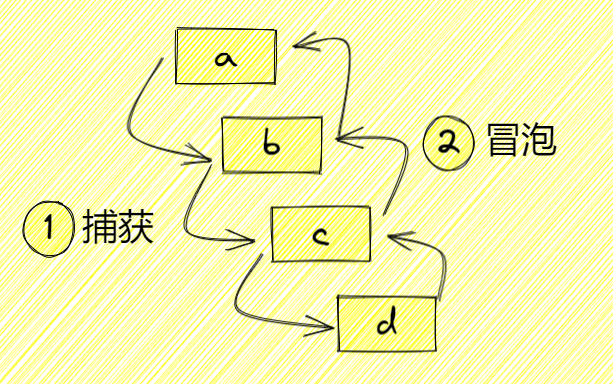

# JavaScript · 浏览器与DOM（18题）

## 不会冒泡的事件有哪些？

**参考答案：**

在 JavaScript  和浏览器中，绝大多数事件都会按照 DOM 事件流模型冒泡，即事件会从目标元素开始向上冒泡到它的父元素，并最终到达 `document` 元素。然而，也有一些事件是不会冒泡的。这些事件通常直接在目标元素上触发，并不会向上传播。  

以下是一些不会冒泡的事件的示例：

1. `focus`：当元素获得焦点时触发，例如通过键盘或鼠标点击。这是一个不会冒泡的事件。
2. `blur`：当元素失去焦点时触发。这也是一个不会冒泡的事件。
3. `focusin`：与 `focus` 类似，但会在元素或其父元素上触发（冒泡），因此这个事件是特例。
4. `focusout`：与 `blur` 类似，但会在元素或其父元素上触发（冒泡），因此这个事件是特例。
5. `load`：当图像、音频、视频或其他资源加载完成时触发。例如，在 `img` 元素上触发的 `load` 事件不会冒泡。
6. `unload`：当页面即将被导航离开时触发。这通常用于执行清理工作，也不会冒泡。
7. `stop`：通常与 `media` 元素相关，例如 `audio` 或 `video` 元素。这是在媒体播放停止时触发的事件。
8. `readystatechange`：当 `document` 的 `readyState` 改变时触发。这通常在页面加载时使用。
9. `scroll`：当元素滚动时触发。这个事件在某些浏览器中可能会冒泡。

这些事件通常直接在目标元素上触发，并且不会传播到父元素上。 


---

## mouseEnter 和 mouseOver 有什么区别？


**参考答案：**

`mouseenter` 和 `mouseover` 是两个用于处理鼠标进入元素时的事件，但它们在一些关键点上有所不同：

1. 事件冒泡：

   - `mouseenter`：这个事件在鼠标指针首次进入特定元素（或其子元素）时触发。当鼠标进入元素时，会触发该元素的 `mouseenter` 事件，但不会在元素的子元素上冒泡。因此，该事件通常用于检测鼠标首次进入元素时的动作。
   - `mouseover`：这个事件在鼠标指针移动到某个元素上时触发，不论它是直接在这个元素上触发还是在其子元素上触发。当鼠标进入一个元素时，它会在该元素上触发 `mouseover` 事件，然后冒泡到父元素。
2. 事件触发范围：

   - `mouseenter`：当鼠标进入元素自身时触发，只在目标元素上触发，不会因为鼠标移动到其子元素上而再次触发。
   - `mouseover`：不仅在目标元素上触发，也在其子元素上触发。所以，如果鼠标从一个子元素移动到另一个子元素，这些元素的父元素会触发多个 `mouseover` 事件。
3. 事件对象的属性：

   - `mouseenter`：事件对象通常会有 `relatedTarget` 属性，它指向鼠标移动前的那个元素。如果 `relatedTarget` 指向目标元素或为 `null`，那么事件就不会触发。
   - `mouseover`：事件对象也会有 `relatedTarget` 属性，通常指向从中离开的那个元素。

使用场景

- `mouseenter` 更适合用来检测鼠标首次进入某个元素时的行为。
- `mouseover` 更适合用来检测鼠标在元素或其子元素之间移动时的行为，因为它冒泡。

在实际使用时，如果你只想在鼠标首次进入元素时触发某些行为（比如显示一个提示），可以使用 `mouseenter`；如果你希望在鼠标移动到某个元素或其子元素上时都触发某些行为（比如动态改变样式），可以使用 `mouseover`。


---

## 什么是 DOM 和 BOM？


**参考答案：**

DOM（Document Object Model）和 BOM（Browser Object Model）是 JavaScript 中常用的两个概念，用于描述浏览器中的不同对象模型。

1. DOM（Document Object Model）:

   - DOM 是表示 HTML 和 XML 文档的标准的对象模型。它将文档中的每个组件（如元素、属性、文本等）都看作是一个对象，开发者可以使用 JavaScript 来操作这些对象，从而动态地改变页面的内容、结构和样式。
   - DOM 以树状结构组织文档的内容，其中树的根节点是 `document` 对象，它代表整个文档。`document` 对象有各种方法和属性，可以用来访问和修改文档的内容和结构。
2. BOM（Browser Object Model）:

   - BOM 是表示浏览器窗口及其各个组件的对象模型。它提供了一组对象，用于访问和控制浏览器窗口及其各个部分，如地址栏、历史记录等。
   - BOM 的核心对象是 `window` 对象，它表示浏览器窗口，并且是 JavaScript 中的全局对象。`window` 对象提供了许多属性和方法，用于控制浏览器窗口的各个方面，如页面导航、定时器、对话框等。
   - BOM 还提供了其他一些对象，如 `navigator`（提供浏览器相关信息）、`location`（提供当前文档的 URL 信息）、`history`（提供浏览器历史记录）、`screen`（提供屏幕信息）等。

总的来说，DOM 是用于访问和操作网页文档的对象模型，而 BOM 是用于控制浏览器窗口及其各个组件的对象模型。在 JavaScript 编程中，开发者通常会同时使用 DOM 和 BOM 来完成各种任务，如操作网页元素、导航控制、事件处理等。


---

## try...catch 可以捕获到异步代码中的错误吗？


**参考答案：**

不能。

以下面代码为例：

```JavaScript
try {
  setTimeout(() => {
    throw new Error('err')
  }, 200);
} catch (err) {
  console.log(err);
}
```

setTimeout是一个异步函数，它的回调函数会在指定的延时后被放入事件队列，等待当前执行栈清空后才执行。因此，当setTimeout的回调函数执行并抛出错误时，try...catch已经执行完毕，无法捕捉到异步回调中的错误。

对于异步代码，需要结合 Promise 、async/await 或者事件监听器等机制来处理错误。


---

## e.target 和 e.currentTarget 有什么区别？


**参考答案：**

冒泡 & 捕获

当你触发一个元素的事件的时候，该事件从该元素的祖先元素传递下去，此过程为`捕获`，而到达此元素之后，又会向其祖先元素传播上去，此过程为`冒泡`

```JavaScript
    <div id="a">
      <div id="b">
        <div id="c">
          <div id="d">哈哈哈哈哈</div>
        </div>
      </div>
    </div>
```



addEventListener

`addEventListener`是为元素绑定事件的方法，他接收三个参数：

- 第一个参数：绑定的事件名
- 第二个参数：执行的函数
- 第三个参数：

  - false：默认，代表冒泡时绑定
  - true：代表捕获时绑定


target & currentTarget

false

我们给四个div元素绑定事件，且`addEventListener`第三个参数不设置，则默认设置为`false`

```JavaScript
const a = document.getElementById('a')
const b = document.getElementById('b')
const c = document.getElementById('c')
const d = document.getElementById('d')
a.addEventListener('click', (e) => {
  const {
    target,
    currentTarget
  } = e
  console.log(`target是${target.id}`)
  console.log(`currentTarget是${currentTarget.id}`)
})
b.addEventListener('click', (e) => {
  const {
    target,
    currentTarget
  } = e
  console.log(`target是${target.id}`)
  console.log(`currentTarget是${currentTarget.id}`)
})
c.addEventListener('click', (e) => {
  const {
    target,
    currentTarget
  } = e
  console.log(`target是${target.id}`)
  console.log(`currentTarget是${currentTarget.id}`)
})
d.addEventListener('click', (e) => {
  const {
    target,
    currentTarget
  } = e
  console.log(`target是${target.id}`)
  console.log(`currentTarget是${currentTarget.id}`)
})
```

现在我们点击，看看输出的东西，可以看出触发的是d，而执行的元素是冒泡的顺序

```JavaScript
target是d currentTarget是d
target是d currentTarget是c
target是d currentTarget是b
target是d currentTarget是a
```

true

我们把四个事件第三个参数都设置为`true`，我们看看输出结果，可以看出触发的是d，而执行的元素是捕获的顺序

```JavaScript
target是d currentTarget是a
target是d currentTarget是b
target是d currentTarget是c
target是d currentTarget是d
```

区别

我们可以总结出：

- `e.target`：触发事件的元素
- `e.currentTarget`：绑定事件的元素


---

## cookie 的有效时间设置为 0 会怎么样


**参考答案：**

Cookie过期时间设置为0，表示跟随系统默认，其销毁与Session销毁时间相同，会在浏览器关闭后删除。


---

## 页面加载的过程中，JS 文件是不是一定会阻塞 DOM 和 CSSOM 的构建？


**参考答案：**

答案：不一定

JavaScript阻塞DOM和CSSOM的构建的情况主要集中在以下两个方面：

- JavaScript文件被放置在head标签内部

当JavaScript文件被放置在head标签内部时，浏览器会先加载JavaScript文件并执行它，然后才会继续解析HTML文档。因此，如果JavaScript文件过大或服务器响应时间过长，就会导致页面一直处于等待状态，进而影响DOM和CSSOM的构建。

- JavaScript代码修改了DOM结构

在JavaScript代码执行时，如果对DOM结构进行了修改，那么浏览器需要重新计算布局（reflow）和重绘（repaint），这个过程会较为耗时，并且会阻塞DOM和CSSOM的构建。

除此之外，还有一些情况下JavaScript并不会阻塞DOM和CSSOM的构建：

- 通过设置 script 标签的 async 、defer 属性避免阻塞DOM和CSSOM的构建

  - async：异步加载JavaScript文件，脚本的下载和执行将与其他工作同时进行（例如从服务器请求其他资源、渲染页面等），而不必等到脚本下载完成才开始这些操作。因此，在使用 async 属性时，脚本的加载和执行是异步的，并且不保证脚本在页面中的顺序。
  - defer属性 ：属性也告诉浏览器立即下载脚本文件，但有一个重要的区别：当文档解析时，脚本不会执行，直到文档解析完成后才执行。这意味着脚本将按照它们在页面上出现的顺序执行，并且在执行之前，整个文档已经被解析完毕了。
- Web Workers ：Web Workers 是一种运行在后台线程的JavaScript脚本，它不会阻塞DOM和CSSOM的构建，并且可以利用多核CPU提高JavaScript代码执行速度。

总结

在一定情况下，JavaScript的执行会阻塞DOM和CSSOM的构建。

但是，在实际应用中，我们可以通过设置 script 标签的 async、defer 属性、使用Web Workers等方式来避免这个问题。


---

## cookie、localStorage和sessionStorage 三者之间有什么区别


**参考答案：**

生命周期

- cookie：可设置失效时间，没有设置的话，默认是关闭浏览器后失效
- localStorage：除非被手动清除，否则将会永久保存。
- sessionStorage： 仅在当前网页会话下有效，关闭页面或浏览器后就会被清除。

存放数据大小

- cookie：4KB左右
- localStorage和sessionStorage：可以保存5MB的信息。

http请求

- cookie：每次都会携带在HTTP头中，如果使用cookie保存过多数据会带来性能问题
- localStorage和sessionStorage：仅在客户端（即浏览器）中保存，不参与和服务器的通信

易用性

- cookie：需要程序员自己封装，原生的 Cookie API 不友好
- localStorage和sessionStorage：原生 API 可以接受，亦可再次封装来对Object和Array有更好的支持

应用场景

从安全性来说，因为每次http请求都会携带cookie信息，这样无形中浪费了带宽，所以cookie应该尽可能少的使用，另外cookie还需要指定作用域，不可以跨域调用（当前页面只能读取页面所在域的 `cookie`，即 `document.cookie` ），限制比较多。但是用来识别用户登录来说，cookie还是比storage更好用的。其他情况下，可以使用storage，就用storage。

storage在存储数据的大小上面秒杀了cookie，现在基本上很少使用cookie了。

localStorage和sessionStorage唯一的差别一个是永久保存在浏览器里面，一个是关闭网页就清除了信息。localStorage可以用来夸页面传递参数，sessionStorage用来保存一些临时的数据，防止用户刷新页面之后丢失了一些参数。


---

## 说说你对 new.target 的理解


**参考答案：**

`new.target`属性允许你检测函数或构造方法是否是通过new运算符被调用的。

在通过new运算符被初始化的函数或构造方法中，`new.target`返回一个指向构造方法或函数的引用。在普通的函数调用中，`new.target` 的值是undefined。

我们可以使用它来检测，一个函数是否是作为构造函数通过new被调用的。

```JavaScript
function Foo() {
  if (!new.target) throw "Foo() must be called with new";
  console.log("Foo instantiated with new");
}

Foo(); // throws "Foo() must be called with new"
new Foo(); // logs "Foo instantiated with new"
```


---

## 给一个dom同时绑定两个点击事件，一个用捕获，一个用冒泡，说下会执行几次事件，然后会先执行冒泡还是捕获？


**参考答案：**

addEventListener绑定几次就执行几次

先捕获，后冒泡


---

## 怎么使用 js 实现拖拽功能？


**参考答案：**

一个元素的拖拽过程，我们可以分为三个步骤:

1. 第一步是鼠标按下目标元素
2. 第二步是鼠标保持按下的状态移动鼠标
3. 第三步是鼠标抬起，拖拽过程结束

这三步分别对应了三个事件，mousedown 事件，mousemove 事件和 mouseup 事件。只有在鼠标按下的状态移动鼠标我们才会执行拖拽事件，因此我们需要在 mousedown 事件中设置一个状态来标识鼠标已经按下，然后在 mouseup 事件中再取消这个状态。在 mousedown 事件中我们首先应该判断，目标元素是否为拖拽元素，如果是拖拽元素，我们就设置状态并且保存这个时候鼠标的位置。然后在 mousemove 事件中，我们通过判断鼠标现在的位置和以前位置的相对移动，来确定拖拽元素在移动中的坐标。最后 mouseup 事件触发后，清除状态，结束拖拽事件。


---

## offsetWidth/offsetHeight,clientWidth/clientHeight 与 scrollWidth/scrollHeight 的区别？


**参考答案：**

clientWidth/clientHeight 返回的是元素的内部宽度，它的值只包含 content + padding，如果有滚动条，不包含滚动条。

clientTop 返回的是上边框的宽度。

clientLeft 返回的左边框的宽度。

offsetWidth/offsetHeight 返回的是元素的布局宽度，它的值包含 content + padding + border 包含了滚动条。

offsetTop 返回的是当前元素相对于其 offsetParent 元素的顶部的距离。

offsetLeft 返回的是当前元素相对于其 offsetParent 元素的左部的距离。

scrollWidth/scrollHeight 返回值包含 content + padding + 溢出内容的尺寸。

scrollTop 属性返回的是一个元素的内容垂直滚动的像素数。

scrollLeft 属性返回的是元素滚动条到元素左边的距离。


---

## 移动端的点击事件的有延迟，时间是多久，为什么会有？ 怎么解决这个延时？


**参考答案：**

移动端点击有 300ms 的延迟是因为移动端会有双击缩放的这个操作，因此浏览器在 click 之后要等待 300ms，看用户有没有下一次点击，来判断这次操作是不是双击。

有三种办法来解决这个问题：

- 通过 meta 标签禁用网页的缩放。
- 通过 meta 标签将网页的 viewport 设置为 ideal viewport。
- 调用一些 js 库，比如 FastClick

click 延时问题还可能引起点击穿透的问题，就是如果我们在一个元素上注册了 touchStart 的监听事件，这个事件会将这个元素隐藏掉，我们发现当这个元素隐藏后，触发了这个元素下的一个元素的点击事件，这就是点击穿透。


---

## 什么是“事件代理”


**参考答案：**

事件代理（Event Delegation）也称之为事件委托。是JavaScript中常用绑定事件的常用技巧。

顾名思义，“事件代理”即是把原本需要绑定在子元素的响应事件委托给父元素，让父元素担当事件监听的职务。

事件代理的原理是DOM元素的事件冒泡。

一个事件触发后，会在子元素和父元素之间传播（propagation）。这种传播分成三个阶段。

- 捕获阶段：从window对象传导到目标节点（上层传到底层）称为“捕获阶段”（capture phase），捕获阶段不会响应任何事件；
- 目标阶段：在目标节点上触发，称为“目标阶段”
- 冒泡阶段：从目标节点传导回window对象（从底层传回上层），称为“冒泡阶段”（bubbling phase）。事件代理即是利用事件冒泡的机制把里层所需要响应的事件绑定到外层。

事件委托的优点：

- 可以大量节省内存占用，减少事件注册。

比如在ul上代理所有li的click事件就非常棒

```Bash
<ul id="list">
  <li>item 1</li>
  <li>item 2</li>
  <li>item 3</li>
  ......
  <li>item n</li>
</ul>
```

如上面代码所示，如果给每个li列表项都绑定一个函数，那对内存的消耗是非常大的，因此较好的解决办法就是将li元素的点击事件绑定到它的父元素ul身上，执行事件的时候再去匹配判断目标元素。

- 可以实现当新增子对象时无需再次对其绑定（动态绑定事件）

假设上述的例子中列表项li就几个，我们给每个列表项都绑定了事件；

在很多时候，我们需要通过 AJAX 或者用户操作动态的增加或者删除列表项li元素，那么在每一次改变的时候都需要重新给新增的元素绑定事件，给即将删去的元素解绑事件；

如果用了事件委托就没有这种麻烦了，因为事件是绑定在父层的，和目标元素的增减是没有关系的，执行到目标元素是在真正响应执行事件函数的过程中去匹配的；所以使用事件在动态绑定事件的情况下是可以减少很多重复工作的。

使用事件委托注意事项：使用“事件委托”时，并不是说把事件委托给的元素越靠近顶层就越好。事件冒泡的过程也需要耗时，越靠近顶层，事件的”事件传播链”越长，也就越耗时。如果DOM嵌套结构很深，事件冒泡通过大量祖先元素会导致性能损失。


---

## JS中怎么阻止事件冒泡和默认事件？


**参考答案：**

event.stopPropagation()方法

这是阻止事件的冒泡方法，不让事件向 document 上蔓延，但是默认事件任然会执行，当你掉用这个方法的时候，如果点击一个连接，这个连接仍然会被打开，

event.preventDefault()方法

这是阻止默认事件的方法，比如在a标签的绑定事件上调用此方法，链接则不会被打开，但是会发生冒泡，冒泡会传递到上一层的父元素；

return false

这个方法比较暴力，他会同时阻止事件冒泡也会阻止默认事件；写上此代码，连接不会被打开，事件也不会传递到上一层的父元素；可以理解为return false就等于同时调用了event.stopPropagation()和event.preventDefault()

---

## 谈谈你对事件冒泡和捕获的理解


**参考答案：**

事件冒泡和事件捕获分别由微软和网景公司提出，这两个概念都是为了解决页面中事件流（事件发生顺序）的问题。

```Bash
<div id="outer">
    <p id="inner">Click me!</p>
</div>
```

上面的代码当中一个div元素当中有一个p子元素，如果两个元素都有一个click的处理函数，那么我们怎么才能知道哪一个函数会首先被触发呢？

事件冒泡

微软提出了名为事件冒泡(event bubbling)的事件流。事件冒泡可以形象地比喻为把一颗石头投入水中，泡泡会一直从水底冒出水面。也就是说，事件会从最内层的元素开始发生，一直向上传播，直到document对象。

因此在事件冒泡的概念下在p元素上发生click事件的顺序应该是p -> div -> body -> html -> document

事件捕获

网景提出另一种事件流名为事件捕获(event capturing)。与事件冒泡相反，事件会从最外层开始发生，直到最具体的元素。

因此在事件捕获的概念下在p元素上发生click事件的顺序应该是document -> html -> body -> div -> p

addEventListener的第三个参数

网景 和 微软 曾经的战争还是比较火热的，当时， 网景主张捕获方式，微软主张冒泡方式。后来 w3c 采用折中的方式，平息了战火，制定了统一的标准——先捕获再冒泡。

addEventListener的第三个参数就是为冒泡和捕获准备的。

addEventListener有三个参数：

```SQL
element.addEventListener(event, function, useCapture)
```

- 第一个参数是需要绑定的事件
- 第二个参数是触发事件后要执行的函数
- 第三个参数默认值是false，表示在事件冒泡阶段调用事件处理函数;如果参数为true，则表示在事件捕获阶段调用处理函数。


---

## 使用原生js给一个按钮绑定两个onclick事件


**参考答案：**

```JavaScript
//事件监听 绑定多个事件
var btn = document.getElementById("btn");

btn.addEventListener("click",hello1);
btn.addEventListener("click",hello2);

function hello1(){
 alert("hello 1");
}
function hello2(){
 alert("hello 2");
}
```


---

## html文档渲染过程，css文件和js文件的下载，是否会阻塞渲染？


**参考答案：**

浏览器内有多个进程，其中渲染进程被称为浏览器内核，负责页面渲染和执行 JS 脚本等。渲染进程负责浏览器的解析和渲染，内部有 JS 引擎线程、 GUI 渲染线程、事件循环管理线程、定时器线程、HTTP 线程。

JS 引擎线程负责执行 JS 脚本，GUI 渲染线程负责页面的解析和渲染，两者是互斥的，也就是执行 JS 的时候页面是停止解析和渲染的。这是因为如果在页面渲染的同时 JS 引擎修改了页面元素，比如清空页面，会造成后续页面渲染的不必要和错误。而由于 JS 经常要操作 DOM ，就要涉及 JS 引擎线程和 GUI 渲染线程的通信，而线程间通信代价是非常昂贵的，这也是造成 JS 操作 DOM 效率不高的原因。

浏览器的 HTML/CSS 的解析和渲染都属于 GUI渲染线程，所以和 JS 引擎线程是互斥、阻塞的。下面从代码实际运行的角度分析浏览器解析和渲染的顺序，以及互相间的阻塞关系。

CSS 阻塞

- css 文件的下载和解析不会影响 DOM 的解析，但是会阻塞 DOM 的渲染。因为 CSSOM Tree 要和 DOM Tree 合成 Render Tree 才能绘制页面。下面的 test1 在 css 下载并解析完成前是默认样式， test2 在 css 下载并解析完成之前不会显示：

```JavaScript
<button class="btn btn-primary">test1</button>
<link rel="stylesheet" href="https://cdn.jsdelivr.net/npm/bootstrap@4.4.1/dist/css/bootstrap.min.css">
<div>test2</div>
```

- css 文件没下载并解析完成之前，后续的 js 脚本不能执行。下面的 alert('ok') 在 css 下载并解析完成之前不会弹出来：

```JavaScript
<link rel="stylesheet" href="https://cdn.jsdelivr.net/npm/bootstrap@4.4.1/dist/css/bootstrap.min.css">
<script>
    alert('ok')
</script>
```

- css 文件的下载不会阻塞前面的 js 脚本执行。下面的 alert('ok') 会在 css 下载完成前弹出：

```JavaScript
<script>
    alert('ok')
</script>
<link rel="stylesheet" href="https://cdn.jsdelivr.net/npm/bootstrap@4.4.1/dist/css/bootstrap.min.css">
```

所以在需要提前执行不操作 dom 元素的 js 时，不妨把 js 放到 css 文件之前。

js 阻塞

js 文件的下载和解析会阻塞 GUI 渲染进程，也就是会阻塞 DOM 和 CSS 的解析和渲染。

js 文件没下载并解析完成之前，后续的 HTML 和 CSS 无法解析：

```JavaScript
<script src="https://code.jquery.com/jquery-3.4.1.js"></script>
<div>test</div>
```

- js 文件的下载不会阻塞前面 HTML 和 CSS 的解析：

```JavaScript
<div>test</div>
<script src="https://code.jquery.com/jquery-3.4.1.js"></script>
```

需要注意的点

- 第一，GUI 渲染线程会尽可能早的将内容呈现到屏幕上，并不会等到所有的 HTML 都解析完成之后再去构建和布局 Render Tree，而是解析完一部分内容就显示一部分内容，同时，可能还在通过网络下载其余内容。下面 test1 会在 js 文件下载完成前渲染完成，而 test2 则会在 js 文件下载并执行完之后渲染：

```JavaScript
  <div>test1</div>
  <script src="https://code.jquery.com/jquery-3.4.1.js"></script>
  <div>test2</div>
```

- 第二，文件的下载是不会被阻塞的，不管是 css 还是 js 文件，浏览器的主线程会在页面解析前开启下载，所以就算在外部脚本执行前删除脚本，脚本也还是会下载。

```JavaScript
<body>
  <script>
    document.body.remove()
  </script>  
  <link rel="stylesheet" href="https://cdn.jsdelivr.net/npm/bootstrap@4.4.1/dist/css/bootstrap.min.css">
  <script src="https://code.jquery.com/jquery-3.4.1.js"></script>
</body>
```


---
