# JavaScript · 网络与安全（20题）

## 简单描述从输入网址到页面显示的过程


**参考答案：**

很多大公司面试喜欢问这样一道面试题，输入URL到看见页面发生了什么？

简单来说，共有以下几个过程：

- DNS解析
- 发起TCP连接
- 发送HTTP请求
- 服务器处理请求并返回HTTP报文
- 浏览器解析渲染页面
- 连接结束

下面我们来看看具体的细节。


DNS解析

DNS解析实际上就是寻找你所需要的资源的过程。假设你输入`www.baidu.com`，而这个网址并不是百度的真实地址，互联网中每一台机器都有唯一标识的IP地址，这个才是关键，但是它不好记，乱七八糟一串数字谁记得住啊，所以就需要一个网址和IP地址的转换，也就是DNS解析。

DNS解析其实是一个递归的过程。

输入`www.google.com`网址后，首先在本地的域名服务器中查找，没找到去根域名服务器查找，没有再去com顶级域名服务器查找，，如此的类推下去，直到找到IP地址，然后把它记录在本地，供下次使用。大致过程就是.-> .com ->google.com. -> www.google.com.。 (最后这个.对应的就是根域名服务器，默认情况下所有的网址的最后一位都是.，为了方便用户，通常都会省略，浏览器在请求DNS的时候会自动加上)


DNS优化

既然已经懂得了解析的具体过程，我们可以看到上述一共经过了N个过程，每个过程有一定的消耗和时间的等待，因此我们得想办法解决一下这个问题！

- DNS缓存

DNS存在着多级缓存，从离浏览器的距离排序的话，有以下几种: 浏览器缓存，系统缓存，路由器缓存，ISP服务器缓存，根域名服务器缓存，顶级域名服务器缓存，主域名服务器缓存。

- DNS负载均衡

比如访问baidu.com的时候，每次响应的并非是同一个服务器（IP地址不同），一般大公司都有成百上千台服务器来支撑访问。DNS可以返回一个合适的机器的IP给用户，例如可以根据每台机器的负载量，该机器离用户地理位置的距离等等，这种过程就是DNS负载均衡。


发起TCP连接

TCP提供一种可靠的传输，这个过程涉及到三次握手，四次挥手。

三次握手

- 第一次握手：

客户端发送syn包(Seq=x)到服务器，并进入SYN_SEND状态，等待服务器确认；

- 第二次握手：

服务器收到syn包，必须确认客户的SYN（ack=x+1），同时自己也发送一个SYN包（Seq=y），即SYN+ACK包，此时服务器进入SYN_RECV状态；

- 第三次握手：

客户端收到服务器的SYN＋ACK包，向服务器发送确认包ACK(ack=y+1)，此包发送完毕，客户端和服务器进入ESTABLISHED状态，完成三次握手。

握手过程中传送的包里不包含数据，三次握手完毕后，客户端与服务器才正式开始传送数据。理想状态下，TCP连接一旦建立，在通信双方中的任何一方主动关闭连接之前，TCP 连接都将被一直保持下去。


四次挥手

数据传输完毕后，双方都可释放连接。最开始的时候，客户端和服务器都是处于ESTABLISHED状态，假设客户端主动关闭，服务器被动关闭。

- 第一次挥手：

客户端发送一个FIN，用来关闭客户端到服务器的数据传送，也就是客户端告诉服务器：我已经不 会再给你发数据了(当然，在fin包之前发送出去的数据，如果没有收到对应的ack确认报文，客户端依然会重发这些数据)，但是，此时客户端还可以接受数据。

FIN=1，其序列号为seq=u（等于前面已经传送过来的数据的最后一个字节的序号加1），此时，客户端进入FIN-WAIT-1（终止等待1）状态。 TCP规定，FIN报文段即使不携带数据，也要消耗一个序号。

- 第二次挥手：

服务器收到FIN包后，发送一个ACK给对方并且带上自己的序列号seq，确认序号为收到序号+1（与SYN相同，一个FIN占用一个序号）。此时，服务端就进入了CLOSE-WAIT（关闭等待）状态。TCP服务器通知高层的应用进程，客户端向服务器的方向就释放了，这时候处于半关闭状态，即客户端已经没有数据要发送了，但是服务器若发送数据，客户端依然要接受。这个状态还要持续一段时间，也就是整个CLOSE-WAIT状态持续的时间。

此时，客户端就进入FIN-WAIT-2（终止等待2）状态，等待服务器发送连接释放报文（在这之前还需要接受服务器发送的最后的数据）。

- 第三次挥手：

服务器发送一个FIN，用来关闭服务器到客户端的数据传送，也就是告诉客户端，我的数据也发送完了，不会再给你发数据了。由于在半关闭状态，服务器很可能又发送了一些数据，假定此时的序列号为seq=w，此时，服务器就进入了LAST-ACK（最后确认）状态，等待客户端的确认。

- 第四次挥手：

主动关闭方收到FIN后，发送一个ACK给被动关闭方，确认序号为收到序号+1，此时，客户端就进入了TIME-WAIT（时间等待）状态。注意此时TCP连接还没有释放，必须经过2∗MSL（最长报文段寿命）的时间后，当客户端撤销相应的TCB后，才进入CLOSED状态。

服务器只要收到了客户端发出的确认，立即进入CLOSED状态。同样，撤销TCB后，就结束了这次的TCP连接。可以看到，服务器结束TCP连接的时间要比客户端早一些。

至此，完成四次挥手。


发送HTTP请求

发送HTTP请求，就是构建HTTP请求报文，并通过TCP协议，发送到服务器指定端口。

请求报文由`请求行`，`请求报头`，`请求正文`组成。


服务器处理请求并返回HTTP报文

对TCP连接进行处理，对HTTP协议进行解析，并按照报文格式进一步封装成HTTP Request对象，供上层使用。这一部分工作一般是由Web服务器去进行，比如Tomcat, Nginx和Apache等Web服务器。

HTTP报文也分成三段：`状态码`，`响应报头`和`响应报文`。


浏览器解析渲染页面


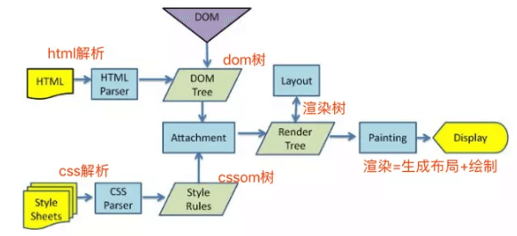

这个图就是Webkit解析渲染页面的过程。

- 解析HTML形成DOM树
- 解析CSS形成CSSOM 树
- 合并DOM树和CSSOM树形成渲染树
- 浏览器开始渲染并绘制页面


---

## RESTful 接口规范是什么？


**参考答案：**

RESTful 接口规范是一种设计 Web 服务接口的风格和规范，遵循 REST（Representational State Transfer）架构。它的设计原则包括以下几点：

1. 资源（Resources）：将系统中的所有事物视为资源，每个资源都有一个唯一的标识符（通常是 URL），用于对其进行操作。
2. 统一接口（Uniform Interface）：接口设计应该简单一致，包括以下几个方面：

   - 使用标准的 HTTP 方法（GET、POST、PUT、DELETE 等）来对资源进行操作。
   - 使用标准的 HTTP 状态码（如 200、404、500）来表示请求结果。
   - 使用资源的 URL 来唯一标识资源。
   - 使用适当的 MIME 类型（如 JSON、XML）来传输数据。
3. 状态无关（Stateless）：每个请求都应该包含足够的信息，服务器不需要保存客户端的状态。这样可以使系统更加简单、可伸缩性更好。
4. 客户端 - 服务器分离（Client-Server Separation）：客户端和服务器之间的交互应该通过标准化的接口进行，使得客户端和服务器可以独立地进行演化。
5. 可缓存性（Cacheability）：对于经常不变的数据，应该使用合适的缓存机制，提高系统的性能和可伸缩性。
6. 按需代码（Code on Demand）（可选）：服务器可以向客户端传输可执行代码，以提供更丰富的功能。

遵循 RESTful 接口规范能够使得系统具有良好的可维护性、可伸缩性和性能，并且更容易与其他系统进行集成。


---

## 需要在本地实现一个聊天室，多个tab页相互通信，不能用websocket，你会怎么做？


**参考答案：**

可以考虑使用以下方法：

1. 使用LocalStorage：这个存储API可在浏览器的不同标签页之间共享数据。当一个标签页发送消息时，将消息存储在LocalStorage中。其他标签页可以监听该存储区的变化，并读取最新的消息内容来实现通信效果。

```JavaScript
// 监听变化
window.addEventListener("storage", (e) => {
    // todo ...
});
```

1. 使用Broadcast Channel API：Broadcast Channel API 可以在浏览器的不同上下文（包括不同的标签页）之间进行双向通信。当一个标签页发送消息到广播频道时，其他标签页可以通过监听相同的广播频道来接收和响应消息。
2. 使用SharedWorker：SharedWorker 是一种在多个浏览器上下文之间共享脚本执行的机制，它可以在不同的标签页之间进行通信。可以创建一个SharedWorker，然后在各个标签页中连接到该SharedWorker，使它们能够共享数据和通信。

以上方法都可以实现在本地多个标签页之间进行通信，但需要根据具体需求和项目情况选择适合的解决方案。需要注意的是，这些方法只适用于本地通信，无法实现跨网络的实时通信效果，若需要实现更复杂的聊天室功能，WebSocket仍是更常用的选择。


---

## 说说WebSocket和HTTP的区别


**参考答案：**

HTTP协议

`HTTP`是单向的，客户端发送请求，服务器发送响应。举例来说，当客户端向服务器发送请求时，该请求以`HTTP`或`HTTPS`的形式发送，在接收到请求后，服务器会将响应发送给客户端。

每个请求都与一个对应的响应相关联，在发送响应后客户端与服务器的连接会被关闭。每个`HTTP`或`HTTPS`请求每次都会新建与服务器的连接，并且在获得响应后，连接将自行终止。 `HTTP`是在`TCP`之上运行的无状态协议，`TCP`是一种面向连接的协议，它使用三向握手方法保证数据包传输的传递并重新传输丢失的数据包。

`HTTP`可以运行在任何可靠的面向连接的协议（例如`TCP`，`SCTP`）的上层。当客户端将`HTTP`请求发送到服务器时，客户端和服务器之间将打开`TCP`连接，并且在收到响应后，`TCP`连接将终止，每个`HTTP`请求都会建立单独的`TCP`连接到服务器，例如如果客户端向服务器发送10个请求，则将打开10个单独的`HTTP`连接。并在获得响应后关闭。

理解上面这段关于 `HTTP`的描述时我觉得还要了解一下`HTTP`长连接的概念，以及`HTTP`与`TCP`的关系，简单概括一下就是：

- `HTTP`协议的长连接和短连接，实质上是`TCP`协议的长连接和短连接。
- 每个`HTTP`连接完成后，其对应的`TCP`连接并不是每次都会关闭。从 `HTTP/1.1`起，默认使用长连接，用以保持连接特性。使用长连接的`HTTP`协议，会在响应头有加入这个头部字段：`Connection:keep-alive`
- 在使用长连接的情况下，当一个网页打开完成后，客户端和服务器之间用于传输`HTTP`数据的`TCP`连接不会关闭，如果客户端再次访问这个服务器上的网页，会继续使用这一条已经建立的连接。`Keep-Alive`不会永久保持连接，它有一个保持时间，可以在不同的服务器软件（如`Apache`，`Nginx`，`Nginx`中这个默认时间是 75s）中设定这个时间。实现长连接要客户端和服务端都支持长连接。
- `HTTP`属于应用层协议，在传输层使用`TCP`协议，在网络层使用`IP`协议。`IP`协议主要解决网络路由和寻址问题，`TCP`协议主要解决如何在`IP`层之上可靠的传递数据包，使在网络上的另一端收到发端发出的所有包，并且顺序与发出顺序一致。`TCP`有可靠，面向连接的特点。

HTTP消息信息是用`ASCII`编码的，每个`HTTP`请求消息均包含`HTTP`协议版本（`HTTP/1.1`，`HTTP/2`），`HTTP`方法（`GET`/`POST`等），`HTTP`标头（`Content-Type`，`Content-Length`），主机信息等。以及包含要传输到服务器的实际消息的正文（请求主体）。`HTTP`标头的大小从200字节到2`KB`不等，`HTTP`标头的常见大小是700-800字节。当`Web`应用程序在客户端使用更多`cookie`和其他工具扩展代理的存储功能时，它将减少`HTTP`标头的荷载。


WebSocket协议

`WebSocket`是双向的，在客户端-服务器通信的场景中使用的全双工协议，与`HTTP`不同，它以`ws://`或`wss://`开头。它是一个有状态协议，这意味着客户端和服务器之间的连接将保持活动状态，直到被任何一方（客户端或服务器）终止。在通过客户端和服务器中的任何一方关闭连接之后，连接将从两端终止。

让我们以客户端-服务器通信为例，每当我们启动客户端和服务器之间的连接时，客户端-服务器进行握手随后创建一个新的连接，该连接将保持活动状态，直到被他们中的任何一方终止。建立连接并保持活动状态后，客户端和服务器将使用相同的连接通道进行通信，直到连接终止。

新建的连接被称为`WebSocket`。一旦通信链接建立和连接打开后，消息交换将以双向模式进行，客户端-服务器之间的连接会持续存在。如果其中任何一方（客户端服务器）宕掉或主动关闭连接，则双方均将关闭连接。套接字的工作方式与`HTTP`的工作方式略有不同，状态代码`101`表示`WebSocket`中的交换协议。


何时使用WebSocket

- 即时`Web`应用程序：即时`Web`应用程序使用一个`Web`套接字在客户端显示数据，这些数据由后端服务器连续发送。在`WebSocke`t中，数据被连续推送/传输到已经打开的同一连接中，这就是为什么`WebSocket`更快并提高了应用程序性能的原因。 例如在交易网站或比特币交易中，这是最不稳定的事情，它用于显示价格波动，数据被后端服务器使用Web套接字通道连续推送到客户端。
- 游戏应用程序：在游戏应用程序中，你可能会注意到，服务器会持续接收数据，而不会刷新用户界面。屏幕上的用户界面会自动刷新，而且不需要建立新的连接，因此在`WebSocket`游戏应用程序中非常有帮助。
- 聊天应用程序：聊天应用程序仅使用`WebSocket`建立一次连接，便能在订阅户之间交换，发布和广播消息。它重复使用相同的`WebSocket`连接，用于发送和接收消息以及一对一的消息传输。


不能使用WebSocket的场景

如果我们需要通过网络传输的任何实时更新或连续数据流，则可以使用`WebSocket`。如果我们要获取旧数据，或者只想获取一次数据供应用程序使用，则应该使用`HTTP`协议，不需要很频繁或仅获取一次的数据可以通过简单的`HTTP`请求查询，因此在这种情况下最好不要使用`WebSocket`。

注意：如果仅加载一次数据，则`RESTful` `Web`服务足以从服务器获取数据。


---

## 说说 https 的握手过程


**参考答案：**

https的详细握手过程

https在七层协议里面属于应用层，他基于tcp协议，所以，https握手的过程，一定先经过tcp的三次握手，tcp链接建立好之后，才进入https的对称密钥协商过程，对称密钥协商好之后，就开始正常的收发数据流程。

接下来拿实际网络数据包来解释https的整个详细的握手过程

打开wireshark抓包工具，并随手打开命令行，输入了如下一行命令

```Plaintext
curl https://www.baidu.com
```

上面其实涉及到两个问题：

1.为什么是wireshark，而不是fiddler 或者 charles

> fiddler 和charles主要是用于抓取应用层协议https/http等上层的应用数据，都是建立链接成功后的数据，而wireshark是可以抓取所有协议的数据包（直接读取网卡数据）,我们的目的是抓取https建立链接成功前的过程，所以我们选择wireshark

2.为什么是用curl， 而不是在浏览器打开[https://www.baidu.com](https://www.baidu.com/)

> curl是只发送一个请求，如果是用浏览器打开百度，那百度页面里面的各种资源也会发送请求，容易造成很多不必要的数据包

好，重点来了，开始上图：

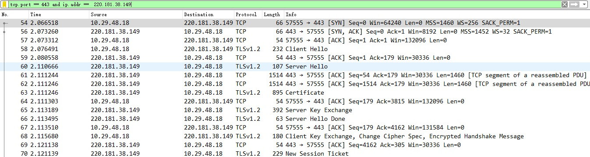

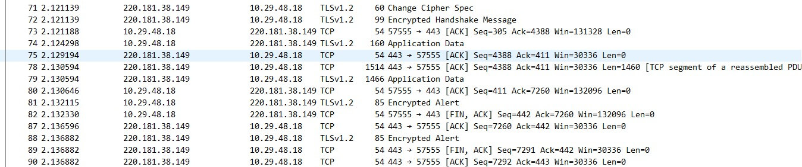

遇到凡事不要慌，接下来待我给你慢慢道来（ack消息属于tcp协议里面的确认报文，不做解释）


第一步


第二步：客户端发送client_hello


> 解释说明：客户端发送client_hello，包含以下内容（请自行对照上图） 1. 包含TLS版本信息 2. 随机数（用于后续的密钥协商）random_C 3. 加密套件候选列表 4. 压缩算法候选列表 5. 扩展字段 6. 其他


第三步：服务端发送server_hello

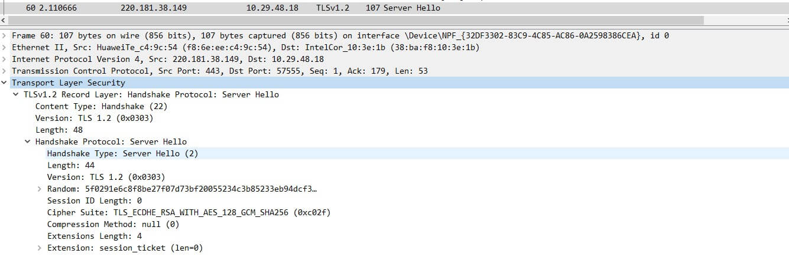

> 解释说明：服务端收到客户端的client_hello之后，发送server_hello，并返回协商的信息结果 1. 选择使用的TLS协议版本 version 2. 选择的加密套件 cipher suite 3. 选择的压缩算法 compression method 4. 随机数 random_S 5. 其他


第四步：服务端发送证书

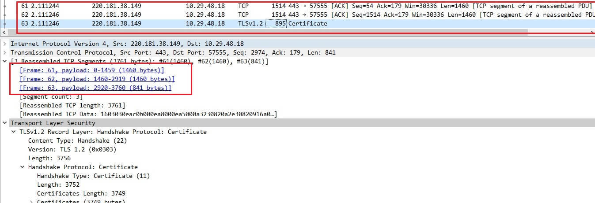

> 解释说明：服务端发送完server_hello后，紧接着开始发送自己的证书（不清楚证书是什么的，可以移步到[上一篇文章](https://juejin.cn/post/6845166890675863559)），从图可知：因包含证书的报文长度是3761，所以此报文在tcp这块做了分段，分了3个报文把证书发送完了
> 
> 问自己： 1. 分段的标准是什么？ 2. 什么时候叫分段，什么时候叫分片？ 3. 什么是MTU，什么是MSS


第五步：服务端发送Server Key Exchange

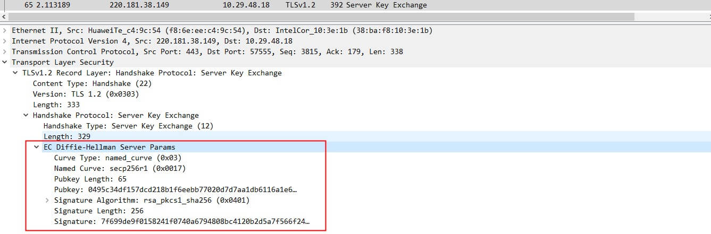


第六步：服务端发送Server Hello Done

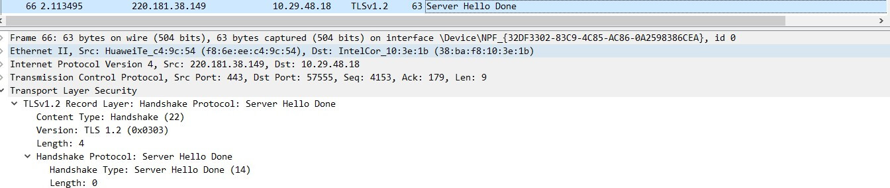

> 解释说明:通知客户端 server_hello 信息发送结束


第七步：客户端发送.client_key_exchange+change_cipher_spec+encrypted_handshake_message

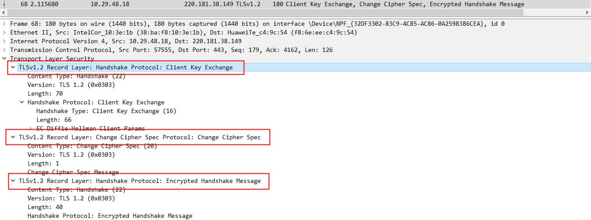

> 解释说明: 1. client_key_exchange，合法性验证通过之后，向服务器发送自己的公钥参数，这里客户端实际上已经计算出了密钥 2. change_cipher_spec，客户端通知服务器后续的通信都采用协商的通信密钥和加密算法进行加密通信 3. encrypted_handshake_message，主要是用来测试密钥的有效性和一致性

第八步：服务端发送New Session Ticket


> 解释说明:服务器给客户端一个会话，用处就是在一段时间之内（超时时间到来之前），双方都以协商的密钥进行通信。

第九步：服务端发送change_cipher_spec

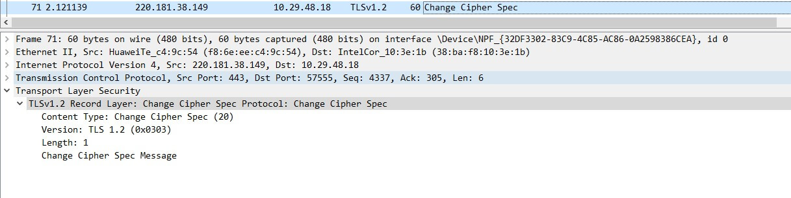

> 解释说明:服务端解密客户端发送的参数，然后按照同样的算法计算出协商密钥，并通过客户端发送的encrypted_handshake_message验证有效性，验证通过，发送该报文，告知客户端，以后可以拿协商的密钥来通信了

第十步：服务端发送encrypted_handshake_message

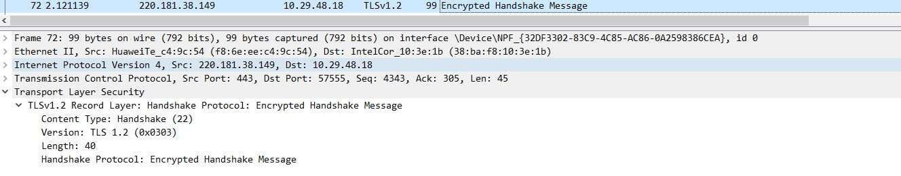

> 解释说明:目的同样是测试密钥的有效性，客户端发送该报文是为了验证服务端能正常解密，客户端能正常加密，相反：服务端发送该报文是为了验证客户端能正常解密，服务端能正常加密

第十一步：完成密钥协商，开始发送数据

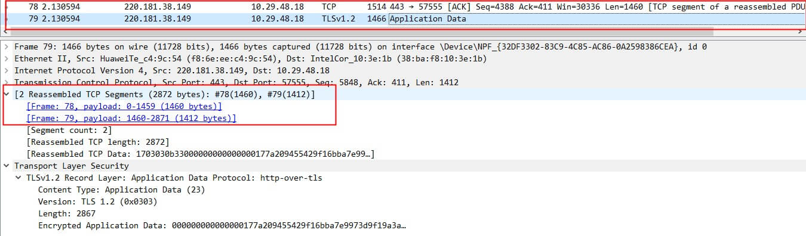

> 解释说明：数据同样是分段发送的

第十二步：完成数据发送，4次tcp挥手

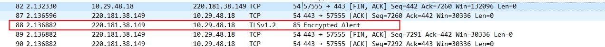

> 解释说明：红框的意思是：客户端或服务器发送的，意味着加密通信因为某些原因需要中断，警告对方不要再发送敏感的数据,服务端数据发送完成也会有此数据包，可不关注


---

## HTTP2中，多路复用的原理是什么？


**参考答案：**

HTTP/2是一个二进制协议，其基于“帧”的结构设计，改进了很多HTTP/1.1痛点问题。


什么是多路复用？

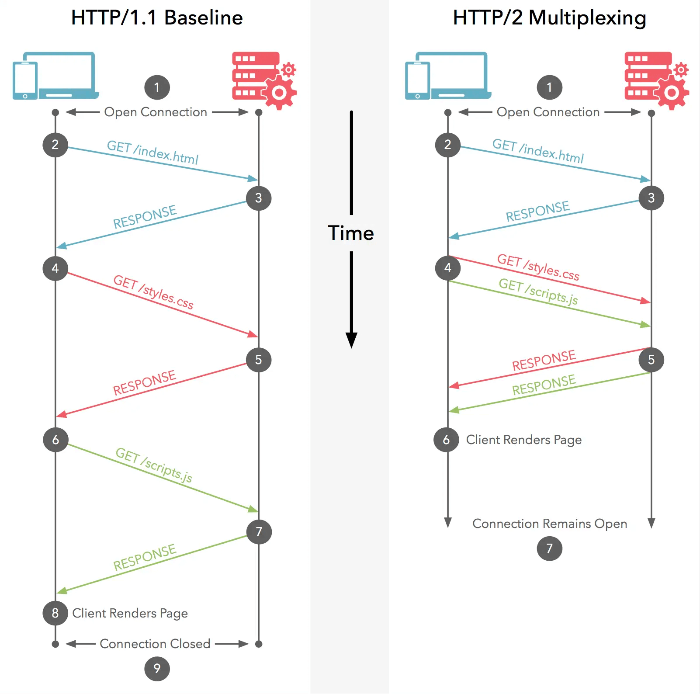

HTTP/1.1协议的请求-响应模型大家都是熟悉的，我们用“HTTP消息”来表示一个请求-响应的过程，那么HTTP/1.1中的消息是“管道串形化”的：只有等一个消息完成之后，才能进行下一条消息；而HTTP/2中多个消息交织在了一起，这无疑提高了“通信”的效率。这就是多路复用：在一个HTTP的连接上，多路“HTTP消息”同时工作。


为什么 `HTTP/1.1` 不能实现“多路复用”？

简单回答就是：`HTTP/2` 是基于二进制“帧”的协议，HTTP/1.1是基于“文本分割”解析的协议。

`HTTP/1.1` 发送请求消息的文本格式：以换行符分割每一条 `key:value` 的内容，解析这种数据用不着什么高科技，相反的，解析这种数据往往速度慢且容易出错。“服务端”需要不断的读入字节，直到遇到分隔符（这里指换行符，代码中可能使用/n或者/r/n表示），这种解析方式是可行的，并且 `HTTP/1.1` 已经被广泛使用了二十多年，这事已经做过无数次了，问题一直都是存在的：

- 一次只能处理一个请求或响应，因为这种以分隔符分割消息的数据，在完成之前不能停止解析。
- 解析这种数据无法预知需要多少内存，这会带给“服务端”很大的压力，因为它不知道要把一行要解析的内容读到多大的“缓冲区”中，在保证解析效率和速度的前提下：内存该如何分配？


HTTP/2帧结构设计和多路复用实现

前边提到：HTTP/2设计是基于“二进制帧”进行设计的，这种设计无疑是一种“高超的艺术”，因为它实现了一个目的：一切可预知，一切可控。

帧是一个数据单元，实现了对消息的封装。下面是HTTP/2的帧结构：

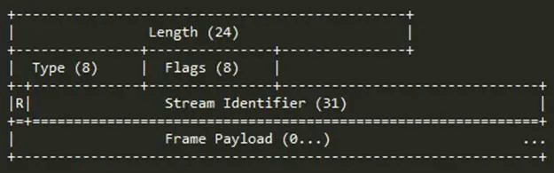

帧的字节中保存了不同的信息，前9个字节对于每个帧都是一致的，“服务器”解析HTTP/2的数据帧时只需要解析这些字节，就能准确的知道整个帧期望多少字节数来进行处理信息。

如果使用HTTP/1.1的话，你需要发送完上一个请求，才能发送下一个；由于HTTP/2是分帧的，请求和响应可以交错甚至可以复用。 为了能够发送不同的“数据信息”，通过帧数据传递不同的内容，HTTP/2中定义了10种不同类型的帧。

有了以上对HTTP/2帧的了解，我们就可以解释多路复用是怎样实现的了，不过在这之前我们先来了解“流”的概念：HTTP/2连接上独立的、双向的帧序列交换。流ID（帧首部的6-9字节）用来标识帧所属的流

下面两张图分别表示了HTTP/2协议上POST请求数据流“复用”的过程，很容易看的明白：

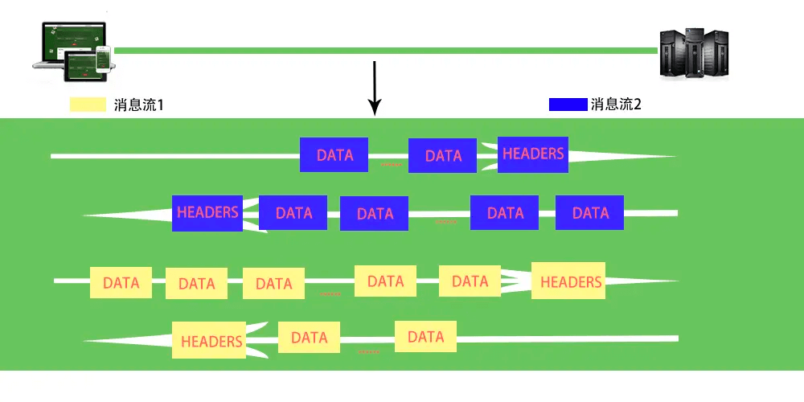

---

## 为什么推荐将静态资源放到cdn上？


**参考答案：**

静态资源是什么

静态资源

静态资源是指在不同请求中访问到的数据都相同的静态文件。例如：图片、视频、网站中的文件（html、css、js）、软件安装包、apk文件、压缩包文件等。

动态资源

动态资源是指在不同请求中访问到的数据不相同的动态内容。例如：网站中的文件（asp、jsp、php、perl、cgi）、API接口、数据库交互请求等。


CDN是什么

内容分发网络，Content Delivery Network或Content Ddistribute Network，简称CDN，是建立并覆盖在承载网之上，由分布在不同区域的边缘节点服务器群组成的分布式网络。

CDN加速的本质是缓存加速。将服务器上存储的静态内容缓存在CDN节点上，当访问这些静态内容时，无需访问服务器源站，就近访问CDN节点即可获取相同内容，从而达到加速的效果，同时减轻服务器源站的压力。

CDN应用广泛，解决因分布、带宽、服务器性能带来的访问延迟问题，适用于站点加速、点播、直播等场景。使用户可就近取得所需内容，解决 Internet网络拥挤的状况，提高用户访问网站的响应速度和成功率。

由于访问动态内容时，每次都需要访问服务器，由服务器动态生成实时的数据并返回。因此CDN的缓存加速不适用于加速动态内容，CDN无法缓存实时变化的动态内容。对于动态内容请求，CDN节点只能转发回服务器源站，没有加速效果。


CDN的作用

1. 加速网站的访问
2. 为了实现跨运营商、跨地域的全网覆盖

互联不互通、区域ISP地域局限、出口带宽受限制等种种因素都造成了网站的区域性无法访问。CDN加速可以覆盖全球的线路，通过和运营商合作，部署IDC资源，在全国骨干节点商，合理部署CDN边缘分发存储节点，充分利用带宽资源，平衡源站流量。

1. 为了保障你的网站安全

CDN的负载均衡和分布式存储技术，可以加强网站的可靠性，相当无无形中给你的网站添加了一把保护伞，应对绝大部分的互联网攻击事件。防攻击系统也能避免网站遭到恶意攻击。

1. 为了异地备援

当某个服务器发生意外故障时，系统将会调用其他临近的健康服务器节点进行服务，进而提供接近100%的可靠性，这就让你的网站可以做到永不宕机。

1. 为了节约成本投入

使用CDN加速可以实现网站的全国铺设，你根据不用考虑购买服务器与后续的托管运维，服务器之间镜像同步，也不用为了管理维护技术人员而烦恼，节省了人力、精力和财力。

1. 为了让你更专注业务本身

CDN加速厂商一般都会提供一站式服务，业务不仅限于CDN，还有配套的云存储、大数据服务、视频云服务等，而且一般会提供7x24运维监控支持，保证网络随时畅通，你可以放心使用。并且将更多的精力投入到发展自身的核心业务之上。


CDN工作原理

- 当用户点击网站页面上的内容URL，经过本地DNS系统解析，DNS系统会最终将域名的解析权交给CNAME指向的CDN专用DNS服务器。
- CDN的DNS服务器将CDN的全局负载均衡设备IP地址返回用户。
- 用户向CDN的全局负载均衡设备发起内容URL访问请求。
- CDN全局负载均衡设备根据用户IP地址，以及用户请求的内容URL，选择一台用户所属区域的区域负载均衡设备，告诉用户向这台设备发起请求。
- 区域负载均衡设备会为用户选择一台合适的缓存服务器提供服务，选择的依据包括：根据用户IP地址，判断哪一台服务器距用户最近；根据用户所请求的URL中携带的内容名称，判断哪一台服务器上有用户所需内容；查询各个服务器当前的负载情况，判断哪一台服务器尚有服务能力。基于以上这些条件的综合分析之后，区域负载均衡设备会向全局负载均衡设备返回一台缓存服务器的IP地址。
- 全局负载均衡设备把服务器的IP地址返回给用户。
- 用户向缓存服务器发起请求，缓存服务器响应用户请求，将用户所需内容传送到用户终端。如果这台缓存服务器上并没有用户想要的内容，而区域均衡设备依然将它分配给了用户，那么这台服务器就要向它的上一级缓存服务器请求内容，直至追溯到网站的源服务器将内容拉到本地。

DNS服务器根据用户IP地址，将域名解析成相应节点的缓存服务器IP地址，实现用户就近访问。使用CDN服务的网站，只需将其域名解析权交给CDN的GSLB设备，将需要分发的内容注入CDN，就可以实现内容加速了。


当没有CDN时

今天我们看到的网站系统基本上都是基于B/S架构的。B/S架构，即Browser-Server（浏览器 服务器）架构。

用户通过浏览器等方式访问网站的过程：

- 用户在自己的浏览器中输入要访问的网站域名。
- 浏览器向本地DNS服务器请求对该域名的解析。
- 本地DNS服务器中如果缓存有这个域名的解析结果，则直接响应用户的解析请求。
- 本地DNS服务器中如果没有关于这个域名的解析结果的缓存，则以递归方式向整个DNS系统请求解析，获得应答后将结果反馈给浏览器。
- 浏览器得到域名解析结果，就是该域名相应的服务设备的IP地址。
- 浏览器向服务器请求内容。
- 服务器将用户请求内容传送给浏览器。

---

## JavaScript 中如何取消请求


**参考答案：**

JavaScript 实现异步请求就靠浏览器提供的两个 API —— XMLHttpRequest 和 Fetch。我们平常用的较多的是 Promise 请求库 axios，它基于 XMLHttpRequest。

本篇带来 XMLHttpRequest、Fetch 和 axios 分别是怎样“取消请求”的。

取消 XMLHttpRequest 请求

当请求已经发送了，可以使用 XMLHttpRequest.abort() 方法取消发送，代码示例如下：

```JavaScript
const xhr = new XMLHttpRequest();
xhr.open('GET', '<http://127.0.0.1:3000/api/get>', true);
xhr.send();
setTimeout(() => {
         xhr.abort();
}, 1000);
```

取消请求，[readyState](https://developer.mozilla.org/en-US/docs/Web/API/XMLHttpRequest/readyState) 会变成 `XMLHttpRequest.UNSENT`(0)；请求的 xhr.[status](https://developer.mozilla.org/en-US/docs/Web/API/XMLHttpRequest/status) 会被设为 0 ；

不如在 Chrome DevTools Network 中，看看正常请求和取消请求的对比图：

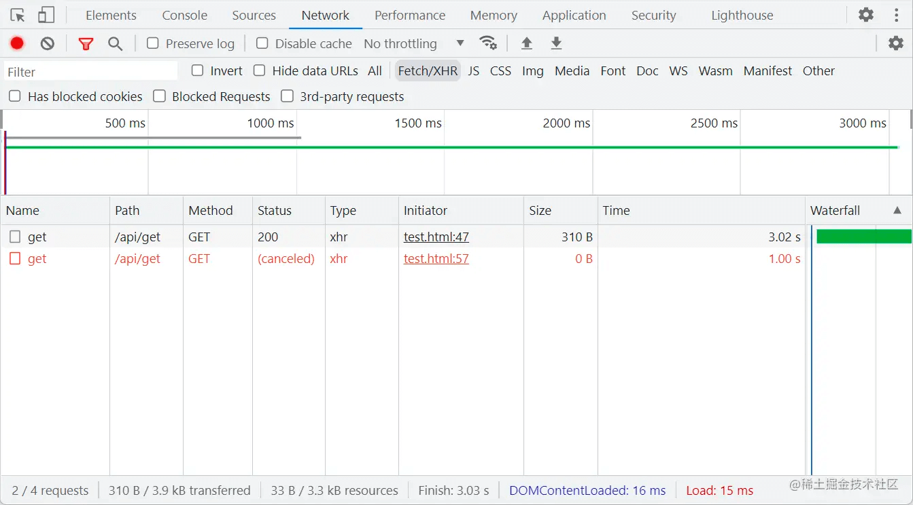

取消 Fetch 请求

取消 Fetch 请求，需要用到 [AbortController](https://developer.mozilla.org/en-US/docs/Web/API/AbortController) API。我们可以构造一个 controller 实例：`const controller = new AbortController()` , controller 它有一个只读属性 [AbortController.signal](https://developer.mozilla.org/en-US/docs/Web/API/AbortSignal)，可以作为参数传入到 fetch 中，用于将控制器与获取请求相关联；

代码示例如下：

```JavaScript
const controller = new AbortController();
void (async function () {
    const response = await fetch('<http://127.0.0.1:3000/api/get>', {
        signal: controller.signal,
    });
    const data = await response.json();
})();

setTimeout(() => {
    controller.abort();
}, 1000);
```

浏览器控制台对比图：


我们其实可以在 controller.abort() 传入“取消请求的原因”参数，然后进行 try...catch 捕获

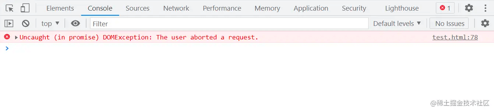

取消 axios 请求

axios 同样支持 [AbortController](https://developer.mozilla.org/en-US/docs/Web/API/AbortController)

```JavaScript
const controller = new AbortController();
const API_URL = '<http://127.0.0.1:3000/api/get>';
void (async function () {
    const response = await axios.get(API_URL, {
        signal: controller.signal,
    });
    const { data } = response;
})();
setTimeout(() => {
    controller.abort();
}, 1000);
```

控制台截图：


错误捕获：

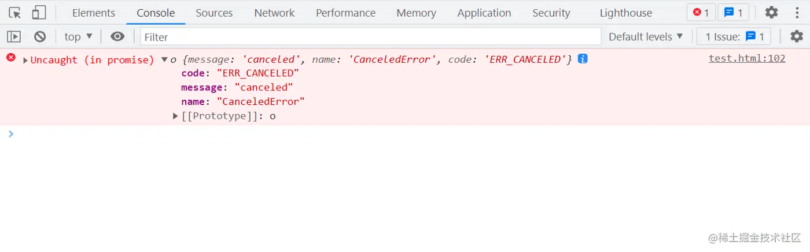

注意：axios 之前用于取消请求的 CancelToken 方法已经被弃用，更多请见文档 [axios-http.com/docs/cancel](https://axios-http.com/docs/cancellation)[…](https://axios-http.com/docs/cancellation)；


---

## 浏览器有哪几种缓存，各种缓存的优先级是什么样的？

**参考答案：**

在浏览器中，有以下几种常见的缓存：

1. 强制缓存：通过设置 Cache-Control 和 Expires 等响应头实现，可以让浏览器直接从本地缓存中读取资源而不发起请求。
2. 协商缓存：通过设置 Last-Modified 和 ETag 等响应头实现，可以让浏览器发送条件请求，询问服务器是否有更新的资源。如果服务器返回 304 Not Modified 响应，则表示客户端本地缓存仍然有效，可直接使用缓存的资源。
3. Service Worker 缓存：Service Worker 是一种特殊的 JS 脚本，可以拦截网络请求并返回缓存的响应，以实现离线访问和更快的加载速度等功能。
4. Web Storage 缓存：包括 localStorage 和 sessionStorage。localStorage 用于存储用户在网站上的永久性数据，而 sessionStorage 则用于存储用户会话过程中的临时数据。

这些缓存的优先级如下：

1. Service Worker 缓存：由于其可以完全控制网络请求，因此具有最高的优先级，即使是强制缓存也可以被它所覆盖。
2. 强制缓存：如果存在强制缓存，并且缓存没有过期，则直接使用缓存，不需要向服务器发送请求。
3. 协商缓存：如果强制缓存未命中，但协商缓存可用，则会向服务器发送条件请求，询问资源是否更新。如果服务器返回 304 Not Modified 响应，则直接使用缓存。
4. Web Storage 缓存：Web Storage 缓存的优先级最低，只有在网络不可用或者其他缓存都未命中时才会生效。


---

## 给某个资源的链接，如 https://www.baidu.com/index.html ，请实现一个方法，获取该资源的后缀，如 html


**参考答案：**

本题主要考察字符串相关的方法，实现比较简单，下面列举两个实现方法。

```JavaScript
var fileName = "https://www.baidu.com/index.html";

function getFileExtension(url){
        if(typeof url !== 'string'){
            return ''
    }
    
    // 方法一
    return url.substring(url.lastIndexOf('.') + 1);
    
    // 方法二
    //return url.split('.').pop().toLowerCase();
}
```


---

## 怎么解决canvas中获取跨域图片数据的问题？


**参考答案：**

背景

在一张图片添加相关文字，然后转化为base64数据，上传至服务器。当代码上线写完部署到测试环境，控制台报出如下错题：

```Plaintext
Uncaught (in promise) DOMException: Failed to execute 'toDataURL' on 'HTMLCanvasElement': Tainted canvases may not be exported
```

这是因为页面在请求图片时产生跨域情况，canvas认为该图片数据为污染的数据，是不安全的数据，无法导出base64数据。

为什么 canvas 认为跨域图片数据为 污染的数据

当请求跨域图片数据，而未满足跨域请求资源的条件时。如果canvas使用未经跨域允许的图片的原始数据，这些是不可信的数据，可能会暴露页面的数据。

请求图片资源 - 同域

Request Headers带有cookie。图片数据是被canvas信任的。

请求图片资源 - 跨域

默认情况下，直接请求跨域图片。因为不符合跨域请求资源的条件，图片数据是不被canvas信任的。

为了解决图片跨域资源共享的问题，  元素提供了支持的属性：crossOrigin，该属性一共有两个值可选：anonymous 和 use-credentials，下面列举了两者的使用场景，以及满足的条件。

无法复制加载中的内容

代码示例

```JavaScript
// page origin is https://a.com

const canvas = document.createElement('canvas');
const context = canvas.getContext('2d');

const img = new Image();
img.crossOrigin = 'anonymous';
img.onload = function () {
   context.drawImage(this, 0, 0);
   context.getImageData(0, 0, img.width, img.height);
};
img.src = 'https://b.com/a.png';
```

另外，跨域图片能正常裁剪（图片未转化成base64），应该满足三个条件：

- img元素中设置crossorigin属性
- 图片允许跨域，设置响应头Access-Control-Allow-Origin
- 使用js方式请求图片资源, 需要避免使用缓存，设置url后加上时间戳，或者http头设置Cache-Control为no-cache

主要原因是：

- 如果使用跨域的资源画到canvas中，并且资源没有使用CORS去请求，canvas会被认为是被污染了, canvas可以正常展示，但是没办法使用toDataURL()或者toBlob()导出数据，见Allowing cross-origin use of images and canvas。 所以通过在img标签上设置crossorigin，启用CORS，属性值为anonymous，在CORS请求时不会发送认证信息,见HTML attribute: crossorigin。
- 在启用CORS请求跨域资源时，资源必须允许跨域，才能正常返回，最简单的方式设置响应头Access-Control-Allow-Origin
- 图片已经通过img标签加载过，浏览器默认会缓存下来，下次使用js方式再去请求，直接返回缓存的图片，如果缓存中的图片不是通过CORS 请求或者响应头中不存在Access-Control-Allow-Origin，都会导致报错。


---

## 前端怎么实现跨域请求？


什么是跨域？

**1.什么是同源策略及其限制内容？**

同源策略是一种约定，它是浏览器最核心也最基本的安全功能，如果缺少了同源策略，浏览器很容易受到XSS、CSRF等攻击。所谓同源是指"协议+域名+端口"三者相同，即便两个不同的域名指向同一个ip地址，也非同源。

同源策略限制内容有：

- Cookie、LocalStorage、IndexedDB 等存储性内容
- DOM 节点
- AJAX 请求发送后，结果被浏览器拦截了

但是有三个标签是允许跨域加载资源：

- ``
- `<link href=XXX>`
- `<script src=XXX>`

**2.常见跨域场景**

当协议、子域名、主域名、端口号中任意一个不相同时，都算作不同域。不同域之间相互请求资源，就算作“跨域”。

特别说明两点：

- 第一：如果是协议和端口造成的跨域问题“前台”是无能为力的。
- 第二：在跨域问题上，仅仅是通过“URL的首部”来识别而不会根据域名对应的IP地址是否相同来判断。“URL的首部”可以理解为“协议, 域名和端口必须匹配”。

跨域并不是请求发不出去，请求能发出去，服务端能收到请求并正常返回结果，只是结果被浏览器拦截了。你可能会疑问明明通过表单的方式可以发起跨域请求，为什么 Ajax 就不会?因为归根结底，跨域是为了阻止用户读取到另一个域名下的内容，Ajax 可以获取响应，浏览器认为这不安全，所以拦截了响应。但是表单并不会获取新的内容，所以可以发起跨域请求。同时也说明了跨域并不能完全阻止 CSRF，因为请求毕竟是发出去了。

---

跨域有哪些方案？

这里只介绍几种开发中用的比较多的，几乎用不到的比如：

- document.domain + iframe：适用主域名相同，子域名不同的跨域场景
- window.name + iframe：利用name值最长可以 2M ，并用不同页面或不同域名加载后依然存在的特性
- location.hash + iframe：适用通过 C 页面来实现 A 页面与 B 页面通信的场景

就不过多展开了

1. CORS

CORS 通信过程都是浏览器自动完成，需要浏览器(都支持)和服务器都支持，所以关键在只要服务器支持，就可以跨域通信，CORS请求分两类，`简单请求`和`非简单请求`

另外CORS请求默认不包含Cookie以及HTTP认证信息，如果需要包含Cookie，需要满足几个条件：

- 服务器指定了 `Access-Control-Allow-Credentials: true`
- 开发者须在请求中打开withCredentials属性: `xhr.withCredentials = true`
- `Access-Control-Allow-Origin不要设为星号`，指定明确的与请求网页一致的域名，这样就不会把其他域名的Cookie上传

简单请求

需要同时满足两个条件，就属于简单请求：

- 请求方法是：`HEAD`、`GET`、`POST`，三者之一
- 请求头信息不超过以下几个字段：

  - Accept
  - Accept-Language
  - Content-Language
  - Last-Event-Id
  - Content-Type：值为三者之一application/x-www/form/urlencoded、multipart/form-data、text/plain

需要这些条件是为了兼容表单，因为历史上表单一直可以跨域

浏览器直接发出CORS请求，具体来说就是在头信息中增加Origin字段，表示请求来源来自哪个域(协议+域名+端口)，服务器根据这个值决定是否同意请求。如果同意，返回的响应会多出以下响应头信息

```JavaScript
Access-Control-Allow-Origin: http://juejin.com // 和 Orign 一致  这个字段是必须的
Access-Control-Allow-Credentials: true // 表示是否允许发送 Cookie  这个字段是可选的
Access-Control-Expose-Headers: FooBar // 指定返回其他字段的值   这个字段是可选的
Content-Type: text/html; charset=utf-8 // 表示文档类型
```

在简单请求中服务器至少需要设置：`Access-Control-Allow-Origin` 字段

非简单请求

比如 PUT 或 DELETE 请求，或 Content-Type 为 application/json ，就是非简单请求。

非简单 CORS 请求，正式请求前会发一次 OPTIONS 类型的查询请求，称为`预检请求`，询问服务器是否支持网页所在域名的请求，以及可以使用哪些头信息字段。只有收到肯定的答复，才会发起正式XMLHttpRequest请求，否则报错

预检请求的方法是OPTIONS，它的头信息中有几个字段

- Origin: 表示请求来自哪个域，这个字段是必须的
- Access-Control-Request-Method：列出CORS请求会用到哪些HTTP方法，这个字段是必须的
- Access-Control-Request-Headers： 指定CORS请求会额外发送的头信息字段，用逗号隔开

OPTIONS请求次数过多也会损耗性能，所以要尽量减少OPTIONS请求，可以让服务器在请求返回头部添加

```JavaScript
Access-Control-Max-Age: Number // 数字 单位是秒
```

表示预检请求的返回结果可以被缓存多久，在这个时间范围内再请求就不需要预检了。不过这个缓存只对完全一样的URL才会生效

**2.Nginx代理跨域**

配置一个代理服务器向服务器请求，再将数据返回给客户端，实质和CORS跨域原理一样，需要配置请求响应头Access-Control-Allow-Origin等字段

```JavaScript
server { 
    listen 81; server_name www.domain1.com; 
    location / { 
        proxy_pass http://xxxx1:8080; // 反向代理 
        proxy_cookie_domain www.xxxx1.com www.xxxx2.com; // 修改cookie里域名 
        index index.html index.htm; 
        // 当用webpack-dev-server等中间件代理接口访问nignx时，此时无浏览器参与，故没有同源限制，下面的跨域配置可不启用 
        add_header Access-Control-Allow-Origin http://www.xxxx2.com; // 当前端只跨域不带cookie时，可为* 
        add_header Access-Control-Allow-Credentials true; 
    } 
}
```

**3.Node中间件代理跨域**

在 Vue 中 vue.config.js 中配置

```JavaScript
module.export = {
    ...
    devServer: {
        proxy: {
            [ process.env.VUE_APP_BASE_API ]: {
                target: \'http://xxxx\',//代理跨域目标接口
                ws: true,
                changeOrigin: true,
                pathRewrite: {
                    [ \'^\' + process.env.VUE_APP_BASE_API ] : \'\'
                }
            }
        }
    }
}
```

Node + express

```JavaScript
const express = require(\'express\')
const proxy = require(\'http-proxy-middleware\')
const app = express()
app.use(\'/\', proxy({ 
    // 代理跨域目标接口 
    target: \'http://xxxx:8080\', 
    changeOrigin: true, 
    // 修改响应头信息，实现跨域并允许带cookie 
    onProxyRes: function(proxyRes, req, res) { 
        res.header(\'Access-Control-Allow-Origin\', \'http://xxxx\')
        res.header(\'Access-Control-Allow-Credentials\', \'true\')
    }, 
    // 修改响应信息中的cookie域名 
    cookieDomainRewrite: \'www.domain1.com\' // 可以为false，表示不修改
})); 
app.listen(3000); 
```

**4.WebSocket**

WebSocket是HTML5标准中的一种通信协议，以`ws://`(非加密)和`wss://`(加密)作为协议前缀，该协议不实行同源政策，只要服务器支持就行

因为WebSocket请求头信息中有Origin字段，表示请求源来自哪个域，服务器可以根据这个字段判断是否允许本次通信，如果在白名单内，就可以通信

**5.postMessage**

postMessage是HTML5标准中的API，它可以给我们解决如下问题：

- 页面和新打开的窗口间数据传递
- 多窗口之间数据传递
- 页面与嵌套的 iframe 之间数据传递
- 上面三个场景之间的`跨域传递`

postMessage 接受两个参数，用法如下：

- 参数一：发送的数据
- 参数二：你要发送给谁就写谁的地址`(协议 + 域名 +端口`)，也可以设置为`*`，表示任意窗口，为`/`表示与当前窗口同源的窗口

**6.JSONP**

原理就是通过添加一个<script>标签，向服务器请求JSON数据，这样不受同源政策限制。服务器收到请求后，将数据放在一个callback回调函数中传回来。比如axios。

不过`只支持GET请求`且`不安全`，可能遇到XSS攻击，不过它的好处是可以向老浏览器或不支持CORS的网站请求数据

```JavaScript
    let script = document.createElement('script')
    script.type = 'text/javascript'
    script.src = 'http://juejin.com/xxx?callback=handleCallback'
    document.body.appendChild(script)
    
    function handleCallback(res){
        console.log(res)
    }
```

服务器返回并立即执行

```JavaScript
handleCallback({ code: 200, msg: 'success', data: [] })
```

**跨域时 Cookie 要做何处理？**

---

指的就是对第三方使用 Cookie 的设置，在 Cookie 信息中添加 `SameSite` 属性

```JavaScript
Set-Cookie: widget_session=123456; SameSite=None; Secure
```

SameSite 有三个值：

- `strict`：严格模式，完全禁止使用Cookie
- `lax`：宽松模式，允许部分情况使用Cookie，`跨域的都行`，a标签跳转，link标签，GET提交的表单
- `none`：任何情况下都会发送Cookie，但必须同时设置Secure属性，意思是需要安全上下文，Cookie `只能通过https发送`，否则无效

Chrome 80之前默认值是none，之后是lax

不过在最新的 `Chrome91` 版本中这个`已经被移除`了，所以在 91之前的版本依然可以使用

如果 Chrome 或 Edge 版本大于91小于94的话，可以通过[Chromium支持的command-line flag](https://peter.sh/experiments/chromium-command-line-switches/)

- 右键 Chrome 或 Edge 浏览器，选择属性
- 在目标(Target)属性末尾加上

```JavaScript
 --disable-features=SameSiteByDefaultCookies,CookiesWithoutSameSiteMustBeSecure
```

并且官方说的到 94 版本会连 comman-line 也会移除

官方的说法是任由开发者控制这两个选项，容易被攻击


---

## 浏览器为什么要有跨域限制？


**参考答案：**

因为存在浏览器同源策略，所以才会有跨域问题。那么浏览器是出于何种原因会有跨域的限制呢。其实不难想到，跨域限制主要的目的就是为了用户的上网安全。

如果浏览器没有同源策略，会存在什么样的安全问题呢。下面从 DOM 同源策略和 XMLHttpRequest 同源策略来举例说明：

如果没有 DOM 同源策略，也就是说不同域的 iframe 之间可以相互访问，那么黑客可以这样进行攻击：

- 做一个假网站，里面用 iframe 嵌套一个银行网站 http://mybank.com。
- 把 iframe 宽高啥的调整到页面全部，这样用户进来除了域名，别的部分和银行的网站没有任何差别。
- 这时如果用户输入账号密码，我们的主网站可以跨域访问到 [http://mybank.com](http://mybank.com/) 的 dom 节点，就可以拿到用户的账户密码了。

如果没有 XMLHttpRequest 同源策略，那么黑客可以进行 CSRF（跨站请求伪造） 攻击：

- 用户登录了自己的银行页面 http://mybank.com，http://mybank.com 向用户的 cookie 中添加用户标识。
- 用户浏览了恶意页面 http://evil.com，执行了页面中的恶意 AJAX 请求代码。
- [http://evil.com](http://evil.com/) 向 [http://mybank.com](http://mybank.com/) 发起 AJAX HTTP 请求，请求会默认把 [http://mybank.com](http://mybank.com/) 对应 cookie 也同时发送过去。
- 银行页面从发送的 cookie 中提取用户标识，验证用户无误，response 中返回请求数据。此时数据就泄露了。
- 而且由于 Ajax 在后台执行，用户无法感知这一过程。

因此，有了浏览器同源策略，我们才能更安全的上网。

---

## 浏览器的同源策略是什么？


**参考答案：**

同源策略（Same origin policy）是一种约定，它是浏览器最核心也最基本的安全功能，如果缺少了同源策略，则浏览器的正常功能可能都会受到影响。可以说 Web 是构建在同源策略基础之上的，浏览器只是针对同源策略的一种实现。

它的核心就在于它认为自任何站点装载的信赖内容是不安全的。当被浏览器半信半疑的脚本运行在沙箱时，它们应该只被允许访问来自同一站点的资源，而不是那些来自其它站点可能怀有恶意的资源。

所谓同源是指：域名、协议、端口相同。

另外，同源策略又分为以下两种：

- DOM 同源策略：禁止对不同源页面 DOM 进行操作。这里主要场景是 iframe 跨域的情况，不同域名的 iframe 是限制互相访问的。
- XMLHttpRequest 同源策略：禁止使用 XHR 对象向不同源的服务器地址发起 HTTP 请求。

---

## 为什么部分请求中，参数需要使用 encodeURIComponent 进行转码？


**参考答案：**

一般来说，URL只能使用英文字母、阿拉伯数字和某些标点符号，不能使用其他文字和符号。

这是因为网络标准RFC 1738做了硬性规定：

> "...Only alphanumerics [0-9a-zA-Z], the special characters "\$-\_.+!\*'()," [not including the quotes - ed], and reserved characters used for their reserved purposes may be used unencoded within a URL."

这意味着，如果URL中有汉字，就必须编码后使用。但是麻烦的是，RFC 1738没有规定具体的编码方法，而是交给应用程序（浏览器）自己决定。这导致"URL编码"成为了一个混乱的领域。

不同的操作系统、不同的浏览器、不同的网页字符集，将导致完全不同的编码结果。如果程序员要把每一种结果都考虑进去，是不是太恐怖了？有没有办法，能够保证客户端只用一种编码方法向服务器发出请求？

就是使用Javascript先对URL编码，然后再向服务器提交，不要给浏览器插手的机会。因为Javascript的输出总是一致的，所以就保证了服务器得到的数据是格式统一的。

Javascript语言用于编码的函数，一共有三个，最古老的一个就是escape()。虽然这个函数现在已经不提倡使用了，但是由于历史原因，很多地方还在使用它，所以有必要先从它讲起。

它的具体规则是，除了ASCII字母、数字、标点符号"@ \* \_ + - . /"以外，对其他所有字符进行编码。

encodeURI()是Javascript中真正用来对URL编码的函数。

它着眼于对整个URL进行编码，因此除了常见的符号以外，对其他一些在网址中有特殊含义的符号"; / ? : @ & = + \$ , #"，也不进行编码。编码后，它输出符号的utf-8形式，并且在每个字节前加上%。

最后一个Javascript编码函数是encodeURIComponent()。与encodeURI()的区别是，它用于对URL的组成部分进行个别编码，而不用于对整个URL进行编码。

因此，"; / ? : @ & = + \$ , #"，这些在encodeURI()中不被编码的符号，在encodeURIComponent()中统统会被编码。至于具体的编码方法，两者是一样。

它对应的解码函数是decodeURIComponent()。


---

## WebSocket 中的心跳是为了解决什么问题？


**参考答案：**

- 为了定时发送消息，使连接不超时自动断线，避免后端设了超时时间自动断线。所以需要定时发送消息给后端，让后端服务器知道连接还在通消息不能断。
- 为了检测在正常连接的状态下，后端是否正常。如果我们发了一个定时检测给后端，后端按照约定要下发一个检测消息给前端，这样才是正常的。如果后端没有正常下发，就要根据设定的超时进行重连。


---

## 说说对 WebSocket 的了解


**参考答案：**

什么是WebSocket

HTML5开始提供的一种浏览器与服务器进行全双工通讯的网络技术，属于应用层协议。它基于TCP传输协议，并复用HTTP的握手通道。

优点

说到优点，这里的对比参照物是HTTP协议，概括地说就是：支持双向通信，更灵活，更高效，可扩展性更好。

- 支持双向通信，实时性更强。
- 更好的二进制支持。
- 较少的控制开销。连接创建后，ws客户端、服务端进行数据交换时，协议控制的数据包头部较小。在不包含头部的情况下，服务端到客户端的包头只有2\~10字节（取决于数据包长度），客户端到服务端的的话，需要加上额外的4字节的掩码。而HTTP协议每次通信都需要携带完整的头部。
- 支持扩展。ws协议定义了扩展，用户可以扩展协议，或者实现自定义的子协议。（比如支持自定义压缩算法等）


---

## 写一个 LRU 缓存函数


**参考答案：**

关于缓存，有个常见的例子是，当用户访问不同站点时，浏览器需要缓存在对应站点的一些信息，这样当下次访问同一个站点的时候，就可以使访问速度变快（因为一部分数据可以直接从缓存读取）。 但是想想内存空间是有限的，所以必须有一些规则来管理缓存的使用，而LRU（Least Recently Used） Cache就是其中之一，直接翻译就是“最不经常使用的数据，重要性是最低的，应该优先删除”。

需求分析

假设我们要实现一个简化版的这个功能，先整理下需求：

- 需要提供put方法，用于写入不同的缓存数据，假设每条数据形式是{'域名','info'},例如{'[https://segmentfault.com](https://segmentfault.com/)': '一些关键信息'}（如果是同一站点重复写入，就覆盖）;
- 当缓存达到上限时， 调用put写入缓存之前, 要删除最近最少使用的数据；
- 提供get方法，用于读取缓存数据，同时需要把被读取的数据，移动到最近使用数据 ；
- 考虑到读取性能，希望get操作的复杂度是O(1)（简单理解就是，读取缓存时不能去遍历所有数据）

数据选型

首先题目里很明显的提到了，需要能够标记数据的插入或使用顺序， 所以肯定不能简单使用object实现，需要借助数组，或者es6的Map和Set实现(Map和Set数据遍历是有序的，遍历顺序即插入顺序)；

其次需要实现O(1)复杂度，那就也无法用单纯使用数组来实现，所以可以考虑的只有Map和Set，那么最后再考虑下数据重复性的问题，会发现这道题不太需要考虑这个场景，所以我们可以先使用Map来实现。

由于Map的特性是：新插入的数据排在后面，旧数据放在前面， 所以我们只要专注于维持这个逻辑就好了:

- 如果遇到要删除数据，则优先从前面删除, 因为最前面的必定是最不常用数据；
- 如果读取某条数据，则应该把数据放到末尾，保证该数据变为最近使用数据；

算法实现

接下来就可以一步步是实现代码了，首先是最基本的 构造函数:

```JavaScript
// 第一步代码
class LRUCache {
    constructor(n){
        this.size = n; // 初始化最大缓存数据条数n
        this.data = new Map(); // 初始化缓存空间map
    }
}
```

接下来是put方法，put方法要处理3个逻辑：

1、如果待写入的域名，已存在于内存之中，直接更新数据并移动到末尾； 2、如果当前未达到缓存数量上限，直接写入新数据； 3、如果当前已经达到缓存数量上限， 要先删除最不经常使用的数据，再写入数据；

其他都可以直接操作，移动到末尾这个行为，可以拆成"先删除该数据，再从末尾重新插入一条该数据"，这样就简单多了。所以我们继续更新代码：

```JavaScript
// 第一步代码
class LRUCache {
    constructor(n){
        this.size = n; // 初始化最大缓存数据条数n
        this.data = new Map(); // 初始化缓存空间map
    }
    // 第二步代码
    put(domain, info){
        if(this.data.has(domain)){
            this.data.delete(domain); // 移除数据
            this.data.set(domain, info)// 在末尾重新插入数据
            return;
        }
        if(this.data.size >= this.size) {
            // 删除最不常用数据
            const firstKey= this.data.keys().next().value; // 不必当心data为空，因为this.size 一般不会取0，满足this.data.size >= this.size时，this.data自然也不为空。
            this.data.delete(firstKey);
        }
        this.data.set(domain, info) // 写入数据
    }
}
```

接着就只剩下get方法了，get方法同样也要处理2种逻辑：

1、根据给定的key，查找是否有对应的信息，若不存在则返回false； 2、若第一步结果存在，则把被访问数据移动到末尾；

```JavaScript
// 第一步代码
class LRUCache {
    constructor(n){
        this.size = n; // 初始化最大缓存数据条数n
        this.data = new Map(); // 初始化缓存空间map
    }
    
    // 第二步代码
    put(domain, info){
        if(this.data.size >= this.size) {
        // 删除最不常用数据
        const firstKey= [...this.data.keys()][0];// 次数不必当心data为空，因为this.size 一般不会取0，满足this.data.size >= this.size时，this.data自然也不为空。
        this.data.delete(firstKey);
        }
        this.data.set(domain, info) // 写入数据
    }

    // 第三步代码
    get(domain) {
        if(!this.data.has(domain)){
            return false;
        }
        const info = this.data.get(domain); //获取结果
        this.data.delete(domain); // 移除数据
        this.data.set(domain, info); // 重新添加该数据
        return info;
    }
}
```

这一步要稍微注意的是，我们是先移除数据后添加数据，严格遵循最大数量不超过n。


---

## webSocket如何兼容低浏览器


**参考答案：**

- Adobe Flash Socket；
- ActiveX HTMLFile (IE) ；
- 基于 multipart 编码发送 XHR；
- 基于长轮询的 XHR；


---

## 什么是跨域？


**参考答案：**

跨域本质是浏览器基于同源策略的一种安全手段

同源策略（Sameoriginpolicy），是一种约定，它是浏览器最核心也最基本的安全功能

所谓同源（即指在同一个域）具有以下三个相同点

- 协议相同（protocol）
- 主机相同（host）
- 端口相同（port）

反之非同源请求，也就是协议、端口、主机其中一项不相同的时候，这时候就会产生跨域

> 一定要注意跨域是浏览器的限制，你用抓包工具抓取接口数据，是可以看到接口已经把数据返回回来了，只是浏览器的限制，你获取不到数据。用postman请求接口能够请求到数据。这些再次印证了跨域是浏览器的限制。
