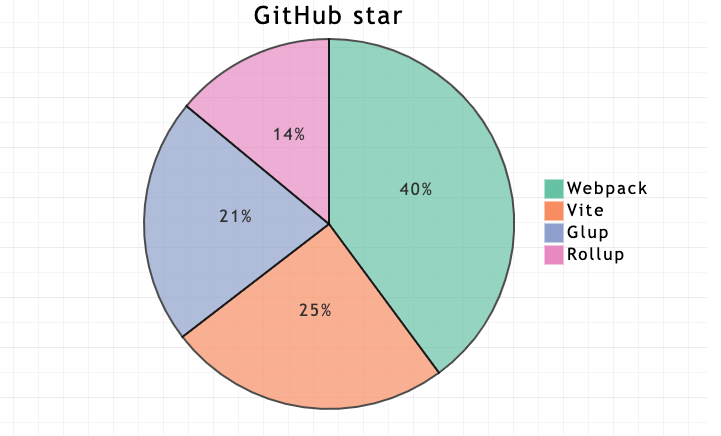

# JavaScript · 工程化与模块（18题）

## common.js和es6中模块引入的区别？


**参考答案：**

CommonJS 和 ES6 模块系统在语法和行为上有显著的区别：

CommonJS

CommonJS 是一种模块系统，主要用于 Node.js 环境。它使用 `require` 函数来引入模块，并使用 `module.exports` 来导出模块。

语法

- 导出模块：

```JavaScript
// moduleA.js
const name = 'John';
module.exports = name;

// 或者导出一个对象
const person = { name: 'John', age: 30 };
module.exports = person;
```

- 引入模块：

```JavaScript
// main.js
const name = require('./moduleA');
console.log(name); // 'John'

// 引入对象
const person = require('./moduleA');
console.log(person.name); // 'John'
console.log(person.age);  // 30
```

特点

1. 动态引入： `require` 可以在函数体内、条件语句中动态引入模块。

```JavaScript
if (condition) {
    const moduleA = require('./moduleA');
}
```

1. 同步加载： `require` 是同步的，模块在执行 `require` 时会立即加载并返回结果。
2. 导出的是值的拷贝： 但对于对象和数组等引用类型，修改引用类型的属性会在所有引用中反映出来。

```JavaScript
const obj = require('./moduleA');
obj.newProp = 'new';
console.log(require('./moduleA').newProp); // 'new'
```


ES6 模块

ES6 模块系统是 ECMAScript 标准的一部分，使用 `import` 和 `export` 语法来定义模块，广泛用于现代前端开发以及一些支持 ES6 的服务器环境。


语法

- 导出模块：

```JavaScript
// moduleA.js
export const name = 'John';

// 导出默认值
const person = { name: 'John', age: 30 };
export default person;
```

- 引入模块：

```JavaScript
// main.js
import { name } from './moduleA';
console.log(name); // 'John'

// 引入默认导出
import person from './moduleA';
console.log(person.name); // 'John'
console.log(person.age);  // 30
```

特点

1. 静态引入： `import` 必须在文件的顶部声明，不能在函数体内或条件语句中使用。这使得 ES6 模块可以在编译时确定依赖关系和优化。

```JavaScript
// 错误的用法
if (condition) {
    import { name } from './moduleA';
}
```

1. 异步加载： 浏览器中的 ES6 模块是异步加载的，这意味着它们不会阻塞页面的其他加载过程。
2. 导出的是值的引用： 导出值的引用意味着当导出模块中的值发生变化时，所有引用该值的地方都会反映出这些变化。

```JavaScript
// moduleA.js
export let count = 1;
setTimeout(() => { count += 1; }, 1000);

// main.js
import { count } from './moduleA';
setTimeout(() => { console.log(count); }, 2000); // 2
```

兼容性和转换

- CommonJS 和 ES6 模块的互操作性： 在 Node.js 环境中，可以使用工具如 Babel 或 Webpack 将 ES6 模块转换为 CommonJS 模块，从而实现兼容性。
- 双向兼容： 使用工具链（如 Babel、Webpack）可以同时支持 CommonJS 和 ES6 模块语法，并在构建过程中根据目标环境进行转换。


总结

- 语法区别： CommonJS 使用 `require` 和 `module.exports`，而 ES6 模块使用 `import` 和 `export`。
- 加载方式： CommonJS 是同步加载，ES6 模块是静态分析和异步加载。
- 使用场景： CommonJS 主要用于 Node.js 环境，而 ES6 模块是 ECMAScript 标准的一部分，更适合现代前端开发。

选择使用哪种模块系统取决于项目需求和运行环境。对于现代前端开发，推荐使用 ES6 模块。对于 Node.js 项目，传统上使用 CommonJS，但也可以逐渐迁移到 ES6 模块。


---

## 为什么Node在使用es module时必须加上文件扩展名?


**参考答案：**

这个事情分两部分说。

第一个问题是，我们需要用代码内容以外的信息（比如文件扩展名来确定一段代码是否是es module。

这件事情的根子是在TC39，在设计es module时就无法从语法上严格区分一段代码到底是es module还是传统的script（注意 commonjs 本质上仍然是传统script）。

有人可能会问，难道不是有`import`、`export`语句就是es module啊？ 从开发者的理解上来说，确实是这样。但问题是，没有`import`、`export`语句也不代表就不是es module。

曾经node社区在TC39的代表提出提案（[tc39/proposal-UnambiguousJavaScriptGrammar](https://github.com/tc39/proposal-UnambiguousJavaScriptGrammar)）来通过语法区分。可能的方案有几种：

1. 类似`"use strict"`，我们可以通过引入`"use module"`指令来解决。  
【优点：容易理解，也很容易实现，没有额外的解析成本；缺点：对于大多数已经有`export`语句的模块来说，有点脱裤子放屁。】
2. 通过`export`语句是否存在来分辨，对于本身不需要`export`的模块，开发者通过加入`export {}`（这是语法上允许的export语句，虽然啥都不导出）来标记其为es module。  
【优点：对于大多数模块来说不需要额外标记；缺点：由于`export`语句并不必然在代码头部，所以解析器需要预扫描`export`语句，决定是否是es module。】
3. 引入某种新的语法来标记。  
【优缺点：类似1】

但是这些方案在TC39讨论时都没法通过。并且可以判断，将来也不可能再引入。

> PS：提醒，TypeScript就是使用 方案2 来确定是否是es module的。】

因为不能通过代码内容本身来判断是否是es module，那就需要某种外部信息。

对于Web平台来说，是通过`<script type=module>`来标明的（也延伸到其他标签，比如需要单独的`<link rel=modulepreload>`；也延伸到其他API，如`new Worker(path, {type: 'module'})`需要额外参数标明是es module）。

对于node.js这样的命令行来说，就要通过文件扩展名（`.mjs`）来标明，或者通过`package.json`文件中的`"type": "module"`字段来标明。

---

第二个问题是，我们需要用完整的路径（包含文件扩展名）来导入，即`import "./my-module.mjs"`而不是`import "./my-module"`。

Node.js下的commonjs模块的resolve规则是按照服务器端脚本系统来设计的，它基于一个假设，即文件系统访问的成本是很小的（不过马后炮来说，今天的大型应用里，大量细碎小模块的resolve成本常常已经不能忽略），因此只要用起来方便，resolve规则复杂一点是ok的。

所以node.js的模块解析机制有复杂的fallback机制。比如对于`require('./my-module')` ，会先寻找该脚本同目录的`my-module`（不带有扩展名）文件，如果找不到则寻找`my-module.js`文件，如果再找不到则寻找`my-module/index.js`文件。

但如此的fallback如果无脑照搬到浏览器端，就会是多次的network roundtrip，这成本肯定是不能接受的。因此在浏览器端，`import`语句中引用的模块，就是一个标准的url，在没有其他额外处理（服务器端根据请求的url返回对应的文件，是可做类似node.js的fallback机制的）的情况下，通常也会包含完整的文件扩展名。

当年node.js加入commonjs模块时，它并不需要考虑和浏览器的一致性。即使后来前端的构建打包工具或一些前端加载器、框架等支持了commonjs模块，也是反过来去兼容node.js的。但今天node.js要加入es module，就需要考虑和浏览器的一致性。

最后，浏览器端import模块要注意的不仅是扩展名，还包括不能直接使用「裸名字」，即不能直接`import "my-module"`。如果要使用的话，需要通过import maps来预先定义。Node.js下虽然可以像`require`那样直接用`import "my-module"`，但也加入了类似import maps的机制。

【补充】

之前遗漏了一个重要差异，对于`import "./file.js"`，Web平台总是将`file.js`作为es module进行解析的，而node.js则总是依据前述外部信息对`file.js`进行解析。如后缀名为`.js`即默认按照commonjs进行解析，除非`package.json`中设定了`"type": "module"`。（node.js中commonjs模块如何当成一个es module使用，是另一个大问题，此处不赘述。）

理论上说，`file.js`不包含`export`、`import`等只允许在es module中出现的语句，也不包含一些在es module中被禁用的特性，则`file.js`既可以按照es module解析，也可以按照传统script解析。Web平台就是如此，这就要求确定一个脚本资源时（比如缓存时），不是url唯一的，而是还需要纳入解析目标（parse goal）。（当然，本来就不是url唯一，需要考虑mime type的，但es module也仍然使用`text/javascript`的mime type。）

而node.js因为要考虑既有的commonjs资产，就决定要同时支持es module和commonjs，因此对于`import "./file.js"`就不可能总是按照es module解析。另一方面node.js的模块缓存一直以来也是基于url唯一的（文件系统没有mime type）。


---

## package.json 文件中的 devDependencies 和 dependencies 对象有什么区别？


**参考答案：**

前端项目的 `package.json` 文件中，`dependencies` 和 `devDependencies` 对象都用于指定项目所依赖的软件包，但它们在项目的开发和生产环境中的使用有所不同。

1. dependencies：

   - `dependencies` 是指定项目在生产环境中运行所需要的依赖项。
   - 这些依赖项通常包括运行时需要的库、框架、工具等。
   - 当你通过 `npm install` 或 `npm ci` 安装依赖时，默认会安装 `dependencies` 中的包。
   - 这些依赖项会被打包和部署到生产环境中，因此它们对于项目的运行是必需的。
2. devDependencies：

   - `devDependencies` 是指定在开发过程中所需要的依赖项。
   - 这些依赖项通常包括开发、测试、构建、部署等过程中所需的工具、库等。
   - 例如，测试框架、构建工具、代码检查工具等通常属于 `devDependencies`。
   - 当你在开发环境中使用 `npm install` 安装依赖时，只会安装 `dependencies` 中的包。要安装 `devDependencies` 中的包，你需要额外使用 `npm install --dev` 或 `npm install --only=dev` 等命令。
   - 这些依赖项不会被打包到生产环境中，因为它们只在开发过程中需要，对于实际部署和运行项目并不需要。

总的来说，`dependencies` 中的依赖项是项目运行所必需的，而 `devDependencies` 中的依赖项则是在开发过程中需要的辅助工具和库。


---

## webpack 5 的主要升级点有哪些？


**参考答案：**

- 持久缓存（Persistent Caching）： Webpack 5引入了更好的持久缓存机制，利用了更稳定的HashedModuleIdsPlugin和NamedChunksPlugin，以改善构建性能。
- Tree-shaking 改进： Webpack 5对Tree-shaking进行了改进，提供了更好的代码优化，以便删除未使用的代码。
- 支持 WebAssembly（WASM）： Webpack 5 对 WebAssembly 提供了原生的支持，使得在项目中使用 WebAssembly 更加方便。
- 支持 ES6 模块导入（Dynamic Import）： Webpack 5对动态导入语法（import()）提供了更好的支持，可以更轻松地进行代码分割。
- 模块联邦（Module Federation）： 这是Webpack 5中的一项重大功能，允许将多个独立的Webpack构建连接在一起，实现模块共享，从而更好地支持微服务架构。
- 缓存组（Caching Groups）： 新的缓存组概念被引入，可以更细粒度地控制模块的缓存策略。
- 内置代码分割优化（optimization.splitChunks）： Webpack 5通过optimization.splitChunks进行了重新设计，提供了更灵活的配置选项，使得代码分割更为强大和易用。
- 默认配置优化： Webpack 5 默认配置中的一些优化，使得开箱即用的性能更好。
- 提高构建性能： Webpack 5引入了一些性能优化，包括更快的持久化缓存、更快的构建速度等。
- 移除废弃特性： 作为更新，Webpack 5移除了一些过时的特性和API，因此在升级时需要注意潜在的破坏性变化。
- 

---

## 说说你对低代码的了解


**参考答案：**

低代码的热潮在几年前就火过，从阿里钉钉跨平台协作方式，再到飞书上的审批流程，以及目前我们接触到的表单审批、投票的模板，这些都是关于低代码的实现方式。随着企业数字化转型和云计算的不断发展，低代码平台又一次成为热门话题被越来越多的人讨论。


低代码平台概述

低代码开发平台，英文全称“Low-Code Development Platform”，简称 LCDP，是通过少量代码或零代码就可以快速生成新应用，实现业务应用的快速交付的应用平台。广义上的低代码平台包括低代码和零代码，它们都属于 APaaS（应用平台即服务）。

低代码这一概念首次出现于 20 世纪 80 年代

第一阶段是探索期，主要是基于 20 世纪 80 年代就有美国公司和实验室开始研究程序可视化编程这个领域，做出了4GL “第四代编程语言”，后来衍生成 VPL（Visual Programming Language可视化编程语言）。

第二阶段是发展期，2014年，由研究机构 Forrester Research 正式提出了“低代码/无代码”的概念。

第三阶段是爆发期，2018年，荷兰公司Mendix以7亿美元被西门子收购、美国低代码独角兽企业 Outsystem 获得1.5亿美元的融资。此次收购事件以及融资事件的发生将低代码市场带入资本方的视野，低代码市场开始进入爆发期。

低代码平台代替了程序员开发数千行具有复杂代码和语法的行。它的作用是让开发人员以及业务人员，通过“拖拉拽”的方式使用平台，来创建完整的应用程序。同时突破了传统业务之间沟通的复杂度和交付时间周期长的特点，能够持续进行开发。


低代码、无代码

低代码平台包括低代码和无代码，二者区别如下：

- 无代码：主要面向业务人员，零开发经验的业务人员通过拖拽等方式，无需编写代码，即可快速搭建各种应用。无代码更适合单点场景的应用，平台应用性高于低代码。
- 低代码：主要面向开发人员，通过自动代码生成和可视化编程，只需要少量代码，即可快速搭建各种应用。低代码的市场占有率高，适合复杂场景交互应用的搭建。平台灵活性高于无代码。

但本质上低代码与无代码都能够降低开发门槛、快速响应业务需求、提升开发效率。

接下来我们来看看具体的低代码平台技术路线。


低代码平台的技术路线

因低代码平台源自于集成开发环境（Integrated Development Environment，IDE）的可视化、模块化与集成化特点，同时根据目标人群对象的使用，大体分为两条线路：第一条为业务复用型，主要包含应用开发平台、智能表格、SAAS 聚合，特点是数据与逻辑完全分离、各自独立的模型驱动，适合开发人员。第二条为开发工具型，主要包含在线 IDE、DSL 开发框架、组件代码库，特点是数据与储存结构合一的表单驱动，适合业务人员使用。


适合开发人员的技术路线

我们首先来看下适用于开发人员的技术路线模型驱动。由模型驱动对软件所涉及到的功能进行建模，然后以应用开发平台为核心，承载各种开发工具和复杂逻辑，并将其可视化。然后辅以少量代码，就能够作为技术中台核心帮助开发者快速产出一整套系符合企业需求的系统。

开发人员通过图中左右两边进行操作，左边是一些特定组件，拖到中间的画布里面。图中的板块都是相互独立的，需要通过右边的语法把它们进行关联，再生成所需要的场景化应用，这是模型驱动的一种方式。


适合业务人员的技术路线

该路线是非IT模式，以表单驱动数据为核心，通过拖拽构建数据表方式展开业务分析设计。以做到完全去IDE化，像搭积木一样按流程构建程序逻辑。适合完全零基础人员，比如人事行政进行资料归档、OA审批，销售人员客户管理等。

左边是拖拽组件，中间是画布，右边是编辑属性。我们通过左边拖拽表单将事件排列在上面，进行简单的数据收集。右边是对表单进行数据处理，比如标题、宽度、必填线等设置。适合业务人员去操作填写数据表格，快速生成自己想要的数据收集，这是表单驱动的一种方式。

对于这类技术路线的产品，又拍云在2020年曾经开发过一套，我们接下来通过又拍云低代码产品来看一下表单驱动的具体应用场景。


低代码可视化拖拽平台的应用

该产品使用拖拉拽的方式，生成所需要的表单。生成表单后，显示面板会把表单数组包括的 json 数据拿出，再通过它识别组件的顺序进行编译后展示。


编辑器实现思路

该产品的编辑器实现思路如下：

首先，使用数组 componentData 维护编辑器中的数据。

其次，将组件通过拖拽事件，拖拽到画布上进行移动布局。当然一个组件要设为可拖拽，那就需要为它添加 draggable 属性，而且在将组件列表中的组件拖拽到画布中时还会经历两个关键事件：

- dragstart 事件
- drop 事件

dragstart 事件，它在拖拽刚开始时触发，主要用于将拖拽的组件信息传递给布，下图是示例代码：

drop 事件，在拖拽结束时触发，主要作用是用于接收拖拽的组件信息，示例代码如下图：

之后使用 push() 方法将新的组件数据添加到 componentData。比如又拍云使用的 VLE 框架就是通过属性来识别我们想要的组件。具体为组件 V-item 是文本数据宽，可以通过其对应的属性值进行上下数据绑定，把数据填到结成数组里面。

组件数据如下：

最后，我们使用 v-for 指令遍历 componentData，主要通过 is 属性来识别出真正要渲染的是哪个组件，将每个组件逐个渲染到画布。例如要渲染的组件数据是 { component: 'v-text' }，则  会被转换为 。

编辑器渲染的核心代码如下所示：

全部完成后我们来看一下整体，如果将画布设为相对定位 position: relative，然后将每个组件设为绝对定位 position: absolute，只要通过监听三个事件就可以进行移动，这三个事件分别为：

- Mousedown 事件，在组件上按下鼠标时，记录组件当前的位置，即 css 中的 left 和 top。
- Mousemove 事件，每次鼠标移动时，都用当前最新的 left 和 top 减去最开始的 left 和 top，从而计算出移动距离，再改变组件位置。
- Mouseup 事件，鼠标抬起时结束移动。

以上就是编译器的整体实现思路。


浅谈低代码平台的未来

根据咨询机构 Gartner 的市场分析来看，2023 年全球超过 50% 的大中型企业将把低代码应用平台作为主要的占领应用平台之一。预计到2024年，低代码应用程序开发将占总应用开发的65%以上。这就引出了两个问题：传统的软件开发会被取代吗？低代码是未来的趋势吗？

实际上，低代码开发并不会取代传统的软件开发，但它将改变在某些领域中的软件开发，改变那些重复低效的业务，这意味着公司不需要为这种业务招聘大量的开发人员，而是安排更多的专业软件开发人员面向客户的需求以及复杂和独特的软件开发问题。

尽管相较于原生的开发模式，低代码开发平台能够显著提升开发效率，尤其适合业务变化快、预算有限、开发时间紧迫的企业应用场景；但是低代码平台也有明显的局限性，至少就目前来说，它主要用于搭建企业软件。因为此类软件架构是有一定规律的，但娱乐、社交等软件开发比较深层交互的东西低代码还是无法实现的。


---

## 说下Vite的原理


**参考答案：**

背景

这里的背景介绍会从与`Vite`紧密相关的两个概念的发展史说起，一个是`JavaScript`的模块化标准，另一个是前端构建工具。


共存的模块化标准

为什么`JavaScript`会有多种共存的模块化标准？因为js在设计之初并没有模块化的概念，随着前端业务复杂度不断提高，模块化越来越受到开发者的重视，社区开始涌现多种模块化解决方案，它们相互借鉴，也争议不断，形成多个派系，从`CommonJS`开始，到`ES6`正式推出`ES Modules`规范结束，所有争论，终成历史，`ES Modules`也成为前端重要的基础设施。

- CommonJS：现主要用于Node.js（Node@13.2.0开始支持直接使用ES Module）
- AMD：`require.js` 依赖前置，市场存量不建议使用
- CMD：`sea.js` 就近执行，市场存量不建议使用
- ES Module：ES语言规范，标准，趋势，未来

对模块化发展史感兴趣的可以看下[《前端模块化开发那点历史》@玉伯](https://github.com/seajs/seajs/issues/588)，而`Vite`的核心正是依靠浏览器对ES Module规范的实现。


发展中的构建工具

近些年前端工程化发展迅速，各种构建工具层出不穷，目前`Webpack`仍然占据统治地位，npm 每周下载量达到两千多万次。下面是我按 npm 发版时间线列出的开发者比较熟知的一些构建工具。


当前工程化痛点

现在常用的构建工具如`Webpack`，主要是通过抓取-编译-构建整个应用的代码（也就是常说的打包过程），生成一份编译、优化后能良好兼容各个浏览器的的生产环境代码。在开发环境流程也基本相同，需要先将整个应用构建打包后，再把打包后的代码交给`dev server`（开发服务器）。

`Webpack`等构建工具的诞生给前端开发带来了极大的便利，但随着前端业务的复杂化，js代码量呈指数增长，打包构建时间越来越久，`dev server`（开发服务器）性能遇到瓶颈：

- 缓慢的服务启动： 大型项目中`dev server`启动时间达到几十秒甚至几分钟。
- 缓慢的HMR热更新： 即使采用了 HMR 模式，其热更新速度也会随着应用规模的增长而显著下降，已达到性能瓶颈，无多少优化空间。

缓慢的开发环境，大大降低了开发者的幸福感，在以上背景下`Vite`应运而生。


什么是Vite？

基于esbuild与Rollup，依靠浏览器自身ESM编译功能， 实现极致开发体验的新一代构建工具！

概念

先介绍以下文中会经常提到的一些基础概念：

- 依赖： 指开发不会变动的部分(npm包、UI组件库)，esbuild进行预构建。
- 源码： 浏览器不能直接执行的非js代码(.jsx、.css、.vue等)，vite只在浏览器请求相关源码的时候进行转换，以提供ESM源码。


开发环境

- 利用浏览器原生的`ES Module`编译能力，省略费时的编译环节，直给浏览器开发环境源码，`dev server`只提供轻量服务。
- 浏览器执行ESM的`import`时，会向`dev server`发起该模块的`ajax`请求，服务器对源码做简单处理后返回给浏览器。
- `Vite`中HMR是在原生 ESM 上执行的。当编辑一个文件时，Vite 只需要精确地使已编辑的模块失活，使得无论应用大小如何，HMR 始终能保持快速更新。
- 使用`esbuild`处理项目依赖，`esbuild`使用go编写，比一般`node.js`编写的编译器快几个数量级。


生产环境

- 集成`Rollup`打包生产环境代码，依赖其成熟稳定的生态与更简洁的插件机制。


处理流程对比

`Webpack`通过先将整个应用打包，再将打包后代码提供给`dev server`，开发者才能开始开发。

`Vite`直接将源码交给浏览器，实现`dev server`秒开，浏览器显示页面需要相关模块时，再向`dev server`发起请求，服务器简单处理后，将该模块返回给浏览器，实现真正意义的按需加载。


基本用法

创建vite项目

```JavaScript
$ npm create vite@latest
```

选取模板

`Vite` 内置6种常用模板与对应的TS版本，可满足前端大部分开发场景，可以点击下列表格中模板直接在 [StackBlitz](https://vite.new/) 中在线试用，还有其他更多的 [社区维护模板](https://github.com/vitejs/awesome-vite#templates)可以使用。

<sheet sheet-id="WBBShq" token="WUmlsiZwRhbu1St8qHJcom3Snph"></sheet>

启动

```JSON
{
  "scripts": {
    "dev": "vite", // 启动开发服务器，别名：`vite dev`，`vite serve`
    "build": "vite build", // 为生产环境构建产物
    "preview": "vite preview" // 本地预览生产构建产物
  }
}
```

实现原理

ESbuild 编译

`esbuild` 使用go编写，cpu密集下更具性能优势，编译速度更快，以下摘自官网的构建速度对比：  
浏览器：“开始了吗？”  
服务器：“已经结束了。”  
开发者：“好快，好喜欢！！”


依赖预构建

- 模块化兼容： 如开头背景所写，现仍共存多种模块化标准代码，`Vite`在预构建阶段将依赖中各种其他模块化规范(CommonJS、UMD)转换 成ESM，以提供给浏览器。
- 性能优化： npm包中大量的ESM代码，大量的`import`请求，会造成网络拥塞。`Vite`使用`esbuild`，将有大量内部模块的ESM关系转换成单个模块，以减少 `import`模块请求次数。


按需加载

- 服务器只在接受到import请求的时候，才会编译对应的文件，将ESM源码返回给浏览器，实现真正的按需加载。


缓存

- HTTP缓存： 充分利用`http`缓存做优化，依赖（不会变动的代码）部分用max-age,immutable 强缓存，源码部分用304协商缓存，提升页面打开速度。
- 文件系统缓存： `Vite`在预构建阶段，将构建后的依赖缓存到`node_modules/.vite` ，相关配置更改时，或手动控制时才会重新构建，以提升预构建速度。


重写模块路径

浏览器`import`只能引入相对/绝对路径，而开发代码经常使用`npm`包名直接引入`node_module`中的模块，需要做路径转换后交给浏览器。

- `es-module-lexer` 扫描 import 语法
- `magic-string` 重写模块的引入路径

```JavaScript
// 开发代码
import { createApp } from 'vue'

// 转换后
import { createApp } from '/node_modules/vue/dist/vue.js'
```

源码分析

与`Webpack-dev-server`类似`Vite`同样使用`WebSocket`与客户端建立连接，实现热更新，源码实现基本可分为两部分，源码位置在:

- `vite/packages/vite/src/client` client（用于客户端）
- `vite/packages/vite/src/node` server（用于开发服务器）

client 代码会在启动服务时注入到客户端，用于客户端对于`WebSocket`消息的处理（如更新页面某个模块、刷新页面）；server 代码是服务端逻辑，用于处理代码的构建与页面模块的请求。

简单看了下源码（vite@2.7.2），核心功能主要是以下几个方法（以下为源码截取，部分逻辑做了删减）：

1. 命令行启动服务`npm run dev`后，源码执行`cli.ts`，调用`createServer`方法，创建http服务，监听开发服务器端口。

```JavaScript
// 源码位置 vite/packages/vite/src/node/cli.ts
const { createServer } = await import('./server')
try {
    const server = await createServer({
        root,
        base: options.base,
        ...
    })
    if (!server.httpServer) {
        throw new Error('HTTP server not available')
    }
    await server.listen()
}
```

1. `createServer`方法的执行做了很多工作，如整合配置项、创建http服务（早期通过koa创建）、创建`WebSocket`服务、创建源码的文件监听、插件执行、optimize优化等。下面注释中标出。

```JavaScript
// 源码位置 vite/packages/vite/src/node/server/index.ts
export async function createServer(
    inlineConfig: InlineConfig = {}
): Promise<ViteDevServer> {
    // Vite 配置整合
    const config = await resolveConfig(inlineConfig, 'serve', 'development')
    const root = config.root
    const serverConfig = config.server

    // 创建http服务
    const httpServer = await resolveHttpServer(serverConfig, middlewares, httpsOptions)

    // 创建ws服务
    const ws = createWebSocketServer(httpServer, config, httpsOptions)

    // 创建watcher，设置代码文件监听
    const watcher = chokidar.watch(path.resolve(root), {
        ignored: [
            '**/node_modules/**',
            '**/.git/**',
            ...(Array.isArray(ignored) ? ignored : [ignored])
        ],
        ...watchOptions
    }) as FSWatcher

    // 创建server对象
    const server: ViteDevServer = {
        config,
        middlewares,
        httpServer,
        watcher,
        ws,
        moduleGraph,
        listen,
        ...
    }

    // 文件监听变动，websocket向前端通信
    watcher.on('change', async (file) => {
        ...
        handleHMRUpdate()
    })

    // 非常多的 middleware
    middlewares.use(...)
    
    // optimize
    const runOptimize = async () => {...}

    return server
}
```

1. 使用[chokidar](https://www.npmjs.com/package/chokidar)监听文件变化，绑定监听事件。

```JavaScript
// 源码位置 vite/packages/vite/src/node/server/index.ts
  const watcher = chokidar.watch(path.resolve(root), {
    ignored: [
      '**/node_modules/**',
      '**/.git/**',
      ...(Array.isArray(ignored) ? ignored : [ignored])
    ],
    ignoreInitial: true,
    ignorePermissionErrors: true,
    disableGlobbing: true,
    ...watchOptions
  }) as FSWatcher
```

1. 通过 [ws](https://www.npmjs.com/package/ws) 来创建`WebSocket`服务，用于监听到文件变化时触发热更新，向客户端发送消息。

```JavaScript
// 源码位置 vite/packages/vite/src/node/server/ws.ts
export function createWebSocketServer(...){
    let wss: WebSocket
    const hmr = isObject(config.server.hmr) && config.server.hmr
    const wsServer = (hmr && hmr.server) || server

    if (wsServer) {
        wss = new WebSocket({ noServer: true })
        wsServer.on('upgrade', (req, socket, head) => {
            // 服务就绪
            if (req.headers['sec-websocket-protocol'] === HMR_HEADER) {
                wss.handleUpgrade(req, socket as Socket, head, (ws) => {
                    wss.emit('connection', ws, req)
                })
            }
        })
    } else {
        ...
    }
    // 服务准备就绪，就能在浏览器控制台看到熟悉的打印 [vite] connected.
    wss.on('connection', (socket) => {
        socket.send(JSON.stringify({ type: 'connected' }))
        ...
    })
    // 失败
    wss.on('error', (e: Error & { code: string }) => {
        ...
    })
    // 返回ws对象
    return {
        on: wss.on.bind(wss),
        off: wss.off.bind(wss),
        // 向客户端发送信息
        // 多个客户端同时触发
        send(payload: HMRPayload) {
            const stringified = JSON.stringify(payload)
            wss.clients.forEach((client) => {
                // readyState 1 means the connection is open
                client.send(stringified)
            })
        }
    }
}
```

1. 在服务启动时会向浏览器注入代码，用于处理客户端接收到的`WebSocket`消息，如重新发起模块请求、刷新页面。

```JavaScript
//源码位置 vite/packages/vite/src/client/client.ts
async function handleMessage(payload: HMRPayload) {
  switch (payload.type) {
    case 'connected':
      console.log(`[vite] connected.`)
      break
    case 'update':
      notifyListeners('vite:beforeUpdate', payload)
      ...
      break
    case 'custom': {
      notifyListeners(payload.event as CustomEventName<any>, payload.data)
      ...
      break
    }
    case 'full-reload':
      notifyListeners('vite:beforeFullReload', payload)
      ...
      break
    case 'prune':
      notifyListeners('vite:beforePrune', payload)
      ...
      break
    case 'error': {
      notifyListeners('vite:error', payload)
      ...
      break
    }
    default: {
      const check: never = payload
      return check
    }
  }
}
```

优势

- 快！快！非常快！！
- 高度集成，开箱即用。
- 基于ESM急速热更新，无需打包编译。
- 基于`esbuild`的依赖预处理，比`Webpack`等node编写的编译器快几个数量级。
- 兼容`Rollup`庞大的插件机制，插件开发更简洁。
- 不与`Vue`绑定，支持`React`等其他框架，独立的构建工具。
- 内置SSR支持。
- 天然支持TS。


不足

- `Vue`仍为第一优先支持，量身定做的编译插件，对`React`的支持不如`Vue`强大。
- 虽然已经推出2.0正式版，已经可以用于正式线上生产，但目前市场上实践少。
- 生产环境集成`Rollup`打包，与开发环境最终执行的代码不一致。


与 webpack 对比

由于`Vite`主打的是开发环境的极致体验，生产环境集成`Rollup`，这里的对比主要是`Webpack-dev-server`与`Vite-dev-server`的对比：

- 到目前很长时间以来`Webpack`在前端工程领域占统治地位，`Vite`推出以来备受关注，社区活跃，GitHub star 数量激增，目前达到



- `Webpack`配置丰富使用极为灵活但上手成本高，`Vite`开箱即用配置高度集成
- `Webpack`启动服务需打包构建，速度慢，`Vite`免编译可秒开
- `Webpack`热更新需打包构建，速度慢，`Vite`毫秒响应
- `Webpack`成熟稳定、资源丰富、大量实践案例，`Vite`实践较少
- `Vite`使用`esbuild`编译，构建速度比`webpack`快几个数量级


兼容性

- 默认目标浏览器是在`script`标签上支持原生 ESM 和 原生 ESM 动态导入
- 可使用官方插件 `@vitejs/plugin-legacy`，转义成传统版本和相对应的`polyfill`


未来探索

- 传统构建工具性能已到瓶颈，主打开发体验的`Vite`，可能会受到欢迎。
- 主流浏览器基本支持ESM，ESM将成为主流。
- `Vite`在`Vue3.0`代替`vue-cli`，作为官方脚手架，会大大提高使用量。
- `Vite2.0`推出后，已可以在实际项目中使用`Vite`。
- 如果觉得直接使用`Vite`太冒险，又确实有`dev server`速度慢的问题需要解决，可以尝试用`Vite`单独搭建一套`dev server`


相关资源

官方插件

除了支持现有的`Rollup`插件系统外，官方提供了四个最关键的插件

- `@vitejs/plugin-vue` 提供 Vue3 单文件组件支持
- `@vitejs/plugin-vue-jsx` 提供 Vue3 JSX 支持（专用的 Babel 转换插件）
- `@vitejs/plugin-react` 提供完整的 React 支持
- `@vitejs/plugin-legacy` 为打包后的文件提供传统浏览器兼容性支持


---

## 说说你对 webpack5 模块联邦的了解？


**参考答案：**

Webpack 5 的模块联邦（`Module Federation`）是一种新的技术，可以实现多个独立 Webpack 构建之间的共享模块和代码。它通过让每个构建的应用程序能够使用其他应用程序中的模块来提高代码共享和复用的效率。

Module Federation 基于 webpack 的远程容器特性。它允许将一个应用程序的某些模块打包为一个独立的、可远程加载的 bundle，并在运行时动态地加载这些模块。这样，在另一个应用程序中就可以通过远程容器加载这些模块，并直接使用它们。这种方式可以避免重复打包和加载相同的模块或库，提高了应用程序的性能和效率。

Module Federation 的主要优势包括：

1. 多个应用程序之间可以共享代码和模块，从而减少重复代码量。
2. 应用程序可以更加灵活地划分为更小的子应用程序，从而降低应用程序的复杂度。
3. 可以避免在应用程序之间传递大量数据，从而提高应用程序的性能和效率。
4. 可以支持应用程序的动态加载和升级，从而实现更好的版本管理和迭代。

总之，Webpack 5 的模块联邦是一项重要的技术创新，可以帮助开发者更好地共享和复用代码、降低应用程序的复杂度，并提高应用程序的性能和效率。


---

## 说说你对模块化方案的理解，比如 CommonJS、AMD、CMD、ES Module 分别是什么？


**参考答案：**

`时间轴：CommonJS --> AMD --> CMD --> ES Module`

CommonJS

- 常用于：`服务器端`，`node`，`webpack`
- 特点：`同步/运行时加载`，`磁盘读取速度快`
- 语法：

```JavaScript
// 1. 导出：通过module.exports或exports来暴露模块  
module.exports = {  
  attr1,  
  attr2  
}  
exports.attr = xx  
```

注意  
不可以`exports = xxx`，这样写会无效，因为更改了exports的地址，而 `exports` 是 `module.exports` 的引用指向的是同一个内存，模块最后导出的是 `module.exports`

```JavaScript
// 2. 引用：require('x')  
const xx = require('xx') // 整体重命名  
const { attr } = require('xx') // 解构某一个导出
```

AMD

- 常用于：不常用，`CommonJs的浏览器端实现`
- 特点：

  - `异步加载`：因为面向浏览器端，为了不影响渲染肯定是异步加载
  - `依赖前置`：所有的依赖必须写在最初的依赖数组中，速度快，但是会浪费资源，预先加载了所有依赖不管你是否用到
- 语法：

```JavaScript
// 1. 导出：通过define来定义模块  
// 如果该模块还依赖其他模块，则将模块的路径填入第一个参数的数组中  
define(['x'], function(x){  
  function foo(){  
      return x.fn() + 1  
  }  
  return {  
      foo: foo  
  };  
});  
// 2. 引用  
require(['a'], function (a){  
  a.foo()  
});
```

CMD

- 常用于：不常用，`根据CommonJs和AMD实现，优化了加载方式`
- 特点：

  - `异步加载`
  - `按需加载/依赖就近`：用到了再引用依赖，方便了开发，缺点是速度和性能较差
- 语法：

```JavaScript
// 1. 导出：通过define来定义模块  
// 如果该模块还依赖其他模块，在用到的地方引用即可  
define(function(){  
  function foo(){  
      var x = require('x')  
      return x.fn() + 1  
  }  
  return {  
      foo: foo  
  };  
});  
// 2. 引用  
var x = require('a');  
a.foo();
```

ES module

- 常用于：`目前浏览器端的默认标准`
- 特点：`静态编译：` 在编译的时候就能确定依赖关系，以及输入和输出的变量
- 语法：

```JavaScript
// 1. 导出：通过export 或 export default 输出模块  
// 写法1: 边声明，边导出  
export var m = 1;  
export function m() {};  
export class M {};  

// 写法2：导出一个接口 export {}，形似导出对象但不是, 本质上是引用集合，最常用的导出方法  

export {  
  attr1,  
  attr2  
}  

// 写法3：默认导出  

export default fn  

// 2. 引用  
import { x } from 'test.js' // 导出模块中对应的值，必须知道值在模块中导出时的名字  
import { x as myx } from 'test.js' // 改名字  
import x from 'test.js' // 默认导出的引用方式  
```

注意

1. `export default`在同一个文件中只可存在一个（一个模块只能有一个默认输出）
2. 一个模块中可以同时使用export default 和 export

```JavaScript
// 模块 test.js
var info = {  
  name: 'name',  
  age: 18  
}  
export default info  
export var name= '海洋饼干'  
export var age = 18  

// 引用  
import person, {name, age as myAge} from 'test.js'  
console.log(person); // { name: 'name', age: 18 }  
console.log(name+ '=' + myAge); // 海洋饼干=18
```


---

## 说说你对 pnpm 的了解


**参考答案：**

pnpm 的官方文档是这样说的:

> Fast, disk space efficient package manager

pnpm 本质上就是一个包管理器，这一点跟 npm/yarn 没有区别，但它作为杀手锏的两个优势在于:

- 包安装速度极快；
- 磁盘空间利用非常高效。

pnpm 与 npm/yarn 相似，也是一个包管理器，但与他们不同的是，作者设计了一套理论上更完善的依赖结构以及高效的文件复用，来解决 npm/yarn 未打算解决或还不够完善的问题。

**嵌套 + 扁平 + pnpm-lock.yaml**

打开通过 pnpm 安装的项目 node_modules 文件夹，你会发现几乎只会有当前 package.json 中所声明的各个依赖（的软连接），而 "真正" 的模块文件，存在于 node_modules/.pnpm，由 模块名@版本号 形式的文件夹扁平化存储（解决依赖重复安装）。

这样的设计，很好的避免了项目中 跨声明访问 的问题，因为当前项目 node_modules 只有声明的依赖可以访问。

而 pnpm-lock.yaml 文件如同 yarn.lock、package-lock.json 一样，可以为项目提供一份各个依赖稳定的版本信息。

**硬链接与更高效的复用**

与 yarn 的 PnP模式 效果类似，为了提升文件存储效率以及降低文件IO开销，node_modules/.pnpm 中存储的文件其实是 pnpm 实际缓存文件的 硬链接，从而避免了多个项目带来多份相同文件引起的空间浪费问题。

pnpm 还额外的使用了 内容寻址的文件系统 来存储依赖文件。当遇到两个版本的 a模块 依赖，但两个版本之前只有一个文件存在差异时，pnpm 只会新增一个差异文件，最大化的提升文件存储效率。


---

## 说说你对JS的模块化方案的了解


**参考答案：**

**前言**

---

JavaScript 语言诞生至今，模块规范化之路曲曲折折。社区先后出现了各种解决方案，包括 AMD、CMD、CommonJS 等，而后 ECMA 组织在 JavaScript 语言标准层面，增加了模块功能（因为该功能是在 ES2015 版本引入的，所以在下文中将之称为 ES6 module）。

今天我们就来聊聊，为什么会出现这些不同的模块规范，它们在所处的历史节点解决了哪些问题？

**何谓模块化？**

---

或根据功能、或根据数据、或根据业务，将一个大程序拆分成互相依赖的小文件，再用简单的方式拼装起来。

**全局变量**

---

**演示项目**

为了更好的理解各个模块规范，先增加一个简单的项目用于演示。

```JavaScript
# 项目目录:
├─ js              # js文件夹
│  ├─ main.js      # 入口
│  ├─ config.js    # 项目配置
│  └─ utils.js     # 工具
└─  index.html     # 页面html
```

**Window**

在刀耕火种的前端原始社会，JS 文件之间的通信基本完全依靠`window`对象（借助 HTML、CSS 或后端等情况除外）。

```JavaScript
// config.js
var api = 'https://github.com/ronffy';
var config = {
  api: api,
}

// utils.js
var utils = {
  request() {
    console.log(window.config.api);
  }
}

// main.js
window.utils.request();
```

```JavaScript
<!-- index.html -->
<!DOCTYPE html>
<html lang="en">
<head>
  <meta charset="UTF-8">
  <meta name="viewport" content="width=device-width, initial-scale=1.0">
  <title>小贼先生：【深度全面】JS模块规范进化论</title>
</head>
<body>

  <!-- 所有 script 标签必须保证顺序正确，否则会依赖报错 -->
  <script src="./js/config.js"></script>
  <script src="./js/utils.js"></script>
  <script src="./js/main.js"></script>
</body>
</html>
```

**IIFE**

浏览器环境下，在全局作用域声明的变量都是全局变量。全局变量存在命名冲突、占用内存无法被回收、代码可读性低等诸多问题。

这时，IIFE（匿名立即执行函数）出现了：

```JavaScript
;(function () {
  ...
}());
```

用IIFE重构 config.js：

```JavaScript
;(function (root) {
  var api = 'https://github.com/ronffy';
  var config = {
    api: api,
  };
  root.config = config;
}(window));
```

IIFE的出现，使全局变量的声明数量得到了有效的控制。

**命名空间**

依靠`window`对象承载数据的方式是“不可靠”的，如`window.config.api`，如果`window.config`不存在，则`window.config.api`就会报错，所以为了避免这样的错误，代码里会大量的充斥`var api = window.config && window.config.api;`这样的代码。

这时，`namespace`登场了，简约版本的`namespace`函数的实现（只为演示，不要用于生产）：

```JavaScript
function namespace(tpl, value) {
  return tpl.split('.').reduce((pre, curr, i) => {
    return (pre[curr] = i === tpl.split('.').length - 1
      ? (value || pre[curr])
      : (pre[curr] || {}))
  }, window);
}
```

用`namespace`设置`window.app.a.b`的值：

```JavaScript
namespace('app.a.b', 3); // window.app.a.b 值为 3
```

用`namespace`获取`window.app.a.b`的值：

```JavaScript
var b = namespace('app.a.b');  // b 的值为 3
 
var d = namespace('app.a.c.d'); // d 的值为 undefined 
```

`app.a.c`值为`undefined`，但因为使用了`namespace`, 所以`app.a.c.d`不会报错，变量`d`的值为`undefined`。

**AMD/CMD**

---

随着前端业务增重，代码越来越复杂，靠全局变量通信的方式开始捉襟见肘，前端急需一种更清晰、更简单的处理代码依赖的方式，将 JS 模块化的实现及规范陆续出现，其中被应用较广的模块规范有 AMD 和 CMD。

面对一种模块化方案，我们首先要了解的是：1. 如何导出接口；2. 如何导入接口。

**AMD**

> 异步模块定义规范（AMD）制定了定义模块的规则，这样模块和模块的依赖可以被异步加载。这和浏览器的异步加载模块的环境刚好适应（浏览器同步加载模块会导致性能、可用性、调试和跨域访问等问题）。

本规范只定义了一个函数`define`，它是全局变量。

```JavaScript
/**
 * @param {string} id 模块名称
 * @param {string[]} dependencies 模块所依赖模块的数组
 * @param {function} factory 模块初始化要执行的函数或对象
 * @return {any} 模块导出的接口
 */
function define(id?, dependencies?, factory): any
```

**RequireJS**

AMD 是一种异步模块规范，RequireJS 是 AMD 规范的实现。

接下来，我们用 RequireJS 重构上面的项目。

在原项目 js 文件夹下增加 require.js 文件：

```JavaScript
# 项目目录:
├─ js                # js文件夹
│  ├─ ...
│  └─ require.js     # RequireJS 的 JS 库
└─  ...
```

```JavaScript
// config.js
define(function() {
  var api = 'https://github.com/ronffy';
  var config = {
    api: api,
  };
  return config;
});

// utils.js
define(['./config'], function(config) {
  var utils = {
    request() {
      console.log(config.api);
    }
  };
  return utils;
});

// main.js
require(['./utils'], function(utils) {
  utils.request();
});
```

```JavaScript
<!-- index.html  -->
<!-- ...省略其他 -->
<body>

  <script data-main="./js/main" src="./js/require.js"></script>
</body>
</html>
```

可以看到，使用 RequireJS 后，每个文件都可以作为一个模块来管理，通信方式也是以模块的形式，这样既可以清晰的管理模块依赖，又可以避免声明全局变量。

特别说明：

先有 RequireJS，后有 AMD 规范，随着 RequireJS 的推广和普及，AMD 规范才被创建出来。

**CMD和AMD**

- CMD 和 AMD 一样，都是 JS 的模块化规范，也主要应用于浏览器端。
- AMD 是 RequireJS 在的推广和普及过程中被创造出来。
- CMD 是 SeaJS 在的推广和普及过程中被创造出来。

二者的的主要区别是 CMD 推崇依赖就近，AMD 推崇依赖前置：

```JavaScript
// AMD
// 依赖必须一开始就写好
define(['./utils'], function(utils) {
  utils.request();
});

// CMD
define(function(require) {
  // 依赖可以就近书写
  var utils = require('./utils');
  utils.request();
});
```

AMD 也支持依赖就近，但 RequireJS 作者和官方文档都是优先推荐依赖前置写法。

考虑到目前主流项目中对 AMD 和 CMD 的使用越来越少，大家对 AMD 和 CMD 有大致的认识就好，此处不再过多赘述。

随着 ES6 模块规范的出现，AMD/CMD 终将成为过去，但毋庸置疑的是，AMD/CMD 的出现，是前端模块化进程中重要的一步。

**CommonJS**

---

前面说了， AMD、CMD 主要用于浏览器端，随着 node 诞生，服务器端的模块规范 CommonJS 被创建出来。

还是以上面介绍到的 `config.js、utils.js、main.js` 为例，看看 CommonJS 的写法:

```JavaScript
// config.js
var api = 'https://github.com/ronffy';
var config = {
  api: api,
};
module.exports = config;

// utils.js
var config = require('./config');
var utils = {
  request() {
    console.log(config.api);
  }
};
module.exports = utils;

// main.js
var utils = require('./utils');
utils.request();
console.log(global.api)
```

执行`node main.js`，`https://github.com/ronffy`被打印了出来。

在 main.js 中打印`global.api`，打印结果是`undefined`。node 用`global`管理全局变量，与浏览器的`window`类似。与浏览器不同的是，浏览器中顶层作用域是全局作用域，在顶层作用域中声明的变量都是全局变量，而 node 中顶层作用域不是全局作用域，所以在顶层作用域中声明的变量非全局变量。

**module.exports和exports**

我们在看 node 代码时，应该会发现，关于接口导出，有的地方使用`module.exports`，而有的地方使用`exports`，这两个有什么区别呢?

CommonJS 规范仅定义了`exports`，但`exports`存在一些问题（下面会说到），所以`module.exports`被创造了出来，它被称为 CommonJS2 。

每一个文件都是一个模块，每个模块都有一个`module`对象，这个`module`对象的`exports`属性用来导出接口，外部模块导入当前模块时，使用的也是`module`对象，这些都是 node 基于 CommonJS2 规范做的处理。

```JavaScript
// a.js
var s = 'i am ronffy'
module.exports = s;
console.log(module);
```

执行`node a.js`，看看打印的`module`对象：

```JavaScript
{
  exports: 'i am ronffy',
  id: '.',                                // 模块id
  filename: '/Users/apple/Desktop/a.js',  // 文件路径名称
  loaded: false,                          // 模块是否加载完成
  parent: null,                           // 父级模块
  children: [],                           // 子级模块
  paths: [ /* ... */ ],                   // 执行 node a.js 后 node 搜索模块的路径
}
```

其他模块导入该模块时：

```JavaScript
// b.js
var a = require('./a.js'); // a --> i am ronffy
```

当在 a.js 里这样写时：

```JavaScript
// a.js
var s = 'i am ronffy'
exports = s;
```

a.js 模块的`module.exports`是一个空对象。

```JavaScript
// b.js
var a = require('./a.js'); // a --> {}
```

把`module.exports`和`exports`放到“明面”上来写，可能就更清楚了：

```JavaScript
var module = {
  exports: {}
}
var exports = module.exports;
console.log(module.exports === exports); // true

var s = 'i am ronffy'
exports = s; // module.exports 不受影响
console.log(module.exports === exports); // false
```

模块初始化时，`exports`和`module.exports`指向同一块内存，`exports`被重新赋值后，就切断了跟原内存地址的关系。

所以，`exports`要这样使用：

```JavaScript
// a.js
exports.s = 'i am ronffy';

// b.js
var a = require('./a.js');
console.log(a.s); // i am ronffy
```

CommonJS 和 CommonJS2 经常被混淆概念，一般大家经常提到的 CommonJS 其实是指 CommonJS2，本文也是如此，不过不管怎样，大家知晓它们的区别和如何应用就好。

**CommonJS与AMD**

CommonJS 和 AMD 都是运行时加载，换言之：都是在运行时确定模块之间的依赖关系。

二者有何不同点：

1. CommonJS 是服务器端模块规范，AMD 是浏览器端模块规范。
2. CommonJS 加载模块是同步的，即执行`var a = require('./a.js');`时，在 a.js 文件加载完成后，才执行后面的代码。AMD 加载模块是异步的，所有依赖加载完成后以回调函数的形式执行代码。
3. [如下代码]`fs`和`chalk`都是模块，不同的是，`fs`是 node 内置模块，`chalk`是一个 npm 包。这两种情况在 CommonJS 中才有，AMD 不支持。

```JavaScript
var fs = require('fs');
var chalk = require('chalk');
```

**UMD**

---

> Universal Module Definition.

存在这么多模块规范，如果产出一个模块给其他人用，希望支持全局变量的形式，也符合 AMD 规范，还能符合 CommonJS 规范，能这么全能吗？

是的，可以如此全能，UMD 闪亮登场。

UMD 是一种通用模块定义规范，代码大概这样(假如我们的模块名称是 myLibName):

```JavaScript
!function (root, factory) {
  if (typeof exports === 'object' && typeof module === 'object') {
    // CommonJS2
    module.exports = factory()
    // define.amd 用来判断项目是否应用 require.js。
    // 更多 define.amd 介绍，请[查看文档](https://github.com/amdjs/amdjs-api/wiki/AMD#defineamd-property-)
  } else if (typeof define === 'function' && define.amd) {
    // AMD
    define([], factory)
  } else if (typeof exports === 'object') {
    // CommonJS
    exports.myLibName = factory()
  } else {
    // 全局变量
    root.myLibName = factory()
  }
}(window, function () {
  // 模块初始化要执行的代码
});
```

UMD 解决了 JS 模块跨模块规范、跨平台使用的问题，它是非常好的解决方案。

**ES6 module**

---

AMD 、 CMD 等都是在原有JS语法的基础上二次封装的一些方法来解决模块化的方案，ES6 module（在很多地方被简写为 ESM）是语言层面的规范，ES6 module 旨在为浏览器和服务器提供通用的模块解决方案。长远来看，未来无论是基于 JS 的 WEB 端，还是基于 node 的服务器端或桌面应用，模块规范都会统一使用 ES6 module。

**兼容性**

目前，无论是浏览器端还是 node ，都没有完全原生支持 ES6 module，如果使用 ES6 module ，可借助 [babel](https://link.segmentfault.com/?enc=OURkG%2BIY5AFtYQSvk2oXpA%3D%3D.lln5vToJ82eedPfkBshKMEyE0fom4DKUYQxzvphPFmo%3D) 等编译器。本文只讨论 ES6 module 语法，故不对 babel 或 typescript 等可编译 ES6 的方式展开讨论。

**导出接口**

CommonJS 中顶层作用域不是全局作用域，同样的，ES6 module 中，一个文件就是一个模块，文件的顶层作用域也不是全局作用域。导出接口使用`export`关键字，导入接口使用`import`关键字。

`export`导出接口有以下方式：

**方式1**

```JavaScript
export const prefix = 'https://github.com';
export const api = `${prefix}/ronffy`;
```

**方式2**

```JavaScript
const prefix = 'https://github.com';
const api = `${prefix}/ronffy`;
export {
  prefix,
  api,
}
```

方式1和方式2只是写法不同，结果是一样的，都是把`prefix`和`api`分别导出。

**方式3（默认导出）**

```JavaScript
// foo.js
export default function foo() {}

// 等同于：
function foo() {}
export {
  foo as default
}
```

`export default`用来导出模块默认的接口，它等同于导出一个名为`default`的接口。配合`export`使用的`as`关键字用来在导出接口时为接口重命名。

**方式4（先导入再导出简写）**

```JavaScript
export { api } from './config.js';

// 等同于：
import { api } from './config.js';
export {
  api
}
```

如果需要在一个模块中先导入一个接口，再导出，可以使用`export ... from 'module'`这样的简便写法。

**导入模块接口**

ES6 module 使用`import`导入模块接口。

导出接口的模块代码1：

```JavaScript
// config.js
const prefix = 'https://github.com';
const api = `${prefix}/ronffy`;
export {
  prefix,
  api,
}
```

接口已经导出，如何导入呢：

**方式1**

```JavaScript
import { api } from './config.js';

// or
// 配合`import`使用的`as`关键字用来为导入的接口重命名。
import { api as myApi } from './config.js';
```

**方式2（整体导入）**

```JavaScript
import * as config from './config.js';
const api = config.api;
```

将 config.js 模块导出的所有接口都挂载在`config`对象上。

**方式3（默认导出的导入）**

```JavaScript
// foo.js
export const conut = 0;
export default function myFoo() {}

// index.js
// 默认导入的接口此处刻意命名为cusFoo，旨在说明该命名可完全自定义。
import cusFoo, { count } from './foo.js';

// 等同于：
import { default as cusFoo, count } from './foo.js';
```

`export default`导出的接口，可以使用`import name from 'module'`导入。这种方式，使导入默认接口很便捷。

**方式4（整体加载）**

import './config.js';

这样会加载整个 config.js 模块，但未导入该模块的任何接口。

**方式5（动态加载模块）**

上面介绍了 ES6 module 各种导入接口的方式，但有一种场景未被涵盖：动态加载模块。比如用户点击某个按钮后才弹出弹窗，弹窗里功能涉及的模块的代码量比较重，所以这些相关模块如果在页面初始化时就加载，实在浪费资源，`import()`可以解决这个问题，从语言层面实现模块代码的按需加载。

ES6 module 在处理以上几种导入模块接口的方式时都是编译时处理，所以`import`和`export`命令只能用在模块的顶层，以下方式都会报错：

```JavaScript
// 报错
if (/* ... */) {
  import { api } from './config.js'; 
}

// 报错
function foo() {
  import { api } from './config.js'; 
}

// 报错
const modulePath = './utils' + '/api.js';
import modulePath;
```

使用`import()`实现按需加载：

```JavaScript
function foo() {
  import('./config.js')
    .then(({ api }) => {

    });
}

const modulePath = './utils' + '/api.js';
import(modulePath);
```

特别说明：  
该功能的提议目前处于 TC39 流程的第4阶段。更多说明，请查看[TC39/proposal-dynamic-import](https://link.segmentfault.com/?enc=u61kJdRaczxbmqQREX%2FCUw%3D%3D.j9rCDxYgxXMW%2FmIMJvWZqURrkN38%2FXqha2fZM6a3RRy61j%2BPqOJa7i5wATeqRqGR)。

**CommonJS 和 ES6 module**

CommonJS 和 AMD 是运行时加载，在运行时确定模块的依赖关系。

ES6 module 是在编译时（`import()`是运行时加载）处理模块依赖关系，。

**CommonJS**

CommonJS 在导入模块时，会加载该模块，所谓“CommonJS 是运行时加载”，正因代码在运行完成后生成`module.exports`的缘故。当然，CommonJS 对模块做了缓存处理，某个模块即使被多次多处导入，也只加载一次。

```JavaScript
// o.js
let num = 0;
function getNum() {
  return num;
}
function setNum(n) {
  num = n;
}
console.log('o init');
module.exports = {
  num,
  getNum,
  setNum,
}

// a.js
const o = require('./o.js');
o.setNum(1);

// b.js
const o = require('./o.js');
// 注意：此处只是演示，项目里不要这样修改模块
o.num = 2;

// main.js
const o = require('./o.js');

require('./a.js');
console.log('a o.num:', o.num);

require('./b.js');
console.log('b o.num:', o.num);
console.log('b o.getNum:', o.getNum());
```

命令行执行`node main.js`，打印结果如下：

```JavaScript
1. `o init`  
_模块即使被其他多个模块导入，也只会加载一次，并且在代码运行完成后将接口赋值到`module.exports`属性上。_
2. `a o.num: 0`  
_模块在加载完成后，模块内部的变量变化不会反应到模块的`module.exports`。_
3. `b o.num: 2`  
_对导入模块的直接修改会反应到该模块的`module.exports`。_
4. `b o.getNum: 1`  
_模块在加载完成后即形成一个闭包。_
```

**ES6 module**

```JavaScript
// o.js
let num = 0;
function getNum() {
  return num;
}
function setNum(n) {
  num = n;
}
console.log('o init');
export {
  num,
  getNum,
  setNum,
}

// main.js
import { num, getNum, setNum } from './o.js';

console.log('o.num:', num);
setNum(1);

console.log('o.num:', num);
console.log('o.getNum:', getNum());
```

我们增加一个 index.js 用于在 node 端支持 ES6 module：

```JavaScript
// index.js
require("@babel/register")({
  presets: ["@babel/preset-env"]
});

module.exports = require('./main.js')
```

命令行执行`npm install @babel/core @babel/register @babel/preset-env -D`安装 ES6 相关 npm 包。

命令行执行`node index.js`，打印结果如下：

```JavaScript
1. `o init`  
_模块即使被其他多个模块导入，也只会加载一次。_
2. `o.num: 0`
3. `o.num: 1`  
_编译时确定模块依赖的 ES6 module，通过`import`导入的接口只是值的引用，所以`num`才会有两次不同打印结果。_
4. `o.getNum: 1`
```

对于打印结果3，知晓其结果，在项目中注意这一点就好。这块会涉及到“Module Records（模块记录）”、“module instance（模快实例）” “linking（链接）”等诸多概念和原理，大家可查看[ES modules: A cartoon deep-dive](https://link.segmentfault.com/?enc=hJYZAxC5vGU2b7y9DswrNw%3D%3D.GLzrq10c45xH5q5ft4hV%2FfypqEagM9x1KX5sfe6PEYfk0n%2BDoqMPVqv23r5OHj1%2FPPpkj7AY0cgIX1dO%2B%2BNsMtCuUx27jMNt9Dq1LUmiBgs%3D)进行深入的研究，本文不再展开。

ES6 module 是编译时加载（或叫做“静态加载”），利用这一点，可以对代码做很多之前无法完成的优化：

1. 在开发阶段就可以做导入和导出模块相关的代码检查。
2. 结合 Webpack、Babel 等工具可以在打包阶段移除上下文中未引用的代码（dead-code），这种技术被称作“tree shaking”，可以极大的减小代码体积、缩短程序运行时间、提升程序性能。


---

## 直接在script标签中写 export 为什么会报错？


**参考答案：**

现代浏览器可以支持用 script 标签引入模块或者脚本，如果要引入模块，必须给 script 标签添加 type=“module”。如果引入脚本，则不需要 type。

---

## 介绍一下 tree shaking 及其工作原理


**参考答案：**

> Tree shaking 是一种通过清除多余代码方式来优化项目打包体积的技术，专业术语叫 Dead code elimination。

tree shaking如何工作的呢？

虽然 tree shaking 的概念在 1990 就提出了，但直到 ES6 的 `ES6-style` 模块出现后才真正被利用起来。

在ES6以前，我们可以使用CommonJS引入模块：require()，这种引入是动态的，也意味着我们可以基于条件来导入需要的代码：

```JavaScript
let dynamicModule;
// 动态导入
if (condition) {
  myDynamicModule = require("foo");
} else {
  myDynamicModule = require("bar");
}
```

但是CommonJS规范无法确定在实际运行前需要或者不需要某些模块，所以CommonJS不适合tree-shaking机制。在 ES6 中，引入了完全静态的导入语法：import。这也意味着下面的导入是不可行的：

```JavaScript
// 不可行，ES6 的import是完全静态的
if (condition) {
  myDynamicModule = require("foo");
} else {
  myDynamicModule = require("bar");
}
```

我们只能通过导入所有的包后再进行条件获取。如下：

```Plaintext
import foo from "foo";
import bar from "bar";
if (condition) {
  // foo.xxxx
} else {
  // bar.xxx
}
```

ES6的import语法可以完美使用tree shaking，因为可以在代码不运行的情况下就能分析出不需要的代码。

看完上面的分析，你可能还是有点懵，这里我简单做下总结：因为tree shaking只能在静态modules下工作。ECMAScript 6 模块加载是静态的,因此整个依赖树可以被静态地推导出解析语法树。所以在 ES6 中使用 tree shaking 是非常容易的。

tree shaking的原理是什么?

看完上面的分析，相信这里你可以很容易的得出题目的答案了：

- ES6 Module引入进行静态分析，故而编译的时候正确判断到底加载了那些模块
- 静态分析程序流，判断那些模块和变量未被使用或者引用，进而删除对应代码


---

## Babel 是什么？


**参考答案：**

Babel 是一个 JavaScript 编译器。

Babel 是一个工具链，主要用于将采用 ECMAScript 2015+ 语法编写的代码转换为向后兼容的 JavaScript 语法，以便能够运行在当前和旧版本的浏览器或其他环境中。


---

## npm 是什么？


**参考答案：**

npm是Node.js的包管理工具，它的诞生也极大的促进了前端的发展，在现代前端开发中都离不开npm的身影。

常见的使用场景有以下几种：

- 允许用户从NPM服务器下载别人编写的第三方包到本地使用。
- 允许用户从NPM服务器下载并安装别人编写的命令行程序到本地使用。
- 允许用户将自己编写的包或命令行程序上传到NPM服务器供别人使用。


---

## 微前端中的应用隔离是什么，一般是怎么实现的？


**参考答案：**

应用隔离问题主要分为主应用和微应用，微应用和微应用之间的JavaScript执行环境隔离，CSS样式隔离。

CSS隔离

当主应用和微应用同屏渲染时，就可能会有一些样式会相互污染，如果要彻底隔离CSS污染，可以采用CSS Module 或者命名空间的方式，给每个微应用模块以特定前缀，即可保证不会互相干扰，可以采用webpack的postcss插件，在打包时添加特定的前缀。

而对于微应用与微应用之间的CSS隔离就非常简单，在每次应用加载时，将该应用所有的link和style 内容进行标记。在应用卸载后，同步卸载页面上对应的link和style即可。

JavaScript隔离

每当微应用的JavaScript被加载并运行时，它的核心实际上是对全局对象Window的修改以及一些全局事件的改变，例如jQuery这个js运行后，会在Window上挂载一个window.\$对象，对于其他库React，Vue也不例外。

为此，需要在加载和卸载每个微应用的同时，尽可能消除这种冲突和影响，最普遍的做法是采用沙箱机制（SandBox）。

沙箱机制的核心是让局部的JavaScript运行时，对外部对象的访问和修改处在可控的范围内，即无论内部怎么运行，都不会影响外部的对象。通常在Node.js端可以采用vm模块，而对于浏览器，则需要结合with关键字和window.Proxy对象来实现浏览器端的沙箱。


---

## 实现微前端有哪些技术方案？


**参考答案：**

单纯根据对概念的理解，很容易想到实现微前端的重要思想就是将应用进行拆解和整合，通常是一个父应用加上一些子应用，那么使用类似Nginx配置不同应用的转发，或是采用iframe来将多个应用整合到一起等等这些其实都属于微前端的实现方案：

- Nginx路由转发

通过Nginx配置反向代理来实现不同路径映射到不同应用，例如www.abc.com/app1对应app1，www.abc.com/app2对应app2，这种方案本身并不属于前端层面的改造，更多的是运维的配置。

优点：简单，快速，易配置

缺点：在切换应用时会触发浏览器刷新，影响体验

- iframe嵌套

父应用单独是一个页面，每个子应用嵌套一个iframe，父子通信可采用postMessage或者contentWindow方式

优点：实现简单，子应用之间自带沙箱，天然隔离，互不影响

缺点：iframe的样式显示、兼容性等都具有局限性；太过简单而显得low

- Web Components

每个子应用需要采用纯Web Components技术编写组件，是一套全新的开发模式

优点：每个子应用拥有独立的script和css，也可单独部署

缺点：对于历史系统改造成本高，子应用通信较为复杂易踩坑

- 组合式应用路由分发

每个子应用独立构建和部署，运行时由父应用来进行路由管理，应用加载，启动，卸载，以及通信机制

优点：纯前端改造，体验良好，可无感知切换，子应用相互隔离

缺点：需要设计和开发，由于父子应用处于同一页面运行，需要解决子应用的样式冲突，变量对象污染，通信机制等技术点


---

## 微前端可以解决什么问题？


**参考答案：**

任何新技术的产生都是为了解决现有场景和需求下的技术痛点，微前端也不例外：

- 拆分和细化

当下前端领域，单页面应用（SPA）是非常流行的项目形态之一，而随着时间的推移以及应用功能的丰富，单页应用变得不再单一而是越来越庞大也越来越难以维护，往往是改一处而动全身，由此带来的发版成本也越来越高。微前端的意义就是将这些庞大应用进行拆分，并随之解耦，每个部分可以单独进行维护和部署，提升效率。

- 整合历史系统

在不少的业务中，或多或少会存在一些历史项目，这些项目大多以采用老框架类似（Backbone.js，Angular.js 1）的B端管理系统为主，介于日常运营，这些系统需要结合到新框架中来使用还不能抛弃，对此我们也没有理由浪费时间和精力重写旧的逻辑。而微前端可以将这些系统进行整合，在基本不修改来逻辑的同时来同时兼容新老两套系统并行运行。

微前端架构具备以下几个核心价值：

- 技术栈无关

主框架不限制接入应用的技术栈，微应用具备完全自主权

- 独立开发、独立部署

微应用仓库独立，前后端可独立开发，部署完成后主框架自动完成同步更新

- 增量升级

在面对各种复杂场景时，我们通常很难对一个已经存在的系统做全量的技术栈升级或重构，而微前端是一种非常好的实施渐进式重构的手段和策略

- 独立运行时

每个微应用之间状态隔离，运行时状态不共享


---

## 什么是微前端？


**参考答案：**

微前端（Micro-Frontends）是一种类似于微服务的架构，它将微服务的理念应用于浏览器端，即将 Web 应用由单一的单体应用转变为多个小型前端应用聚合为一的应用。

各个前端应用还可以独立运行、独立开发、独立部署。

微前端不是单纯的前端框架或者工具，而是一套架构体系


---
