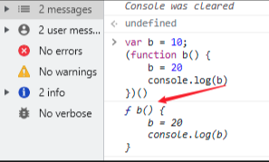

# JavaScript · 手写与编程题（23题）

## 下面代码会输出什么？

```JavaScript
foo();
var foo;
function foo(){
  console.log(1);
}
foo = function(){
  console.log(2);
}
```

**参考答案：**

答案是：1

> 函数声明和变量声明都会被提升，但是有一个值得注意的细节，那就是，函数会首先提升，然后才是变量！

根据 JavaScript 的变量和函数提升规则，上述代码在执行时会被解析成以下形式：

```JavaScript
function foo(){
  console.log(1);
}

var foo; // 变量声明被提升至顶部

foo(); // 输出 1

foo = function(){
  console.log(2);
}
```

以下是代码的执行过程：

1. 首先，函数 `foo` 的函数声明被提升到作用域的顶部。所以，在调用 `foo()` 之前，函数 `foo` 已经可用。

2.然后，变量 `foo` 被声明，并且由于它已经被函数 `foo` 的定义所覆盖，因此这个变量声明没有改变函数 `foo` 的值。

1. 接下来，函数 `foo` 被调用，输出结果为 `1`。
2. 最后，变量 `foo` 被重新赋值为一个新的函数表达式，该函数输出结果为 `2`。

所以，最终输出结果为：

```Plaintext

```


---

## 描述下列代码的执行结果

```JavaScript
foo(typeof a);
function foo(p) {
  console.log(this);
  console.log(p);
  console.log(typeof b);
  let b = 0;
}
```


**参考答案：**

在这段代码中，我们首先遇到了一个函数声明 `foo`，然后在 `foo` 函数内部，有三个语句:

1. `console.log(this);`: 打印函数 `foo` 的执行上下文中的 `this` 值。由于 `foo` 是在全局环境中声明的，因此 `this` 指向全局对象（在浏览器环境下通常是 `window` 对象）。
2. `console.log(p);`: 打印参数 `p` 的类型。这个参数的值是在调用 `foo` 函数时传入的，因此这里会输出传入的参数类型。
3. `console.log(typeof b);`: 打印变量 `b` 的类型。由于变量 `b` 是在后面的代码中使用 `let` 声明的，因此在这之前对 `b` 的访问会导致暂时性死区（Temporal Dead Zone，TDZ）的错误。因此这里会输出 `ReferenceError: Cannot access 'b' before initialization`。

因此，这段代码的输出会是类似以下内容的内容：

```Plaintext
Window // （全局执行上下文中的 this）
undefined // （foo 函数的参数类型）
ReferenceError: Cannot access 'b' before initialization // （在 b 声明之前访问 b 会导致 ReferenceError）
```


---

## bind、call、apply 有什么区别？如何实现一个bind?


**参考答案：**

一、作用

`call `、`apply `、`bind `作用是改变函数执行时的上下文，简而言之就是改变函数运行时的`this`指向

那么什么情况下需要改变`this`的指向呢？下面举个例子

```JavaScript
var name1="lucy";
var obj={
    name1:"martin",
    say:function () {
        console.log(this.name1);
    }
};
obj.say(); //martin，this指向obj对象
setTimeout(obj.say,0); //lucy，this指向window对象
```

从上面可以看到，正常情况`say`方法输出`martin`

但是我们把`say`放在`setTimeout`方法中，在定时器中是作为回调函数来执行的，因此回到主栈执行时是在全局执行上下文的环境中执行的，这时候`this`指向`window`，所以输出`luck`

> PS: 此处需要注意，如果外层改成 `const name``1``="lucy";`，那么`setTimeout(obj.say,0);`的输出会是 undefined，因为 var 声明的变量会挂载在 window 上，而 let 和 const 声明的变量不会挂载到 window 上。

我们实际需要的是`this`指向`obj`对象，这时候就需要该改变`this`指向了

```JavaScript
setTimeout(obj.say.bind(obj),0); //martin，this指向obj对象
```


二、区别

下面再来看看`apply`、`call`、`bind`的使用

apply

`apply`接受两个参数，第一个参数是`this`的指向，第二个参数是函数接受的参数，以数组的形式传入

改变`this`指向后原函数会立即执行，且此方法只是临时改变`this`指向一次

```JavaScript
function fn(...args){
    console.log(this,args);
}
let obj = {
    myname:"张三"
}

fn.apply(obj,[1,2]); // this会变成传入的obj，传入的参数必须是一个数组；
fn(1,2) // this指向window
```

当第一个参数为`null`、`undefined`的时候，默认指向`window`(在浏览器中)

```JavaScript
fn.apply(null,[1,2]); // this指向window
fn.apply(undefined,[1,2]); // this指向window
```


call

`call`方法的第一个参数也是`this`的指向，后面传入的是一个参数列表

跟`apply`一样，改变`this`指向后原函数会立即执行，且此方法只是临时改变`this`指向一次

```JavaScript
function fn(...args){
    console.log(this,args);
}
let obj = {
    myname:"张三"
}

fn.call(obj,1,2); // this会变成传入的obj，传入的参数不是数组；
fn(1,2) // this指向window
```

同样的，当第一个参数为`null`、`undefined`的时候，默认指向`window`(在浏览器中)

```JavaScript
fn.call(null,1,2]); // this指向window
fn.call(undefined,1,2); // this指向window
```


bind

bind方法和call很相似，第一参数也是`this`的指向，后面传入的也是一个参数列表(但是这个参数列表可以分多次传入)

改变`this`指向后不会立即执行，而是返回一个永久改变`this`指向的函数

```JavaScript
function fn(...args){
    console.log(this,args);
}
let obj = {
    myname:"张三"
}

const bindFn = fn.bind(obj); // this 也会变成传入的obj ，bind不是立即执行需要执行一次
bindFn(1,2) // this指向obj
fn(1,2) // this指向window
```

小结

从上面可以看到，`apply`、`call`、`bind`三者的区别在于：

- 三者都可以改变函数的`this`对象指向
- 三者第一个参数都是`this`要指向的对象，如果如果没有这个参数或参数为`undefined`或`null`，则默认指向全局`window`
- 三者都可以传参，但是`apply`是数组，而`call`是参数列表，且`apply`和`call`是一次性传入参数，而`bind`可以分为多次传入
- `bind `是返回绑定this之后的函数，`apply `、`call` 则是立即执行


三、实现

实现`bind`的步骤，我们可以分解成为三部分：

- 修改`this`指向
- 动态传递参数

```JavaScript
// 方式一：只在bind中传递函数参数
fn.bind(obj,1,2)()

// 方式二：在bind中传递函数参数，也在返回函数中传递参数
fn.bind(obj,1)(2)
```

- 兼容`new`关键字

整体实现代码如下：

```JavaScript
Function.prototype.myBind = function (context) {
    // 判断调用对象是否为函数
    if (typeof this !== "function") {
        throw new TypeError("Error");
    }

    // 获取参数
    const args = [...arguments].slice(1),
          fn = this;

    return function Fn() {

        // 根据调用方式，传入不同绑定值
        return fn.apply(this instanceof Fn ? this : context, args.concat(...arguments)); 
    }
}
```


---

## 下面代码中，点击 “+3” 按钮后，age 的值是什么？

```JavaScript
import { useState } from 'react';

export default function Counter() {
  const [age, setAge] = useState(42);
  function increment() {
    setAge(age + 1); 
  }
  return (
    <>
      <h1>Your age: {age}</h1>
      <button onClick={() => {
        increment();
        increment();
        increment();
      }}>+3</button>
    </>
  );
}
```


**参考答案：**

点击 +3 时，可能只更新为 43。

这是因为 `setAge(age + 1)` 即使多次调用，也不会立即更新组件状态，而是会进行合并，最终只触发一次重新渲染。

如果要实现调用三次就增加 3 ，可以将 `increment` 改为函数式更新：

```JavaScript
function increment() {
    setAge(a => a + 1); // 函数式更新
}
```


---

## 下面代码会输出什么？

```JavaScript
foo();
var foo;
function foo(){
  console.log(1);
}
foo = function(){
  console.log(2);
}
```


**参考答案：**

答案是：1

> 函数声明和变量声明都会被提升，但是有一个值得注意的细节，那就是，函数会首先提升，然后才是变量！

根据 JavaScript 的变量和函数提升规则，上述代码在执行时会被解析成以下形式：

```JavaScript
function foo(){
  console.log(1);
}

var foo; // 变量声明被提升至顶部

foo(); // 输出 1

foo = function(){
  console.log(2);
}
```

以下是代码的执行过程：

1. 首先，函数 `foo` 的函数声明被提升到作用域的顶部。所以，在调用 `foo()` 之前，函数 `foo` 已经可用。

2.然后，变量 `foo` 被声明，并且由于它已经被函数 `foo` 的定义所覆盖，因此这个变量声明没有改变函数 `foo` 的值。

1. 接下来，函数 `foo` 被调用，输出结果为 `1`。
2. 最后，变量 `foo` 被重新赋值为一个新的函数表达式，该函数输出结果为 `2`。

所以，最终输出结果为：

```Plaintext
1
```


---

## 描述下列代码的执行结果

```JavaScript
foo(typeof a);
function foo(p) {
  console.log(this);
  console.log(p);
  console.log(typeof b);
  let b = 0;
}
```


**参考答案：**

在这段代码中，我们首先遇到了一个函数声明 `foo`，然后在 `foo` 函数内部，有三个语句:

1. `console.log(this);`: 打印函数 `foo` 的执行上下文中的 `this` 值。由于 `foo` 是在全局环境中声明的，因此 `this` 指向全局对象（在浏览器环境下通常是 `window` 对象）。
2. `console.log(p);`: 打印参数 `p` 的类型。这个参数的值是在调用 `foo` 函数时传入的，因此这里会输出传入的参数类型。
3. `console.log(typeof b);`: 打印变量 `b` 的类型。由于变量 `b` 是在后面的代码中使用 `let` 声明的，因此在这之前对 `b` 的访问会导致暂时性死区（Temporal Dead Zone，TDZ）的错误。因此这里会输出 `ReferenceError: Cannot access 'b' before initialization`。

因此，这段代码的输出会是类似以下内容的内容：

```Plaintext
Window // （全局执行上下文中的 this）
undefined // （foo 函数的参数类型）
ReferenceError: Cannot access 'b' before initialization // （在 b 声明之前访问 b 会导致 ReferenceError）
```


---

## bind、call、apply 有什么区别？如何实现一个bind?


**参考答案：**

一、作用

`call `、`apply `、`bind `作用是改变函数执行时的上下文，简而言之就是改变函数运行时的`this`指向

那么什么情况下需要改变`this`的指向呢？下面举个例子

```JavaScript
var name="lucy";
var obj={
    name:"martin",
    say:function () {
        console.log(this.name);
    }
};
obj.say(); //martin，this指向obj对象
setTimeout(obj.say,0); //lucy，this指向window对象
```

从上面可以看到，正常情况`say`方法输出`martin`

但是我们把`say`放在`setTimeout`方法中，在定时器中是作为回调函数来执行的，因此回到主栈执行时是在全局执行上下文的环境中执行的，这时候`this`指向`window`，所以输出`luck`

> PS: 此处需要注意，如果外层改成 `const name="lucy";`，那么`setTimeout(obj.say,0);`的输出会是 undefined，因为 var 声明的变量会挂载在 window 上，而 let 和 const 声明的变量不会挂载到 window 上。

我们实际需要的是`this`指向`obj`对象，这时候就需要该改变`this`指向了

```JavaScript
setTimeout(obj.say.bind(obj),0); //martin，this指向obj对象
```


二、区别

下面再来看看`apply`、`call`、`bind`的使用

apply

`apply`接受两个参数，第一个参数是`this`的指向，第二个参数是函数接受的参数，以数组的形式传入

改变`this`指向后原函数会立即执行，且此方法只是临时改变`this`指向一次

```JavaScript
function fn(...args){
    console.log(this,args);
}
let obj = {
    myname:"张三"
}

fn.apply(obj,[1,2]); // this会变成传入的obj，传入的参数必须是一个数组；
fn(1,2) // this指向window
```

当第一个参数为`null`、`undefined`的时候，默认指向`window`(在浏览器中)

```JavaScript
fn.apply(null,[1,2]); // this指向window
fn.apply(undefined,[1,2]); // this指向window
```


call

`call`方法的第一个参数也是`this`的指向，后面传入的是一个参数列表

跟`apply`一样，改变`this`指向后原函数会立即执行，且此方法只是临时改变`this`指向一次

```JavaScript
function fn(...args){
    console.log(this,args);
}
let obj = {
    myname:"张三"
}

fn.call(obj,1,2); // this会变成传入的obj，传入的参数不是数组；
fn(1,2) // this指向window
```

同样的，当第一个参数为`null`、`undefined`的时候，默认指向`window`(在浏览器中)

```JavaScript
fn.call(null,1,2]); // this指向window
fn.call(undefined,1,2); // this指向window
```


bind

bind方法和call很相似，第一参数也是`this`的指向，后面传入的也是一个参数列表(但是这个参数列表可以分多次传入)

改变`this`指向后不会立即执行，而是返回一个永久改变`this`指向的函数

```JavaScript
function fn(...args){
    console.log(this,args);
}
let obj = {
    myname:"张三"
}

const bindFn = fn.bind(obj); // this 也会变成传入的obj ，bind不是立即执行需要执行一次
bindFn(1,2) // this指向obj
fn(1,2) // this指向window
```

小结

从上面可以看到，`apply`、`call`、`bind`三者的区别在于：

- 三者都可以改变函数的`this`对象指向
- 三者第一个参数都是`this`要指向的对象，如果如果没有这个参数或参数为`undefined`或`null`，则默认指向全局`window`
- 三者都可以传参，但是`apply`是数组，而`call`是参数列表，且`apply`和`call`是一次性传入参数，而`bind`可以分为多次传入
- `bind `是返回绑定this之后的函数，`apply `、`call` 则是立即执行


三、实现

实现`bind`的步骤，我们可以分解成为三部分：

- 修改`this`指向
- 动态传递参数

```JavaScript
// 方式一：只在bind中传递函数参数
fn.bind(obj,1,2)()

// 方式二：在bind中传递函数参数，也在返回函数中传递参数
fn.bind(obj,1)(2)
```

- 兼容`new`关键字

整体实现代码如下：

```JavaScript
Function.prototype.myBind = function (context) {
    // 判断调用对象是否为函数
    if (typeof this !== "function") {
        throw new TypeError("Error");
    }

    // 获取参数
    const args = [...arguments].slice(1),
          fn = this;

    return function Fn() {

        // 根据调用方式，传入不同绑定值
        return fn.apply(this instanceof Fn ? new fn(...arguments) : context, args.concat(...arguments)); 
    }
}
```

---

## 利用字符重复出现的次数，编写一种方法，实现基本的字符串压缩功能。比如，字符串aabcccccaaa会变为a2b1c5a3

**参考答案：**

下面是实现示例：

```JavaScript
function compressString(str) {
  let compressed = '';
  let count = 1;

  for (let i = 0; i < str.length; i++) {
    if (str[i] === str[i + 1]) {
      // 如果当前字符与下一个字符相同，增加计数器
      count++;
    } else {
      // 否则，将当前字符及其计数器追加到结果中
      compressed += str[i] + count;
      count = 1; // 重置计数器
    }
  }

  // 返回较短的字符串（原始字符串或压缩后的字符串）
  return compressed.length < str.length ? compressed : str;
}

// 示例用法
console.log(compressString('aabcccccaaa')); // 输出 "a2b1c5a3"
console.log(compressString('abcdefg')); // 输出 "abcdefg" （未发生压缩）
```


---

## 说说下面代码的输出结果

```Plaintext
Promise.resolve().then(() => {
  console.log(0)
  return Promise.resolve(4)
}).then((res) => {
  console.log(res)
})
Promise.resolve().then(() => {
  console.log(1)
}).then(() => {
  console.log(2)
}).then(() => {
  console.log(3)
}).then(() => {
  console.log(5)
}).then(() =>{
  console.log(6)
})
```

**参考答案：**

输出结果是：

```Plaintext
0
1
2
3
4
5
6
```

1、分析

一般遇到`Promise.resolve()`时，相当于`new Promise(resolve => {resolve()})`都是同步完成的，不会消耗微任务。 但以下情况时，需要注意，我们先看三组代码：

```JavaScript
//代码1
new Promise(resolve => {
    resolve(Promise.resolve(4));//resolve了一个Promise
})
.then((res) => {
    console.log(res)
})
```

```JavaScript
//代码2
Promise.resolve().then(() => {
    return Promise.resolve(4);//return了一个Promise
})
.then((res) => {
    console.log(res)
})
```

```JavaScript
//代码3
Promise.resolve().then(() => {
    return 4;//return了一个Number类型的4
})
.then((res) => {
    console.log(res)
})
```

这三个输出结果，打印出来的都是数字4。

我们可以看出不同，代码3是我们最常见的情况。代码3里打印的res是`4`，和上边`return`的是同样的数据类型。那么代码1和代码2的res为什么不是`Object`类型的`Promise{<fulfilled>: 4}`呢？

在一般情况下：

```JavaScript
Promise.resolve().then(() => {
    return 4;
})
```

这段代码中，`Promise.resolve().then`是一个构造函数,`() => {return 4;}`是这个函数的参数，这个函数调用，最后返回一个值为`4`的`Promise`(即`new Promise(resolve => resolve(4)`).

而在

```JavaScript
new Promise(resolve => {
    resolve(Promise.resolve(4));//resolve了一个Promise
})
```

```JavaScript
Promise.resolve().then(() => {
    return Promise.resolve(4);//return了一个Promise
})
```

中，因为js在遇到`resolve`或者`return`一个`Promise`对象时，会先求得这个`Promise`对象的值，也就是这个`Promise`的状态为`fulfilled`或`rejected`的值(假如这个值是`'a'`)，再用这个值作为返回的新的`Promised`的值，这个新的`Promsie`(就是`new Promise(resolve => resolve('a')`)作为下级链式调用的`Promise`。

2、结论

在chrome内部实现的Promise和标准的Promise/A+规范存在差异。浏览器内部实现的区别。我们可以理解为，resolve或者return遇到一个Promise对象时，得到这个Promise的值之后，会把这个值用微任务包装起来，在return值向外传递(因为后边没有.then()了，所以是向父级的外层传递)时，会产生第二个微任务。

所以代码

```JavaScript
//代码1
new Promise(resolve => {
    resolve(Promise.resolve(4));//resolve了一个Promise
})
.then((res) => {
    console.log(res)
})
```

可以理解为

```JavaScript
new Promise(resolve => {
    resolve(4);
})
.then()
.then()
.then((res) => {
    console.log(res)
})
```

对应的，代码

```JavaScript
//代码2
Promise.resolve().then(() => {
    return Promise.resolve(4);//return了一个Promise
})
.then((res) => {
    console.log(res)
})
```

可以理解为

```JavaScript
Promise.resolve()
.then(() => {
    return 4;
})
.then()
.then()
.then((res) => {
    console.log(res)
})
```

这样理解的，核心就是会比正常的return一个非Promise的值时，多两个微任务.then().then()

另外的

```JavaScript
Promise.resolve().then(() => {
    return Promise.resolve(Promise.resolve(Promise.resolve(4)))
})
.then(res => {
    console.log(res);
})
```

像这样的`return Promise.resolve(Promise.resolve(Promise.resolve(4)))`嵌套多层`Promise`，其实和`Promise.resolve(4)`是一样的，并不会多产生微任务。因为这两段代码的`Promsie`状态变为`fulfilled`的过程并不需要等待。而是拿到它的值之后，在向后运行的时候，会产生微任务。

但如果是

```JavaScript
Promise.resolve().then(() => {
    return new Promise(resolve => {
            resolve(4)
    })
    .then(res => {
            return 4.1
    })
    .then(res => {
            return 4.2
    })
})
.then(res => {
    console.log(res);
})
```

这时`.then(res => { console.log(res); })`想要运行，需要等待前边return 的Promise状态变为`fulfilled`才行，

```JavaScript
new Promise(resolve => {
        resolve(4)
})
.then(res => {
        return 4.1
})
.then(res => {
        return 4.2
})
```

本身是会注册两个微任务的，而拿到它的值之后，在向后运行的时候，又会产生两个任务(包装值一次，return传递一次)。

3、回顾

我们再来看这个题目

```JavaScript
Promise.resolve().then(() => {
    console.log(0);
    return Promise.resolve(4);
}).then((res) => {
    console.log(res)
})

Promise.resolve().then(() => {
    console.log(1);
}).then(() => {
    console.log(2);
}).then(() => {
    console.log(3);
}).then(() => {
    console.log(5);
}).then(() =>{
    console.log(6);
})
```

按照上边的分析，可以对应转化为

```JavaScript
Promise.resolve().then(() => {
    console.log(0);
    return 4;
})
.then()
.then()
.then((res) => {
    console.log(res)
})

Promise.resolve().then(() => {
    console.log(1);
}).then(() => {
    console.log(2);
}).then(() => {
    console.log(3);
}).then(() => {
    console.log(5);
}).then(() =>{
    console.log(6);
})
```

所以运行结果是0,1,2,3,4,5,6


---

## 下面代码的输出是什么？

```JavaScript
const obj = {
 fn1: () => console.log(this),
 fn2: function() {console.log(this)}
}

obj.fn1();
obj.fn2();

const x = new obj.fn1();
const y = new obj.fn2();
```

**参考答案：**

在上面的代码中，obj 对象包含两个方法 fn1 和 fn2。fn1 使用箭头函数定义，而 fn2 使用普通函数定义。

对于箭头函数，它没有自己的 this 值，也就是说它会捕获上下文中的 this 值，因此 fn1 中的 this 指向的是全局对象 window（或者 undefined，如果运行环境是严格模式）。因此，当我们调用 obj.fn1() 时，输出结果为 window（或 undefined）。

对于普通函数，它的 this 值是在运行时动态绑定的。因此，当我们调用 obj.fn2() 时，输出结果为 obj 对象本身。

接下来，代码中分别使用 new 运算符创建了 obj.fn1 和 obj.fn2 的实例 x 和 y。

\*\*由于箭头函数没有自己的 this 值，所以尝试使用 new 运算符创建实例会导致 TypeError 错误。\*\*也就是 `new obj.fn1() `会报错。

而对于普通函数，new 运算符可以正确地创建实例，并且 this 值指向新创建的实例对象。但因为上面执行 `new obj.fn1() `时 js 已经报错，`new obj.fn2(); `并不会执行。


---

## 下面代码的输出是什么？

```JavaScript
console.log(typeof typeof typeof null);
console.log(typeof console.log(1));
```


**参考答案：**

第一行代码输出结果为 "string"。解释如下：

1. typeof null 返回 "object"，因为在JavaScript中，null 被认为是一个空对象引用。
2. typeof "object" 返回 "string"。
3. typeof "string" 返回 "string"。

因此，最终结果为 "string"。

第二行代码先输出 1，然后输出结果为 "undefined"。解释如下：

1. console.log(1) 输出 1。
2. console.log 函数没有返回值，因此返回 undefined。
3. typeof undefined 返回 "undefined"。

因此，最终结果为：

```Plaintext
string
1
undefined
```


---

## 如果要实现一个类似“谷歌图片”的系统，你会有哪些方面的考虑？


**参考答案：**

可以从以下几个方面考虑：

1. 设计界面和交互：首先需要设计一个美观、易用的用户界面，包括搜索框、图片展示区、分页、筛选器等。同时还需要设计一些交互细节，例如图片加载过程中的占位符、无结果时的提示信息、图片缩放和拖拽等。
2. 数据获取和处理：接下来需要考虑如何获取和处理图片数据。可以使用爬虫技术从其他网站抓取图片，也可以通过图片 API 或者图库合作获得。在获取到图片之后，还需要对其进行处理，例如压缩、裁剪、优化等。
3. 存储和管理图片：为了提高图片的访问速度和稳定性，需要将图片存储在 CDN 或者对象存储服务上，并建立相应的管理系统，包括上传、删除、修改、备份等功能。
4. 图片搜索和智能推荐：为了提高搜索体验和用户满意度，可以开发一些算法和模型，对图片进行分类、标记和关联，从而实现更精确的搜索和智能推荐功能。
5. 安全和隐私保护：在实现图片搜索和分享的同时，也需要注意安全和隐私保护。可以采用图像识别技术对涉黄、涉暴等不良内容进行过滤，防止违规图片的发布和传播。同时还需要保护用户隐私，避免非法获取和使用用户个人信息。


---

## 说说下面代码的输出是什么？

```JavaScript
function Foo(){
    Foo.a = function(){
        console.log(1);
    }
    this.a = function(){
        console.log(2)
    }
}

Foo.prototype.a = function(){
    console.log(3);
}

Foo.a = function(){
    console.log(4);
}

Foo.a();
let obj = new Foo();
obj.a();
Foo.a();
```


**参考答案：**

运行以上代码，输出结果为：

```Plaintext
4
2
1
```

解析如下：

1. 首先，调用 Foo.a() 方法，输出 4。这是因为 Foo.a 是一个静态方法，直接在函数对象上定义的，所以可以通过函数名直接调用执行。
2. 然后，创建一个 Foo 类型的实例 obj，调用 obj.a() 方法，输出 2。这是因为在构造函数 Foo 中，使用 this.a 定义了实例属性 a，会覆盖原型中的同名属性。
3. 最后，再次调用 Foo.a() 方法，输出 1。虽然在上面已经定义了一个静态方法 Foo.a，但是在构造函数 Foo 中又重新定义了一个同名属性，导致静态方法被覆盖了，所以此时输出的是在构造函数中定义的方法。


---

## 说说下面代码的执行过程

```JavaScript
var a=3;
2 function c(){
3    alert(a);
4 }
5 (function(){
6  var a=4;
7  c();
8 })();
```


**参考答案：**

这段代码的执行过程如下：

1. 定义变量 a 并赋值为 3。
2. 定义一个函数 c，该函数弹出一个对话框显示变量 a 的值。
3. 定义一个立即执行函数，并在其中定义变量 a 并赋值为 4。
4. 在立即执行函数中调用函数 c。
5. 函数 c 弹出一个对话框显示变量 a 的值，此时输出结果为 3。

原因是在立即执行函数中定义的变量 a 只在该函数作用域内有效，并没有改变全局作用域中的变量 a 的值，而函数 c 中使用的变量 a 是从全局作用域中查找的，因此输出的是全局作用域中的变量 a 的值。


---

## 下面代码的输出是什么？

```JavaScript
var name = '123';

var obj = {
 name: '456',
 print: function() {
  function a() {
    console.log(this.name);
  }
  a();
 }
}

obj.print();
```

**参考答案：**

上述代码输出结果为 "123"。解释如下：

1. 在全局作用域中声明了变量 name，值为字符串 "123"。
2. 声明一个对象 obj，包含属性 name 和方法 print，其中 name 属性的值为字符串 "456"，print 方法中定义了函数 a。
3. 当执行 obj.print() 时，会调用 print 方法，并在其中定义了函数 a。
4. 函数 a 中调用 console.log(this.name) 方法。由于此时 this 指向全局对象（即 window 对象），因此执行 this.name 等价于执行 window.name。
5. 根据步骤1，window.name 的值为字符串 "123"，因此最终输出结果为 "123"。

需要注意的是，在JavaScript中，this 的值取决于函数在何处被调用。如果该函数是作为对象的方法进行调用的，则 this 指向该对象；否则，this 指向全局对象。在本例中，虽然函数 a 被定义在 print 方法中，但是它并没有作为 obj 的方法进行调用，因此 this 指向全局对象。


---

## 说说下面代码执行后的输出是什么？

```JavaScript
var b = 10;
(function b(){
    b = 20;
    console.log(b);
})();
```

**参考答案：**

先看浏览器中的执行结果：



解析

- 代码预解析时，会将var b进行变量提升，此时b没有被赋值(b=undefined) (这里有人会说这里明明有个函数表达式呀，为什么没有进入变量提升，因为IIFE自带有词法作用域(我们常理解得作用域))
- 发现没有可以变量提升得时候将b赋值为10，此时会将b 赋值为10(b=10)
- 碰到了立即执行函数，会执行其内边的函数 function b()
- IIFE作用域中定义b = function b(){}
- 碰到了b = 20，会顺着作用域链寻找是否存在b，发现IIFE作用域中存在b，将IIFE作用域中的b赋值为20(b=20)(因为函数表达式特性，标识符无法被修改，所以这里执行失败)
- 执行console.log(b)，此时的b会找IIFE中的作用域看看是否存在b，发现其内边存在，将其返回


---

## 遍历一个任意长度的list中的元素并依次创建异步任务，如何获取所有任务的执行结果？


**参考答案：**

看到这个题目，大家首先想到的是 `Promise.all` 或者 `Promise.allSettled`。

- `Promise.all`

`Promise.all` 需要传入一个数组，数组中的元素都是 `Promise` 对象。当这些对象都执行成功时，则 all 对应的 promise 也成功，且执行 then 中的成功回调。如果有一个失败了，则 all 对应的 `promise` 失败，且失败时只能获得第一个失败 `Promise` 的数据。

```JavaScript
const p1 = new Promise((resolve, reject) => {
  resolve('成功了')
})
const p2 = Promise.resolve('success')
const p3 = Promise.reject('失败')

Promise.all([p1, p2]).then((result) => {
  console.log(result)  //["成功了", "success"]
}).catch((error) => {
  //未被调用
})

Promise.all([p1, p3, p2]).then((result) => {
  //未被调用
}).catch((error) => {
  console.log(error)  //"失败"
});
```

- `Promise.allSettled`

`Promise.allSettled()` 可用于并行执行独立的异步操作，并收集这些操作的结果。

`Promise.allSettled()` 方法返回一个在所有给定的 promise 都已经 fulfilled 或 rejected 后的 promise，并带有一个对象数组，每个对象表示对应的 promise 结果。

```JavaScript
Promise.allSettled([p1, p2, p3])
.then(values => {
    console.log(values)
})
```


---

## 实现一个数字转中文的方法

**参考答案：**

```JavaScript
//阿拉伯数字转中文数字
function NoToChinese(num) {
    if (!/^\d*(\.\d*)?$/.test(num)) {
        alert("Number is wrong!");
        return "Number is wrong!";
    }
    var AA = new Array("零", "一", "二", "三", "四", "五", "六", "七", "八", "九");
    var BB = new Array("", "十", "百", "千", "万", "亿", "点", "");
    var a = ("" + num).replace(/(^0*)/g, "").split("."),
        k = 0,
        re = "";
    for (var i = a[0].length - 1; i >= 0; i--) {
        switch (k) {
            case 0:
                re = BB[7] + re;
                break;
            case 4:
                if (!new RegExp("0{4}\\d{" + (a[0].length - i - 1) + "}$").test(a[0]))
                    re = BB[4] + re;
                break;
            case 8:
                re = BB[5] + re;
                BB[7] = BB[5];
                k = 0;
                break;
        }
        if (k % 4 == 2 && a[0].charAt(i + 2) != 0 && a[0].charAt(i + 1) == 0) re = AA[0] + re;
        if (a[0].charAt(i) != 0) re = AA[a[0].charAt(i)] + BB[k % 4] + re;
        k++;
    }
    if (a.length > 1) //加上小数部分(如果有小数部分) 
    {
        re += BB[6];
        for (var i = 0; i < a[1].length; i++) re += AA[a[1].charAt(i)];
    }
    return re;
};
```


---

## 我现在有一个canvas，上面随机布着一些黑块，请实现方法，计算canvas上有多少个黑块。


**参考答案：**

这一题可以转化成图的联通分量问题。通过getImageData获得像素数组，从头到尾遍历一遍，就可以判断每个像素是否是黑色。同时，准备一个width \* height大小的二维数组，这个数组的每个元素是1/0。如果是黑色，二维数组对应元素就置1；否则置0。

然后问题就被转换成了图的连通分量问题。可以通过深度优先遍历或者并查集来实现。


---

## 怎么实现一个扫描二维码登录PC网站的需求？


**参考答案：**

二维码登录本质

二维码登录本质上也是一种登录认证方式。既然是登录认证，要做的也就两件事情：

- 告诉系统我是谁
- 向系统证明我是谁

扫描二维码登录的一般步骤

- 扫码前，手机端应用是已登录状态，PC端显示一个二维码，等待扫描
- 手机端打开应用，扫描PC端的二维码，扫描后，会提示"已扫描，请在手机端点击确认"
- 用户在手机端点击确认，确认后PC端登录就成功了

具体流程

生成二维码

- PC端向服务端发起请求，告诉服务端，我要生成用户登录的二维码，并且把PC端设备信息也传递给服务端
- 服务端收到请求后，它生成二维码ID，并将二维码ID与PC端设备信息进行绑定
- 然后把二维码ID返回给PC端
- PC端收到二维码ID后，生成二维码(二维码中肯定包含了ID)
- 为了及时知道二维码的状态，客户端在展现二维码后，PC端不断的轮询服务端，比如每隔一秒就轮询一次，请求服务端告诉当前二维码的状态及相关信息，或者直接使用websocket，等待在服务端完成登录后进行通知

扫描二维码

- 用户用手机去扫描PC端的二维码，通过二维码内容取到其中的二维码ID
- 再调用服务端API将移动端的身份信息与二维码ID一起发送给服务端
- 服务端接收到后，它可以将身份信息与二维码ID进行绑定，生成临时token。然后返回给手机端
- 因为PC端一直在轮询二维码状态，所以这时候二维码状态发生了改变，它就可以在界面上把二维码状态更新为已扫描

状态确认

- 手机端在接收到临时token后会弹出确认登录界面，用户点击确认时，手机端携带临时token用来调用服务端的接口，告诉服务端，我已经确认
- 服务端收到确认后，根据二维码ID绑定的设备信息与账号信息，生成用户PC端登录的token
- 这时候PC端的轮询接口，它就可以得知二维码的状态已经变成了"已确认"。并且从服务端可以获取到用户登录的token
- 到这里，登录就成功了，后端PC端就可以用token去访问服务端的资源了


---

## object.assign和扩展运算法是深拷贝还是浅拷贝，两者区别是什么？


**参考答案：**

- 扩展运算符

```JavaScript
let outObj = {
  inObj: {a: 1, b: 2}
}
let newObj = {...outObj}
newObj.inObj.a = 2
console.log(outObj) // {inObj: {a: 2, b: 2}}
```

- Object.assign()

```JavaScript
let outObj = {
  inObj: {a: 1, b: 2}
}
let newObj = Object.assign({}, outObj)
newObj.inObj.a = 2
console.log(outObj) // {inObj: {a: 2, b: 2}}
```

可以看到，两者都是浅拷贝。

Object.assign()方法接收的第一个参数作为目标对象，后面的所有参数作为源对象。然后把所有的源对象合并到目标对象中。它会修改了一个对象，因此会触发 ES6 setter。

扩展操作符（…）使用它时，数组或对象中的每一个值都会被拷贝到一个新的数组或对象中。它不复制继承的属性或类的属性，但是它会复制ES6的 symbols 属性。


---

## NaN 是什么，用 typeof 会输出什么？


**参考答案：**

NaN：Not a Number，表示非数字

typeof NaN === 'number'


---

## 下面执行后输出什么？

```JavaScript
for(var i = 1; i <= 5; i ++){
  setTimeout(function timer(){
          console.log(i)
  }, 0)
}
```


**参考答案：**

结论： 输出5个6。

因为setTimeout为宏任务，由于JS中单线程eventLoop机制，在主线程同步任务执行完后才去执行宏任 务，因此循环结束后setTimeout中的回调才依次执行，但输出i的时候当前作用域没有，往上一级再找，发现了i,此时循环已经结束，i变成了6。因此会全部输出6。


---
