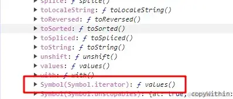

# JavaScript · 作用域与闭包（8题）

## 如何让 var [a, b] = {a: 1, b: 2} 解构赋值成功？


**参考答案：**

迭代协议

题目问怎么能让var [a,b] = {a:1,b:2} 成立，那么我们首先要运行一下，看看它是怎么个不成立法。

```JavaScript
const obj = {
    a:'1',
    b:'2',
}

const [a,b] = obj
```

运行之后打开控制台可以发现报错信息，它告诉我们obj这个对象是不可迭代的，那么我们想办法把obj变成可迭代的是不是就能解决这个问题，这要怎么做呢？想要搞明白这点我们需要先了解一下可迭代协议。


可迭代协议的概念（ MDN ）

> 可迭代协议允许 JavaScript 对象定义或定制它们的迭代行为，例如，在一个 `for..of` 结构中，哪些值可以被遍历到。一些内置类型同时是[内置的可迭代对象](https://developer.mozilla.org/zh-CN/docs/Web/JavaScript/Reference/Iteration_protocols#%E5%86%85%E7%BD%AE%E7%9A%84%E5%8F%AF%E8%BF%AD%E4%BB%A3%E5%AF%B9%E8%B1%A1)，并且有默认的迭代行为，比如 `Array` 或者 `Map`，而其他内置类型则不是（比如 `Object`）。
> 
> 要成为可迭代对象，该对象必须实现 `@@iterator` 方法，这意味着对象（或者它[原型链](https://developer.mozilla.org/zh-CN/docs/Web/JavaScript/Inheritance_and_the_prototype_chain)上的某个对象）必须有一个键为 `@@iterator` 的属性，可通过常量 `Symbol.iterator` 访问该属性：
> 
> `[Symbol.iterator]`
> 
> 一个无参数的函数，其返回值为一个符合[迭代器协议](https://developer.mozilla.org/zh-CN/docs/Web/JavaScript/Reference/Iteration_protocols#%E8%BF%AD%E4%BB%A3%E5%99%A8%E5%8D%8F%E8%AE%AE)的对象。
> 
> 当一个对象需要被迭代的时候（比如被置入一个 `for...of` 循环时），首先，会不带参数调用它的 `@@iterator` 方法，然后使用此方法返回的迭代器获得要迭代的值。

说人话就是，要想让obj成为一个可迭代的对象，就需要它实现 `@@iterator` 方法，具体表现为对象身上要有一个名为`[Symbol.iterator]` 的方法。而数组和Map则是一开始就有这个方法，所以它们是可迭代的。而对象身上则没有这个默认行为，所以不可迭代。真的是这样吗？我们创建一个数组，看看数组身上到底有没有`[Symbol.iterator]` 方法。

```JavaScript
const array = [1,2,3]
console.log(array)
```

点开原型查看



发现真的有一个Symbol.iterator()方法，该方法会返回一个迭代器对象。我们来调用一下

```JavaScript
const array = [1,2,3]
const iterator = array[Symbol.iterator]()
console.log(iterator)
console.log(iterator.next())
console.log(iterator.next())
console.log(iterator.next())
console.log(iterator.next())
```

打印iterator对象后发现在它的原型上有一个next()方法，调用next()方法，会得到一个对象value就是当前迭代的值，done则代表当前迭代器是否已经迭代完成。


数组 解构 的本质

```JavaScript
const array = [1,2,3]
var [a,b,c] = array
// 本质上是
const iterator = array[Symbol.iterator]()
var a = iterator.next().value
var b = iterator.next().value
var c = iterator.next().value
```

解决方法

到此为止我们可知，要想满足迭代协议需要对象身上有一个名为`[Symbol.iterator]`的方法。再使用for..of或者解构赋值的时候会隐式的调用这个方法，得到一个迭代对象，通过迭代对象的next方法判断当前是否完成迭代和具体迭代的值。

也就是说我们要在obj上添加`[Symbol.iterator]`方法并且完成next方法的逻辑

最终代码如下：

```JavaScript
 const obj = {
    a: '1',
    b: '2',
    [Symbol.iterator]() {
        let index = 0
        const keys = Object.keys(this)
        return {
            next() {
                if (index < keys.length) {
                    return {
                        done: false,
                        value: obj[keys[index++]]
                    }
                }
                return {done:true,value:undefined}
            }
        }
    }
}

const [a, b] = obj
```

当然，我们也可以用for...of去循环遍历这个对象，我看谁再说for...of不能遍历对象(doge)

```JavaScript
for(let i of obj){
    console.log(i)
}
// 1
// 2
```


---

## 什么是作用域链？


**参考答案：**

作用域链（Scope Chain）是 JavaScript 中用于查找变量和函数的一种机制。每个 JavaScript 函数都会创建一个作用域链。

作用域链是由当前执行环境（Execution Context）中的变量对象（Variable Object）以及其父级执行环境的变量对象组成的。当代码在一个执行环境中执行时，如果需要访问一个变量或者函数，JavaScript 引擎会首先在当前执行环境的变量对象中查找，如果找不到，它会沿着作用域链向上一级的执行环境中查找，直到找到对应的变量或者函数，或者达到全局执行环境为止。

作用域链的形成是由函数定义时的位置来决定的，而不是函数调用时的位置。这意味着函数的作用域链是在函数定义时确定的，而不是在函数调用时确定的。

作用域链的重要性在于它决定了变量和函数的访问权限。一个变量或者函数能否在当前执行环境中被访问到，取决于它是否在当前执行环境的作用域链上。


---

## 如何让 var [a, b] = {a: 1, b: 2} 解构赋值成功？

**参考答案：**

迭代协议

题目问怎么能让var [a,b] = {a:1,b:2} 成立，那么我们首先要运行一下，看看它是怎么个不成立法。

```JavaScript
const obj = {
    a:'1',
    b:'2',
}

const [a,b] = obj
```

运行之后打开控制台可以发现报错信息，它告诉我们obj这个对象是不可迭代的，那么我们想办法把obj变成可迭代的是不是就能解决这个问题，这要怎么做呢？想要搞明白这点我们需要先了解一下可迭代协议。

可迭代协议的概念（ MDN ）

> 可迭代协议允许 JavaScript 对象定义或定制它们的迭代行为，例如，在一个 `for..of` 结构中，哪些值可以被遍历到。一些内置类型同时是[内置的可迭代对象](https://developer.mozilla.org/zh-CN/docs/Web/JavaScript/Reference/Iteration_protocols#%E5%86%85%E7%BD%AE%E7%9A%84%E5%8F%AF%E8%BF%AD%E4%BB%A3%E5%AF%B9%E8%B1%A1)，并且有默认的迭代行为，比如 `Array` 或者 `Map`，而其他内置类型则不是（比如 `Object`）。
> 
> 要成为可迭代对象，该对象必须实现 `@@iterator` 方法，这意味着对象（或者它[原型链](https://developer.mozilla.org/zh-CN/docs/Web/JavaScript/Inheritance_and_the_prototype_chain)上的某个对象）必须有一个键为 `@@iterator` 的属性，可通过常量 `Symbol.iterator` 访问该属性：
> 
> `[Symbol.iterator]`
> 
> 一个无参数的函数，其返回值为一个符合[迭代器协议](https://developer.mozilla.org/zh-CN/docs/Web/JavaScript/Reference/Iteration_protocols#%E8%BF%AD%E4%BB%A3%E5%99%A8%E5%8D%8F%E8%AE%AE)的对象。
> 
> 当一个对象需要被迭代的时候（比如被置入一个 `for...of` 循环时），首先，会不带参数调用它的 `@@iterator` 方法，然后使用此方法返回的迭代器获得要迭代的值。

说人话就是，要想让obj成为一个可迭代的对象，就需要它实现 `@@iterator` 方法，具体表现为对象身上要有一个名为`[Symbol.iterator]` 的方法。而数组和Map则是一开始就有这个方法，所以它们是可迭代的。而对象身上则没有这个默认行为，所以不可迭代。真的是这样吗？我们创建一个数组，看看数组身上到底有没有`[Symbol.iterator]` 方法。

```JavaScript
const array = [1,2,3]
console.log(array)
```

发现真的有一个Symbol.iterator()方法，该方法会返回一个迭代器对象。我们来调用一下

```JavaScript
const array = [1,2,3]
const iterator = array[Symbol.iterator]()
console.log(iterator)
console.log(iterator.next())
console.log(iterator.next())
console.log(iterator.next())
console.log(iterator.next())
```

打印iterator对象后发现在它的原型上有一个next()方法，调用next()方法，会得到一个对象value就是当前迭代的值，done则代表当前迭代器是否已经迭代完成。

数组 解构 的本质

```JavaScript
const array = [1,2,3]
var [a,b,c] = array
// 本质上是
const iterator = array[Symbol.iterator]()
var a = iterator.next().value
var b = iterator.next().value
var c = iterator.next().value
```


解决方法

到此为止我们可知，要想满足迭代协议需要对象身上有一个名为`[Symbol.iterator]`的方法。再使用for..of或者解构赋值的时候会隐式的调用这个方法，得到一个迭代对象，通过迭代对象的next方法判断当前是否完成迭代和具体迭代的值。

也就是说我们要在obj上添加`[Symbol.iterator]`方法并且完成next方法的逻辑

最终代码如下：

```JavaScript
 const obj = {
    a: '1',
    b: '2',
    [Symbol.iterator]() {
        let index = 0
        const keys = Object.keys(this)
        return {
            next() {
                if (index < keys.length) {
                    return {
                        done: false,
                        value: obj[keys[index++]]
                    }
                }
                return {done:true,value:undefined}
            }
        }
    }
}

const [a, b] = obj
```

当然，我们也可以用for...of去循环遍历这个对象，我看谁再说for...of不能遍历对象(doge)

```JavaScript
for(let i of obj){
    console.log(i)
}
// 1
// 2
```


---

## 什么是作用域链？


**参考答案：**

作用域链（Scope Chain）是 JavaScript 中用于查找变量和函数的一种机制。每个 JavaScript 函数都会创建一个作用域链。

作用域链是由当前执行环境（Execution Context）中的变量对象（Variable Object）以及其父级执行环境的变量对象组成的。当代码在一个执行环境中执行时，如果需要访问一个变量或者函数，JavaScript 引擎会首先在当前执行环境的变量对象中查找，如果找不到，它会沿着作用域链向上一级的执行环境中查找，直到找到对应的变量或者函数，或者达到全局执行环境为止。

作用域链的形成是由函数定义时的位置来决定的，而不是函数调用时的位置。这意味着函数的作用域链是在函数定义时确定的，而不是在函数调用时确定的。

作用域链的重要性在于它决定了变量和函数的访问权限。一个变量或者函数能否在当前执行环境中被访问到，取决于它是否在当前执行环境的作用域链上。

---

## 导致 JavaScript 中 this 指向混乱的原因是什么?


**参考答案：**

JavaScript 中 this 指向混乱的原因主要有以下几点：

1. 函数调用方式不同：JavaScript 中函数的调用方式有多种，包括普通函数调用、方法调用、构造函数调用和箭头函数等。不同的调用方式会导致 this 的指向不同。
2. 丢失绑定：当一个函数被单独调用时，即没有任何对象或上下文与之相关联时，this 将指向全局对象（在浏览器环境中通常是 `window` 对象）。这种情况下，如果函数内部使用了 this，则可能会出现意外结果。
3. 隐式绑定丢失：当一个方法从对象中切割出来并作为独立函数调用时，隐式绑定将会丢失，导致 this 不再指向原对象。这往往发生在将对象方法作为回调函数传递给其他函数的情况下。
4. 显式绑定问题：使用 `.call()`、`.apply()` 或 `.bind()` 方法可以显式地绑定函数的 this，但如果不小心使用或错误地使用这些方法，也可能导致 this 指向混乱。
5. 箭头函数中的 this：箭头函数没有自己的 this 绑定机制，它会从外围作用域继承 this。这意味着箭头函数中的 this 与其定义时的上下文相关联，而不是调用时的上下文。
6. 异步操作中的 this：在异步函数或回调函数中，this 的指向可能会发生变化，因为它们的执行上下文可能会改变。

为了避免 this 指向混乱的问题，可以采取以下措施：

- 使用箭头函数，它能够继承外部作用域的 this。
- 使用 `.bind()`、`.call()` 或 `.apply()` 方法显式地绑定函数的 this。
- 使用闭包将需要引用的 this 缓存起来。
- 在方法调用时确保上下文正确。


---

## var、let、const之间有什么区别？

**参考答案：**

var

在ES5中，顶层对象的属性和全局变量是等价的，用`var`声明的变量既是全局变量，也是顶层变量

注意：顶层对象，在浏览器环境指的是`window`对象，在 `Node` 指的是`global`对象

```JavaScript
var a = 10;
console.log(window.a) // 10
```

使用`var`声明的变量存在变量提升的情况

```JavaScript
console.log(a) // undefined
var a = 20
```

在编译阶段，编译器会将其变成以下执行

```JavaScript
var a
console.log(a)
a = 20
```

使用`var`，我们能够对一个变量进行多次声明，后面声明的变量会覆盖前面的变量声明

```JavaScript
var a = 20 
var a = 30
console.log(a) // 30
```

在函数中使用使用`var`声明变量时候，该变量是局部的

```JavaScript
var a = 20
function change(){
    var a = 30
}
change()
console.log(a) // 20 
```

而如果在函数内不使用`var`，该变量是全局的

```JavaScript
var a = 20
function change(){
   a = 30
}
change()
console.log(a) // 30 
```

二、let

`let`是`ES6`新增的命令，用来声明变量

用法类似于`var`，但是所声明的变量，只在`let`命令所在的代码块内有效

```JavaScript
{
    let a = 20
}
console.log(a) // ReferenceError: a is not defined.
```

不存在变量提升

```JavaScript
console.log(a) // 报错ReferenceError
let a = 2
```

这表示在声明它之前，变量`a`是不存在的，这时如果用到它，就会抛出一个错误

只要块级作用域内存在`let`命令，这个区域就不再受外部影响

```JavaScript
var a = 123
if (true) {
    a = 'abc' // ReferenceError
    let a;
}
```

使用`let`声明变量前，该变量都不可用，也就是大家常说的“暂时性死区”

最后，`let`不允许在相同作用域中重复声明

```JavaScript
let a = 20
let a = 30
// Uncaught SyntaxError: Identifier 'a' has already been declared
```

注意的是相同作用域，下面这种情况是不会报错的

```JavaScript
let a = 20
{
    let a = 30
}
```

因此，我们不能在函数内部重新声明参数

```JavaScript
function func(arg) {
  let arg;
}
func()
// Uncaught SyntaxError: Identifier 'arg' has already been declared
```

三、const

`const`声明一个只读的常量，一旦声明，常量的值就不能改变

```JavaScript
const a = 1
a = 3
// TypeError: Assignment to constant variable.
```

这意味着，`const`一旦声明变量，就必须立即初始化，不能留到以后赋值

```JavaScript
const a;
// SyntaxError: Missing initializer in const declaration
```

如果之前用`var`或`let`声明过变量，再用`const`声明同样会报错

```JavaScript
var a = 20
let b = 20
const a = 30
const b = 30
// 都会报错
```

`const`实际上保证的并不是变量的值不得改动，而是变量指向的那个内存地址所保存的数据不得改动

对于简单类型的数据，值就保存在变量指向的那个内存地址，因此等同于常量

对于复杂类型的数据，变量指向的内存地址，保存的只是一个指向实际数据的指针，`const`只能保证这个指针是固定的，并不能确保改变量的结构不变

```JavaScript
const foo = {};

// 为 foo 添加一个属性，可以成功
foo.prop = 123;
foo.prop // 123

// 将 foo 指向另一个对象，就会报错
foo = {}; // TypeError: "foo" is read-only
```

其它情况，`const`与`let`一致

四、区别

`var`、`let`、`const`三者区别可以围绕下面五点展开：

- 变量提升
- 暂时性死区
- 块级作用域
- 重复声明
- 修改声明的变量
- 使用

变量提升

`var `声明的变量存在变量提升，即变量可以在声明之前调用，值为`undefined`

// 2023.4.25 更新

`let`和`const`不存在变量提升，即它们所声明的变量一定要在声明后使用，否则报错

let / const 不存在变量提升是不完全正确的，只能说由于暂时性死区的存在使得我们无法直观感受到变量提升的效果。

let 和 const 定义的变量都会被提升，但是不会被初始化，不能被引用，不会像var定义的变量那样，初始值为undefined。

当进入let变量的作用域时，会立即给它创建存储空间，但是不会对它进行初始化。

变量的赋值可以分为三个阶段：

- 创建变量，在内存中开辟空间
- 初始化变量，将变量初始化为undefined
- 真正赋值

关于let、var和function：

- let 的「创建」过程被提升了，但是初始化没有提升。
- var 的「创建」和「初始化」都被提升了。
- function 的「创建」「初始化」和「赋值」都被提升了。

```JavaScript
// var
console.log(a)  // undefined
var a = 10

// let 
console.log(b)  // Cannot access 'b' before initialization
let b = 10

// const
console.log(c)  // Cannot access 'c' before initialization
const c = 10
```

暂时性死区

`var`不存在暂时性死区

`let`和`const`存在暂时性死区，只有等到声明变量的那一行代码出现，才可以获取和使用该变量

```JavaScript
// var
console.log(a)  // undefined
var a = 10

// let
console.log(b)  // Cannot access 'b' before initialization
let b = 10

// const
console.log(c)  // Cannot access 'c' before initialization
const c = 10
```

块级作用域

`var`不存在块级作用域

`let`和`const`存在块级作用域

```JavaScript
// var
{
    var a = 20
}
console.log(a)  // 20

// let
{
    let b = 20
}
console.log(b)  // Uncaught ReferenceError: b is not defined

// const
{
    const c = 20
}
console.log(c)  // Uncaught ReferenceError: c is not defined
```

重复声明

`var`允许重复声明变量

`let`和`const`在同一作用域不允许重复声明变量

```JavaScript
// var
var a = 10
var a = 20 // 20

// let
let b = 10
let b = 20 // Identifier 'b' has already been declared

// const
const c = 10
const c = 20 // Identifier 'c' has already been declared
```

修改声明的变量

`var`和`let`可以

`const`声明一个只读的常量。一旦声明，常量的值就不能改变

```JavaScript
// var
var a = 10
a = 20
console.log(a)  // 20

//let
let b = 10
b = 20
console.log(b)  // 20

// const
const c = 10
c = 20
console.log(c) // Uncaught TypeError: Assignment to constant variable
```

使用

能用`const`的情况尽量使用`const`，其他情况下大多数使用`let`，避免使用`var`

---

## 箭头函数的 this 指向哪⾥？


**参考答案：**

箭头函数不同于传统JavaScript中的函数，箭头函数并没有属于⾃⼰的this，它所谓的this是捕获其所在上下⽂的 this 值，作为⾃⼰的 this 值，并且由于没有属于⾃⼰的this，所以是不会被new调⽤的，这个所谓的this也不会被改变。

可以⽤Babel理解⼀下箭头函数:

```JavaScript
// ES6 
const obj = { 
  getArrow() { 
    return () => { 
      console.log(this === obj); 
    }; 
  } 
}
```

转化后：

```JavaScript
// ES5，由 Babel 转译
var obj = { 
   getArrow: function getArrow() { 
     var _this = this; 
     return function () { 
        console.log(_this === obj); 
     }; 
   } 
};
```


---

## 什么是变量提升


**参考答案：**

函数在运行的时候，会首先创建执行上下文，然后将执行上下文入栈，然后当此执行上下文处于栈顶时，开始运行执行上下文。

在创建执行上下文的过程中会做三件事：创建变量对象，创建作用域链，确定 this 指向，其中创建变量对象的过程中，首先会为 arguments 创建一个属性，值为 arguments，然后会扫码 function 函数声明，创建一个同名属性，值为函数的引用，接着会扫码 var 变量声明，创建一个同名属性，值为 undefined，这就是变量提升。


---
