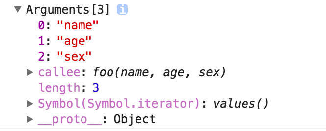
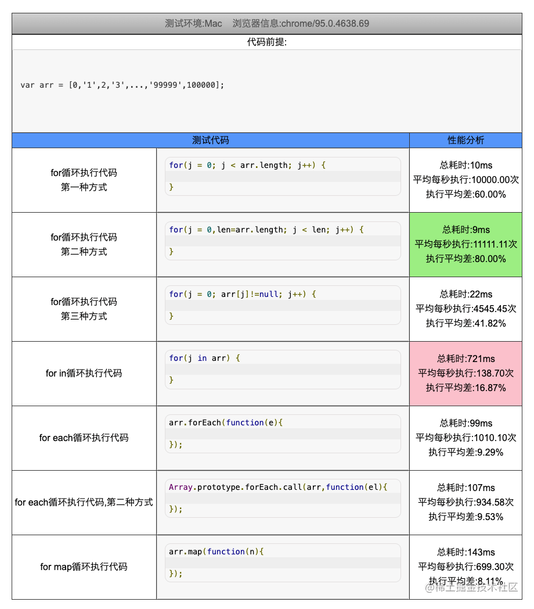

# JavaScript · 函数与对象（27题）

## Proxy 能够监听到对象中的对象的引用吗？


**参考答案：**

`Proxy`可以监听到对象中的对象的引用。

当使用`Proxy`包装一个对象时，可以为该对象的任何属性创建一个拦截器，包括属性值为对象的情况。

下面展示了如何使用`Proxy`来监听对象中对象引用的变化：

```JavaScript
const obj = {
  nestedObj: { foo: 'bar' }
}

const handler = {
  get(target, prop, receiver) {
    const value = Reflect.get(target, prop, receiver)
    if (typeof value === 'object' && value !== null) {
      return new Proxy(value, handler)
    }
    console.log('get', prop, target[prop])
    return value
  },
  set(target, property, value) {
    target[property] = value
    console.log(`Setting property '${property}' to '${value}'`)
    return true
  }
}

const proxyObj = new Proxy(obj, handler)
proxyObj.nestedObj.foo = 'baz'  // 输出: Setting property 'foo' to 'baz'
```

我们通过`Proxy`创建了一个代理对象`proxyObj`，它包装了原始的`obj`。然后，我们对`proxyObj`中的`nestedObj.foo`进行赋值操作，这会触发`set`拦截器，并打印相应的信息。

通过使用适当的拦截器函数，可以实现对对象中对象引用的监听和修改。这使得我们可以在需要时执行自定义的操作，例如记录更改、验证或触发其他事件等。


---

## Proxy 能够监听到对象中的对象的引用吗？


**参考答案：**

`Proxy`可以监听到对象中的对象的引用。

当使用`Proxy`包装一个对象时，可以为该对象的任何属性创建一个拦截器，包括属性值为对象的情况。

下面展示了如何使用`Proxy`来监听对象中对象引用的变化：

```JavaScript
const obj = {
  nestedObj: { foo: 'bar' }
}

const handler = {
  get(target, prop, receiver) {
    const value = Reflect.get(target, prop, receiver)
    if (typeof value === 'object' && value !== null) {
      return new Proxy(value, handler)
    }
    console.log('get', prop, target[prop])
    return value
  },
  set(target, property, value) {
    target[property] = value
    console.log(`Setting property '${property}' to '${value}'`)
    return true
  }
}

const proxyObj = new Proxy(obj, handler)
proxyObj.nestedObj.foo = 'baz'  // 输出: Setting property 'foo' to 'baz'
```

我们通过`Proxy`创建了一个代理对象`proxyObj`，它包装了原始的`obj`。然后，我们对`proxyObj`中的`nestedObj.foo`进行赋值操作，这会触发`set`拦截器，并打印相应的信息。

通过使用适当的拦截器函数，可以实现对对象中对象引用的监听和修改。这使得我们可以在需要时执行自定义的操作，例如记录更改、验证或触发其他事件等。


---

## arguments 这种类数组，如何遍历类数组？

类数组对象

所谓的类数组对象:

> 拥有一个 length 属性和若干索引属性的对象

举个例子：

```JavaScript
var array = ['name', 'age', 'sex'];

var arrayLike = {
    0: 'name',
    1: 'age',
    2: 'sex',
    length: 3
}
```

即便如此，为什么叫做类数组对象呢？

那让我们从读写、获取长度、遍历三个方面看看这两个对象。

读写

```JavaScript
console.log(array[0]); // name
console.log(arrayLike[0]); // name

array[0] = 'new name';
arrayLike[0] = 'new name';
```

长度

```JavaScript
console.log(array.length); // 3
console.log(arrayLike.length); // 3
```

遍历

```JavaScript
for(var i = 0, len = array.length; i < len; i++) {
   ……
}
for(var i = 0, len = arrayLike.length; i < len; i++) {
    ……
}
```

是不是很像？

那类数组对象可以使用数组的方法吗？比如：

```JavaScript
arrayLike.push('4');
```

然而上述代码会报错: arrayLike.push is not a function

所以终归还是类数组呐……

调用数组方法

如果类数组就是任性的想用数组的方法怎么办呢？

既然无法直接调用，我们可以用 Function.call 间接调用:

```JavaScript
var arrayLike = {0: 'name', 1: 'age', 2: 'sex', length: 3 }

Array.prototype.join.call(arrayLike, '&'); // name&age&sex

Array.prototype.slice.call(arrayLike, 0); // ["name", "age", "sex"] 
// slice可以做到类数组转数组

Array.prototype.map.call(arrayLike, function(item){
    return item.toUpperCase();
}); 
// ["NAME", "AGE", "SEX"]
```

类数组转数组

在上面的例子中已经提到了一种类数组转数组的方法，再补充三个：

```JavaScript
var arrayLike = {0: 'name', 1: 'age', 2: 'sex', length: 3 }
// 1. slice
Array.prototype.slice.call(arrayLike); // ["name", "age", "sex"] 
// 2. splice
Array.prototype.splice.call(arrayLike, 0); // ["name", "age", "sex"] 
// 3. ES6 Array.from
Array.from(arrayLike); // ["name", "age", "sex"] 
// 4. apply
Array.prototype.concat.apply([], arrayLike)
```

那么为什么会讲到类数组对象呢？以及类数组有什么应用吗？

要说到类数组对象，Arguments 对象就是一个类数组对象。在客户端 JavaScript 中，一些 DOM 方法(document.getElementsByTagName()等)也返回类数组对象。

Arguments对象

接下来重点讲讲 Arguments 对象。

Arguments 对象只定义在函数体中，包括了函数的参数和其他属性。在函数体中，arguments 指代该函数的 Arguments 对象。

举个例子：

```JavaScript
function foo(name, age, sex) {
    console.log(arguments);
}

foo('name', 'age', 'sex')
```

打印结果如下：



我们可以看到除了类数组的索引属性和length属性之外，还有一个callee属性，接下来我们一个一个介绍。

length属性

Arguments对象的length属性，表示实参的长度，举个例子：

```JavaScript
function foo(b, c, d){
    console.log("实参的长度为：" + arguments.length)
}

console.log("形参的长度为：" + foo.length)

foo(1)

// 形参的长度为：3
// 实参的长度为：1
```

callee属性

Arguments 对象的 callee 属性，通过它可以调用函数自身。

讲个闭包经典面试题使用 callee 的解决方法：

```JavaScript
var data = [];

for (var i = 0; i < 3; i++) {
    (data[i] = function () {
       console.log(arguments.callee.i) 
    }).i = i;
}

data[0]();
data[1]();
data[2]();

// 0
// 1
// 2
```

接下来讲讲 arguments 对象的几个注意要点：

arguments 和对应参数的绑定

```JavaScript
function foo(name, age, sex, hobbit) {

    console.log(name, arguments[0]); // name name

    // 改变形参
    name = 'new name';

    console.log(name, arguments[0]); // new name new name

    // 改变arguments
    arguments[1] = 'new age';

    console.log(age, arguments[1]); // new age new age

    // 测试未传入的是否会绑定
    console.log(sex); // undefined

    sex = 'new sex';

    console.log(sex, arguments[2]); // new sex undefined

    arguments[3] = 'new hobbit';

    console.log(hobbit, arguments[3]); // undefined new hobbit

}

foo('name', 'age')
```

传入的参数，实参和 arguments 的值会共享，当没有传入时，实参与 arguments 值不会共享

除此之外，以上是在非严格模式下，如果是在严格模式下，实参和 arguments 是不会共享的。

传递参数

将参数从一个函数传递到另一个函数

```JavaScript
// 使用 apply 将 foo 的参数传递给 bar
function foo() {
    bar.apply(this, arguments);
}
function bar(a, b, c) {
   console.log(a, b, c);
}

foo(1, 2, 3)
```

强大的ES6

使用ES6的 ... 运算符，我们可以轻松转成数组。

```JavaScript
function func(...arguments) {
    console.log(arguments); // [1, 2, 3]
}

func(1, 2, 3);
```

应用

arguments的应用其实很多，在下个系列，也就是 JavaScript 专题系列中，我们会在 jQuery 的 extend 实现、函数柯里化、递归等场景看见 arguments 的身影。这篇文章就不具体展开了。

如果要总结这些场景的话，暂时能想到的包括：

1. 参数不定长
2. 函数柯里化
3. 递归调用
4. 函数重载 ...


---

## 遍历数组的方式有哪些？


**参考答案：**

数组遍历的方法

for

标准的for循环语句，也是最传统的循环语句

```JavaScript
var arr = [1,2,3,4,5]
for(var i=0;i<arr.length;i++){
  console.log(arr[i])
}
```

最简单的一种遍历方式，也是使用频率最高的，性能较好，但还能优化

优化版for循环语句

```JavaScript
var arr = [1,2,3,4,5]
for(var i=0,len=arr.length;i<len;i++){
  console.log(arr[i])
}
```

使用临时变量，将长度缓存起来，避免重复获取数组长度，尤其是当数组长度较大时优化效果才会更加明显。

这种方法基本上是所有循环遍历方法中性能最高的一种

forEach

普通forEach

对数组中的每一元素运行给定的函数,没有返回值，常用来遍历元素

```JavaScript
var arr5 = [10,20,30]
var result5 = arr5.forEach((item,index,arr)=>{
    console.log(item)
})
console.log(result5)
/*
10
20
30
undefined   该方法没有返回值
*/
```

数组自带的foreach循环，使用频率较高，实际上性能比普通for循环弱

原型forEach

由于foreach是Array型自带的，对于一些非这种类型的，无法直接使用(如NodeList)，所以才有了这个变种，使用这个变种可以让类似的数组拥有foreach功能。

```JavaScript
const nodes = document.querySelectorAll('div')
Array.prototype.forEach.call(nodes,(item,index,arr)=>{
  console.log(item)
})
```

实际性能要比普通foreach弱

for...in

任意顺序遍历一个对象的除[Symbol](https://developer.mozilla.org/en-US/docs/Web/JavaScript/Reference/Global_Objects/Symbol)以外的[可枚举](https://developer.mozilla.org/zh-CN/docs/Web/JavaScript/Enumerability_and_ownership_of_properties)属性，包括继承的可枚举属性。

一般常用来遍历对象，包括非整数类型的名称和继承的那些原型链上面的属性也能被遍历。像 Array和 Object使用内置构造函数所创建的对象都会继承自Object.prototype和String.prototype的不可枚举属性就不能遍历了.

```JavaScript
var arr = [1,2,3,4,5]
for(var i in arr){
  console.log(i,arr[i])
}  //这里的i是对象属性，也就是数组的下标
/**
0 1
1 2
2 3
3 4
4 5 **/
```

大部分人都喜欢用这个方法，但它的性能却不怎么好

for...of（不能遍历对象）

> 在可迭代对象（具有 iterator 接口）（Array，Map，Set，String，arguments）上创建一个迭代循环，调用自定义迭代钩子，并为每个不同属性的值执行语句，不能遍历对象

```JavaScript
let arr=["前端","面试题宝典","真好用"];
    for (let item of arr){
        console.log(item)
    }

//遍历对象
let person={name:"前端面试题宝典",age:18,city:"上海"}
for (let item of person){
  console.log(item)
}
// 我们发现它是不可以的 我们可以搭配Object.keys使用
for(let item of Object.keys(person)){
    console.log(person[item])
}
// 南玖 18 上海
```

这种方式是es6里面用到的，性能要好于forin，但仍然比不上普通for循环

map

> map: 只能遍历数组，不能中断，返回值是修改后的数组。

```JavaScript
let arr=[1,2,3];
const res = arr.map(item=>{
  return item+1
})
console.log(res) //[2,3,4]
console.log(arr) // [1,2,3]
```

every

对数组中的每一运行给定的函数，如果该函数对每一项都返回true,则该函数返回true

```JavaScript
var arr = [10,30,25,64,18,3,9]
var result = arr.every((item,index,arr)=>{
      return item>3
})
console.log(result)  //false
```

some

对数组中的每一运行给定的函数，如果该函数有一项返回true,就返回true，所有项返回false才返回false

```JavaScript
var arr2 = [10,20,32,45,36,94,75]
var result2 = arr2.some((item,index,arr)=>{
    return item<10
})
console.log(result2)  //false
```

reduce

`reduce()`方法对数组中的每个元素执行一个由你提供的reducer函数（升序执行），将其结果汇总为单个返回值

```JavaScript
const array = [1,2,3,4]
const reducer = (accumulator, currentValue) => accumulator + currentValue;

// 1 + 2 + 3 + 4
console.log(array1.reduce(reducer));
```

filter

对数组中的每一运行给定的函数，会返回满足该函数的项组成的数组

```JavaScript
// filter  返回满足要求的数组项组成的新数组
var arr3 = [3,6,7,12,20,64,35]
var result3 = arr3.filter((item,index,arr)=>{
    return item > 3
})
console.log(result3)  //[6,7,12,20,64,35]
```

性能测试

工具测试

使用工具测试[性能分析](http://tools.jb51.net/aideddesign/js_bianli)结果如下图所示



手动测试

我们也可以自己用代码测试：

```JavaScript
//测试函数
function clecTime(fn,fnName){
        const start = new Date().getTime()
        if(fn) fn()
        const end = new Date().getTime()
        console.log(`${fnName}执行耗时:${end-start}ms`)
}

function forfn(){
  let a = []
  for(var i=0;i<arr.length;i++){
    // console.log(i)
    a.push(arr[i])
  }
}
clecTime(forfn, 'for')   //for执行耗时:106ms

function forlenfn(){
  let a = []
  for(var i=0,len=arr.length;i<len;i++){
    a.push(arr[i])
  }
}
clecTime(forlenfn, 'for len')   //for len执行耗时:95ms

function forEachfn(){
  let a = []
  arr.forEach(item=>{
    a.push[item]
  })
}
clecTime(forEachfn, 'forEach')   //forEach执行耗时:201ms

function forinfn(){
  let a = []
  for(var i in arr){
    a.push(arr[i])
  }
}
clecTime(forinfn, 'forin') //forin执行耗时:2584ms (离谱)

function foroffn(){
  let a = []
  for(var i of arr){
    a.push(i)
  }
}
clecTime(foroffn, 'forof') //forof执行耗时:221ms

//  ...其余可自行测试
```

结果分析

经过工具与手动测试发现，结果基本一致，数组遍历各个方法的速度：传统的for循环最快，for-in最慢

> for-len `>` for `>` for-of `>` forEach `>` map `>` for-in

javascript原生遍历方法的建议用法：

- 用`for`循环遍历数组
- 用`for...in`遍历对象
- 用`for...of`遍历类数组对象（ES6）
- 用`Object.keys()`获取对象属性名的集合

为何for… in会慢？

因为`for … in`语法是第一个能够迭代对象键的JavaScript语句，循环对象键（{}）与在数组（[]）上进行循环不同，引擎会执行一些额外的工作来跟踪已经迭代的属性。因此不建议使用`for...in`来遍历数组


---

## 前端跨页面通信，你知道哪些方法？


**参考答案：**

在前端中，有几种方法可用于实现跨页面通信：

1. LocalStorage 或 SessionStorage：这两个 Web 存储 API 可以在不同页面之间共享数据。一个页面可以将数据存储在本地存储中，另一个页面则可以读取该数据并进行相应处理。通过监听 storage 事件，可以实现数据的实时更新。
2. Cookies：使用 Cookies 也可以在不同页面之间传递数据。通过设置和读取 Cookie 值，可以在同一域名下的不同页面之间交换信息。
3. PostMessage：`window.postMessage()` 方法允许从一个窗口向另一个窗口发送消息，并在目标窗口上触发 message 事件。通过指定目标窗口的 origin，可以确保只有特定窗口能够接收和处理消息。
4. Broadcast Channel：Broadcast Channel API 允许在同一浏览器下的不同上下文（例如，在不同标签页或 iframe 中）之间进行双向通信。它提供了一个类似于发布-订阅模式的机制，通过创建一个广播频道，并在不同上下文中加入该频道，可以实现消息的广播和接收。
5. SharedWorker：SharedWorker 是一个可由多个窗口或标签页共享的 Web Worker，它可以在不同页面之间进行跨页面通信。通过 SharedWorker，多个页面可以通过 postMessage 进行双向通信，并共享数据和执行操作。
6. IndexedDB：IndexedDB 是浏览器提供的一个客户端数据库，可以在不同页面之间存储和共享数据。通过在一个页面中写入数据，另一个页面可以读取该数据。
7. WebSockets：WebSockets 提供了全双工的、双向通信通道，可以在客户端和服务器之间进行实时通信。通过建立 WebSocket 连接，可以在不同页面之间通过服务器传递数据并实现实时更新。

这些方法各有特点，适用于不同的场景。根据具体需求和使用环境，选择合适的跨页面通信方法可以实现数据传递和协作。


---

## 写出一个函数trans，将数字转换成汉语的输出，输入为不超过10000亿的数字。

```JavaScript
trans(123456) —— 十二万三千四百五十六
trans（100010001）—— 一亿零一万零一
```

**参考答案：**

```JavaScript
function NumToChina(n) {
  n = n.toString();
  let numbers = ['零', '一', '二', '三', '四', '五', '六', '七', '八', '九'];
  if (n === '0') return numbers[0];
  let units = ['', '十', '百', '千'];
  let len = n.length;
  let res = '';
  for (let i = 0; i < len; i++) {
    let num = Number(n[i]);
    if (num != 0) {
      if (n[i - 1] === '0') res = res + numbers[0];
      res = res + numbers[num] + units[len - i - 1];
    }
  }
  if (len == 2 && n[0] == '1') res = res.slice(1);
  return res;
}

function numTo(n) {
  const isLose = n < 0;
  n = Math.abs(n).toString();
  let res = [];
  let len = n.length;
  for (let i = len; i > 0; i -= 4) {
    res.push(NumToChina(n.slice(Math.max(0, i - 4), i)));
  }
  const units = ['', '万', '亿'];
  for (let i = 0; i < res.length; i++) {
    if (res[i] == '') continue;
    res[i] = res[i] + units[i];
  }
  isLose && res.push('负');
  return res.reverse().join('');
}
numTo(12345);
```

以下是原答案：

```JavaScript
/**
 * 阿拉伯数字转中文数字,
 * 如果传入数字时则最多处理到21位，超过21位js会自动将数字表示成科学计数法，导致精度丢失和处理出错
 * 传入数字字符串则没有限制
 * @param {number|string} digit
 */
function toZhDigit(digit) {
  digit = typeof digit === 'number' ? String(digit) : digit;
  const zh = ['零', '一', '二', '三', '四', '五', '六', '七', '八', '九'];
  const unit = ['千', '百', '十', ''];
  const quot = ['万', '亿', '兆', '京', '垓', '秭', '穰', '沟', '涧', '正', '载', '极', '恒河沙', '阿僧祗', '那由他', '不可思议', '无量', '大数'];

  let breakLen = Math.ceil(digit.length / 4);
  let notBreakSegment = digit.length % 4 || 4;
  let segment;
  let zeroFlag = [], allZeroFlag = [];
  let result = '';

  while (breakLen > 0) {
    if (!result) { // 第一次执行
      segment = digit.slice(0, notBreakSegment);
      let segmentLen = segment.length;
      for (let i = 0; i < segmentLen; i++) {
        if (segment[i] != 0) {
          if (zeroFlag.length > 0) {
            result += '零' + zh[segment[i]] + unit[4 - segmentLen + i];
            // 判断是否需要加上 quot 单位
            if (i === segmentLen - 1 && breakLen > 1) {
              result += quot[breakLen - 2];
            }
            zeroFlag.length = 0;
          } else {
            result += zh[segment[i]] + unit[4 - segmentLen + i];
            if (i === segmentLen - 1 && breakLen > 1) {
              result += quot[breakLen - 2];
            }
          }
        } else {
          // 处理为 0 的情形
          if (segmentLen == 1) {
            result += zh[segment[i]];
            break;
          }
          zeroFlag.push(segment[i]);
          continue;
        }
      }
    } else {
      segment = digit.slice(notBreakSegment, notBreakSegment + 4);
      notBreakSegment += 4;

      for (let j = 0; j < segment.length; j++) {
        if (segment[j] != 0) {
          if (zeroFlag.length > 0) {
            // 第一次执行zeroFlag长度不为0，说明上一个分区最后有0待处理
            if (j === 0) {
              result += quot[breakLen - 1] + zh[segment[j]] + unit[j];
            } else {
              result += '零' + zh[segment[j]] + unit[j];
            }
            zeroFlag.length = 0;
          } else {
            result += zh[segment[j]] + unit[j];
          }
          // 判断是否需要加上 quot 单位
          if (j === segment.length - 1 && breakLen > 1) {
            result += quot[breakLen - 2];
          }
        } else {
          // 第一次执行如果zeroFlag长度不为0, 且上一划分不全为0
          if (j === 0 && zeroFlag.length > 0 && allZeroFlag.length === 0) {
            result += quot[breakLen - 1];
            zeroFlag.length = 0;
            zeroFlag.push(segment[j]);
          } else if (allZeroFlag.length > 0) {
            // 执行到最后
            if (breakLen == 1) {
              result += '';
            } else {
              zeroFlag.length = 0;
            }
          } else {
            zeroFlag.push(segment[j]);
          }

          if (j === segment.length - 1 && zeroFlag.length === 4 && breakLen !== 1) {
            // 如果执行到末尾
            if (breakLen === 1) {
              allZeroFlag.length = 0;
              zeroFlag.length = 0;
              result += quot[breakLen - 1];
            } else {
              allZeroFlag.push(segment[j]);
            }
          }
          continue;
        }
      }

    --breakLen;
  }

  return result;
}
```

从左至右，先把数字按万分位分组，每组加上对应的单位(万，亿, ...)，然后每个分组进行迭代。

breakLen表示能够分成多少个分组，notBreakSegment表示当前已处理过的分组长度。

while循环中有一个if判断，如果不存在result，则说明是第一次处理，那么在处理上是有些不同的。

- 首先，在segment的赋值上，第一次是从0开始，取notBreakSegment的长度，后面每迭代一次notBreakSegment都要在上一个值上加4
- 其次，第一次处理不用判断上一个分组是否全为0的情形，这里zeroFlag表示每一个分组内存在0的个数，allZeroFalg表示当前分组前面出现的全为0的分组的个数。
- 此外，在第一次执行时，还处理了只传入为0的情形。

每次处理segment[i]时，都要先判断当前值是否为0，为0时则直接记录到zeroFlag，然后进入下一次迭代，如果不为0，首先得判断上一个数字是否为0, 然后还得根据上一个0是否位于上一个分组的末位，来添加quot，最后还需要清空标志位。如果当前分组全为0，则标记allZeroFlag，所以在下一个分组处理时，还需要判断上一个分组是否全为0。


---

## 怎么把函数中的 arguments 转成数组？


**参考答案：**

函数中的 arguments 是一个对象，不是一个数组，严格来说它是一个类数组对象。

1、调用数组的原型方法来转换

```JavaScript
var foo = function(a,b){
        var arr = Array.prototype.slice.call(arguments);
        console.log(arr)
}
foo(1,2) //(2) [1, 2]
```

2、使用ES6的新语法 `Array.from()` 来转换

`Array.from` 方法用于将两类对象转为真正的数组：类似数组的对象和可遍历对象（包括Set和Map）。

```JavaScript
var foo = function(a,b){
        var arr = Array.from(arguments);
        console.log(arr)
}
foo(1,2) // (2) [1, 2]
```

3、使用 for

使用 for 循环挨个将 arguments 对象中的内容复制给新数组中

```JavaScript
function toArray(){
    var args = []; 
    for (var i = 1; i < arguments.length; i++) { 
        args.push(arguments[i]); 
    } 
    return args;
}
```

4、利用 ES6 中的 rest 参数转换

```JavaScript
let a = (…args) => args;
```


---

## 数组中的reduce方法有用过吗，说说它的具体用途？


**参考答案：**

`reduce()`方法在JavaScript中是一个高阶函数，用于对数组中的每个元素进行累积操作，最终返回一个单一的值。

具体来说，`reduce()`方法接受两个参数：回调函数和可选的初始值。回调函数在每个数组元素上被调用，并且可以接受四个参数：累积值（上一次回调函数的返回值或初始值）、当前值、当前索引和原始数组。

`reduce()`方法的执行过程如下：

1. 如果提供了初始值，则将其作为累积值（accumulator），否则使用数组的第一个元素作为初始累积值。
2. 对于数组中的每个元素，都调用回调函数，并传递当前累积值、当前值、当前索引和原始数组作为参数。
3. 回调函数返回的值作为下一次调用的累积值。
4. 最终，`reduce()`方法返回最后一次调用回调函数的返回值。

以下是一个示例，演示了如何使用`reduce()`方法计算数组中所有元素的总和：

```JavaScript
const numbers = [1, 2, 3, 4, 5];
const sum = numbers.reduce((accumulator, currentValue) => accumulator + currentValue);

console.log(sum); // 输出: 15
```

在上述代码中，使用`reduce()`方法对`numbers`数组中的每个元素进行累加操作，并将结果存储在`sum`变量中。

`reduce()`方法非常强大，可以用于解决各种累积计算问题，如求和、求平均值、查找最大/最小值等。

它提供了一种简洁而灵活的方式来处理数组数据，并生成一个单一的结果。


---

## 改变this指向的方法有哪些？


**参考答案：**

有以下几种常用的方法可以改变`this`的指向：

1. 使用`bind()`方法：`bind()`方法会创建一个新的函数，并将其内部的`this`绑定到指定的对象。例如：

```JavaScript
function sayHello() {
  console.log("Hello, " + this.name);
}

const person = { name: "John" };
const boundFunction = sayHello.bind(person);
boundFunction(); // 输出: Hello, John
```

1. 使用箭头函数（Arrow Function）：箭头函数没有自己的`this`，它会继承外部作用域的`this`。因此，在箭头函数中使用`this`时，它会指向定义时所在的上下文。例如：

```JavaScript
const obj = {
  name: "Alice",
  sayHello: function() {
    setTimeout(() => {
      console.log("Hello, " + this.name);
    }, 1000);
  }
};

obj.sayHello(); // 输出: Hello, Alice
```

1. 使用`call()`或`apply()`方法：`call()`和`apply()`方法可以立即调用函数，并显式指定函数内部的`this`值。它们之间的区别在于参数的传递方式。例如：

```JavaScript
function sayHello() {
  console.log("Hello, " + this.name);
}

const person = { name: "John" };
sayHello.call(person); // 输出: Hello, John

// 或者使用 apply()
sayHello.apply(person); // 输出: Hello, John
```

---

## addEventListener 第三个参数

addEventListener 语法

```Plaintext
addEventListener(type, listener); 
addEventListener(type, listener, options); 
addEventListener(type, listener, useCapture); 
```

`type`表示监听[事件类型](https://developer.mozilla.org/zh-CN/docs/Web/Events)的大小写敏感的字符串。

`listener`当所监听的事件类型触发时，会接收到一个事件通知（实现了 [`Event`](https://developer.mozilla.org/zh-CN/docs/Web/API/Event) 接口的对象）对象。`listener` 必须是一个实现了 [`EventListener`](https://developer.mozilla.org/zh-CN/docs/Web/API/EventTarget/addEventListener) 接口的对象，或者是一个[函数](https://developer.mozilla.org/zh-CN/docs/Web/JavaScript/Guide/Functions)。有关回调本身的详细信息，请参阅[事件监听回调](https://developer.mozilla.org/zh-CN/docs/Web/API/EventTarget/addEventListener#%E4%BA%8B%E4%BB%B6%E7%9B%91%E5%90%AC%E5%9B%9E%E8%B0%83)


`options` 可选一个指定有关 `listener` 属性的可选参数对象。可用的选项如下：

- `capture` 可选一个布尔值，表示 `listener` 会在该类型的事件捕获阶段传播到该 `EventTarget` 时触发。
- `once` 可选一个布尔值，表示 `listener` 在添加之后最多只调用一次。如果为 `true`，`listener` 会在其被调用之后自动移除。
- `passive` 可选一个布尔值，设置为 `true` 时，表示 `listener` 永远不会调用 `preventDefault()`。如果 listener 仍然调用了这个函数，客户端将会忽略它并抛出一个控制台警告。查看[使用 passive 改善滚屏性能](https://developer.mozilla.org/zh-CN/docs/Web/API/EventTarget/addEventListener#%E4%BD%BF%E7%94%A8_passive_%E6%94%B9%E5%96%84%E6%BB%9A%E5%B1%8F%E6%80%A7%E8%83%BD)以了解更多。
- `signal` 可选[`AbortSignal`](https://developer.mozilla.org/zh-CN/docs/Web/API/AbortSignal)，该 `AbortSignal` 的 [`abort()`](https://developer.mozilla.org/zh-CN/docs/Web/API/AbortController/abort) 方法被调用时，监听器会被移除。

`useCapture` 可选一个布尔值，表示在 DOM 树中注册了 `listener` 的元素，是否要先于它下面的 `EventTarget` 调用该 `listener`。当 useCapture（设为 true）时，沿着 DOM 树向上冒泡的事件不会触发 listener。当一个元素嵌套了另一个元素，并且两个元素都对同一事件注册了一个处理函数时，所发生的事件冒泡和事件捕获是两种不同的事件传播方式。事件传播模式决定了元素以哪个顺序接收事件。进一步的解释可以查看 [DOM Level 3 事件](https://www.w3.org/TR/DOM-Level-3-Events/#event-flow)及 [JavaScript 事件顺序](https://www.quirksmode.org/js/events_order.html#link4)文档。如果没有指定，`useCapture` 默认为 `false`。


备注： 对于事件目标上的事件监听器来说，事件会处于“目标阶段”，而不是冒泡阶段或者捕获阶段。捕获阶段的事件监听器会在任何非捕获阶段的事件监听器之前被调用。


---

## Javscript数组的常用方法有哪些？


**参考答案：**

以下是一些常见的JavaScript数组方法：

1. `push()`: 在数组末尾添加一个或多个元素，并返回新数组的长度。
2. `pop()`: 移除并返回数组末尾的元素。
3. `unshift()`: 在数组开头添加一个或多个元素，并返回新数组的长度。
4. `shift()`: 移除并返回数组开头的元素。
5. `concat()`: 合并两个或更多数组，并返回新的合并后的数组，不会修改原始数组。
6. `slice()`: 从数组中提取指定位置的元素，返回一个新的数组，不会修改原始数组。
7. `splice()`: 从指定位置删除或替换元素，可修改原始数组。
8. `indexOf()`: 查找指定元素在数组中的索引，如果不存在则返回-1。
9. `lastIndexOf()`: 从数组末尾开始查找指定元素在数组中的索引，如果不存在则返回-1。
10. `includes()`: 检查数组是否包含指定元素，返回一个布尔值。
11. `join()`: 将数组中的所有元素转为字符串，并使用指定的分隔符连接它们。
12. `reverse()`: 颠倒数组中元素的顺序，会修改原始数组。
13. `sort()`: 对数组中的元素进行排序，默认按照字母顺序排序，会修改原始数组。
14. `filter()`: 创建一个新数组，其中包含符合条件的所有元素。
15. `map()`: 创建一个新数组，其中包含对原始数组中的每个元素进行操作后的结果。
16. `reduce()`: 将数组中的元素进行累积操作，返回一个单一的值。
17. `forEach()`: 对数组中的每个元素执行提供的函数。


---

## 说说对 requestIdleCallback 的理解


**参考答案：**

`requestIdleCallback` 是一个浏览器 API，它允许我们在浏览器空闲时执行一些任务，以提高网页的性能和响应速度。

通常情况下，JavaScript 代码会占用主线程，从而阻塞了其他的任务。当页面需要进行一些复杂计算、渲染大量的DOM元素等操作时，就会导致用户的交互体验变得缓慢和卡顿。

`requestIdleCallback` 的作用就是将一些非关键性的任务从主线程中分离出来，等到浏览器闲置时再执行。这样就可以避免占用主线程，提高页面的响应速度和流畅度。

使用 `requestIdleCallback` 需要传入一个回调函数，该函数会在浏览器空闲时被调用。回调函数的参数是一个 IdleDeadline 对象，它包含有关浏览器还剩余多少时间可供执行任务的信息。根据该对象的时间戳信息，开发人员可以自行决定是否继续执行任务或推迟执行。

`requestIdleCallback` 可以帮助我们优化 Web 应用程序的性能和响应速度，减少资源的浪费。


---

## js函数有哪几种声明方式？有什么区别？


**参考答案：**

有 `表达式` 和 `声明式` 两种函数声明方式

- 函数的声明式写法为：`function test(){}`，这种写法会导致函数提升，所有通过`function`关键字声明的变量都会被解释器优先编译，不管声明在什么位置都可以调用它，但是它本身并不会被执行。

```JavaScript
test(); // 测试
function test() {
  console.log("测试");
}
test(); // 测试
```

- 函数的表达式写法为：`var test = function(){}`，这种写法不会导致函数提升，必须先声明后调用，不然就会报错。

```JavaScript
test(); // 报错：TypeError: test is not a function
var test = function() {
  console.log("测试");
};
```

二者的区别

```JavaScript
//函数声明式
function greeting(){
      console.log("hello world");  
}
//函数表达式
var greeting = function(){
    console.log("hello world"); 

```

1. 函数声明式变量会声明提前 函数表达式变量不会声明提前
2. 函数声明中的`函数名`是必需的，而函数表达式中的`函数名则是可选的`。
3. 函数表达式可以在定义的时候直接在表达式后面加()执行，而函数声明则不可以。

```JavaScript
function fun(){  
   console.log('我是一个函数声明式')  
}();   //unexpected token  

var foo = function (){  
    console.log('我是一个函数表达式')  
}();   //我是一个函数表达式  
```

1. 自执行函数即使带有函数名，它里面的函数还是属于函数表达式。

```JavaScript
(function fun(){  
    console.log('我是一个函数表达式')  
})()  //我是一个函数表达式  
```

因为函数只是整个自执行函数的一部分。


---

## 如何把一个对象变成可迭代对象？


**参考答案：**

可迭代对象（Iterable object）是数组的泛化，这个概念是在说任何对象都可以被定制为可在 `for..of` 循环中使用的对象。

也就是说，可以应用 `for..of` 的对象被称为 `可迭代对象`。

迭代器

在 JavaScript 中，迭代器是一个对象，它定义一个序列，并在终止时可能返回一个返回值。

更具体地说，迭代器是通过使用 `next()` 方法实现 `Iterator protocol` 的任何一个对象，该方法返回具有两个属性的对象：

- `value`，这是序列中的 `next` 值
- `done`，如果已经迭代到序列中的最后一个值，则它为 `true`

如果 `value` 和 `done` 一起存在，则它是迭代器的返回值。

一旦创建，迭代器对象可以通过重复调用 `next() `显式地迭代。

迭代一个迭代器被称为消耗了这个迭代器，因为它通常只能执行一次。

在产生终止值之后，对 `next()` 的额外调用应该继续返回 `{done: true}`。

Javascript 中最常见的迭代器是 Array 迭代器，它只是按顺序返回关联数组中的每个值。

虽然很容易想象所有迭代器都可以表示为数组，但事实并非如此。数组必须完整分配，但迭代器仅在必要时使用，因此可以表示无限大小的序列，例如 0 和无穷大之间的整数范围。

这是一个可以做到这一点的例子。它允许创建一个简单的范围迭代器，它定义了从开始（包括）到结束（独占）间隔步长的整数序列。它的最终返回值是它创建的序列的大小，由变量 iterationCount 跟踪。

```JavaScript
let index = 0
const bears = ['ice', 'panda', 'grizzly']

let iterator = {
  next() {
    if (index < bears.length) {
      return { done: false, value: bears[index++] }
    }

    return { done: true, value: undefined }
  }
}

console.log(iterator.next()) //{ done: false, value: 'ice' }
console.log(iterator.next()) //{ done: false, value: 'panda' }
console.log(iterator.next()) //{ done: false, value: 'grizzly' }
console.log(iterator.next()) //{ done: true, value: undefined }
```

实现可迭代对象

如果一个对象拥有 `[Symbol.iterator]` 方法，并且该方法返回一个迭代器对象，这样的对象即可称为`可迭代对象`。

```JavaScript
let info = {
  bears: ['ice', 'panda', 'grizzly'],
  [Symbol.iterator]: function() {
    let index = 0
    let _iterator = {
       //这里一定要箭头函数，或者手动保存上层作用域的this
       next: () => {
        if (index < this.bears.length) {
          return { done: false, value: this.bears[index++] }
        }
  
        return { done: true, value: undefined }
      }
    }

    return _iterator
  }
}

let iter = info[Symbol.iterator]()
console.log(iter.next())
console.log(iter.next())
console.log(iter.next())
console.log(iter.next())

//符合可迭代对象协议 就可以利用 for of 遍历
for (let bear of info) {
  console.log(bear)
}
//ice panda grizzly
```


---

## 说说你对“立即执行函数”的理解


**参考答案：**

什么是立即执行函数？

JS立即执行函数模式是一种语法，可以让你的函数在定义后立即被执行，这种模式本质上就是函数表达式（命名的或者匿名的），在创建后立即执行。

立即执行函数的两种常见写法：

- 匿名函数包裹在一个括号运算符中，后面跟一个小括号

```JavaScript
(function(){
    //...
})()
```

- 匿名函数后面跟一个小括号，整个包裹在一个括号运算符中

```JavaScript
(function(){
    //...
}())
```

()，！，+，-，=等运算符都能起到立即执行的作用，这些运算符的作用就是将匿名函数或函数声明转换为函数表达式。

注意：

- 函数体后面要有小括号()
- 函数体必须是函数表达式而不能是函数声明

例：

```JavaScript
(function (test) {    //使用()运算符,输出123
    console.log(test);
})(123);

(function (test) {    //使用()运算符,输出123
    console.log(test);
}(123));

!function (test) {    //使用!运算符,输出123
    console.log(test);
}(123);
var fn = function (test) {  //使用=运算符,输出123
    console.log(test);
}(123);
```

好处：

- 不必为函数命名，避免了污染全局变量
- 立即执行函数内部形成了一个单独的作用域，可以封装一些外部无法读取的私有变量
- 封装变量

总之：立即执行函数会形成一个单独的作用域，可以封装一些临时变量或者局部变量，避免污染全局变量。


---

## 非递归遍历二叉树


**参考答案：**

二叉树使用递归实现前中后序遍历是非常容易的，本文给出非递归实现前中后序遍历的方法，核心的思想是使用一个栈，通过迭代来模拟递归的实现过程。

下面实现中root代表二叉树根节点，每个节点都具有left,right两个指针，分别指向当前节点左右子树，一个val属性代表当前节点的值

**前序遍历（preorderTraversal）**

---

```JavaScript
const preorderTraversal = function(root) {
    const stack = [], res = []
    root && stack.push(root)
    // 使用一个栈stack，每次首先输出栈顶元素，也就是当前二叉树根节点，之后依次输出二叉树的左孩子和右孩子
    while(stack.length > 0) {
        let cur = stack.pop()
        res.push(cur.val)
        // 先入栈的元素后输出，所以先入栈当前节点右孩子，再入栈左孩子
        cur.right && stack.push(cur.right)
        cur.left && stack.push(cur.left)
    }
    return res
};
```

**中序遍历（inorderTraversal）**

**第一种方法**

```JavaScript
const inorderTraversal = function(root) {
    const res = [], stack = []
    while(root || stack.length) {
        // 中序遍历，首先迭代左孩子，左孩子依次入栈
        if(root.left) {
            stack.push(root)
            root = root.left
        // 如果左孩子为空了，输出节点，去右孩子中迭代，
        } else if(root.right) {
            res.push(root.val)
            root = root.right
        // 如果左右孩子都为空了，输出当前节点，栈顶元素出栈，也就是回退到上一层，此时置空节点左孩子，防止while循环重复进入
        } else if(!root.left && !root.right) {
            res.push(root.val)
            root = stack.pop()
            root && (root.left = null)
        }
    }
    return res
};
```

**第二种方法（第一种优化）**

我们在上一种方法里，条件判断`root.left`,`root.right`,其实我们可以只考虑当前节点node，这样我们只需要判断node是否存在，简化代码

```JavaScript
 const inorderTraversal = function(root) {
    const res = [], stack = []
    let node = root;
    while (stack.length > 0 || node !== null) {
        // 这里用当前节点node是否存在，简化代码，
        if (node) {
            stack.push(node);
            node = node.left
        } else {
            node = stack.pop();
            res.push(node.val);
            node = node.right;
        }
    }
    return res;
};
```

**后序遍历（postorderTraversal）**

**第一种方法**

```JavaScript
// 1, 先依次遍历左孩子, 在栈中依次记录，当左孩子为空时，遍历到叶子节点 //跳回上一层节点, 为防止while循环重复进入，将上一层左孩子置为空
// 2, 接着遍历右孩子, 在栈中依次记录值，当右孩子为空时, 遍历到叶子节点
// 跳回上一层节点, 为防止while循环重复进入，将上一层右孩子置为空
const postorderTraversal = function(root) {
    let res = [], stack = []
    while (root || stack.length) {
        if (root.left) {
            stack.push(root)
            root = root.left
        } else if (root.right) {
            stack.push(root)
            root = root.right
        } else {
            res.push(root.val)
            root = stack.pop()
            if (root && root.left) root.left = null
            else if (root && root.right) root.right = null
        }
    }
    return res
};
```

**第二种方法（逆序思维）**

再回头看看前序遍历的代码，实际上后序遍历和前序遍历是一个逆序过程

```JavaScript
// 结果数组中依次进入的是节点的左孩子，右孩子，节点本身，注意使用的是
// unshift，与前序遍历push不同，每次数组头部添加元素，实际上就是前序 遍历的逆序过程
const postorderTraversal = function(root) {
    const res = [], stack = []
    while (root || stack.length) {
        res.unshift(root.val)
        root.left && stack.push(root.left)
        root.right && stack.push(root.right)
        root = stack.pop()
    }
    return res
};
```

**第三种方法（逆序思维的另一种写法）**

```JavaScript
// 和前序遍历区别在于，结果数组res中入栈顺序是当前节点，右孩子，左孩子，最后
// 使用js数组reverse方法反转（逆序），使得输出顺序变为左孩子，右孩子，当前节点，实现后序遍历
const postorderTraversal = function(root) {
    let stack = [], res = []
    root && stack.push(root)
    while(stack.length > 0) {
        let cur = stack.pop()
        res.push(cur.val)
        cur.left && stack.push(cur.left)
        cur.right && stack.push(cur.right)
    }
    return res.reverse()
};
```

本文详细介绍了二叉树前中后序遍历的非递归实现，核心是借助一个栈stack,使用迭代的方式模拟递归过程


---

## 连续 bind()多次，输出的值是什么？

```JavaScript
var bar = function(){
    console.log(this.x);
}
var foo = {
    x:3
}
var sed = {
    x:4
}
var func = bar.bind(foo).bind(sed);
func(); //?
 
var fiv = {
    x:5
}
var func = bar.bind(foo).bind(sed).bind(fiv);
func(); //?
```

**参考答案：**

两次都输出 3。

在Javascript中，多次 `bind()` 是无效的。

更深层次的原因， `bind()` 的实现，相当于使用函数在内部包了一个 `call` / `apply` ，第二次 `bind()` 相当于再包住第一次 `bind()` ,故第二次以后的 `bind` 是无法生效的。


---

## 如何区分数组和对象？


**参考答案：**

**方法1 ：通过 ES6 中的 Array.isArray 来识别**

---

```Plaintext
console.log(Array.isArray([]))//true
console.log(Array.isArray({}))//false
```

**方法2 ：通过 instanceof 来识别**

---

```Plaintext
console.log([] instanceof Array)//true
console.log({} instanceof Array)//false
```

**方法3 ：通过调用 constructor 来识别**

---

```Plaintext
console.log([].constructor)//[Function: Array]
console.log({}.constructor)//[Function: Object]
```

**方法4 ：通过 Object.prototype.toString.call 方法来识别**

---

```Plaintext
console.log(Object.prototype.toString.call([]))//[object Array]  
console.log(Object.prototype.toString.call({}))//[object Object]   
```


---

## 写一个 repeat 方法，实现字符串的复制拼接


**参考答案：**

实现的方法有很多，以下介绍几种。

**方法一**

空数组 join

```JavaScript
function repeat(target, n) {
  return (new Array(n + 1)).join(target);
}
```

**方法二**

改良方法1，省去创建数组这一步，提高性能。之所以创建一个带 length 属性的对象，是因为要调用数组的原型方法，需要指定 call 第一个参数为类数组对象。

```JavaScript
function repeat(target, n) {
  return Array.prototype.join.call({
    length: n + 1
  }, target);
}
```

**方法三**

改良方法 2，利用闭包缓存 join，避免重复创建对象、寻找方法。

```JavaScript
var repeat = (function () {
  var join = Array.prototype.join, obj = {};
  return function(target, n) {
    obj.length = n + 1;
    return join.call(obj, target);
  };
})();
```

**方法四**

使用二分法，减少操作次数

```JavaScript
function repeat(target, n) {
  var s = target, total = [];
  while (n > 0) {
    if (n % 2 === 1) {
      total[total.length] = s;
    }
    if (n === 1) {
      break;
    }

    s += s;
    n = n >> 1; // Math.floor(n / 2);
  }
  return total.join('');
}
```

**方法五**

方法 4 的变种，免去创建数组与使用 join。缺点是循环中创建的字符串比要求的长。

```JavaScript
function repeat(target, n) {
  var s = target, c = s.length * n;
  do {
    s += s;
  } while (n = n >> 1)
  s = s.substring(0, c);
  return s;
}
```

**方法六**

方法 4 的改良。

```JavaScript
function repeat(target, n) {
  var s = target, total = "";
  while (n > 0) {
    if (n % 2 === 1) {
      total += s;
    }
    if (n === 1) {
      break;
    }
    s += s;
    n = n >> 1;
  }
  return total;
}
```


---

## 什么是类数组对象？


**参考答案：**

一个拥有 length 属性和若干索引属性的对象就可以被称为类数组对象，类数组对象和数组类似，但是不能调用数组的方法。常见的类数组对象有 arguments 和 DOM 方法的返回结果，还有一个函数也可以被看作是类数组对象，因为它含有 length 属性值，代表可接收的参数个数。

常见的类数组转换为数组的方法有这样几种：

（1）通过 call 调用数组的 slice 方法来实现转换

```JavaScript
Array.prototype.slice.call(arrayLike);
```

（2）通过 call 调用数组的 splice 方法来实现转换

```JavaScript
Array.prototype.splice.call(arrayLike, 0);
```

（3）通过 apply 调用数组的 concat 方法来实现转

```JavaScript
Array.prototype.concat.apply([], arrayLike);
```

（4）通过 Array.from 方法来实现转换

```JavaScript
Array.from(arrayLike);
```


---

## 如果new一个箭头函数会怎么样？


**参考答案：**

箭头函数是ES6中的提出来的，它没有prototype，也没有自己的this指向，更不可以使用arguments参数，所以不能New一个箭头函数。

new操作符的实现步骤如下：

1、创建一个空的简单JavaScript对象（即{}）；

2、为步骤1新创建的对象添加属性\_\_proto\_\_，将该属性链接至构造函数的原型对象 ；

3、将步骤1新创建的对象作为this的上下文 ；

4、如果该函数没有返回对象，则返回this。

所以，上面的第二、三步，箭头函数都是没有办法执行的。


---

## isNaN 和 Number.isNaN 函数有什么区别？


**参考答案：**

NaN

全局属性 NaN 的值表示不是一个数字（Not-A-Number）。

在 JavaScript 中，NaN 最特殊的地方就是，我们不能使用相等运算符（== (en-US) 和 === (en-US)）来判断一个值是否是 NaN，因为 NaN == NaN 和 NaN === NaN 都会返回 false。因此，必须要有一个判断值是否是 NaN 的方法。

方法简介

- 函数 isNaN 接收参数后，会尝试将这个参数转换为数值，任何不能被转换为数值的的值都会返回 true，因此非数字值传入也会返回 true ，会影响 NaN 的判断。
- 函数 Number.isNaN 会首先判断传入参数是否为数字，如果是数字再继续判断是否为 NaN ，不会进行数据类型的转换，这种方法对于 NaN 的判断更为准确。

总结

和全局函数 isNaN() 相比，Number.isNaN() 不会自行将参数转换成数字，只有在参数是值为 NaN 的数字时，才会返回 true。

Number.isNaN() 方法确定传递的值是否为NaN，并且检查其类型是否为Number。它是原来的全局isNaN() 的更稳妥的版本。


---

## bind() 连续调用多次，this的绑定值是什么呢？

```JavaScript
var bar = function(){
    console.log(this.x);
}
var foo = {
    x:3
}
var sed = {
    x:4
}
var func = bar.bind(foo).bind(sed);
func(); //?
  
var fiv = {
    x:5
}
var func = bar.bind(foo).bind(sed).bind(fiv);
func(); //?
```


---

## ES6中的 Reflect 对象有什么用？


**参考答案：**

Reflect 对象不是构造函数，所以创建时不是用 new 来进行创建。

在 ES6 中增加这个对象的目的：

- 将 Object 对象的一些明显属于语言内部的方法（比如 Object.defineProperty），放到 Reflect 对象上。现阶段，某些方法同时在 Object 和 Reflect 对象上部署，未来的新方法将只部署在 Reflect 对象上。也就是说，从 Reflect 对象上可以拿到语言内部的方法。
- 修改某些 Object 方法的返回结果，让其变得更合理。比如，Object.defineProperty(obj, name, desc)在无法定义属性时，会抛出一个错误，而 Reflect.defineProperty(obj, name, desc)则会返回 false。
- 让 Object 操作都变成函数行为。某些 Object 操作是命令式，比如 name in obj 和 delete obj[name]，而 Reflect.has(obj, name)和 Reflect.deleteProperty(obj, name)让它们变成了函数行为。
- Reflect 对象的方法与 Proxy 对象的方法一一对应，只要是 Proxy 对象的方法，就能在 Reflect 对象上找到对应的方法。这就让 Proxy 对象可以方便地调用对应的 Reflect 方法，完成默认行为，作为修改行为的基础。也就是说，不管 Proxy 怎么修改默认行为，你总可以在 Reflect 上获取默认行为。

```JavaScript
var loggedObj = new Proxy(obj, {
  get(target, name) {
    console.log("get", target, name);
    return Reflect.get(target, name);
  },
  deleteProperty(target, name) {
    console.log("delete" + name);
    return Reflect.deleteProperty(target, name);
  },
  has(target, name) {
    console.log("has" + name);
    return Reflect.has(target, name);
  },
});
```

上面代码中，每一个 Proxy 对象的拦截操作（get、delete、has），内部都调用对应的 Reflect 方法，保证原生行为能够正常执行。添加的工作，就是将每一个操作输出一行日志。

---

## 什么是尾调用优化和尾递归？


**参考答案：**

什么是尾调用？

尾调用的概念非常简单，一句话就能说清楚，就是指某个函数的最后一步是调用另一个函数。

```JavaScript
function f(x){
  return g(x);
}
```

上面代码中，函数f的最后一步是调用函数g，这就叫尾调用。

以下两种情况，都不属于尾调用。

```JavaScript
// 情况一
function f(x){
  let y = g(x);
  return y;
}

// 情况二
function f(x){
  return g(x) + 1;
}
```

上面代码中，情况一是调用函数g之后，还有别的操作，所以不属于尾调用，即使语义完全一样。情况二也属于调用后还有操作，即使写在一行内。

尾调用不一定出现在函数尾部，只要是最后一步操作即可。

```Plaintext
function f(x) {
  if (x > 0) {
    return m(x)
  }
  return n(x);
}
```

上面代码中，函数m和n都属于尾调用，因为它们都是函数f的最后一步操作。

尾调用优化

尾调用之所以与其他调用不同，就在于它的特殊的调用位置。

我们知道，函数调用会在内存形成一个"调用记录"，又称"调用帧"（call frame），保存调用位置和内部变量等信息。如果在函数A的内部调用函数B，那么在A的调用记录上方，还会形成一个B的调用记录。等到B运行结束，将结果返回到A，B的调用记录才会消失。如果函数B内部还调用函数C，那就还有一个C的调用记录栈，以此类推。所有的调用记录，就形成一个"调用栈"（call stack）。

尾调用由于是函数的最后一步操作，所以不需要保留外层函数的调用记录，因为调用位置、内部变量等信息都不会再用到了，只要直接用内层函数的调用记录，取代外层函数的调用记录就可以了。

```JavaScript
function f() {
  let m = 1;
  let n = 2;
  return g(m + n);
}
f();

// 等同于
function f() {
  return g(3);
}
f();

// 等同于
g(3);
```

上面代码中，如果函数g不是尾调用，函数f就需要保存内部变量m和n的值、g的调用位置等信息。但由于调用g之后，函数f就结束了，所以执行到最后一步，完全可以删除 f() 的调用记录，只保留 g(3) 的调用记录。

这就叫做"尾调用优化"（Tail call optimization），即只保留内层函数的调用记录。如果所有函数都是尾调用，那么完全可以做到每次执行时，调用记录只有一项，这将大大节省内存。这就是"尾调用优化"的意义。

尾递归

函数调用自身，称为递归。如果尾调用自身，就称为尾递归。

递归非常耗费内存，因为需要同时保存成千上百个调用记录，很容易发生"栈溢出"错误（stack overflow）。但对于尾递归来说，由于只存在一个调用记录，所以永远不会发生"栈溢出"错误。

```JavaScript
function factorial(n) {
  if (n === 1) return 1;
  return n * factorial(n - 1);
}

factorial(5) // 120
```

上面代码是一个阶乘函数，计算n的阶乘，最多需要保存n个调用记录，复杂度 O(n) 。

如果改写成尾递归，只保留一个调用记录，复杂度 O(1) 。

```JavaScript
function factorial(n, total) {
  if (n === 1) return total;
  return factorial(n - 1, n * total);
}

factorial(5, 1) // 120
```

"尾调用优化"对递归操作意义重大，所以一些函数式编程语言将其写入了语言规格。ES6也是如此，第一次明确规定，所有 ECMAScript 的实现，都必须部署"尾调用优化"。这就是说，在 ES6 中，只要使用尾递归，就不会发生栈溢出，相对节省内存。


---

## js对象中，可枚举性（enumerable）是什么？


**参考答案：**

可枚举性（enumerable）用来控制所描述的属性，是否将被包括在for...in循环之中（除非属性名是一个Symbol）。具体来说，如果一个属性的enumerable为false，下面三个操作不会取到该属性。

- for..in循环
- Object.keys方法
- JSON.stringify方法

```JavaScript
var o = { a: 1, b: 2 };

o.c = 3;
Object.defineProperty(o, "d", {
  value: 4,
  enumerable: false,
});

o.d;
// 4

for (var key in o) console.log(o[key]);
// 1
// 2
// 3

Object.keys(o); // ["a", "b", "c"]

JSON.stringify(o); // => "{a:1,b:2,c:3}"
```

上面代码中，d属性的enumerable为false，所以一般的遍历操作都无法获取该属性，使得它有点像“秘密”属性，但还是可以直接获取它的值。

至于for...in循环和Object.keys方法的区别，在于前者包括对象继承自原型对象的属性，而后者只包括对象本身的属性。如果需要获取对象自身的所有属性，不管enumerable的值，可以使用Object.getOwnPropertyNames方法。

可枚举属性是指那些内部 “可枚举” 标志设置为 true 的属性。对于通过直接的赋值和属性初始化的属性，该标识值默认为即为 true。但是对于通过 Object.defineProperty 等定义的属性，该标识值默认为 false。


---

## null是对象吗？为什么？


**参考答案：**

null不是对象。

虽然 typeof null 会输出 object，但是这只是 JS 存在的一个悠久 Bug。在 JS 的最初版本中使用的是 32 位系统，为了性能考虑使用低位存储变量的类型信息，000 开头代表是对象然而 null 表示为全零，所以将它错误的判断为 object 。


---
