# JavaScript · JS核心与其他（1）（13题）

## MessageChannel 是什么，有什么使用场景？


**参考答案：**

`MessageChannel` 是一个 JavaScript API，用于在两个独立的执行环境（如 Web Workers 或者不同的 browsing contexts）之间建立双向通信的通道。`MessageChannel` 提供了两个通信端点（`port1` 和 `port2`），可以在两个不同的执行环境之间传递消息，并通过事件监听的方式来处理这些消息。

使用场景包括但不限于：

1. Web Workers 通信：在 Web 开发中，`MessageChannel` 通常用于在主线程和 Web Worker 之间建立通信通道，以便主线程与 Worker 之间传递消息和数据。
2. 不同浏览上下文（browsing context）之间的通信：在现代浏览器中，多个标签页、iframe 或者其他类型的 browsing context 可以通过 `MessageChannel` 实现通信。
3. SharedWorker 通信：`MessageChannel` 可以用于在主线程和 Shared Worker 之间建立通信通道。
4. 服务端和客户端之间的通信：`MessageChannel` 可以用于客户端（如浏览器）与服务端（如 WebSocket 服务器）之间的通信，特别是在与 WebSocket 或其他类似技术结合使用时。
5. 异步任务处理：在某些场景中，使用 `MessageChannel` 可以更方便地处理异步任务，因为它提供了独立于主线程的通信通道。


使用示例

下面是一个简单的示例，展示如何使用 `MessageChannel` 在主线程和 Web Worker 之间建立通信通道：

```JavaScript
// 创建 MessageChannel
const channel = new MessageChannel();
const port1 = channel.port1;
const port2 = channel.port2;

// 在主线程中
const worker = new Worker('worker.js');
worker.postMessage({ port: port2 }, [port2]);

port1.onmessage = function(event) {
  console.log('Received message from worker:', event.data);
};

// 发送消息给 worker
port1.postMessage('Hello, Worker!');
```

在上面的示例中，我们创建了一个 `MessageChannel`，并通过 `port1` 和 `port2` 进行通信。我们将 `port2` 发送给 Web Worker，`port1` 留在主线程。然后，主线程可以通过监听 `port1` 的 `onmessage` 事件来接收来自 Web Worker 的消息，并通过 `port1.postMessage()` 向 Web Worker 发送消息。


---

## script标签放在header里和放在body底部里有什么区别？


**参考答案：**

将 `<script>` 标签放在`<head>`和 `<body>` 底部，会对页面的加载和性能产生不同的影响：


`<script>` 标签放在 `<head>` 部分

优点：

1. 预加载： 浏览器在渲染页面之前，会先下载和解析所有在 `<head>` 部分的脚本文件。这样可以确保脚本在页面加载过程中随时可以被调用。
2. 全局可用性： 一些脚本，特别是需要在页面一加载就运行的脚本，适合放在 `<head>` 中。

缺点：

1. 阻塞渲染： 浏览器在遇到 `<script>` 标签时会暂停 HTML 的解析和渲染，直到脚本下载并执行完毕。这可能会导致页面加载变慢，尤其是当脚本文件较大或者需要从远程服务器下载时。
2. 页面白屏时间延长： 用户可能会看到页面在加载过程中有一段时间的白屏，直到脚本加载完成。


`<script>` 标签放在 `<body>` 底部

优点：

1. 非阻塞渲染： 将 `<script>` 标签放在 `<body>` 底部意味着浏览器可以优先下载和渲染 HTML 内容，这样用户可以更快地看到页面内容。
2. 更好的用户体验： 用户不会因为等待脚本加载而长时间看到空白页面。页面内容会先显示出来，然后再执行脚本，这提高了页面的响应速度和用户体验。

缺点：

1. 延迟脚本执行： 如果某些脚本需要在页面加载之前运行（如某些初始化脚本），放在 `<body>` 底部可能会导致这些脚本运行延迟，影响功能。


现代优化技术

1. `defer` 属性： 在 `<head>` 部分使用 `<script>` 标签时，可以添加 `defer` 属性。这个属性会告诉浏览器异步下载脚本，但在页面解析完成后再执行脚本。这样既可以保持脚本全局可用，又不会阻塞页面渲染。

```JavaScript
<script src="script.js" defer></script>
```

2. `async` 属性： `async` 属性也用于异步加载脚本，但它会在脚本下载完成后立即执行，不考虑页面的解析进度。这对某些独立的、不会依赖于其他脚本或 DOM 结构的脚本很有用。

```JavaScript
<script src="script.js" async></script>
```

总结

- `<head>` 部分： 适合需要立即执行的脚本，但可能阻塞页面渲染。
- `<body>` 底部： 适合一般脚本，能提高页面加载性能和用户体验。
- 使用 `defer` 或 `async`： 现代浏览器支持这些属性，可以同时兼顾性能和功能需求。


---

## MessageChannel 是什么，有什么使用场景？

**参考答案：**

`MessageChannel` 是一个 JavaScript API，用于在两个独立的执行环境（如 Web Workers 或者不同的 browsing contexts）之间建立双向通信的通道。`MessageChannel` 提供了两个通信端点（`port1` 和 `port2`），可以在两个不同的执行环境之间传递消息，并通过事件监听的方式来处理这些消息。

使用场景包括但不限于：

1. Web Workers 通信：在 Web 开发中，`MessageChannel` 通常用于在主线程和 Web Worker 之间建立通信通道，以便主线程与 Worker 之间传递消息和数据。
2. 不同浏览上下文（browsing context）之间的通信：在现代浏览器中，多个标签页、iframe 或者其他类型的 browsing context 可以通过 `MessageChannel` 实现通信。
3. SharedWorker 通信：`MessageChannel` 可以用于在主线程和 Shared Worker 之间建立通信通道。
4. 服务端和客户端之间的通信：`MessageChannel` 可以用于客户端（如浏览器）与服务端（如 WebSocket 服务器）之间的通信，特别是在与 WebSocket 或其他类似技术结合使用时。
5. 异步任务处理：在某些场景中，使用 `MessageChannel` 可以更方便地处理异步任务，因为它提供了独立于主线程的通信通道。


使用示例

下面是一个简单的示例，展示如何使用 `MessageChannel` 在主线程和 Web Worker 之间建立通信通道：

```JavaScript
// 创建 MessageChannel
const channel = new MessageChannel();
const port1 = channel.port1;
const port2 = channel.port2;

// 在主线程中
const worker = new Worker('worker.js');
worker.postMessage({ port: port2 }, [port2]);

port1.onmessage = function(event) {
  console.log('Received message from worker:', event.data);
};

// 发送消息给 worker
port1.postMessage('Hello, Worker!');
```

在上面的示例中，我们创建了一个 `MessageChannel`，并通过 `port1` 和 `port2` 进行通信。我们将 `port2` 发送给 Web Worker，`port1` 留在主线程。然后，主线程可以通过监听 `port1` 的 `onmessage` 事件来接收来自 Web Worker 的消息，并通过 `port1.postMessage()` 向 Web Worker 发送消息。


---

## 前端性能优化指标有哪些？怎么进行性能检测？


**参考答案：**

1. 概述

`web`性能说简单点就是网站打开速度快不快，页面中的动画够不够流畅，表单提交的速度是否够快，列表滚动页面切换是否卡顿。性能优化就是让网站变得快。

在`MDN`上对`web`性能的定义是网站或应用程序的客观度量和可感知的用户体验。比如减少页面加载时间(减少文件体积，减少`HTTP`请求，使用预加载)，让网站尽快可用(懒加载或者分片加载)，平滑的交互性(使用`CSS`替代`JS`动画，减少`UI`重绘)，感知表现(加载动画，`loading`等给用户感觉快)，性能测定(性能指标，性能测试，性能监控以便持续优化，毕竟性能优化是个持续的过程)。

页面性能关乎到用户的留存，网站的转换率，用户体验和网站的传播，甚至影响搜索排名遭到用户投诉，当然也会影响开发的效率。

1. 性能指标

进行性能优化之前首先要知道要在哪些方面做性能优化。

首先需要了解性能指标，多快的速度才算快呢？可以使用专业的工具可量化的评估出网站或应用的性能表现。

立足于网站页面响应的生命周期，分析出造成较差性能表现的原因，最后进行技术改造，可行性分析等具体的优化措施，持续迭代优化就可以了。

事实上性能是相对的，他并不是绝对的概念。对于一个用户而言在不同的网络环境下访问页面的速度可能是不同的。即使相同的网站在懒加载的情况下也会显得快。

在讨论性能的时候精确地，可量化的指标是很重要的。但是仅仅因为一个度量标准是基于客观准备并且可以定量的度量的，并不一定意味这些度量是有用的。对于`Web`开发人员来说，如何恒量一个`Web`页面的性能一直都是一个难题。

最初，开发人员使用`Time to To Byte`。`DomContentLoaded`和`Load`这些恒量文档加载进度的指标，但他们不能直接反应用户视觉体验。

为了恒量用户视觉体验，Web标准中定义了一些性能指标。这些性能指标被各大浏览器标准化实现，例如`First Paint`和`First Contentful Paint`。

还有一些由Web孵化器社区组提出的性能指标，如`Largest COntentful Paint`, `Time to Interactive`, `First Input Delay`, `First CPU Idle`。

另外还有`Google`提出的`First Meaningful Paint`, `Speed Index`。

百度提出的`First Screen Paint`。

这些指标之间并不是毫无关联，而是在以用户为中心的目标中不断演进出来的，有的已经不再建议使用，有的被各种测试工具实现，有的则可以作为通用标准可用于生产环境测量的API。

1. RAIL性能模型

`RAIL`是`Response`，`Animation`，`Idle`和`Load`的首字母缩写，是一种由`Google Chrome`团队于`2015年`提出的性能模型，用于提升浏览器的用户体验和性能。

`RAIL`模型的理念是以用户为中心，最终目标并不是让你的网站在任何特定设备上都能运行很快，而是使用户满意。

`Response`: 应该尽可能快速的响应用户的操作，应在在`100ms`以内响应用户输入。

`Animation`: 在展示动画的时候，每一帧应该以`16ms`进行渲染，这样可以保持动画效果的一致性，并且避免卡顿。

`Idle`: 当使用`js`主线程的时候，应该把任务划分到执行时间小于`50ms`的片段中去，这样可以释放线程以进行用户交互。`50ms`为单位是为了保证用户在发生操作的`100ms`内做出响应。

要使网站响应迅速，动画流畅，通常都需要较长的处理时间，但以用户为中心来看待性能问题，就会发现并非所有工作都需要在响应和加载阶段完成，完全可以利用浏览器的空闲时间处理可延迟的任务，只要让用户感受不到延迟即可。利用空闲时间处理延迟可减少预加载的数据大小，以保证网站或应用快速完成加载。

`Load`: 应该在小于`1s`的时间内加载完成你的网站，并可以进行用户交互。根据网络条件和硬件的不同，用户对性能延迟的理解也有所不同，在`3G`网络需要花费更多的时间，`5s`是一个更现实的目标。

基于用户体验的性能指标其中包括一下几个比较重要的性能指标。

1. FCP (First Contentful Paint)

首次内容绘制，浏览器首次绘制来自`DOM`的内容的时间，内容必须包括文本，图片，非白色的`canvas`或`svg`，也包括带有正在加载中的`web`字体文本。这是用户第一次看到的内容。

<sheet sheet-id="O26Vpv" token="WUmlsiZwRhbu1St8qHJcom3Snph"></sheet>

1. LCP (Largest Contentful Paint)

最大内容绘制，可视区域中最大的内容元素呈现到屏幕上的时间，用以估算页面的主要内容对用户的可见时间。`img`图片，`video`元素的封面，通过`url`加载到的背景，文本节点等，为了提供更好的用户体验，网站应该在`2.5s`以内或者更短的时间最大内容绘制。

<sheet sheet-id="SVBTGF" token="WUmlsiZwRhbu1St8qHJcom3Snph"></sheet>

1. FID (First Input Delay)

首次输入延迟，从用户第一次与页面进行交互到浏览器实际能够响应该交互的时间，输入延迟是因为浏览器的主线程正忙于做其他事情，所以不能响应用户，发生这种情况的一个常见原因是浏览器正忙于解析和执行应用程序加载的大量计算的`JavaScript`。

<sheet sheet-id="bMw5Jq" token="WUmlsiZwRhbu1St8qHJcom3Snph"></sheet>

1. TTI (Time to Interactive)

网页第一次完全达到可交互状态的时间点，浏览器已经可以持续的响应用户的输入，完全达到可交互的状态的时间是在最后一个长任务完成的时间，并且在随后的`5s`内网络和主线程是空闲的。从定义上来看，中文名称叫持续可交互时间或可流畅交互时间更合适。

<sheet sheet-id="tYfOIG" token="WUmlsiZwRhbu1St8qHJcom3Snph"></sheet>

1. TBT (Total Block Time)

总阻塞时间，度量了`FCP`和`TTI`之间的总时间，在该时间范围内，主线程被阻塞足够长的时间以防止输入响应。只要存在长任务，该主线程就会被视为阻塞，该任务在主线程上运行超过`50`毫秒。

线程阻塞是因为浏览器无法中断正在进行的任务，因此如果用户确实在较长的任务中间与页面进行交互，则浏览器必须等待任务完成才能响应。

<sheet sheet-id="KzwJLG" token="WUmlsiZwRhbu1St8qHJcom3Snph"></sheet>

1. CLS (Cumulative Layout Shift)

累计布局位移，`CLS`会测量在页面整个生命周期中发生的每个意外的布局移位的所有单独布局移位分数的总和，他是一种保证页面的视觉稳定性从而提升用户体验的指标方案。

用人话来说就是当点击页面中的某个元素的时候，突然布局变了，手指点到了其它位置。比如想点击页面的链接，突然出现了一个`banner`。这种情况可能是因为尺寸未知的图像或者视频。

<sheet sheet-id="N2yppi" token="WUmlsiZwRhbu1St8qHJcom3Snph"></sheet>

1. Web Vitals

这也是谷歌指定的`web`性能指标标准, 谷歌认为之前的标准太复杂，指标太多了，在`2020`年重新进行了梳理，简化到了三个。加载性能`LCP`，交互性`FID`，视觉稳定性`CLS`。只需要做好这三个，网站的性能基本上就可以了。

测量`Web Vitals`的工具有很多，比如`Lighthouse`，`web-vitals`，浏览器插件`web vitals`。

1. Web-Vitals

```JavaScript
// npm install web-vitals -g

import { getLCP, getFID, getCLS } from 'web-vitals';

getCLS(conole.log)
getFID(conole.log)
getCLS(conole.log)
```

1. 浏览器插件

谷歌浏览器可以直接在插件市场中查找并且安装`web vitals`。安装完成之后浏览器的右上角会多出插件标志，点击就会显示页面的性能指标。


5.性能测试

性能检测是作为性能优化过程中的一环，他的目的通常是给后续优化工作提供指导方向，参考基线以及千户对比的依据。性能检测并不是一次性执行结束后就完成的工作，他会在检测，记录和改进的迭代过程中不断重复。来协助网站的性能优化不断接近期望的效果。

1.Lighthouse（灯塔）

`Lighthouse`是谷歌开发并开源的`web`性能测试工具，用于改进网络应用的质量，可以将其作为一个`Chrome`扩展程序运行，或从命令行运行。只需要为其提供一个需要审查的地址，`Lighthouse`就会对页面进行一连串的测试，生成一个有关页面性能的报告。

在浏览器的调试工具中默认就存在`lighthouse`选项，只需要切换至`lighthouse`，在右侧的选项区选中需要的选项。点击生成报告。

可以看到淘宝的首屏时间是`0.6s`，可交互时间是`1.5s`，总阻塞时间是`10ms`。最大绘制时间是`1s`。通过这些指标就可以看到在哪方面存在性能瓶颈。

在下方会对渲染进行拍照截图，如果空白页面较多也能体现网站白屏时间过长。下面还会给一些优化建议。比如某些资源过大，加载时间过长等，当然这些建议不并一定都是对的，只是一些建议。

最后是测试环境信息，不能制作一种环境的测试，要多环境测试。

2.WebPageTest

在线`web`性能测试工具(`https://www.webpagetest.org`), 提供多地点测试。他只能测试已经发布了的网站。输入需要测试的网页地址，点击`start test`按钮就开始测试了，可以选择测试地理位置，测试的浏览器等。


6.Chrome DevTools

  1.浏览器的任务管理器

可以查看当前`Chrome`浏览器中，所有进程关于`GPU`，网络和内存空间的使用情况，这些进程包括当前打开的各个标签页，安装的各种扩展插件，以及`GPU`，网络，渲染等浏览器的默认进程，通过监控这些数据，可以定位可能存在内存泄露或网络资源加载异常的问题进程。

更多工具 `->` 任务管理器

  2.Network网络分析

`Network`面板是一个常被用到的工具，通过它可以获取到网站所有资源的请求情况，包括加载时间，尺寸大小，优先级设置以及`HTTP`缓存等信息。可以帮助开发者发现可能由于未进行有效压缩而导致资源尺寸过大的问题，未配置缓存策略导致二次请求加载时间过长的问题。

  3. Coverage

监控并统计出网站应用运行过程中代码执行的覆盖率情况。

统计的对象是`JavaScript`脚本文件与`css`样式文件，统计结果主要包括文件的字节大小，执行过程中已覆盖的代码字节数，可视化的覆盖率条形图。

根据执行结果可以发现到底哪些尺寸较大的代码文件覆盖率较低，这就意味着这些代码文件中可能存在较多的无用代码。

`Ctrl + shift + p `搜索 `coverage` 就会显示出来。

  4.Memory 面板

主要用于分析内存占用情况，如果出现内存泄露，那么就可能带来网站崩溃的后果。

为了更细致和准确的监控应用网站当前的内存使用情况，`Chrome`浏览器提供`Memory`面板，可以快速生成当前的堆内存快照。

  5.Performance

使用`Performance`面板主要对网站应用的运行时性能表现进行检测和分析，包括页面的每秒帧数，`CPU`的消耗和各种请求花费的时间。

  6.FPS

另一个非常方便的工具是`FPS`计数，可以在页面运行时提供对`FPS`的实时估计。

`Ctrl + Shift + P` 输入 `fps` 选择显示渲染。就会在浏览器中出现监控面板。

  7.性能优化路径

说前端优化之前先从这样一个问题开始说起。当浏览器地址栏输入`url`按下回车，整个过程都发生了什么。性能优化基本也是围绕这个过程展开的。

首先浏览器接收到`URL`，到网络请求线程的开启，一个完整的`HTTP`请求发出，服务器接收到请求并转到具体的处理服务，前后台之间的`HTTP`交互和涉及的缓存机制，浏览器接收到数据包的关键渲染路径，`js`引擎的解析过程。大致就是这样一个过程。

下面来详细说说。

浏览器接收到输入的`URL`到开启网络请求线程，这个阶段是在浏览器内部完成的。那么什么是线程什么是进程呢？

简单来说，进程就是一个程序运行的实例，操作系统会为进程创建独立的内存，用来存放运行所需的代码和数据，而线程是进程的组成部分，每个进程至少有一个主线程及可能的若干子线程，这些线程由所需的进程进行启动和管理。

由于多个线程可以共享操作系统为其所属的同一个进程所分配的资源，所以多线程的并行处理能有效提高程序的运行效率。

只要某个线程执行出错，将会导致整个程序崩溃。进程与进程之间相互隔离，这保证了当一个进程挂起或崩溃的情况发生时并不会影响其他进程的正常运行，虽然每个进程只能访问系统分配给自己的资源，但可以通弄过`IPC`机制进行进程间通信。

进程所占用的资源会在其关闭后由操作系统回收，即使进程中存在某个线程产生的内存泄露，当进程退出时相关的内存资源也会被回收。线程之间可以共享所属进程的数据。

早期浏览器都是单进程的，其中的页面渲染，呈现，网络请求都通过线程来实现。前面说了只要一个线程崩溃就会导致整个进程崩溃。如果你上网较早应该有过这样的体会，一个网站卡死了整个浏览器都卡死了。单进程的浏览器存在很多的隐患，比如页面流畅度，安全性，稳定性都比较低。

后来`Chrome`推出了多进程浏览器，一个浏览器只有一个主进程，负责菜单栏，标题栏等页面显示，文件访问，前进后退以及子进程管理。除主进程外还有`GPU`进程，插件进程，网络进程，渲染进程。

渲染进程也称为浏览器内核，默认会为每个标签页开辟一个独立的渲染进程，负责将`HTML`，`CSS`，`JavaScript`等资源转为可交互的页面，其中包含多个子线程，`js`引擎线程，`GUI`渲染线程，事件触发线程，定时触发器线程，异步`http`请求线程等。当打开一个标签页输入URL后所发起的网络请求就是从这个进程开始的，处于安全的考虑渲染进程存在于沙箱中。打开`Chrome`的任务管理器可以从中发现这些进程。

建立`HTTP`请求这个阶段主要分为两部分，`DNS`解析和通信链路的建立。简单来说首先发起请求的客户端浏览器要明确知道所要访问的服务器地址，然后建立通往该服务器地址的路径。

1. DNS解析

`DNS`解析说白了就是根据`host`域名找到具体的`IP`地址，中间会经历很多的环节。

首先会查找浏览器的缓存，如果找不到就去查找系统自身的`DNS`缓存，在没有就去查找系统的`hosts`文件，再找不到就去本地域名服务器提供商查询根域名服务器，如果还是找不到就去查找`com`顶级域名服务器，最后会去权限域名服务器查找，都没有找到就返回报错信息。这就是`DNS`查找的过程，其中任何一个环节慢了都会影响后续的操作。

1. 网络模型

在通过`DNS`解析到目标服务器`IP`地址后，就可以建立网络连接进行资源的访问。在这个过程中涉及到网络架构模型，国际标准化组织提出了一些网络架构的模型，`OSI`、`TCP/IP`。

`OSI`是七层架构，包括应用层，表示层，会话层，传输层，网络层，数据链路层，物理层。`TCP/IP`简化到了四层，应用层，传输层，网络层，数据链路层。同样每一层慢了对性能都有影响。

1. TCP

经过网络模型之后就要建立`TCP`链接，主要是为了通过`http`对数据进行请求和发送。

由于`TCP`是面向有链接的通信协议，所以在传输数据之前需要建立好客户端与服务间的链接，即通常所说的三次握手。

1. 前后端数据交互

当`TCP`链接建立好以后，便可通过`HTTP`等协议进行前后端的通信，但在实际的应用中，并非浏览器与确定`IP`地址的服务器之间直接通信，往往会在中间加入反向代理服务器。

1. 反向代理服务器

反向代理服务器根据客户的请求，从后端服务器上获取资源后提供给客户端，反向代理通过会做下面一些事，比如负载均衡，安全防火墙，加密及`SSL`加速，数据压缩，解决跨域，静态资源缓存。

1. 后端处理流程

请求经过反向代理服务器收到请求后，首先会有一层统一的验证环节，如跨域验证，安全拦截等，如果发现是不规则的请求则直接返回相应的拒绝报文。

通过验证后才会进入具体的后天程序代码执行阶段，如具体的计算数据库的操作等。

完成计算之后，后台会以一个`HTTP`响应数据包的形式发送回请求的前端，解说此次请求。

1. HTTP相关协议特性

`HTTP`是建立在传输层`TCP`协议上的应用层协议，在`TCP`层面上存在长链接和短连接的区别。

所谓长链接就是在客户端与服务器端简历`TCP`连接上可以连续发送数据包，但需要双方发送心跳检查包来维持这个链接。

短连接就是当客户端需要向服务器发送请求时，会在网络层`IP`协议之上建立一次链接，当请求发送并收到响应后，则断开此链接。

`HTTP1.0`时默认使用短连接。

`HTTP1.1`时默认使用长链接，但是长链接存在并发数，如果请求过多仍旧需要等待。常用的做法是将域名进行拆分，对小图标进行合并。

`HTTP2.0`之后便可以在一个`TCP`链接上请求多个资源，分割成更小的帧请求的性能再次提成。

1. 浏览器缓存

基于`HTTP`的缓存分为强缓存和协商缓存。

强缓存就是当浏览器判断出本地缓存未过期时，直接取本地缓存，无需发起请求，此时的状态为`200 from cache`，在`HTTP1.1`版本后通过头部的`cache-control max-age`属性值规定的过期时长来判断缓存是否失效，这比之前使用`expires`过期时间更准确并且安全。

协商缓存则需要浏览器发起`HTTP`请求，来判断浏览器本地缓存的文件是否改变。

1. 关键渲染路径

当经历了网络请求过程，从服务器获取到了所访问的页面文件之后，浏览器便要开始渲染服务器响应回来的内容。

首先浏览器会通过解析`HTML`和`CSS`文件来构建`DOM`和`CSSOM`。

浏览器接收读取到`HTML`文件，其实是根绝文件指定编码的原始字节，首先需要将字节转换为字符串，再将字符串转换为`W3C`标准规定的令牌结构，令牌就是`HTML`中不同标签代表不同含义的一组规则结构。然后经过词法分析将令牌转化为定义了属性和规则值的对象，最后将这些标签根据`HTML`表示的父子关系，连接成树形结构。

`DOM`树表示文档标记的属性和关系，但未包含其中各元素经过渲染后的外观呈现，这边是接下来`CSSOM`的职责了，与将`HTML`文件解析为文档对象模型的过程类似，`CSS`文件也会首先经历从字节到字符串，然后令牌化及词法分析后构建为层叠样式表对象模型。

这两个对象模型的构建过程是会花费时间的，可以通过浏览器的开发者工具性能选项卡查看到对应过程的耗时情况。

得到文档对象模型和层叠样式表对象之后就要进行绘制，呈现之前浏览器需要将文档对象模型和样式模型合并到一起最终形成一颗渲染树。这棵树中只包含可见的节点，比如`display`为`node`的节点就是不包含的。

从所生成的`DOM`树的根节点开始向下遍历每个子节点，忽略所有不可见的节点，因为不可见的节点不会出现在渲染树中。

在`CSSOM`中为每个可见的子节点找到对应的规则并应用。

布局节点根据所得到的渲染树，计算他们在试图设备中的具体位置和大小，这一步输出的是一个盒模型。绘制节点将每个节点的具体绘制方案转化为屏幕上的实际像素。

构建渲染树，布局，及绘制过程所需要的时间取决于实际文档的大小。文档过大，浏览器需要处理的任务就越多样式也复杂，绘制需要的时间就越长。所以关键渲染路径执行快慢，将直接影响首屏加载时间的性能指标。

当首屏渲染完成胡，用户在和网站的交互过程中，有可能通过`JavaScript`代码提供的用户操作接口更改渲染树的结构。一旦`DOM`结构发生改变，这个渲染过程就会重新执行一遍。

关键渲染路径的优化不仅是首屏性能，还有交互性能。


---

## css 中的 animation、transition、transform 有什么区别？


**参考答案：**

在 CSS 中，`animation`、`transition` 和 `transform` 是用来创建动画效果的关键属性，它们各自具有不同的作用和特点。

1. animation：

   - `animation` 属性允许创建一个在指定时间内播放的动画效果，可以包括多个关键帧。
   - 通过指定关键帧动画的名称、持续时间、动画方式（timing function）、延迟时间、播放次数等来控制动画的效果。
   - `animation` 属性可以实现更复杂的动画效果，例如循环动画、无限次播放等。
2. transition：

   - `transition` 属性用于指定在元素状态改变时，要以何种方式过渡到新状态。
   - 通过指定过渡的属性、持续时间、动画方式（timing function）、延迟时间等来控制过渡效果。
   - `transition` 属性适用于元素从一种状态平滑过渡到另一种状态，例如颜色、大小、位置等属性的变化。
3. transform：

   - `transform` 属性用于对元素进行变形，例如平移、旋转、缩放、倾斜等。
   - 通过 `transform` 属性，可以改变元素的变形属性来创建动画效果。
   - `transform` 属性通常与 `transition` 或 `animation` 结合使用，使得变形动画更加平滑。

总结：

- `animation` 属性用于创建复杂的动画序列
- `transition` 属性用于在状态变化时平滑过渡
- `transform` 属性用于对元素进行变形

这三种属性通常结合使用，以实现丰富的动画效果。


---

## SPA（单页应用）首屏加载速度慢怎么解决？

**参考答案：**

一、什么是首屏加载

首屏时间（First Contentful Paint），指的是浏览器从响应用户输入网址地址，到首屏内容渲染完成的时间，此时整个网页不一定要全部渲染完成，但需要展示当前视窗需要的内容

首屏加载可以说是用户体验中最重要的环节

关于计算首屏时间

利用`performance.timing`提供的数据：

通过`DOMContentLoad`或者`performance`来计算出首屏时间

```JavaScript
// 方案一：
document.addEventListener('DOMContentLoaded', (event) => {
    console.log('first contentful painting');
});
// 方案二：
performance.getEntriesByName("first-contentful-paint")[0].startTime

// performance.getEntriesByName("first-contentful-paint")[0]
// 会返回一个 PerformancePaintTiming的实例，结构如下：
{
  name: "first-contentful-paint",
  entryType: "paint",
  startTime: 507.80000002123415,
  duration: 0,
};
```


二、加载慢的原因

在页面渲染的过程，导致加载速度慢的因素可能如下：

- 网络延时问题
- 资源文件体积是否过大
- 资源是否重复发送请求去加载了
- 加载脚本的时候，渲染内容堵塞了


三、解决方案

常见的几种SPA首屏优化方式

- 减小入口文件积
- 静态资源本地缓存
- UI框架按需加载
- 图片资源的压缩
- 组件重复打包
- 开启GZip压缩
- 使用SSR

减小入口文件体积

常用的手段是路由懒加载，把不同路由对应的组件分割成不同的代码块，待路由被请求的时候会单独打包路由，使得入口文件变小，加载速度大大增加

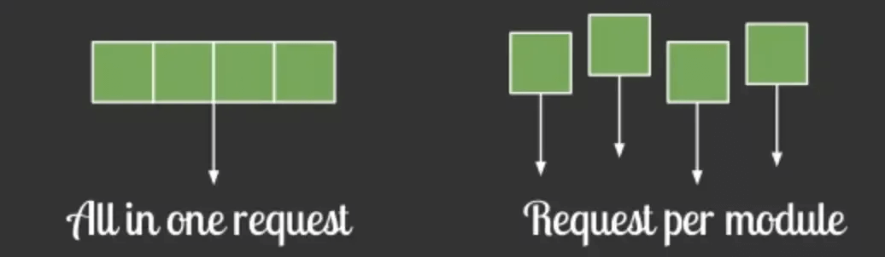

在`vue-router`配置路由的时候，采用动态加载路由的形式

```JavaScript
routes:[ 
    path: 'Blogs',
    name: 'ShowBlogs',
    component: () => import('./components/ShowBlogs.vue')
]
```

以函数的形式加载路由，这样就可以把各自的路由文件分别打包，只有在解析给定的路由时，才会加载路由组件


静态资源本地缓存

后端返回资源问题：

- 采用`HTTP`缓存，设置`Cache-Control`，`Last-Modified`，`Etag`等响应头
- 采用`Service Worker`离线缓存

前端合理利用`localStorage`


UI框架按需加载

在日常使用`UI`框架，例如`element-UI`、或者`antd`，我们通常会直接引用整个`UI`库

```JavaScript
import ElementUI from 'element-ui'
Vue.use(ElementUI)
```

但实际上我用到的组件只有按钮，分页，表格，输入与警告 所以我们要按需引用

```JavaScript
import { Button, Input, Pagination, Table, TableColumn, MessageBox } from 'element-ui';
Vue.use(Button)
Vue.use(Input)
Vue.use(Pagination)
```


组件重复打包

假设`A.js`文件是一个常用的库，现在有多个路由使用了`A.js`文件，这就造成了重复下载

解决方案：在`webpack`的`config`文件中，修改`CommonsChunkPlugin`的配置

```JavaScript
minChunks: 3
```

`minChunks`为3表示会把使用3次及以上的包抽离出来，放进公共依赖文件，避免了重复加载组件


图片资源的压缩

图片资源虽然不在编码过程中，但它却是对页面性能影响最大的因素

对于所有的图片资源，我们可以进行适当的压缩

对页面上使用到的`icon`，可以使用在线字体图标，或者雪碧图，将众多小图标合并到同一张图上，用以减轻`http`请求压力。


开启GZip压缩

拆完包之后，我们再用`gzip`做一下压缩 安装`compression-webpack-plugin`

```JavaScript
cnmp i compression-webpack-plugin -D
```

在`vue.congig.js`中引入并修改`webpack`配置

```JavaScript
const CompressionPlugin = require('compression-webpack-plugin')

configureWebpack: (config) => {
        if (process.env.NODE_ENV === 'production') {
            // 为生产环境修改配置...
            config.mode = 'production'
            return {
                plugins: [new CompressionPlugin({
                    test: /\.js$|\.html$|\.css/, //匹配文件名
                    threshold: 10240, //对超过10k的数据进行压缩
                    deleteOriginalAssets: false //是否删除原文件
                })]
            }
        }
```

在服务器我们也要做相应的配置 如果发送请求的浏览器支持`gzip`，就发送给它`gzip`格式的文件 我的服务器是用`express`框架搭建的 只要安装一下`compression`就能使用

```Plaintext
const compression = require('compression')
app.use(compression())  // 在其他中间件使用之前调用
```

使用SSR

SSR（Server side ），也就是服务端渲染，组件或页面通过服务器生成html字符串，再发送到浏览器

从头搭建一个服务端渲染是很复杂的，`vue`应用建议使用`Nuxt.js`实现服务端渲染


小结：

减少首屏渲染时间的方法有很多，总的来讲可以分成两大部分 ：资源加载优化 和 页面渲染优化

下图是更为全面的首屏优化的方案

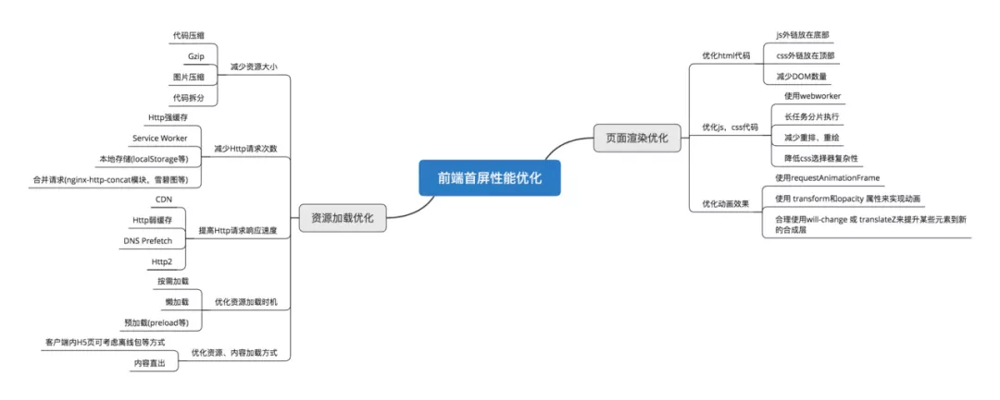

大家可以根据自己项目的情况选择各种方式进行首屏渲染的优化


---

## 说说new操作符具体干了什么？


**参考答案：**

一、是什么

在`JavaScript`中，`new`操作符用于创建一个给定构造函数的实例对象

例子

```JavaScript
function Person(name, age){
    this.name = name;
    this.age = age;
}
Person.prototype.sayName = function () {
    console.log(this.name)
}
const person1 = new Person('Tom', 20)
console.log(person1)  // Person {name: "Tom", age: 20}
person1.sayName() // 'Tom'
```

从上面可以看到：

- `new` 通过构造函数 `Person` 创建出来的实例可以访问到构造函数中的属性
- `new` 通过构造函数 `Person` 创建出来的实例可以访问到构造函数原型链中的属性（即实例与构造函数通过原型链连接了起来）

现在在构建函数中显式加上返回值，并且这个返回值是一个原始类型

```JavaScript
function Test(name) {
  this.name = name
  return 1
}
const t = new Test('xxx')
console.log(t.name) // 'xxx'
```

可以发现，构造函数中返回一个原始值，然而这个返回值并没有作用

下面在构造函数中返回一个对象

```JavaScript
function Test(name) {
  this.name = name
  console.log(this) // Test { name: 'xxx' }
  return { age: 26 }
}
const t = new Test('xxx')
console.log(t) // { age: 26 }
console.log(t.name) // 'undefined'
```

从上面可以发现，构造函数如果返回值为一个对象，那么这个返回值会被正常使用


二、流程

从上面介绍中，我们可以看到`new`关键字主要做了以下的工作：

- 创建一个新的对象`obj`
- 将对象与构建函数通过原型链连接起来
- 将构建函数中的`this`绑定到新建的对象`obj`上
- 根据构建函数返回类型作判断，如果是原始值则被忽略，如果是返回对象，需要正常处理

举个例子：

```JavaScript
function Person(name, age){
    this.name = name;
    this.age = age;
}
Person.prototype.sayName = function () {
    console.log(this.name)
}
const person1 = new Person('Tom', 20)
console.log(person1)  // Person {name: "Tom", age: 20}
person1.sayName() // 'Tom'
```

三、手写new操作符

现在我们已经清楚地掌握了`new`的执行过程

那么我们就动手来实现一下`new`

```JavaScript
function mynew(Func, ...args) {
    // 1.创建一个新对象
    const obj = {}
    // 2.新对象原型指向构造函数原型对象
    obj.__proto__ = Func.prototype
    // 3.将构建函数的this指向新对象
    let result = Func.apply(obj, args)
    // 4.根据返回值判断
    return result instanceof Object ? result : obj
}
```

测试一下

```JavaScript
function mynew(func, ...args) {
    const obj = {}
    obj.__proto__ = func.prototype
    let result = func.apply(obj, args)
    return result instanceof Object ? result : obj
}
function Person(name, age) {
    this.name = name;
    this.age = age;
}
Person.prototype.say = function () {
    console.log(this.name)
}

let p = mynew(Person, "huihui", 123)
console.log(p) // Person {name: "huihui", age: 123}
p.say() // huihui
```

可以发现，代码虽然很短，但是能够模拟实现`new`


---

## 说说你对计算机网络模型的理解


**参考答案：**

一、体系结构

计算机网络的各层及其协议的集合被称为网络的体系结构，按照不同的维度，其常被分为七层、五层、四层网络结构：

1.1 七层网络模型

开放式系统互联模型（Open System Interconnection Model，简称为 OSI 模型）是一种概念模型，由国际标准化组织提出，并试图成为计算机在世界范围内互连为网络的标准框架，它具有七层网络结构。

1.2 四层网络模型

互联网协议套件（Internet Protocol Suite，IPS）是多个网络传输协议的集合，它为网际网络的基础通信提供架构支撑。由于该协议族中最核心的两个协议分别为 TCP（传输控制协议）和 IP（网际协议），因此它也被称为 TCP/IP 协议族（TCP/IP Protocol Suite 或 TCP/IP Protocols），简称 TCP/IP，它具有四层网络结构 。

1.3 五层网络模型

OSI 七层网络模型由国际标准化组织进行制定，它是正统意义上的国际标准。但其实现过于复杂，且制定周期过长，在其整套标准推出之前，TCP/IP 模型已经在全球范围内被广泛使用，所以 TCP/IP 模型才是事实上的国际标准。TCP/IP 模型定义了应用层、传输层、网际层、网络接口层这四层网络结构，但并没有给出网络接口层的具体内容，因此在学习和开发中，通常将网络接口层替换为 OSI 七层模型中的数据链路层和物理层来进行理解，这就是五层网络模型：

1. 应用层 (application layer)：直接为应用进程提供服务。应用层协议定义的是应用进程间通讯和交互的规则，不同的应用有着不同的应用层协议，如 HTTP协议（万维网服务）、FTP协议（文件传输）、SMTP协议（电子邮件）、DNS（域名查询）等。
2. 传输层 (transport layer)：有时也译为运输层，它负责为两台主机中的进程提供通信服务。该层主要有以下两种协议：

   - 传输控制协议 (Transmission Control Protocol，TCP)：提供面向连接的、可靠的数据传输服务，数据传输的基本单位是报文段（segment）；
   - 用户数据报协议 (User Datagram Protocol，UDP)：提供无连接的、尽最大努力的数据传输服务，但不保证数据传输的可靠性，数据传输的基本单位是用户数据报。
3. 网络层 (internet layer)：有时也译为网际层，它负责为两台主机提供通信服务，并通过选择合适的路由将数据传递到目标主机。
4. 数据链路层 (data link layer)：负责将网络层交下来的 IP 数据报封装成帧，并在链路的两个相邻节点间传送帧，每一帧都包含数据和必要的控制信息（如同步信息、地址信息、差错控制等）。
5. 物理层 (physical Layer)：确保数据可以在各种物理媒介上进行传输，为数据的传输提供可靠的环境。


二、物理层

物理层考虑的是如何在各种媒介上传输数据，它定义了与传输媒介相关的接口特性，如：

- 机械特性：指明接口所用的接线器的形状和尺寸、引线数目和排列、固定和锁定装置等。
- 电气特性：指明在接口电缆的各条线上出现的电压的范围。
- 功能特性：指明某条线上出现的某一电平的电压的意义。
- 规程特性：指明对于不同功能的各种可能事件的出现顺序。

2.1 传输媒介

物理层并不指具体的传输媒介，相反物理层希望能够尽量屏蔽不同媒介间的差异。这些传输媒介可以分为以下两类：

- 导引型传输媒介：信号被导引沿着固体媒介进行传播，如双绞线、同轴电缆、光缆。
- 非导引型传输媒介：信号在自由空间内进行传播，如短波通信、微波通信。

2.2 信道分类

信道是指信息传输的基本通道，它可以分为以下三类：

- 单工信道：只能有一个方向的通信而没有反方向的通信；
- 半双工信道：通信的双方都能发送信息，但双方不能同时发送或接收信息。
- 全双工信道：通信的双方可以同时发送和接收信息。

2.3 信道复用

信道复用是信息传输当中最常使用的技术，用于提高信息传输的效率，根据采用技术的不同，可以分为以下几类：

1. 频分复用

频分复用（FDM，Frequency Division Multiplexing）是将用于传输信道的总带宽划分成若干个子频带（或称子信道），每个子信道传输一路信号：

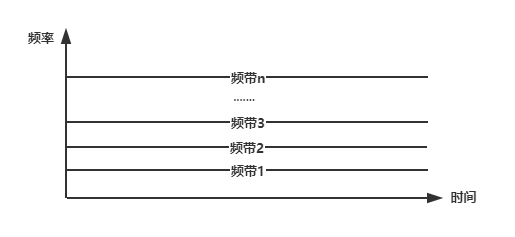

1. 时分复用

时分复用（TDM，Time Division Multiplexing) 是指采用同一物理连接的不同时段来传输不同的信号：

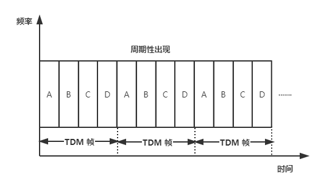

如上图所示，在一个时分复用帧中，不同用户的信号周期性出现，如果某个用户处于闲置状态，则其对应的帧上也会出现空闲：

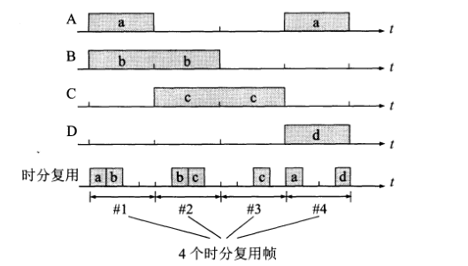

为了解决时分复用的这个缺点就产生了统计时分复用。

3.统计时分复用

在统计时分复用（Statistic TDM）模式下，各用户将数据发送到集中器的输入缓存中，然后由集中器进行顺序扫描并放入到 STDM 帧中：

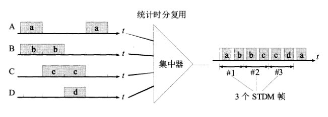

1. 波分复用

波分复用（WDM，Wavelength Division Multiplexing）是将两种或多种不同波长的光载波信号在发送端经复用器汇合在一起，并耦合到光线路的同一根光纤中进行传输；在接收端，经分用器将各种波长的光载波分离，然后由光解调器作进一步处理以恢复原信号：

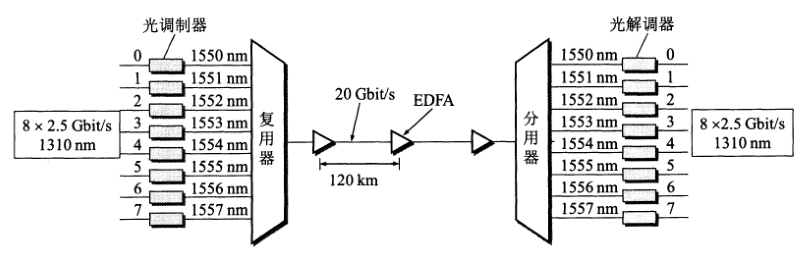

5.码分复用

码分复用（CDM，Code Division Multiplexing）是靠不同的编码来区分各路原始信号的一种复用方式。


三、数据链路层

3.1 基本功能

1. 封装成帧

数据链路层会将网络层传递下来的数据拆分为多段，并在每段数据前后分别添加首部和尾部，以构成一个完成的帧，帧是链路层传输的基本数据单元。帧首部用控制字符 `SOH` 表示，帧尾部用控制字符 `EOT` 表示：

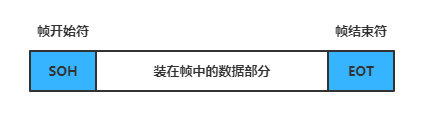

1. 透明传输

透明传输是指不论何种数据都应当能够在链路上进行安全地传输。由于我们采用控制字符来封装帧，当传输数据中出现了控制字符时，就会导致无法正确区分出帧头帧尾，此时需要使用转移字符 `ESC` 来进行转义：

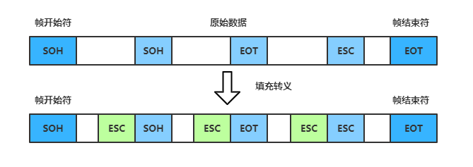

1. 差错检测

由于现实环境中的通信链路都是不理想的，因此比特在传输过程中可能会产生差错：1 可能会变成 0，而 0 也可能变成 1，这称为比特差错。在一段时间内，传输错误的比特占所传输比特总数的比率称为误码率。为了解决这个问题，数据链路层将待发送的数据分为多组，并采用循环冗余校验（CRC，Cyclic Redundancy Check）技术为每组数据生成冗余校验码，之后将每组数据和其校验码共同构成一帧后再发送出去。


3.2 PPP 协议

点到点协议（PPP，Point to Point Protocol）是目前使用最为广泛的数据链路层协议，主要用于建立点对点的连接来传输数据单元。它由以下三部分组成：

- 一个将 IP 数据报封装到串行链路的方法；
- 链路控制协议 (LCP) ：一种扩展链路控制协议，用于建立、配置、测试和管理数据链路连接。
- 网络控制协议 (NCP) ：协商该链路上所传输的数据包格式与类型，建立、配置不同的网络层协议。


3.3 Mac 地址

MAC 地址（Media Access Control Address），直译为媒体存取控制地址，也称为局域网地址（LAN Address）或物理地址（Physical Address）。MAC 地址用于在网络中唯一标识一个网卡，一台设备若有多个网卡，则每个网卡都会有一个唯一的 MAC 地址。链路层通过 Mac 地址来识别需要发送数据的目标节点。

MAC地址为 48 位的（6 个字节），通常表示为 12 个 16 进制数，每两个 16 进制数之间用冒号隔开，如 `08：00：20：0A：8C：6D`，前 3 字节为组织机构唯一标识（OUI，Organizationally Unique Identifier），由 IEEE 的注册管理机构统一分配给硬件生产厂家，以确保在全球范围内的唯一；后 3 字节由厂家自行分配。

3.4 局域网

局域网（LAN，Local Area Network）是连接住宅、学校、实验室、大学校园或办公大楼等有限区域内计算机的网络。 按照 IEEE802 标准，局域网体系结构分为三层，即物理层，媒体链路控制层（MAC），逻辑链路控制层（LLC）。实际上是两层，该标准将数据链路层拆分为更具体的媒体链路控制层和逻辑链路控制层。


3.5 以太网

以太网（Ethernet）是目前使用范围最广的局域网，以常用的以太网 v2 标准为例，其帧格式如下：

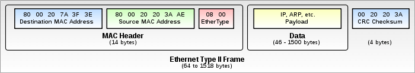

其中 Mac Header 分别记录了目的地的 Mac 地址和来源地的 Mac 地址。


四、网络层

4.1 网际协议 IP

网际协议（Internet Protocol）是网络层中最重要的协议，也是 TCP\IP 两大核心协议之一，所有需要互联的计算机网络都需要遵循该协议，以便能够将不同网络在全世界范围内连接起来。该层传输的基本数据单元是 IP 数据报，其格式如下：

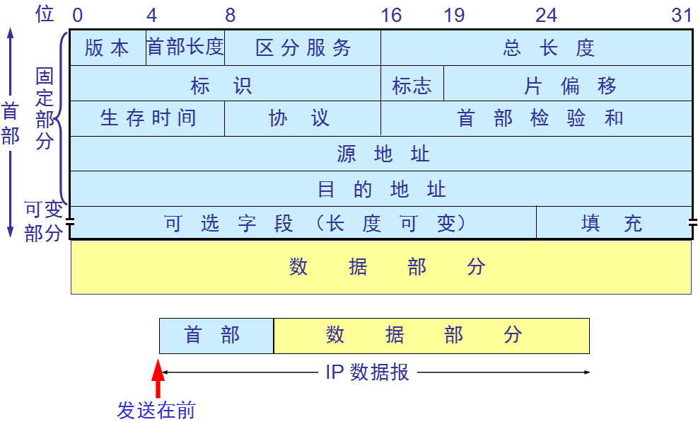

各字段的含义如下：

- 版本：占 4 位，指 IP 协议的版本（IPv4 或 IPv6）。
- 首部长度：占 4 位，可表示的最大十进制数是 15 。
- 区分服务：只有在使用区分服务时，该字段才有用，一般情况下不会用到。
- 总长度：指首部长度和数据长度之和，单位为字节。该字段为 16 位，因此数据报最大长度为 65535 个字节，由于数据链路层规定了一个帧中数据字段的最大长度 MTU（Maximum Transfer Unit，最大传送单元），以以太网为例，该值为 1500，所以当数据报长度超过 MTU 时，需要对数据进行分片。
- 标识：占 16 位，由 IP 软件内部的计数器维护，每产生一个数据报，计数器就加 1，用于发生分片时，将相同数据报标识的分片重组为原数据报。
- 标志：占 3 位，目前只有两位有意义：

  - 最低位 MF（More Fragment）：为 1 时表示后面还有分片，为 0 时表示该数据报分片已经是最后一个；
  - 中间位 DF（Don't Fragment）：代表不能分片，只有将其设为 1 时，才允许分片。
- 片偏移：占 13 位，标识该片在原数据报中的偏移位置。
- 生存时间：TTL，每经过一个路由器，其值就会减 1，当值为 0 时，就将该数据报丢弃。这样做是为了避免数据报目的地址不存在时，数据报一直在网络中无限制转发。
- 协议：占 8 位，指明数据报携带的数据所使用的协议。
- 首部校验和：占 16 位，其只校验数据报的首部，不包括数据部分。
- 源地址：占 32 位，数据来源的 IP 地址；
- 目的地址：占 32 位，目的地的 IP 地址。


4.2 ARP 协议

IP 数据报中的源地址和目标地址均是 IP 地址，而数据链路层的帧中的源地址和目标地址均是 Mac 地址，那么怎样根据 IP 地址获得 Mac 地址？这就需要使用到 ARP 协议。互联网络中的每台主机都有一个 ARP 缓存表，存储了本局域网内各主机和路由器的 IP 地址与 Mac 地址的映射关系，示例如下：

主机名称

IP地址

MAC地址

A

192.168.38.10

00-AA-00-62-D2-02

B

192.168.38.11

00-BB-00-62-C2-02

C

192.168.38.12

00-CC-00-62-C2-02

D

192.168.38.13

00-DD-00-62-C2-02

E

192.168.38.14

00-EE-00-62-C2-02

> 你也可以使用 `arp -a` 来查看你本机的 ARP 缓存表 。

拥有 ARP 表后，数据链路层中帧的发送过程如下：

- 主机 A 发送数据前， 会先查看自己的 ARP 表中是否有目标 IP 对应的 Mac 地址，如果有则将其封装到帧里，然后发送；
- 如果没有找到，主机 A 则会以广播的方式向同一网段内的所有主机发出对该 IP 地址的询问；
- 对应 IP 地址的主机接收到这个消息后以单播的方式将对应的 Mac 地址回复给主机 A 。


4.3 IP 地址分类

IP 地址由 ICANN（The Internet Corporation for Assigned Names and Numbers，互联网名称与数字地址分配机构）进行分配，它是一个在全世界范围内唯一的 32 位标识符，最早的 IP 地址采用两级分类，只由 `网络号 + 主机号` 组成，分为以下五类：

A，B，C 三类是最常使用的类型，其类别位分别为 0，10，110 。需要注意的是另外并非所有 IP 地址都可用来分配，限制如下：

网络号限制：

- 网络号全为 0 的 IP 地址是保留地址，代表 “本网络”（B，C 两类地址的网络号开头都是 1，所以不存在全 0 的情况）；
- 网络号为 127（即 01111111）也是保留地址，作为回环测试使用（同上，B 和 C 两类地址也不存在该情况）；
- B 类地址 128.0.0.0 （网络号为 10000000 00000000）不能用于分配；
- C 类地址 192.0.0.0 （网络号为 11000000 00000000）不能用于分配；

主机号限制：

- 全 0 主机号表示该 IP 地址是本主机所连接到的单个网络地址，如 IP 地址为 5.6.7.8 的主机所在的网络地址就是 5.0.0.0，该地址不能用于分配；
- 全 1 主机号表示该网络上的所有主机，因此也不能被分配。

综上所述，每种网络类型所能分配到 IP 地址的情况如下：

网络类别

最大可分配的网络数

第一个可分配的网络号

最后一个可分配的网络号

每个网络的最大主机数

A

126（27-2）

1

126

16 777 215（224-2）

B

16 383（214-1）

128.1

191.255

65 534（216-2）

C

2 097 151（221-1）

192.0.1

223.255.255

254（28-2）

从该表我们可以看出来，两级 IP 地址灵活性不足，且利用率较低，假设你现在的公司有 4 个机房（每个机房 20 台主机），出于信息安全的考虑，每个机房的网络需要彼此隔离，在两级 IP 的架构下你就只能申请 4 个 C 类地址，此时你浪费的 IP 数量为 `(254-20)*4` ，为解决两级 IP 地址灵活性不足问题，就产生了三级 IP 地址，即划分子网。此时你只需要申请一个 C 类地址，然后将其划分为 4 个子网。


4.4 划分子网

划分子网方案诞生与 1985 年，它从主机号借用若干位作为子网号，从而将 IP 地址划分为三级：网络号 + 子网号 + 主机号。假设网络地址为 192.168.10.0，利用子网掩码 255.255.255.224 对其进行划分子网，此时可以划分为四个子网：

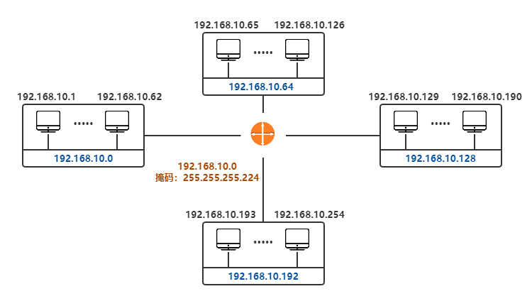

由于子网对外是不可见的，所以需要使用子网掩码来辅助路由，假设目标 IP 地址为 192.168.10.198，想要正确到达该地址，必须先正确到达网络地址 192.168.10.192 。网络地址，子网掩码和主机 IP 之间的关系如下：

```Plaintext
IP 地址：192.168.10.198             二进制IP地址：11000000.10101000.00001010.11000110
子网掩码：255.255.255.224           二进制掩码：11111111.11111111.11111111.11100000
网络地址：192.168.10.192            按位逻辑与运算结果为：11000000.10101000.00001010.11000000
```

现代互联网标准规定：所有网络都必须使用子网掩码，同时路由器的路由表中也必须包含子网掩码这一项。因为路由表包含了 IP 地址和子网掩码，所以通过位运算就能很快计算出网络地址。

最后，如果一个网络不划分子网掩码，则其子网掩码取默认值，各类 IP 地址默认的掩码如下：

类别

子网掩码的二进制数值

子网掩码的十进制数值

A

11111111 00000000 00000000 00000000

255.0.0.0

B

11111111 11111111 00000000 00000000

255.255.0.0

C

11111111 11111111 11111111 00000000

255.255.255.0


4.5 构成超网

无类别域间路由（CIDR，Classless Inter-Domain Routing）是一个给用户分配 IP 地址以及在互联网上有效地路由 IP 数据报的地址归类方法。它消除了传统的 A 类，B 类 和 C 类地址以及划分子网的概念，采用无分类的两级编址：

```Plaintext
IP地址 ::= {<网络前缀>,<主机号>}
```

并使用斜线记法进行表示：

128.14.35.7 / 20 = 10000000 00001110 00100011 00000111

此时表示前 20 位都是网络前缀，该地址所处的地址块中的最小地址和最大地址则分别为：

十进制

二进制

最小地址

128.14.32.0

10000000 00001110 00100000 00000000

最大地址

128.14.47.255

10000000 00001110 00101111 11111111

每个地址块可以使用地址块中的最小地址和网络前缀的位数进行指定，例如上面的地址块可以记为 128.14.32.0 / 20 ，也可以简称为 `/20地址块` 。为更方便的进行路由选择，CIDR 使用 32 位的地址掩码，斜线后面的数字同时表示地址掩码中 1 的个数，例如 `/20地址块` 的地址掩码为 11111111 11111111 11110000 00000000 。

由于一个 CIDR 地址块可以包含多个地址，所以路由表就利用 CIDR 地址块来查找目标网络，这种地址聚合常称为路由聚合，也称为构成超网。通过路由聚合，可以极大减少路由表中项目的数量，从而提高网络的整体性能。


4.6 ICMP 和 IGMP

在网络层，除了上面介绍的 IP 协议和 ARP 协议外，最常使用的还有以下两个协议：

- 互联网控制消息协议 (ICMP，Internet Control Message Protocol)：为了提高 IP 数据报的交付率，ICMP 允许主机或路由器报告差错情况和提供异常报告给发送者，以便发送者进行补偿行为。
- 网路群组管理协议 (IGMP，Internet Group Management Protocol) ：是用于管理网路协议多播组成员的一种通信协议。IP 主机和相邻的路由器可以利用 IGMP 来建立多播组的组成员。


4.7 专用地址

RFC 1918 中指明了一些专用地址（Private Address），这些地址只能用于一个机构的内部通信，但不能用于和互联网上的主机进行通信。在互联网中的所有路由器，对目的地址是专用地址的数据报一律不进行转发。下面是三个专用的地址块：

- 10.0.0.0 -- 10.255.255.255（或记为 10.0.0.0/8 ，又称为 24 位块）；
- 172.16.0.0 -- 172.31.255.255（或记为 172.16.0.0/12 ，又称为 20 位块）；
- 192.168.0.0 -- 192.168.255.255（或记为 192.168.0.0/16 ，又称为 16 位块）。

因为不同机构可以采用相同的专用地址，因此其也被称为可重用地址。


4.8 VPN

如果一个机构内使用的是由专用地址构成的专用网，但该机构的部门却分布在不同的、远距离的地理位置上，此时可以利用公共的互联网作为本机构内各专用网之间的通信载体，这样的专用网称为虚拟专用网（Virtual Private Network）。此时通过公共互联网的数据可以使用 IPSec（IP Security）协议加密来保证安全性。


4.8 NAT

当某台主机获取到的地址是专用地址时，其是无法和外部互联网进行通讯的，如果想要和外部互联网进行通讯，可以采用 NAT（Network Address Translation，网络地址转换）技术来实现。该方法需要在专用网连接到互联网的路由器上安装 NAT 软件，NAT 路由器需要至少一个有效的全球 IP 地址，当使用专用地址的主机在和外界进行通信时，NAT 路由器会将其转换为全球 IP 地址。

由上面的原理也可以看出，具有 n 个全球 IP 地址的路由器最多只允许 n 台主机同时接入到互联网。 为了解决这个问题，现在常用的 NAT 转换表会把传输层的端口号也利用上。

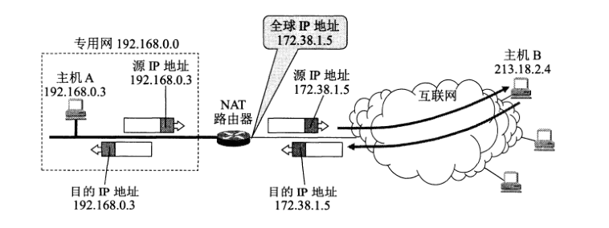

4.9 IPv6

上面我们介绍过 IPv4 的长度为 32 位，因此所有可分配的 IP 地址大约为 42 亿个，到 2011 年 2 月，所有可分配地址均已耗尽，因此产生了 IPv6，IPv6 的地址长度为 128 位，采用十六进制表示。


五、传输层

传输层负责为两台主机中的进程提供通信服务，它使用 16 位的端口号来标识端口，当两个计算机中的进程要进行通讯时，除了要知道对方的 IP 地址外，还需要知道对方的端口。该层主要有以下两个协议：用户数据报协议（UDP，User Datagram Protocol）和传输控制协议（TCP，Transmission Control Protocol）：


5.1 UDP

用户数据报协议 UDP 具有以下特点：

- UDP 是无连接的；
- UDP 提供尽最大努力的交付服务，但不保证交付的可靠性；
- UDP 是面向报文的；
- UDP 没有拥塞控制，因此网络出现拥塞不会使源主机的发送速率降低；
- UDP 支持一对一、一对多、多对一和多对多的交互通信；
- UDP 的首部开销较小，只有 8 个字节，远小于 TCP 的 20 个字节。首部共由四个字段组成，每个字段两个字节：

  - 源端口号：在需要对方回信时选用，不需要时可用全 0 表示；
  - 目标端口号；
  - 长度：UDP 用户数报的总长度；
  - 校验和：检测 UDP 用户数据报在传输中是否有错，如果有错则丢弃。

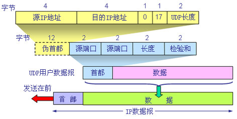

5.2 TCP 简介

传输控制协议 TCP 具有以下特点：

- TCP 是面向连接的；
- TCP 提供可靠的交付服务；
- TCP 提供全双工的通信，两端都设有缓存，用来临时存放通信数据；
- 面向字节流，这里的流指的是流入或流出进程的字节序列；
- 每一条 TCP 连接唯一地被通信两端的两个端点所确定，即：

```Plaintext
TCP 连接 ::= {socket1,socket2} = {(IP1,port1),(IP2,port2)}  
```

5.3 TCP 报文首部

TCP 虽然是面向字节流的，但其传输的基本数据单元则是报文段。一个 TCP 报文段分为首部和数据两部分，TCP 首部的前 20 个字节是固定的，后面有 4n 字节是根据需要而增加的选项（n 为整数），具体格式如下：

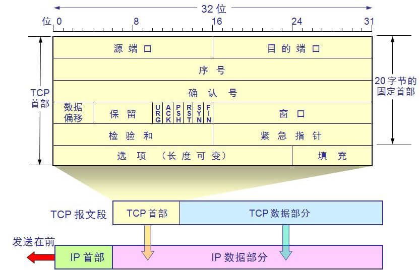

各字段的含义如下：

1. 源端口和目的端口：各占 2 个字节。
2. 序号：占 4 字节，序号范围为 [ 0 , 232 - 1 ] ，序号增加到 232 - 1 后又会回到 0 。在一个 TCP 连接中，传送的字节流中的每一个字节都要按顺序进行编号。
3. 确认号：占 4 字节，表示期望收到对方下一个报文段的第一个数据字节的序号。例如 B 收到 A 的报文，序号值为 501 ，数据长度为 200 字节（序号 501 \~ 700），此时表明 B 正确收到了序号 700 及其之前的所有数据，因此 B 在发送给 A 的确认报文段中确认号的值为 701。
4. 数据偏移：占 4 位，其所能表达的最大数字是 15 。数据偏移表示该数据报中数据的起始位置，由于数据报是由 首部+数据 组成，所以实际上就是指报文段的首部长度。数据偏移的单位是 32 位字（即以 4 字节长为单位），所以数据偏移的最大长度是 60 （15\*4）字节，即 TCP 报文段的首部长度不能超过 60 字节，对应的选项长度不能超过 40 字节。
5. 保留：占 6 位，保留为今后使用，目前应置为 0 。
6. 六个控制位：其作用分别如下：

   - 紧急 URG (URGent)：当值为 1 时，表明紧急指针字段有效，代表此报文中有紧急数据，应尽快传送，而无需按原来的排队顺序传送。
   - 确认 ACK (ACKnowledgment)：当值为 1 时，确认号有效；值为 0 时，确认号无效。TCP 规定，在连接建立后所有传送的报文段都必须把 ACK 置为 1。
   - 推送 PSH (Push)：当值为 1 时，表示接受方应该将数据立即交付给应用进程，而不是等待缓存填满后再向上交付。
   - 复位 RST (Reset)：当值为 1 时，表明 TCP 连接出现严重差错，必须立即释放，然后再重新建立连接；也可以用来拒绝一个非法的报文段或拒绝打开一个连接。
   - 同步 SYN (SYNchronization)：在连接建立时用来同步序号。当 SYN = 1 而 ACK = 0 时，表明这是一个连接请求报文段；对方若同意建立连接，则应在响应的报文段中使 SYN = 1 和 ACK = 1 。
   - 终止 FIN (FINis)：当值为 1 时，表明此报文段发送方的数据已发送完毕，并要求释放连接。
7. 窗口：占 2 字节，取值范围为 [ 0 , 216 - 1 ] 之间的整数。窗口字段保持动态变化，用于指明接收方允许发送方发送的数据量。
8. 校验和：占 2 字节，校验的字段范围包括首部和数据。
9. 紧急指针：占 2 字节，仅在 URG = 1 时才有意义，用于指明紧急数据的结束位置，位于结束位置之后的就是普通数据。
10. 选项：长度可变，最长可达 40 字节。可用的选项有：最大报文段长度 ，窗口扩大选项、时间戳选项等。


5.4 三次握手

TCP 建立连接的过程叫做握手，握手需要在客户和服务器之间交换三个 TCP 报文段，具体如下：

1. 服务器进程 B 首先创建传输控制模块 TCB，然后进入 LISTEN（收听）状态，准备接受客户端的连接请求；
2. 客户端进程 A 首先创建传输控制模块 TCB，然后发出连接请求报文段，此时同步位 `SYN = 1` ，同时选择一个初始序号 `seq = x` ，之后进入 SYN-SENT（同步已发送）状态；
3. B 收到连接请求报文段后，如果同意建立连接，则发送确认报文段，此时 SYN 和 ACK 都置为 1，确认号 `ack = x + 1` ，并为自己选择一个初始序号 `seq =y` ，之后进入 SYN-RCVD（同步收到）状态；
4. A 收到来自 B 的确认后，发出最后的确认，确认报文段的 ACK 为 1，确认号 `ack = y + 1`，序号 `seq = x + 1`。TCP 标准规定，ACK 报文段可以携带数据也可以不携带，如果不携带则该序号不被消耗，下一个数据报文段的序号仍然是 `seq = x + 1`。之后 A 进入 ESTABLISHED（已连接）状态；
5. 当 B 收到 A 的确认后，也进入 ESTABLISHED 状态。


5.5 四次挥手

数据传输结束后，通信的双方都可以释放连接，具体过程如下：

1. 假设应用进程 A 先主动关闭连接，此时需要发送连接释放报文段：首部终止控制位 FIN 为 1，序号 `seq = u`，其中 u 等于前面传送过的数据的最后一个字节的序号加 1 。之后 A 进入 FIN-WAIT-1（终止等待 1）状态；
2. 应用进程 B 收到连接释放报文段后立即发出确认，确认号 `ack = u + 1`，序号 `seq = v` ，其中 v 等于前面传送过的数据的最后一个字节的序号加 1 。之后 B 进入 CLOSE-WAIT（关闭等待）状态，并通知高层应用进程。此时 TCP 连接处于半关闭状态，即 A 已经没有数据需要发送，但如果 B 发送数据，A 仍要接收；
3. A 收到来自 B 的确认后就进入 FIN-WAIT-2（终止等待 2）状态，等待 B 发出连接释放报文段；
4. 若高层应用进程已经没有数据要发送，则通知 B 释放 TCP 连接。此时 B 发出释放连接报文段：首部终止控制位 FIN 为 1，序号 `seq = w`（在半关闭状态下 B 可能又发送了一些数据），另外还需要重复上次已经发送过的确认号 `ack = u + 1`。之后 B 进入 LAST-ACK（最后确认）状态；
5. A 收到 B 的连接释放报文段后，发出最后确认：ACK 为 1，确认号 `ack = w + 1`，序号 `seq = u + 1`，然后进入 TIME-WAIT（有时间限制的等待）状态；
6. B 收到来自 A 的最后确认后进入 CLOSED（关闭）状态；
7. A 经过 2 倍的 MSL（Maximum Segment Lifetime，最长报文段寿命）后，才进入 CLOSED 状态。

RFC 793 建议 MSL 设置为 2 分钟，现在的网络环境已经有了质的提升，该值可以按需缩短。A 之所以要等待两倍的 MSL 时间后才进入 CLOSED 状态，主要基于以下两个原因：

- 为了保证 A 发送的最后一个 ACK 报文段能够到达 B。如果 B 没有收到该最后确认，则会进行超时重发 FIN+ACK 报文段，A 在 2MSL 等待时间内会响应该报文段并重发最后确认；
- 确保本次连接内产生的所有报文段都从网络消失，进而确保下一个新的连接中不会出现旧的连接请求报文段。


5.6 可靠传输的原理

1. 停止等待协议

想要实现可靠性传输，最基本的可以使用停止等待协议：每发送完一个数据单元就停止发送，并等待对方的确认。

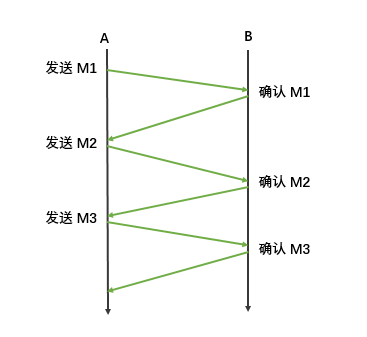

此时面临两个问题：

- 如果 A 给 B 发送数据的过程中出现了丢失，此时 B 无法收到数据，自然也不会返回确认，那么程序就会一直等待；
- 如果 B 给 A 发送确认的过程中出现了丢失或经过很长时间才到达 A，那么程序也会持续等待。

针对第一个问题，解决方案是如果在给定的时间内没有收到确认，则进行超时重传：

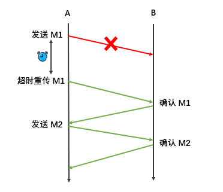

针对第二个问题，其解决方案依然是超时重传，具体细分为以下两种情况：

- 如果 B 收到了 M1，只是返回的确认丢失了，当超时重传后，B 需要丢弃重复收到的 M1；
- 如果 B 的返回确认没有丢失，只是超过了重传时间后才到达 A，此时 A 可能会收到两次确认，一次是补传得到确认，一次是原有的延迟到达的确认，A 需要丢弃延时到达的确认，不做任何处理：

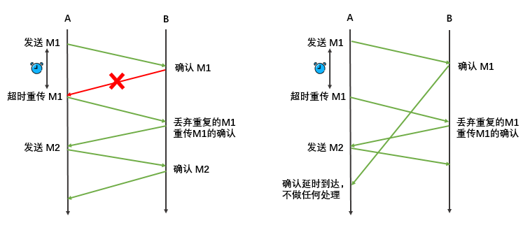

在基本的停止等待协议中，一次只发送一个数据单元，此时信道利用率非常低，为了解决这个问题，可以采用流水线传输，一次发送多个数据单元：

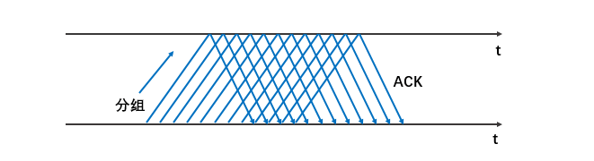

当使用流水线传输时，为保证可靠性，需要配合使用连续 ARQ 协议和滑动窗口协议。

2.连续 ARQ 协议

连续ARQ（Automatic Repeat reQuest）协议指发送方维持着一个一定大小的发送窗口，位于发送窗口内的所有分组都可连续发送出去，中途不需要等待对方的确认，发送方在每收到一个确认时就把发送窗口向前滑动一个分组的位置：

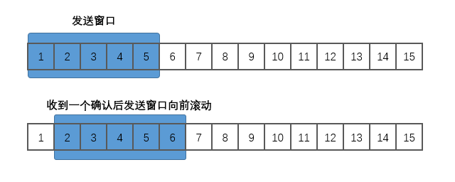

通常接收方一般都是采用累积确认的方式。此时接收方不必对收到的分组逐个发送确认，而是在收到几个分组后，对按序到达的最后一个分组发送确认，它表示：这个分组及其之前的所有分组都已正确到达。


5.7 TCP 的可靠传输

TCP 的滑动窗口以字节为单位，并采用以下方法来计算超时重传时间 RTO（Retransmission Time Out）：

```Plaintext
RTO = RTT_S + 4 × RTT_D
```

其中 RTTS 表示加权平均往返时间，计算方式如下：

```Plaintext
新的 RTT_S = (1-α) × 旧的 RTT_S +  α × 新的 RTT 值
```

- RTT （Round Trip Time）代表报文段的往返时间，它记录一个报文段从发出去到收到确认的时间长度；
- 第一次测量时， RTTS 的值就等于 RTT 的值，之后的 RTTS 则采用上面的公式进行计算；
- 其中 0 ≤ α＜1 ，RFC 6298 推荐其值取 0.125 。

RTTD 是 RTT 偏差的加权平均值，计算方式如下：

```Plaintext
新的 RTT_D = (1-β) × 旧的 RTT_D +  β × |RTT_S - 新的 RTT 值|
```

- 第一次测量时，RTTD 的值就等于 RTT 值的一半，之后的 RTTD 则采用上面的公式进行计算；
- β 值是一个小于 1 的系数，RFC 6298 推荐其值取 0.25 。


5.8 流量控制

流量控制（flow control）是指控制发送方的发送速率，以便接收方来得及接收。假设 A 向 B 发送数据，在连接建立时，B 会将自己接收窗口（rwnd，receiver window）的大小告诉 A ，而 A 需要保证发送窗口的大小不能超过 B 接收窗口的大小，通过该机制就可以实现对发送方的流量控制。


5.9 拥塞控制

网络拥塞（congestion）是指传输的数据量超过节点承受能力而导致传输能力下降的情况。而拥塞控制就是防止过多的数据注入到网络中而造成路由器和链路过载。TCP 采用四种算法来进行拥塞控制，分别是：慢启动（slow start）、拥塞避免（congestion avoidance）、快重传（fast retransmit）和快恢复（fast recovery）：

1. 慢启动

慢开始和拥塞避免都是基于窗口的拥塞控制：发送方会维持一个名为拥塞窗口 cwnd（congestion window）的状态变量，其值取决于网络的拥塞程度，并会动态变化，同时发送方会让自己的发送窗口等于拥塞窗口。

慢启动的思路如下：由于不知道网络的负载能力，所以最好的选择就是逐步探测，即由小到大成倍地增大发送窗口，也就是说，由小到大成倍地增大拥塞窗口的值。

1. 拥塞避免

拥塞避免算法的思路是让拥塞窗口 cwnd 缓慢地增大：每经过一个往返时间 RTT 就把发送方的拥塞窗口 cwnd 加 1，而不是像慢启动阶段那样加倍地增长。慢启动和拥塞避免通常是配合使用，以保证启动速度，一开始使用慢启动进行成倍增长，当达到某一个阈值 ssthresh 后采用拥塞避免进行稳步尝试：

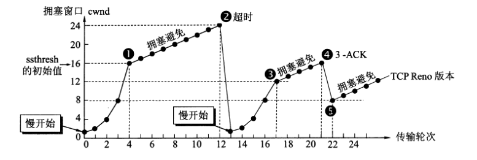

1. 快重传和快恢复

快重传算法要求接收方不要等待自己发送数据时才进捎带确认，而是要立即发送确认，即使收到了失序报文段也要立即发出对已收到的报文段的重复确认。示例如下：

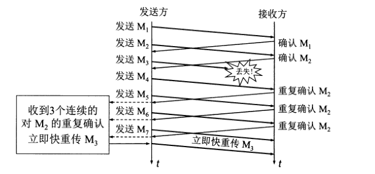

如上图所示，当 M3 丢失时，之后发送 M4 ， M5 ， M6 时收到的都是对于 M2 的重复确认，此时发送方就可以知道 M3 已经丢失，需要立即进行重传。由于此时只是个别报文出现了丢失，而不是网络拥塞，所以执行快恢复：发送方调整 ssthresh = cwnd / 2，并设置 cwnd = ssthresh = 8 （图中点5），并开始执行拥塞避免算法。


六、应用层

6.1 域名系统 DNS

目前我们都是使用易于理解的域名来访问互联网应用，但传输层需要的则是 IP 地址，因此需要使用域名系统（DNS，Domain Name System）来进行域名与 IP 地址之间的转换 。

域名是一个逻辑上的概念，分为多级域名，其中最基础的是根域名，其次是顶级域名，顶级域名共分为四类：

- 国家顶级域名 nTLD：如 cn 表示中国，us 表示美国；
- 通用顶级域名 gTLD：如 com 表示公司企业，org 表示非盈利性组织，net 表示网络服务机构；
- 基础结构域名：又称为反向域名，用于反向域名解析，该顶级域名只有一个 arpa；
- 新顶级域名 New gTLD：ICANN 机构在 2011 年 6 月 20 日批准新顶级域名，允许任何满足条件的公司或机构进行申请。

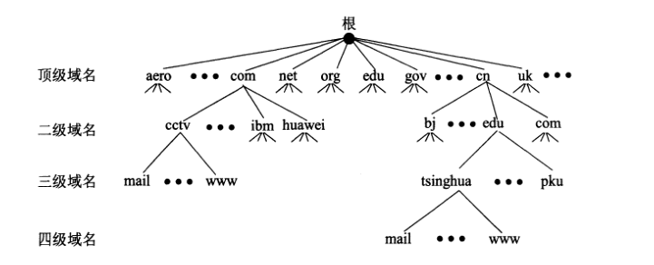

6.2 文件传输协议 FTP

文件传输协议（FTP，File Transfer Protocol）是用于在网络上进行文件传输的一套标准协议，允许客户指明文件的类型和格式，并获得文件的存储权限。FTP 的服务器进程由两大部分组成：

- 一个主进程：负责接收新的请求；
- 若干个从属进程：负责处理单个请求。

因此一个 FTP 服务器进程可以同时为多个客户端进程提供服务。


6.3 远程终端协议 TELNET

Telnet 协议是 Internet 远程登录服务的标准协议和主要方式，它为用户提供了在本地计算机上访问远程主机的能力。Telnet 能将用户的击键传到远程主机，同时也能将远程主机的输出通过 TCP 连接返回到用户屏幕，这种服务是透明的，用户感觉键盘和显示器好像都是直接连在远程主机上，因此 Telnet 又称为终端仿真协议。


6.4 万维网 WWW

万维网是一个分布式的超媒体系统，它是超文本系统的扩展。它包含以下重要概念：

1. 统一资源定位符 URL

用于定位互联网上资源的位置和访问这些资源的方法，其格式如下：

```Plaintext
<协议>://<主机>:<端口>/<路径>
```

1. 超文本传送协议 HTTP

HTTP 协议定义了浏览器如何向万维网请求文档，以及服务器如何把文档传送给浏览器。

1. 超文本标记语言 HTML

超文本标记语言 HTML 是一种标识性的语言，包括一系列标签，这些标签可以用于说明文字、图形、动画、声音、表格、链接等各种类型的资源，并能将网络文档格式进行统一。


6.5 动态主机配置协议 DHCP

通常连接到互联网的计算机的协议软件都需要配置多个项目，如 IP 地址，子网掩码，默认路由器的 IP 地址以及域名服务器的 IP 地址等等，为了省去配置的麻烦，现在互联网普遍采用动态主机配置协议 DHCP（Dynamic Host Configuration Protocol），它提供了一种即插即用联网的机制。此时你只需要采用默认的配置即可，如下所示：

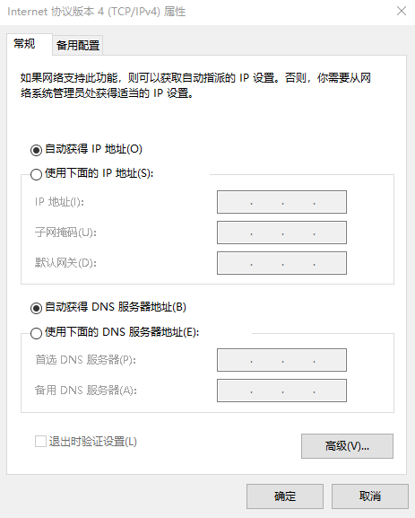

此时需要进行联网的主机在启动时候会广播发现报文（DHCP DISCOVER），其目的地址为 255.255.255.255（即受限广播地址），此时本地网络上的所有主机都能接收到这个广播报文，但只有 DHCP 服务器才会通过提供报文（DHCP OFFER）对此广播进行响应。DHCP 服务器先在其数据库中查找该计算机的配置信息，若找到，则直接返回；若找不到，则从服务器的 IP 地址池取一个地址分配给该计算机。

通常不是每个网络都有 DHCP 服务器，但每个网络都至少有一个 DHCP 中继代理（通常是路由器），它配置了 DHCP 服务器的 IP 地址信息。当 DHCP 中继代理收到主机 A 的发现报文后，就以单播的方式向 DHCP 服务器进行转发；并等待其回复后，再转发回主机 A 。

DHCP 服务器分配给 DHCP 客户的 IP 地址是临时性的，只能在一段时间内使用，该时间称为租用期，由 DHCP 服务器进行设置。


---

## 最大子序和

给你一个整数数组 `nums` ，请你找出一个具有最大和的连续子数组（子数组最少包含一个元素），返回其最大和。

子数组 是数组中的一个连续部分。

示例 1：

输入： nums = [-2,1,-3,4,-1,2,1,-5,4] 输出： 6 解释： 连续子数组 [4,-1,2,1] 的和最大，为 6 。

示例 2：

输入： nums = [1] 输出： 1

示例 3：

输入： nums = [5,4,-1,7,8] 输出： 23

提示：

- `1 <= nums.length <= 105`
- `-104 <= nums[i] <= 104`

\*\*进阶：\*\*如果你已经实现复杂度为 `O(n)` 的解法，尝试使用更为精妙的 分治法 求解。

```JavaScript
/**
 * @param {number[]} nums
 * @return {number}
 */
var maxSubArray = function(nums) {

};
```

**参考答案：**

方法一：动态规划

思路和算法

假设 `nums` 数组的长度是 `n`，下标从 `0` 到 `n-1`。

我们用 `f(i)` 代表以第 `i` 个数结尾的「连续子数组的最大和」，那么很显然我们要求的答案就是：


因此我们只需要求出每个位置的 `f(i)`，然后返回 `f` 数组中的最大值即可。那么我们如何求 `f(i)` 呢？我们可以考虑 `nums[i]` 单独成为一段还是加入 `f(i-1)` 对应的那一段，这取决于 `nums[i]` 和 `f(i-1) + nums[i]` 的大小，我们希望获得一个比较大的，于是可以写出这样的动态规划转移方程：

![图片展示了求解最大子序和问题中动态规划转移方程的关键部分。方程为`f(i) = max{f(i - 1) + nums\[i\], nums\[i\]}`，其中`f(i)`代表以第`i`个数结尾的「连续子数组的最大和」，`nums\[i\]`是数组中的一个元素。该方程用于求出每个位置的`f(i)`，通过比较`f(i - 1) + nums\[i\]`和`nums\[i\]`的大小，得到一个较大的值，最终返回`f`数组中的最大值，以求得最大子序和。](../imgs/LFMjb1Gwpoi2mlxazGPcdGd5nXg.png)

不难给出一个时间复杂度 `O(n)`、空间复杂度 `O(n)` 的实现，即用一个 `f` 数组来保存 `f(i)` 的值，用一个循环求出所有 `f(i)`。考虑到 `f(i)` 只和 `f(i-1)` 相关，于是我们可以只用一个变量 `pre` 来维护对于当前 `f(i)` 的 `f(i-1)` 的值是多少，从而让空间复杂度降低到 `O(1)`，这有点类似「滚动数组」的思想。

代码

```JavaScript
var maxSubArray = function(nums) {
    let pre = 0, maxAns = nums[0];
    nums.forEach((x) => {
        pre = Math.max(pre + x, x);
        maxAns = Math.max(maxAns, pre);
    });
    return maxAns;
};
```

复杂度

- 时间复杂度：`O(n)`，其中 `n` 为 `nums` 数组的长度。我们只需要遍历一遍数组即可求得答案。
- 空间复杂度：`O(1)`。我们只需要常数空间存放若干变量。


方法二：分治

思路和算法

这个分治方法类似于「线段树求解最长公共上升子序列问题」的 `pushUp` 操作。

我们定义一个操作 `get(a, l, r)` 表示查询 `a` 序列 `[l,r]` 区间内的最大子段和，那么最终我们要求的答案就是 `get(nums, 0, nums.size() - 1)`。如何分治实现这个操作呢？对于一个区间 `[l,r]`，我们取 `m = (l + r)/2`，对区间 `[l,m]` 和 `[m+1,r]` 分治求解。当递归逐层深入直到区间长度缩小为 `1` 的时候，递归「开始回升」。这个时候我们考虑如何通过 `[l,m]` 区间的信息和 `[m+1,r]` 区间的信息合并成区间 `[l,r]` 的信息。最关键的两个问题是：

- 我们要维护区间的哪些信息呢？
- 我们如何合并这些信息呢？

对于一个区间 `[l,r]`，我们可以维护四个量：

- `lSum` 表示 `[l,r]` 内以 `l` 为左端点的最大子段和
- `rSum` 表示 `[l,r]` 内以 `r` 为右端点的最大子段和
- `mSum` 表示 `[l,r]` 内的最大子段和
- `iSum` 表示 `[l,r]` 的区间和

以下简称 `[l,m]` 为 `[l,r]` 的「左子区间」，`[m+1,r]` 为 `[l,r]` 的「右子区间」。我们考虑如何维护这些量呢（如何通过左右子区间的信息合并得到 `[l,r]` 的信息）？对于长度为 `1` 的区间 `[i, i]`，四个量的值都和 `nums}[i]` 相等。对于长度大于 `1` 的区间：

- 首先最好维护的是 `iSum`，区间 `[l,r]` 的 `iSum` 就等于「左子区间」的 `iSum` 加上「右子区间」的 `iSum`。
- 对于 `[l,r]` 的 `lSum`，存在两种可能，它要么等于「左子区间」的 `lSum`，要么等于「左子区间」的 `iSum` 加上「右子区间」的 `lSum`，二者取大。
- 对于 `[l,r]` 的 `rSum`，同理，它要么等于「右子区间」的 `rSum`，要么等于「右子区间」的 `iSum` 加上「左子区间」的 `rSum`，二者取大。
- 当计算好上面的三个量之后，就很好计算 `[l,r]` 的 `mSum` 了。我们可以考虑 `[l,r]` 的 `mSum` 对应的区间是否跨越 `m`——它可能不跨越 `m`，也就是说 `[l,r]` 的 `mSum` 可能是「左子区间」的 `mSum` 和 「右子区间」的 `mSum` 中的一个；它也可能跨越 `m`，可能是「左子区间」的 `rSum` 和 「右子区间」的 `lSum` 求和。三者取大。

这样问题就得到了解决。

代码

```JavaScript
function Status(l, r, m, i) {
    this.lSum = l;
    this.rSum = r;
    this.mSum = m;
    this.iSum = i;
}

const pushUp = (l, r) => {
    const iSum = l.iSum + r.iSum;
    const lSum = Math.max(l.lSum, l.iSum + r.lSum);
    const rSum = Math.max(r.rSum, r.iSum + l.rSum);
    const mSum = Math.max(Math.max(l.mSum, r.mSum), l.rSum + r.lSum);
    return new Status(lSum, rSum, mSum, iSum);
}

const getInfo = (a, l, r) => {
    if (l === r) {
        return new Status(a[l], a[l], a[l], a[l]);
    }
    const m = (l + r) >> 1;
    const lSub = getInfo(a, l, m);
    const rSub = getInfo(a, m + 1, r);
    return pushUp(lSub, rSub);
}

var maxSubArray = function(nums) {
    return getInfo(nums, 0, nums.length - 1).mSum;
};
```

复杂度分析

假设序列 `a` 的长度为 `n`。

- 时间复杂度：假设我们把递归的过程看作是一颗二叉树的先序遍历，那么这颗二叉树的深度的渐进上界为 `O(log n)`，这里的总时间相当于遍历这颗二叉树的所有节点，故总时间的渐进上界是 `O(\sum_{i=1}^{\log n} 2^{i-1})=O(n)`，故渐进时间复杂度为 `O(n)`。
- 空间复杂度：递归会使用 `O(log n)` 的栈空间，故渐进空间复杂度为 `O(log n)`。


题外话

「方法二」相较于「方法一」来说，时间复杂度相同，但是因为使用了递归，并且维护了四个信息的结构体，运行的时间略长，空间复杂度也不如方法一优秀，而且难以理解。那么这种方法存在的意义是什么呢？

对于这道题而言，确实是如此的。但是仔细观察「方法二」，它不仅可以解决区间 `[0, n-1]`，还可以用于解决任意的子区间 `[l,r]` 的问题。如果我们把 `[0, n-1]` 分治下去出现的所有子区间的信息都用堆式存储的方式记忆化下来，即建成一颗真正的树之后，我们就可以在 `O(log n)` 的时间内求到任意区间内的答案，我们甚至可以修改序列中的值，做一些简单的维护，之后仍然可以在 `O(log n)` 的时间内求到任意区间内的答案，对于大规模查询的情况下，这种方法的优势便体现了出来。这棵树就是上文提及的一种神奇的数据结构——线段树。


---

## 说说你对“三次握手”、“四次挥手”的理解


**参考答案：**

我们都知道TCP是面向连接的，`三次握手`就是用来建立连接的，`四次握手`就是用来断开连接的。


三次握手

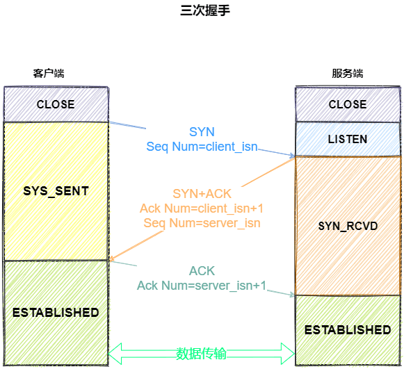

我们来看一下三次握手的过程：

- 一开始，客户端和服务端都处于 `CLOSED` 状态。客户端主动打开连接，服务端被动打卡连接，结束`CLOSED` z状态，开始监听，进入 `LISTEN `状态。

一次握手

- 客户端会随机初始化序号（`client_isn`），将此序号置于 TCP 首部的「序号」字段中，同时把 `SYN` 标志位置为 `1` ，表示 `SYN` 报文。接着把第一个 SYN 报文发送给服务端，表示向服务端发起连接，该报文不包含应用层数据，之后客户端处于 `SYN-SENT` 状态。

二次握手

- 服务端收到客户端的 `SYN` 报文后，首先服务端也随机初始化自己的序号（`server_isn`），将此序号填入 TCP 首部的「序号」字段中，其次把 TCP 首部的「确认应答号」字段填入 `client_isn + 1`, 接着把 `SYN` 和 `ACK` 标志位置为 `1`。最后把该报文发给客户端，该报文也不包含应用层数据，之后服务端处于 `SYN-RCVD` 状态。

三次握手

- 客户端收到服务端报文后，还要向服务端回应最后一个应答报文，首先该应答报文 TCP 首部 `ACK` 标志位置为 `1` ，其次「确认应答号」字段填入 `server_isn + 1` ，最后把报文发送给服务端，这次报文可以携带客户到服务器的数据，之后客户端处于 `ESTABLISHED` 状态。

好了，经过三次握手的过程，客户端和服务端之间的确定连接正常，接下来进入`ESTABLISHED`状态，服务端和客户端就可以快乐地通信了。

这里有个小细节，第三次握手是可以携带数据的，这是面试常问的点。

> 那么为什么要三次握手呢？两次不行吗？

- 为了防止服务器端开启一些无用的连接增加服务器开销
- 防止已失效的连接请求报文段突然又传送到了服务端，因而产生错误。

由于网络传输是有延时的(要通过网络光纤和各种中间代理服务器)，在传输的过程中，比如客户端发起了 SYN=1 的第一次握手。

如果服务器端就直接创建了这个连接并返回包含 SYN、ACK 和 Seq 等内容的数据包给客户端，这个数据包因为网络传输的原因丢失了，丢失之后客户端就一直没有接收到服务器返回的数据包。

如果没有第三次握手告诉服务器端客户端收的到服务器端传输的数据的话，服务器端是不知道客户端有没有接收到服务器端返回的信息的。服务端就认为这个连接是可用的，端口就一直开着，等到客户端因超时重新发出请求时，服务器就会重新开启一个端口连接。

这样一来，就会有很多无效的连接端口白白地开着，导致资源的浪费。

这个过程可理解为：

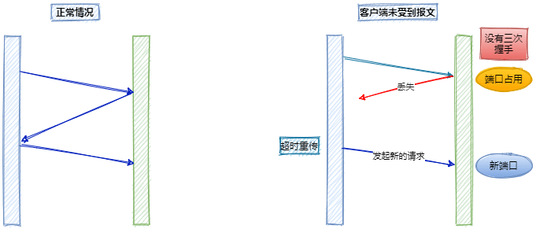

还有一种情况是已经失效的客户端发出的请求信息，由于某种原因传输到了服务器端，服务器端以为是客户端发出的有效请求，接收后产生错误。

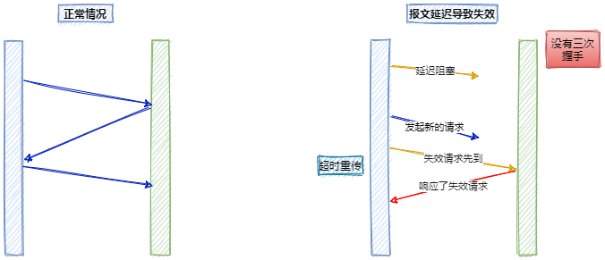

所以我们需要“第三次握手”来确认这个过程：

通过第三次握手的数据告诉服务端，客户端有没有收到服务器“第二次握手”时传过去的数据，以及这个连接的序号是不是有效的。若发送的这个数据是“`收到且没有问题`”的信息，接收后服务器就正常建立 TCP 连接，否则建立 TCP 连接失败，服务器关闭连接端口。由此减少服务器开销和接收到失效请求发生的错误。


四次挥手

还是先上图：

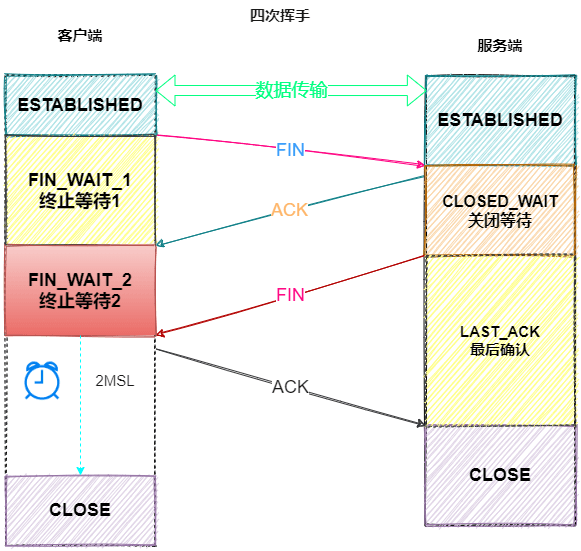

聚散终有时，TCP 断开连接是通过四次挥手方式。

`双方`都可以主动断开连接，断开连接后主机中的「资源」将被释放。

上图是客户端主动关闭连接 ：

一次挥手

- 客户端打算关闭连接，此时会发送一个 TCP 首部 `FIN` 标志位被置为 `1` 的报文，也即 `FIN` 报文，之后客户端进入 `FIN_WAIT_1` 状态。

二次挥手

- 服务端收到该报文后，就向客户端发送 `ACK` 应答报文，接着服务端进入 `CLOSED_WAIT` 状态。

三次挥手

- 客户端收到服务端的 `ACK` 应答报文后，之后进入 `FIN_WAIT_2` 状态。等待服务端处理完数据后，也向客户端发送 `FIN` 报文，之后服务端进入 `LAST_ACK` 状态。

四次挥手

- 客户端收到服务端的 `FIN` 报文后，回一个 `ACK` 应答报文，之后进入 `TIME_WAIT` 状态
- 服务器收到了 `ACK` 应答报文后，就进入了 `CLOSED` 状态，至此服务端已经完成连接的关闭。
- 客户端在经过 `2MSL` 一段时间后，自动进入 `CLOSED` 状态，至此客户端也完成连接的关闭。

你可以看到，每个方向都需要一个 FIN 和一个 ACK，因此通常被称为四次挥手。

> 为什么要挥手四次？

再来回顾下四次挥手双方发 `FIN` 包的过程，就能理解为什么需要四次了。

- 关闭连接时，客户端向服务端发送 `FIN` 时，仅仅表示客户端不再发送数据了但是还能接收数据。
- 服务器收到客户端的 `FIN` 报文时，先回一个 `ACK` 应答报文，而服务端可能还有数据需要处理和发送，等服务端不再发送数据时，才发送 `FIN` 报文给客户端来表示同意现在关闭连接。

从上面过程可知，服务端通常需要等待完成数据的发送和处理，所以服务端的 `ACK` 和 `FIN` 一般都会分开发送，从而比三次握手导致多了一次。

> 为什么客户端在TIME-WAIT阶段要等2MSL？

为的是确认服务器端是否收到客户端发出的 ACK 确认报文，当客户端发出最后的 ACK 确认报文时，并不能确定服务器端能够收到该段报文。

所以客户端在发送完 ACK 确认报文之后，会设置一个时长为 2MSL 的计时器。

MSL 指的是 Maximum Segment Lifetime：一段 TCP 报文在传输过程中的最大生命周期。

2MSL 即是服务器端发出为 FIN 报文和客户端发出的 ACK 确认报文所能保持有效的最大时长。

服务器端在 1MSL 内没有收到客户端发出的 ACK 确认报文，就会再次向客户端发出 FIN 报文：

- 如果客户端在 2MSL 内，再次收到了来自服务器端的 FIN 报文，说明服务器端由于各种原因没有接收到客户端发出的 ACK 确认报文。

客户端再次向服务器端发出 ACK 确认报文，计时器重置，重新开始 2MSL 的计时。

- 否则客户端在 2MSL 内没有再次收到来自服务器端的 FIN 报文，说明服务器端正常接收了 ACK 确认报文，客户端可以进入 CLOSED 阶段，完成“四次挥手”。

所以，客户端要经历时长为 2SML 的 TIME-WAIT 阶段;这也是为什么客户端比服务器端晚进入 CLOSED 阶段的原因。


---

## 请简述 == 的机制

**参考答案：**

大家知道，==是JavaScript中比较复杂的一个运算符。它的运算规则奇怪，容易让人犯错，从而成为JavaScript中“最糟糕的特性”之一。

在仔细阅读了ECMAScript规范的基础上，我画了一张图，我想通过它你会彻底地搞清楚关于==的一切。同时，我也试图通过此文向大家证明==并不是那么糟糕的东西，它很容易掌握，甚至看起来很合理。

先上图：

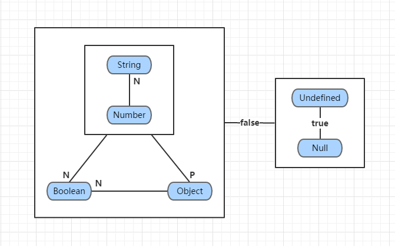

图1 ==运算规则的图形化表示

规范毕竟是给JavaScript运行环境的开发人员看的(比如V8引擎的开发人员们)，而不是给语言的使用者看的。而上图正是将规范中复杂的描述翻译成了更容易看懂的形式。

在详细介绍图1中的每个部分前，我们来复习一下JS中关于类型的知识：

1. JS中的值有两种类型：原始类型(Primitive)、对象类型(Object)。
2. 原始类型包括：Undefined、Null、Boolean、Number和String等五种。
3. Undefined类型和Null类型的都只有一个值，即undefined和null；Boolean类型有两个值：true和false；Number类型的值有很多很多；String类型的值理论上有无数个。
4. 所有对象都有valueOf()和toString()方法，它们继承自Object，当然也可能被子类重写。

现在考虑表达式：

```JavaScript
x == y
```

其中x和y是上述六种类型中某一种类型的值。

当x和y的类型相同时，x == y可以转化为x === y，而后者是很简单的(唯一需要注意的可能是NaN)，所以下面我们只考虑x和y的类型不同的情况。


一. 有和无

在图1中，JavaScript值的六种类型用蓝底色的矩形表示。它们首先被分成了两组：

- String、Number、Boolean和Object (对应左侧的大矩形框)
- Undefined和Null (对应右侧的矩形框)

分组的依据是什么？我们来看一下，右侧的Undefined和Null是用来表示不确定、无或者空的，而右侧的四种类型都是确定的、有和非空。我们可以这样说：

> 左侧是一个存在的世界，右侧是一个空的世界。

所以，左右两个世界中的任意值做==比较的结果都是false是很合理的。(见图1中连接两个矩形的水平线上标的false)


二. 空和空

JavaScript中的undefined和null是另一个经常让我们崩溃的地方。通常它被认为是一个设计缺陷，这一点我们不去深究。不过我曾听说，JavaScript的作者最初是这样想的：

> 假如你打算把一个变量赋予对象类型的值，但是现在还没有赋值，那么你可以用null表示此时的状态(证据之一就是typeof null 的结果是'object')；相反，假如你打算把一个变量赋予原始类型的值，但是现在还没有赋值，那么你可以用undefined表示此时的状态。

不管这个传闻是否可信，它们两者做==比较的结果是true是很合理的。(见图1中右侧垂直线上标的true)

在进行下一步之前，我们先来说一下图1中的两个符号：大写字母N和P。这两个符号并不是PN结中正和负的意思。而是：

- N表示ToNumber操作，即将操作数转为数字。它是规范中的抽象操作，但我们可以用JS中的Number()函数来等价替代。
- P表示ToPrimitive操作，即将操作数转为原始类型的值。它也是规范中的抽象操作，同样也可以翻译成等价的JS代码。不过稍微复杂一些，简单说来，对于一个对象obj：

> ToPrimitive(obj)等价于：先计算obj.valueOf()，如果结果为原始值，则返回此结果；否则，计算obj.toString()，如果结果是原始值，则返回此结果；否则，抛出异常。

注：此处有个例外，即Date类型的对象，它会先调用toString()方法，后调用valueOf()方法。

在图1中，标有N或P的线表示：当它连接的两种类型的数据做==运算时，标有N或P的那一边的操作数要先执行ToNumber或ToPrimitive变换。


三. 真与假

从图1可以看出，当布尔值与其他类型的值作比较时，布尔值会转化为数字，具体来说

```JavaScript
true -> 1
false -> 0
```

这一点也不需浪费过多口舌。想一下在C语言中，根本没有布尔类型，通常用来表示逻辑真假的正是整数1和0。


四. 字符的序列

在图1中，我们把String和Number类型分成了一组。为什么呢？在六种类型中，String和Number都是字符的序列(至少在字面上如此)。字符串是所有合法的字符的序列，而数字可以看成是符合特定条件的字符的序列。所以，数字可以看成字符串的一个子集。

根据图1，在字符串和数字做==运算时，需要使用ToNumber操作，把字符串转化为数字。假设x是字符串，y是数字，那么：

```JavaScript
x == y -> Number(x) == y
```

那么字符串转化为数字的规则是怎样的呢？规范中描述得很复杂，但是大致说来，就是把字符串两边的空白字符去掉，然后把两边的引号去掉，看它能否组成一个合法的数字。如果是，转化结果就是这个数字；否则，结果是NaN。例如：

```JavaScript
Number('123') // 结果123
Number('1.2e3') // 结果1200
Number('123abc') // 结果NaN
Number('123\v\f') // 结果123
```

当然也有例外，比如空白字符串转化为数字的结果是0。即

```JavaScript
Number('') // 结果0
Number('\v\f') // 结果0
```

五. 单纯与复杂

原始类型是一种单纯的类型，它们直接了当、容易理解。然而缺点是表达能力有限，难以扩展，所以就有了对象。对象是属性的集合，而属性本身又可以是对象。所以对象可以被构造得任意复杂，足以表示各种各样的事物。

但是，有时候事情复杂了也不是好事。比如一篇冗长的论文，并不是每个人都有时间、有耐心或有必要从头到尾读一遍，通常只了解其中心思想就够了。于是论文就有了关键字、概述。JavaScript中的对象也一样，我们需要有一种手段了解它的主要特征，于是对象就有了toString()和valueOf()方法。

> toString()方法用来得到对象的一段文字描述；而valueOf()方法用来得到对象的特征值。

当然，这只是我自己的理解。顾名思义，toString()方法倾向于返回一个字符串。那么valueOf()方法呢？根据规范中的描述，它倾向于返回一个数字——尽管内置类型中，valueOf()方法返回数字的只有Number和Date。

根据图1，当一个对象与一个非对象比较时，需要将对象转化为原始类型(虽然与布尔类型比较时，需要先将布尔类型变成数字类型，但是接下来还是要将对象类型变成原始类型)。这也是合理的，毕竟==是不严格的相等比较，我们只需要取出对象的主要特征来参与运算，次要特征放在一边就行了。


六. 万物皆数

我们回过头来看一下图1。里面标有N或P的那几条连线是没有方向的。假如我们在这些线上标上箭头，使得连线从标有N或P的那一端指向另一端，那么会得到(不考虑undefined和null)：

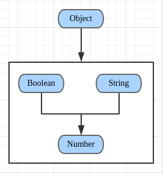

图2 ==运算过程中类型转化的趋势

发现什么了吗？对，在运算过程中，所有类型的值都有一种向数字类型转化的趋势。毕竟曾经有名言曰：

> 万物皆数。


七. 举个例子

前面废话太多了，这里还是举个例子，来证明图1确实是方便有效可以指导实践的。

例，计算下面表达式的值：

```JavaScript
[''] == false
```

首先，两个操作数分别是对象类型、布尔类型。根据图1，需要将布尔类型转为数字类型，而false转为数字的结果是0，所以表达式变为：

```JavaScript
[''] == 0
```

两个操作数变成了对象类型、数字类型。根据图1，需要将对象类型转为原始类型：

- 首先调用[].valueOf()，由于数组的valueOf()方法返回自身，所以结果不是原始类型，继续调用[].toString()。
- 对于数组来说，toString()方法的算法，是将每个元素都转为字符串类型，然后用逗号','依次连接起来，所以最终结果是空字符串''，它是一个原始类型的值。

此时，表达式变为：

```JavaScript
'' == 0
```

两个操作数变成了字符串类型、数字类型。根据图1，需要将字符串类型转为数字类型，前面说了空字符串变成数字是0。于是表达式变为：

```JavaScript
0 == 0
```

到此为止，两个操作数的类型终于相同了，结果明显是true。

从这个例子可以看出，要想掌握==运算的规则，除了牢记图1外，还需要记住那些内置对象的toString()和valueOf()方法的规则。包括Object、Array、Date、Number、String、Boolean等，幸好这没有什么难度。


八. 再次变形

其实，图一还不够完美。为什么呢？因为对象与字符串/数字比较时都由对象来转型，但是与同样是原始类型的布尔类型比较时却需要布尔类型转型。实际上，只要稍稍分析一下，全部让对象来转为原始类型也是等价的。所以我们得到了最终的更加完美的图形：

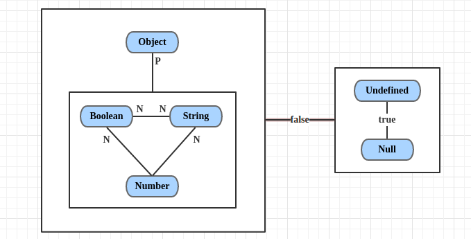

图3 更完美的==运算规则的图形化表示

有一个地方可能让你疑惑：为什么Boolean与String之间标了两个N？虽然按照规则应该是由Boolean转为数字，但是下一步String就要转为数字了，所以干脆不如两边同时转成数字。


九. 总结一下

前面说得很乱，根据我们得到的最终的图3，我们总结一下==运算的规则：

- undefined == null，结果是true。且它俩与所有其他值比较的结果都是false。
- String == Boolean，需要两个操作数同时转为Number。
- String/Boolean == Number，需要String/Boolean转为Number。
- Object == Primitive，需要Object转为Primitive(具体通过valueOf和toString方法)。

瞧见没有，一共只有4条规则！是不是很清晰、很简单。

---

## 怎么做移动端的样式适配？


**参考答案：**

以下是一些常见的移动端样式适配方法：

1. 响应式设计（Responsive Design）：

   - 使用CSS媒体查询（Media Queries）来根据设备的特征（如屏幕宽度、高度、方向等）应用不同的样式。
   - 通过设置百分比宽度、最大宽度或相对单位（比如 rem）来确保元素相对于其容器的大小进行自适应。

   ```JavaScript
    @media only screen and (max-width: 768px) {
     /* 在小屏幕上的样式 */
   }
   
   @media only screen and (min-width: 769px) and (max-width: 1024px) {
     /* 在中等屏幕上的样式 */
   }
   
   @media only screen and (min-width: 1025px) {
     /* 在大屏幕上的样式 */
   }
   ```
2. 弹性布局（Flexbox）和网格布局（Grid）：

   - 使用弹性布局和网格布局可以更方便地创建灵活的布局，使页面元素能够根据屏幕大小自动调整位置。

   ```JavaScript
   .container {
     display: flex;
     flex-wrap: wrap;
   }
   
   .item {
     flex: 1;
   }
   ```
3. 移动端优先（Mobile-first）：

   - 首先定义移动端的样式，然后使用媒体查询逐渐添加更大屏幕上的样式，以确保基本功能在小屏幕上也能正常工作。

   ```JavaScript
   /* 移动端样式 */
   body {
     font-size: 14px;
   }
   
   /* 大屏幕样式 */
   @media only screen and (min-width: 768px) {
     body {
       font-size: 16px;
     }
   }
   ```
4. 图片和多媒体适配：

   - 使用`max-width: 100%`确保图片和多媒体在小屏幕上不会溢出其容器。
   - 使用`picture`元素或`srcset`属性提供不同尺寸的图片。

   ```JavaScript
   img {
     max-width: 100%;
     height: auto;
   }
   ```
5. 交互友好：

   - 使用合适的尺寸和间距，确保链接、按钮等可点击元素在触摸屏上易于点击。

   ```JavaScript
   /* 适当的触摸区域大小 */
   a, button {
     padding: 10px;
   }
   ```
6. 测试和调试：

   - 在不同设备和浏览器上测试你的样式，确保页面在各种情况下都有良好的表现。
   - 使用浏览器开发者工具检查元素并模拟不同设备的情况。


---

## 怎么预防用户快速连续点击，造成数据多次提交？


**参考答案：**

为了防止重复提交，前端一般会在第一次提交的结果返回前，将提交按钮禁用。

实现的方法有很多种：

- css设置 `pointer-events` 为 `none`
- 增加变量控制，当变量满足条件时才执行点击事件的后续代码（比如给按钮的点击事件增加防抖）
- 如果按钮使用 button 标签实现，可以使用 `disabled` 属性
- 加遮罩层，比如一个全屏的loading，避免触发按钮的点击事件
- ...


---
