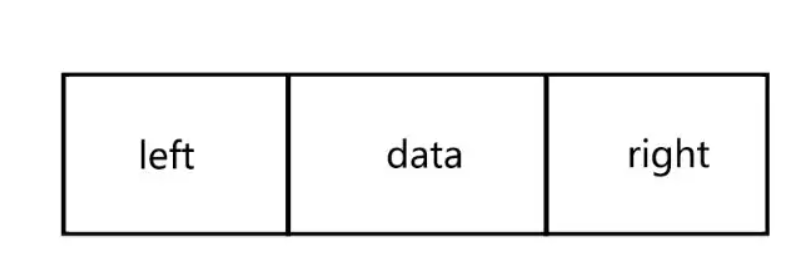
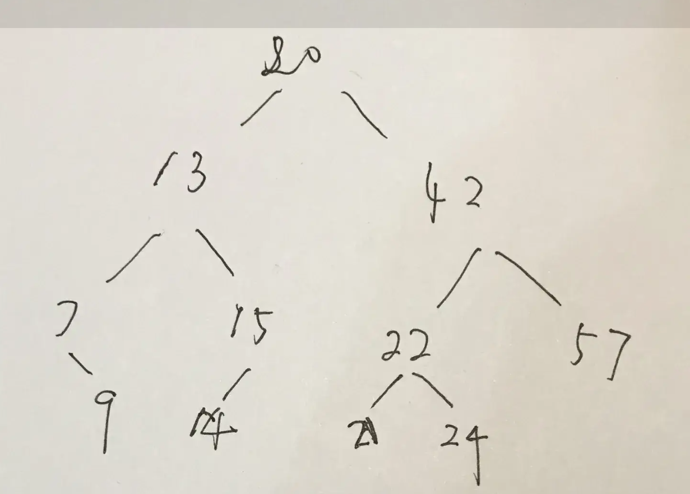

# JavaScript · JS核心与其他（2）（40题）

## 怎么实现大型文件上传？


**参考答案：**

大文件快速上传的方案，其实无非就是将 文件变小，也就是通过 压缩文件资源 或者 文件资源分块 后再上传。

具体来说，可以考虑以下几种方法：

1. 分片上传（Chunked Upload）：将大文件拆分成小的文件块(chunk)，然后通过多个并行的请求依次上传这些文件块。服务器接收到每个文件块后进行存储，最后合并所有文件块以还原原始文件。这种方法可以降低单个请求的负载，并允许在网络中断或上传失败时可以从断点续传。
2. 流式上传（Streaming Upload）：客户端使用流方式逐步读取文件的内容，并将数据流通过 POST 请求发送给服务器。服务器端能够逐步接收并处理这些数据流，而无需等待完整的文件上传完成。这种方法适用于较大的文件，减少了内存占用和传输延迟。
3. 使用专门的文件上传服务：有一些第三方服务可供使用，例如云存储服务（如 Amazon S3、Google Cloud Storage）、文件传输协议（如 FTP、SFTP）等。这些服务通常提供了高可靠性、可扩展性和安全性，并且针对大文件上传进行了优化。
4. 压缩文件上传：如果可能，可以在客户端先对文件进行压缩，然后再进行上传。压缩后的文件大小更小，可以减少上传时间和网络带宽消耗。
5. 并发上传：通过多个并行的请求同时上传文件的不同部分，以加快整个上传过程。这需要服务器端支持并发上传并正确处理分片或部分文件的合并。
6. 断点续传：记录上传进度和状态，以便在网络中断或上传失败后能够从上次中断的位置继续上传。可以使用客户端或服务器端的断点续传机制来实现。

补充知识点

问题 1：谁负责资源分块？谁负责资源整合？

当然这个问题也很简单，肯定是前端负责分块，服务端负责整合.

问题 2：前端怎么对资源进行分块？

首先是选择上传的文件资源，接着就可以得到对应的文件对象 File，而 File.prototype.slice 方法可以实现资源的分块，当然也有人说是 Blob.prototype.slice 方法，因为 `Blob.prototype.slice === File.prototype.slice`.

问题 3：服务端怎么知道什么时候要整合资源？如何保证资源整合的有序性？

由于前端会将资源分块，然后单独发送请求，也就是说，原来 1 个文件对应 1 个上传请求，现在可能会变成 1 个文件对应 n 个上传请求，所以前端可以基于 Promise.all 将这多个接口整合，上传完成在发送一个合并的请求，通知服务端进行合并。

合并时可通过 nodejs 中的读写流（readStream/writeStream），将所有切片的流通过管道（pipe）输入最终文件的流中。

在发送请求资源时，前端会定好每个文件对应的序号，并将当前分块、序号以及文件 hash 等信息一起发送给服务端，服务端在进行合并时，通过序号进行依次合并即可。

问题 4：如果某个分块的上传请求失败了，怎么办？

一旦服务端某个上传请求失败，会返回当前分块失败的信息，其中会包含文件名称、文件 hash、分块大小以及分块序号等，前端拿到这些信息后可以进行重传，同时考虑此时是否需要将 Promise.all 替换为 Promise.allSettled 更方便。


---

## 说说你的ES6-ES12的了解


**参考答案：**

ES6（2015）

1. 类（class）

```JavaScript
class Man {
  constructor(name) {
    this.name = '小豪';
  }
  console() {
    console.log(this.name);
  }
}
const man = new Man('小豪');
man.console(); // 小豪
```

1. 模块化(ES Module)

```JavaScript
// 模块 A 导出一个方法
export const sub = (a, b) => a + b;
// 模块 B 导入使用
import { sub } from './A';
console.log(sub(1, 2)); // 3
```

1. 箭头（Arrow）函数

```JavaScript
const func = (a, b) => a + b;
func(1, 2); // 3
```

1. 函数参数默认值

```JavaScript
function foo(age = 25,){ // ...}
```

1. 模板字符串

```JavaScript
const name = '小豪';
const str = `Your name is ${name}`;
```

1. 解构赋值

```JavaScript
let a = 1, b= 2;
[a, b] = [b, a]; // a 2  b 1
```

1. 延展操作符

```JavaScript
let a = [...'hello world']; // ["h", "e", "l", "l", "o", " ", "w", "o", "r", "l", "d"]
```

1. 对象属性简写

```JavaScript
const name='小豪',
const obj = { name };
```

1. Promise

```JavaScript
Promise.resolve().then(() => { console.log(2); });
console.log(1);
// 先打印 1 ，再打印 2
```

1. let和const

```JavaScript
let name = '小豪'；
const arr = [];
```

ES7（2016）

1. Array.prototype.includes()

```JavaScript
[1].includes(1); // true
```

1. 指数操作符

```JavaScript
2**10; // 1024
```

ES8（2017）

1. async/await

异步终极解决方案

```JavaScript
async getData(){
    const res = await api.getTableData(); // await 异步任务
    // do something    
}
```

1. Object.values()

```JavaScript
Object.values({a: 1, b: 2, c: 3}); // [1, 2, 3]
```

1. Object.entries()

```JavaScript
Object.entries({a: 1, b: 2, c: 3}); // [["a", 1], ["b", 2], ["c", 3]]
```

1. String padding

```JavaScript
// padStart
'hello'.padStart(10); // "     hello"
// padEnd
'hello'.padEnd(10) "hello     "
```

1. 函数参数列表结尾允许逗号
2. Object.getOwnPropertyDescriptors()

> 获取一个对象的所有自身属性的描述符,如果没有任何自身属性，则返回空对象。

1. SharedArrayBuffer对象

> SharedArrayBuffer 对象用来表示一个通用的，固定长度的原始二进制数据缓冲区，

```JavaScript
/**
 * 
 * @param {*} length 所创建的数组缓冲区的大小，以字节(byte)为单位。  
 * @returns {SharedArrayBuffer} 一个大小指定的新 SharedArrayBuffer 对象。其内容被初始化为 0。
 */
new SharedArrayBuffer(10)
```

1. Atomics对象

> Atomics 对象提供了一组静态方法用来对 SharedArrayBuffer 对象进行原子操作。

ES9（2018）

1. 异步迭代

await可以和for...of循环一起使用，以串行的方式运行异步操作

```JavaScript
async function process(array) {
  for await (let i of array) {
    // doSomething(i);
  }
}
```

1. Promise.finally()

```JavaScript
Promise.resolve().then().catch(e => e).finally();
```

1. Rest/Spread 属性

```JavaScript
const values = [1, 2, 3, 5, 6];
console.log( Math.max(...values) ); // 6
```

1. 正则表达式命名捕获组

```JavaScript
const reg = /(?<year>[0-9]{4})-(?<month>[0-9]{2})-(?<day>[0-9]{2})/;
const match = reg.exec('2021-02-23');
```

1. 正则表达式反向断言

```JavaScript
(?=p)、(?<=p)  p 前面(位置)、p 后面(位置)
(?!p)、(?<!p>) 除了 p 前面(位置)、除了 p 后面(位置)
```

1. 正则表达式dotAll模式

> 正则表达式中点.匹配除回车外的任何单字符，标记s改变这种行为，允许行终止符的出现

```JavaScript
/hello.world/.test('hello\nworld');  // false
```

ES10（2019）

1. Array.flat()和Array.flatMap()

flat()

```JavaScript
[1, 2, [3, 4]].flat(Infinity); // [1, 2, 3, 4]
```

flatMap()

```JavaScript
[1, 2, 3, 4].flatMap(a => [a**2]); // [1, 4, 9, 16]
```

1. String.trimStart()和String.trimEnd()

去除字符串首尾空白字符

1. String.prototype.matchAll

> matchAll（）为所有匹配的匹配对象返回一个迭代器

```JavaScript
const raw_arr = 'test1  test2  test3'.matchAll((/t(e)(st(\d?))/g));
const arr = [...raw_arr];
```

1. Symbol.prototype.description

> 只读属性，回 Symbol 对象的可选描述的字符串。

```JavaScript
Symbol('description').description; // 'description'
```

1. Object.fromEntries()

> 返回一个给定对象自身可枚举属性的键值对数组

```JavaScript
// 通过 Object.fromEntries， 可以将 Map 转化为 Object:
const map = new Map([ ['foo', 'bar'], ['baz', 42] ]);
console.log(Object.fromEntries(map)); // { foo: "bar", baz: 42 }
```

1. 可选 Catch

ES11（2020）

1. Nullish coalescing Operator(空值处理)

表达式在 ?? 的左侧 运算符求值为undefined或null，返回其右侧。

```JavaScript
let user = {
    u1: 0,
    u2: false,
    u3: null,
    u4: undefined
    u5: '',
}
let u2 = user.u2 ?? '用户2'  // false
let u3 = user.u3 ?? '用户3'  // 用户3
let u4 = user.u4 ?? '用户4'  // 用户4
let u5 = user.u5 ?? '用户5'  // ''
```

1. Optional chaining（可选链）

?.用户检测不确定的中间节点

```JavaScript
let user = {}
let u1 = user.childer.name // TypeError: Cannot read property 'name' of undefined
let u1 = user.childer?.name // undefined
```

1. Promise.allSettled

> 返回一个在所有给定的promise已被决议或被拒绝后决议的promise，并带有一个对象数组，每个对象表示对应的promise结果

```JavaScript
const promise1 = Promise.resolve(3);
const promise2 = 42;
const promise3 = new Promise((resolve, reject) => reject('我是失败的Promise_1'));
const promise4 = new Promise((resolve, reject) => reject('我是失败的Promise_2'));
const promiseList = [promise1,promise2,promise3, promise4]
Promise.allSettled(promiseList)
.then(values=>{
  console.log(values)
});
```

1. import()

按需导入

1. 新基本数据类型BigInt

> 任意精度的整数

1. globalThis

- 浏览器：window
- worker：self
- node：global

ES12（2021）

1. replaceAll

> 返回一个全新的字符串，所有符合匹配规则的字符都将被替换掉

```JavaScript
const str = 'hello world';
str.replaceAll('l', ''); // "heo word"
```

1. Promise.any

> Promise.any() 接收一个Promise可迭代对象，只要其中的一个 promise 成功，就返回那个已经成功的 promise 。如果可迭代对象中没有一个 promise 成功（即所有的 promises 都失败/拒绝），就返回一个失败的 promise

```JavaScript
const promise1 = new Promise((resolve, reject) => reject('我是失败的Promise_1'));
const promise2 = new Promise((resolve, reject) => reject('我是失败的Promise_2'));
const promiseList = [promise1, promise2];
Promise.any(promiseList)
.then(values=>{
  console.log(values);
})
.catch(e=>{
  console.log(e);
});
```

1. WeakRefs

> 使用WeakRefs的Class类创建对对象的弱引用(对对象的弱引用是指当该对象应该被GC回收时不会阻止GC的回收行为)

1. 逻辑运算符和赋值表达式

> 逻辑运算符和赋值表达式，新特性结合了逻辑运算符（&&，||，??）和赋值表达式而JavaScript已存在的 复合赋值运算符有：

```JavaScript
a ||= b
//等价于
a = a || (a = b)

a &&= b
//等价于
a = a && (a = b)

a ??= b
//等价于
a = a ?? (a = b)
```

1. 数字分隔符

> 数字分隔符，可以在数字之间创建可视化分隔符，通过_下划线来分割数字，使数字更具可读性

```JavaScript
const money = 1_000_000_000;
//等价于
const money = 1000000000;

1_000_000_000 === 1000000000; // true
```


---

## 用js实现二叉树的定义和基本操作


**参考答案：**

树是计算机科学中经常用到的一种数据结构。树是一种非线性的数据结构，以分层的方式存储数据。树被用来存储具有层级关系的数据，比如文件系统中的文件；树还被用来存储有序列表。

二叉树具有诸多优点。相对于链表来说，二叉树在进行查找时速度非常快，而相对于数组来说，为二叉树添加或删除元素也非常快。

二叉树

二叉树是一种特殊的树，表现在它的子节点个数不超过两个。且二叉树的子树有左右之分，其次序不能任意颠倒。

在实现二叉树时，采用的存储结构为链式存储结构，链式结构的意思是采用一个链表来存储一颗二叉树，二叉树中每一个节点用链表的一个节点来存储，在二叉树中，节点结构至少有三个域：数据域data，左指针域left，右指针域right，如下图所示：




二叉链表的存储结构描述如下：

```JavaScript
class Node{
    constructor(data, left, right){
        this.data = data;
        this.left = left;
        this.right = right;
        this.count = 1;
    }
}
```

与图1不同之处在于多了一个count变量，这个变量的作用在于，在向二叉排序树中插入节点时，如果发现有已经有相同的节点值了，就放弃插入，但是将该节点的count变量加一，这是为了后面实现统计文本中不同的单词数量而设计的。

使用不同的存储结构，实现二叉树的链表的算法也不同。因此接下来的算法全都基于当前所选的存储结构。

其次，将要实现的并不是普通的二叉树，而是二叉排序树，其定义为：

> 二叉排序树或者是一棵空树，或者是具有下列性质的二叉树：  
>   
> （1）若左子树不空，则左子树上所有结点的值均小于它的根结点的值；  
>   
> （2）若右子树不空，则右子树上所有结点的值均大于它的根结点的值；  
>   
> （3）左、右子树也分别为二叉排序树；  
>   
> （4）没有键值相等的节点。

二叉排序树

在二叉排序树的实现了一些基本操作：插入节点，删除节点，寻找节点，以及获取最小值和最大值。

代码框架：

```JavaScript
class BSTree {
    constructor() {
        this.root = null;
    }

    // 删除一个节点
    _removeNode(node, data) {
       
    }

    // 删除给定的数据节点
    remove(data) {
        this.root = this._removeNode(this.root, data);
    }

    // 向二叉树中插入节点
    insert(data) {
        
    }

    // 寻找给定数据的节点
    find(data) {
        
    }

    // 获得最小值的节点
    getMinNode(node = this.root) {
        
    }

    // 获得最大值的节点
    getMaxNode(node = this.root) {
        
    }
}
```

实现二叉排序树的各种方法

首先是insert(data)方法，从总体上来说，插入操作可以分为两步，新建值为data的节点，然后在二叉排序树中找到合适的位置插入即可。

建立以data为值的新的节点比较容易，只要

```JavaScript
let newNode = new Node(data, null, null);
```

即可，关键就在于如何找到正确的插入位置。

这里使用parentNode来记录当前节点的父节点，初始时，该变量为null，当前节点为currNode，初始时为该二叉树的根节点。

- 如果在插入时，root节点为空，则直接将新节点赋给root节点即可。
- 如果新的节点值小于当前节点值，说明待插入的位置应在在当前节点的左子树上，那么在大于时，就应该在当前节点的右子树上。进而更新当前节点所指向的节点，直到当前节点为空时，说明找到了正确的插入位置。

insert()的具体代码如下：

```JavaScript
    // 向二叉树中插入节点
    insert(data) {
        let newNode = new Node(data, null, null);

        if (this.root == null) {
            this.root = newNode;
        } else {
            let currNode = this.root;
            let parentNode = null;

            while (true) {
                parentNode = currNode;

                if (newNode.data < currNode.data) {
                    currNode = currNode.left;  // 更新当前指点的指向

                    if (!currNode) {  // 当前节点为空时，说明找到了正确的插入位置
                        parentNode.left = newNode;
                        break;
                    }
                } else if (newNode.data > currNode.data) {
                    currNode = currNode.right;   // 更新当前指点的指向

                    if (!currNode) {  // // 当前节点为空时，说明找到了正确的插入位置
                        parentNode.right = newNode;
                        break;
                    }
                } else if (newNode.data == currNode.data) {
                    // 如果给定的数据再次出现，就更新计数值
                    currNode.count++;
                    break;
                }
            }
        }
    }
    
```

寻找最小值函数getMinNode()，该方法较为简单，因为是一个二叉排序树，所以最小值永远在最左边的分支上，故而一直沿着左分支走到头就是最小值了。

```JavaScript
   // 获得最小值的节点
    getMinNode(node = this.root) {
        let currNode = node;
        while (currNode.left) {
            currNode = currNode.left;
        }
        return currNode;
    }
```

最大值也是同样的道理：

```JavaScript
   // 获得最大值的节点
    getMaxNode(node = this.root) {
        let currNode = node;
        while (currNode.right) {
            currNode = currNode.right;
        }
        return currNode;
    }
```

find()方法，在二叉树排序树中寻找给定的数据，比较简单：

```JavaScript
    // 寻找给定数据的节点
    find(data) {
        let currNode = this.root;
        while (currNode) {
            if (currNode.data == data) {
                return currNode;
            } else if (data < currNode.data) {
                currNode = currNode.left;
            } else {
                currNode = currNode.right;
            }
        }
        return null;
    }
```

接下来时较为复杂一些的remove()方法，由于删除节点操作使用到了递归的操作，所以单独定义了一个函数：

```JavaScript
_removeNode(node, data){}
```

这里在_removeNode()的方法中实现真正的删除操作。该函数的功能是删除以data为值的节点，函数名称前面有个下划线表示不应该在实例中调用此函数。

这里在remove()方法中调用了这个函数：

```JavaScript
remove(data){
    this.root = this._removeNode(this.root, data);
}
```

在删除节点时，一共可以分为三种情况：

1. 待删除的节点是叶子节点。
2. 待删除的节点没有左子节点，或者没有右子节点。
3. 待删除的节点的左右子节点均存在。

当待删除的节点时叶子节点时，这种情况比较简单，直接将待删除的节点置空返回即可。

当待删除的节点没有左子节点时，返回该节点的右孩子节点，并删除该节点。待删除节点没有右节点时类似处理。

比较麻烦的是最后一种情况，待删除的节点的左右子节点均存在时，可以有两种做法：要么查找待删除节点左子树上的最大值，要么查找其右子树上的最小值。

这里使用查找其右子树上的最小值的方法。在找到待删除节点的右子树上的最小值后，创建一个临时节点，将临时节点上的值复制到待删除节点，然后再删除临时节点。

```JavaScript
    // 删除一个节点
    _removeNode(node, data) {
        if (node == null) {
            return null;
        }
        if (data == node.data) {
            // 叶子节点
            if (node.left == null && node.right == null) {
                return null;
            }

            // 没有左节点的节点
            if (node.left == null) return node.right;


            //没有右节点的节点
            if (node.right == null) return node.left;
     

            // 有两个节点的节点
            /*  
             做法：
                找到待删除节点的右子树上的最小值创建一个临时节点。
                将临时节点上的值复制到待删除节点，然后再删除临时节点
            */

            // 寻找右子树上的最小值
            let tmpNode = this.getMinNode(node.right);
            node.data = tmpNode.data;
            node.right = this._removeNode(node.right, tmpNode.data);
            return node;
        } else if (data < node.data) {  // 待删除节点在左子树上
            node.left = this._removeNode(node.left, data);
            return node;
        } else {  // 待删除节点在右子树上
            node.right = this._removeNode(node.right, data);
            return node;
        }
    }
    
```

该函数使用了递归的操作来删除一个节点，如果传入待删除的数据值正好等于传入的节点的数据值时，就开始判断是上面提到的3中情况的那一种。如果待删除数据值小于当前节点数据值，则说明待删除的数据在当前节点的左子树上，反之在右子树上。

测试

由于准备将二叉排序树的遍历操作写在下一篇中，所以担心方法可能写错了的小伙伴可能展示无法测试所写的插入和删除操作正确与否。先用写的获取最大值和最小值来测试下吧。

```JavaScript
let myTree = new BSTree();

myTree.insert(20);
myTree.insert(13);
myTree.insert(7);
myTree.insert(9);
myTree.insert(15);
myTree.insert(14);
myTree.insert(42);
myTree.insert(22);
myTree.insert(21);
myTree.insert(24);
myTree.insert(57);

```

新建后的二叉排序树如下图所示：



获取最大值试一下：

```JavaScript
console.log(myTree.getMaxNode());  // Node {data: 57, left: null, right: null, count: 1}
```

可以看到值为57的节点确实没有左右子树。

最小值：

```JavaScript
console.log(myTree.getMinNode());  // Node {data: 7, left: null, right: Node, count: 1}
```

可以看到值为7的节点只有右子树，与上图所示相同。

删除节点7，模拟下删除时有右子节点的情况：

```JavaScript
myTree.remove(7);
console.log(myTree.getMinNode());  // Node {data: 9, left: null, right: null, count: 1}
```

可见值为9的节点取代了原来值为7的节点的位置。

删除节点42，模拟下删除时左右子树均存在的情况：

```JavaScript
myTree.remove(42);
console.log(myTree.getMaxNode());  // Node {data: 57, left: Node, right: null, count: 1}
```

在删除值为42的节点时，使用的方法时寻找其右子树上的最大值，为57。将待删除的节点的值修改为57，然后在其右子树上删除值为57的节点即可。

根据返回的结果来看，删除后最大值为57，其右子树为空。可见是正确的。


---

## AST语法树是什么？


**参考答案：**

AST是抽象语法树（Abstract Syntax Tree）的缩写，它是一种用于表示程序源代码结构的树状数据结构。AST可以将源代码解析为一个由节点组成的树形结构，每个节点代表着代码中的一个特定语法结构或语义概念。

在编译过程中，AST扮演了重要的角色。它被用于分析、转换和生成代码。以下是一些常见的使用情况：

1. 解析和验证：通过解析源代码，将其转换为AST之后，可以对代码进行验证和静态分析。这包括检查语法错误、类型错误、变量引用等，并发现潜在的问题或优化机会。
2. 优化和转换：AST可以用于执行各种优化操作，例如消除冗余代码、提取共享表达式、内联函数调用等。它还能够进行代码转换，例如将ES6代码转换为ES5兼容的代码、将模板编译为渲染函数等。
3. 生成代码：从AST中可以再次生成目标代码，如JavaScript、HTML、CSS等。这使得可以将源代码翻译为其他语言、在不同平台上执行代码等。

AST通常是由多个节点组成的树状结构，每个节点代表一个语法单位或表达式。节点之间的关系通过父子关系或兄弟关系来表示程序的结构。在不同的编程语言和工具中，AST可能有不同的表示方式和节点类型。

通过使用AST，开发人员可以更好地理解和分析代码的结构，从而进行静态分析、优化和转换等操作。它也为很多编程工具提供了基础，如编译器、静态代码分析工具和IDE等。


---

## 如果空数组调用reduce会发生什么？

**参考答案：**

当空数组调用`reduce()`方法时，如果没有提供初始值参数，则会抛出一个`TypeError`错误。这是因为在空数组上调用`reduce()`方法时，无法得到初始累积值。

例如：

```JavaScript
const emptyArray = [];
const result = emptyArray.reduce((accumulator, currentValue) => accumulator + currentValue);
// TypeError: Reduce of empty array with no initial value
```

要解决这个问题，可以提供一个初始值参数作为`reduce()`的第二个参数。这样，在空数组的情况下，将使用该初始值作为结果返回。

以下是对空数组使用`reduce()`并提供初始值的示例：

```JavaScript
const emptyArray = [];
const initialValue = 0;
const result = emptyArray.reduce((accumulator, currentValue) => accumulator + currentValue, initialValue);

console.log(result); // 输出: 0
```

在上述代码中，我们通过将初始值设置为0，确保了在空数组的情况下也能正确返回结果。

---

## 前端的页面截图怎么实现？


**参考答案：**

前端实现页面截图主要有以下几种方式：

1. 使用浏览器自带的截图功能：在 Chrome 浏览器中，可以通过右键菜单或者快捷键 Ctrl + Shift + P 打开“命令菜单”，然后输入“截图”并选择相应选项即可。
2. 使用第三方插件或工具：例如 Awesome Screenshot、Nimbus Screenshot 等浏览器插件，或者 html2canvas、dom-to-image 等 JavaScript 库。
3. 使用 Canvas 绘制：通过 Canvas API 可以绘制出页面内容，并将其导出为图片格式。具体实现可以参考 Fabric.js、Puppeteer 等库。
4. 使用服务器端渲染：对于需要生成动态内容或者需要进行复杂操作的页面，可以使用服务器端渲染技术（如 Node.js 或 PHP）来生成网页截图。

以上这些方法各有优缺点。

- 使用浏览器截图功能简单便捷，但是可能无法自定义截图范围和格式；
- 使用第三方插件或工具需要安装额外的软件，而且可能存在安全风险；
- 使用 Canvas 绘制需要掌握一定的 Canvas 编程知识，而且可能会影响性能；
- 使用服务器端渲染则需要对服务器编程有一定的了解。
- 

---

## canvas 和 webgl 有什么区别？


**参考答案：**

Canvas和WebGL都是用于在Web浏览器中绘制图形和动画的技术，但它们在实现和功能上有一些区别：

1. 渲染方式：

   - Canvas：Canvas使用2D渲染上下文（2D context）来绘制图形和图像。它基于像素的绘图系统，通过JavaScript脚本控制渲染过程。
   - WebGL：WebGL（Web Graphics Library）是基于OpenGL ES标准的JavaScript API，它可以利用GPU进行硬件加速的3D图形渲染。WebGL使用着色器（shaders）编程，允许更复杂和高性能的图形渲染。
2. 功能和复杂性：

   - Canvas：Canvas提供了简单的2D图形绘制功能，包括绘制基本形状、路径、文本和图像等。它适用于绘制简单的图形和动画。
   - WebGL：WebGL提供了强大的3D图形渲染功能，包括高级的着色器编程、纹理映射、深度缓冲、光照效果等。它适用于创建复杂的3D图形、游戏和交互式可视化。
3. 编程难度：

   - Canvas：使用Canvas进行2D图形绘制相对简单，仅需基本的JavaScript知识和绘图API的了解即可开始绘制。
   - WebGL：WebGL的编程相对复杂，需要了解着色器编程和3D图形渲染的概念。使用WebGL需要掌握OpenGL ES或类似的图形编程知识。

选择Canvas还是WebGL取决于具体的需求。如果只需要简单的2D图形和动画，Canvas是一个不错的选择。但如果需要更高级的3D图形渲染和性能，或者开发复杂的游戏或可视化应用程序，那么WebGL可能更适合。


---

## 前端路由 `a -> b -> c`这样前进，也可以返回 `c -> b -> a`，用什么数据结构来存比较高效


**参考答案：**

在前端路由中，常用的存储方式是栈（Stack）数据结构。栈是一种线性数据结构，具有后进先出（LIFO）的特点，即最后入栈的元素最先弹出栈。

当用户访问一个新页面时，可以将当前页面路由信息压入栈中。例如，在访问页面 a 时，可以将 a 的路由信息存储在栈顶。当用户访问 b 页面时，再将 b 的路由信息压入栈中，此时 a 的路由信息就被挤到了栈底。以此类推，当用户访问 c 页面时，c 的路由信息被压入栈顶，a 和 b 的路由信息都被挤到了栈底。

如果用户想要返回上一个页面，可以从栈顶弹出最后一个路由信息，并显示对应的页面。例如，在 c 页面返回 b 页面时，可以从栈顶弹出 c 的路由信息，然后显示 b 页面。此时，a 和 b 的路由信息还保留在栈中。如果用户再次返回上一个页面，则从栈顶弹出 b 的路由信息，然后显示 a 页面。此时，只有 a 的路由信息剩余在栈中。

使用栈数据结构来存储前端路由信息具有以下优点：

- 简单直观：栈数据结构易于理解和实现，符合前端路由的基本需求。
- 高效快速：在栈中压入和弹出元素都是 O(1) 的时间复杂度，不会对页面加载和响应产生太大的影响。
- 可扩展性：栈数据结构可以很容易地扩展到支持浏览器的前进和后退按钮。

在使用栈数据结构来存储前端路由信息时，还需要考虑如何处理浏览器刷新、从历史记录中跳转等特殊情况，并进行相应的错误处理。


---

## Web Worker 是什么？


**参考答案：**

Web Worker 是 HTML5 标准中提供的一项技术，它可以让 JavaScript 脚本在后台线程运行，从而避免阻塞 UI 线程。Web Worker 可以创建一个独立的线程来执行脚本，从而使得主线程可以专注于用户交互和响应。

Web Worker 的主要特点包括：

1. 独立线程：Web Worker 可以在独立的线程中运行 JavaScript 代码，从而避免了在主线程中运行耗时任务的风险。
2. 沙箱环境：Web Worker 运行的 JavaScript 代码在一个受限的沙箱环境中，不能访问与主线程共享的 DOM、全局变量等资源，从而保证了数据安全性和代码稳定性。
3. 事件通信：Web Worker 可以通过事件来与主线程进行通信，从而实现线程间的数据传递和同步操作。

使用 Web Worker 可以改善因大量 JS 计算导致的卡顿问题，增强页面的稳定性和用户体验。

Web Worker 不仅可以在浏览器中运行，还可以在 Node.js 中运行，在实际应用和开发中都有广泛的应用。


---

## 说说你对 ToPrimitive 的理解


**参考答案：**

ToPrimitive 是一个抽象操作，用于将一个值转换为原始值（primitive value），即字符串、数字或布尔值。

在 JavaScript 中，当需要将一个非原始值用作原始值时，会自动调用 `ToPrimitive` 操作。例如，在使用加法运算符时，如果其中一个操作数不是原始值，则会将其转换为原始值，这就是通过调用 `ToPrimitive` 来实现的。

ToPrimitive 操作的实现方式如下：

- 如果该值已经是原始类型，则直接返回该值。
- 如果该值是对象，则按照以下步骤进行转换：

  - 调用 valueOf() 方法并返回结果，如果结果是原始类型则直接返回该结果。
  - 调用 toString() 方法并返回结果，如果结果是原始类型则直接返回该结果。
- 如果都不是原始类型，则抛出 TypeError 异常。

示例：

```JavaScript
let obj = {
  [Symbol.toPrimitive](hint) {
    switch (hint) {
      case 'number':
        return 123;
      case 'string':
        return 'str';
      case 'default':
        return 'default';
      default:
        throw new Error();
     }
   }
};

2 * obj // 246
3 + obj // '3default'
obj == 'default' // true
String(obj) // 'str'
```


---

## 怎么使用 Math.max、Math.min 获取数组中的最值？


**参考答案：**

`Math.min()`和`Math.max()`用法比较类似：

> console.log(Math.min(1, 5, 2, 7, 3)); // 输出：1

但它们不接受数组作为参数。

如果想使用数组作为参数，有以下两个方法：

- apply

```JavaScript
const arr = [1, 5, 2, 7, 3];
console.log(Math.min.apply(null, arr)); // 输出：1
```

- 扩展运算符

```JavaScript
const arr = [3, 5, 1, 6, 2, 8];

const maxVal = Math.max(...arr); // 获取数组中的最大值
```


---

## 怎么实现虚拟列表？


**参考答案：**

虚拟列表是一种优化长列表渲染性能的技术，它只渲染可见区域内的部分内容，从而大幅降低了页面渲染的复杂度。

具体而言，实现虚拟列表需要以下步骤：

- 计算可见区域：首先需要计算出当前可见区域内的列表项数量和位置。
- 渲染可见区域：只渲染当前可见区域内的列表项，而不是整个列表。
- 动态调整列表高度：由于只渲染了部分列表项，因此需要动态调整列表容器的高度，以确保滚动条可以正确地显示并且用户可以滚动整个列表。
- 延迟加载非可见区域：当用户滚动列表时，需要根据当前滚动位置动态加载非可见区域的列表项，以便在用户滚动到该区域时能够及时显示。

在实现虚拟列表的过程中，还可以使用一些技术来优化渲染性能，包括：

- 虚拟 DOM：使用虚拟 DOM 技术可以减少每次重新渲染时需要操作真实 DOM 的次数，从而提高渲染性能。
- 懒加载：懒加载可以延迟加载非可见区域的列表项，从而减少不必要的网络请求和资源占用。
- 缓存：缓存可以在滚动时快速复用已经渲染的列表项，从而减少重新渲染的次数。
- 预测算法：使用预测算法可以根据当前滚动位置和滚动速度来预测用户可能查看的区域，并提前加载该区域的列表项，以提高用户体验。

总之，实现虚拟列表需要计算可见区域、渲染可见区域、动态调整列表高度和延迟加载非可见区域等步骤，并且需要使用一些技术来优化渲染性能。虚拟列表可以大幅提高长列表的渲染性能，并提高用户体验。


---

## 以下等式是成立的吗：1_000_000 === 1000000 ？


**参考答案：**

`1_000_000 === 1000000` 的结果为 true

`1_000_000` 中使用了 `_`，这是数字分隔符规范(Numeric Separators)，也就是允许在数字值中使用下划线来提高数值的可读性。

如果我们尝试写十亿这样的值，可以通过用下划线分隔数字来提高可读性。

```JavaScript
let a = 1000000000000; 
let b = 1_000_000_000_000; 
console.log(a===b); // true
```

数字分隔符规范不仅支持整数，还支持各种数字格式：

```JavaScript
// Decimal 
let dec = 1_000_000.220_720; 

// Binary 
let bin = 0b1010_0001_1000_0101; 

// Octal 
let oct = 0o1234_5670; 

// Hexadecimal 
let hex = 0xA0_B0_C0; 

// BigInt 
let bint = 9_223_372_036_854_775_807n;
```


---

## 说说你对轮询的理解


**参考答案：**

什么是轮询？

轮询是指在一定的时间间隔内，定时向服务器发送请求，获取最新数据的过程。轮询通常用于从服务器获取实时更新的数据。

轮询和长轮询有什么区别？

轮询是在固定的时间间隔内向服务器发送请求，即使服务器没有数据更新也会继续发送请求。而长轮询是先发送一个请求，服务器如果没有数据更新，则不会立即返回，而是将请求挂起，直到有数据更新时再返回结果。

前端轮询的实现方式有哪些？

前端轮询的实现方式有两种：基于定时器的轮询和基于递归的轮询。基于定时器的轮询使用 setInterval() 方法来定时发送请求，而基于递归的轮询则使用 setTimeout() 方法来控制下一次请求的时间。

轮询有什么缺点？

轮询会产生大量的无效请求，浪费带宽和服务器资源，并且对服务器的压力比较大。同时，在短时间内频繁地发送请求可能会被服务器视为恶意行为，导致 IP 被封禁等问题。

如何避免轮询的缺点？

为了避免轮询的缺点，可以使用 WebSocket、SSE（Server-Sent Events）等技术来实现实时数据更新。

WebSocket 是一种双向通信协议，能够实现服务器与客户端之间的实时通信；而 SSE 则是一种基于 HTTP 的单向通信协议，可以实现服务器向客户端推送实时数据。

这些技术都能够减少无效请求，提高数据传输效率，并且对服务器资源的消耗也比较小。


---

## ES6有哪些新特性？


**参考答案：**

关于ES6和JavaScript的关系

1、ES6是对于ES2015+的俗称，也可以说是通常叫法，那么，ES6是什么呢？

ES 全称是ECMAScript，它是JavaScript基础构建的一种语言，JavaScript正是建立在ECMAScript语言的基础规范中建立使用的，那么，ECMAScript的使用，对于JavaScript至关重要！

在我的理解中，ECMAScript是一种语言层面的东西，它只是定义了JavaScript以及在它基础之上建立的其他语言的语法规范，而JavaScript的语言，更关于一种平台性质在其中。

JavaScript包括 ECMAScript、DOM、BOM三个组成部分，DOM和BOM是web API提供的接口或者是JavaScript和浏览器之间进行交互的部分，实质就是操纵文档元素，进行展示布局，而ECMAScript在JavaScript中其中语法的作用，它不会去跟文档有直接的关系，但是他的数据处理完成后会通过web API展示在文档中。

ES6新特性的分类

新特性主要归为四大类：

- 解决原有语法上的一些不足

比如let 和 const 的块级作用域

- 对原有语法进行增强

比如解构、展开、参数默认值、模板字符串

- 全新的对象、全新的方法、全新的功能

比如promise、proxy、object的assign、is

- 全新的数据类型和数据结构

比如symbol、set、map

下面具体进行介绍

1. let、const 块级作用域以及和 var 的区别

- let、const 声明的变量，在 for，if 语句中，会形成块级作用域，块级作用域内的变量，不能被作用域外部使用
- let、const 声明变量不再会有声明提升，在变量声明之前使用运行时会报错

```JavaScript
//块级作用域一级块级作用域的使用
if (true) {
  const param = 'param in if block'
  console.log(param) //param in if block
}
console.log(param) //块级作用域外访问内部定义的变量，ReferenceError: param is not defined
```

- 块级作用域声明变量，会出现“暂时性死区”，块级作用域声明变量前使用变量，将会报错

```JavaScript
// 暂时性死区
const i = 100
if (i) {
  console.log(i) //ReferenceError: Cannot access 'i' before initialization
  const i = 1000
}
```

- const 声明的是一个常量，声明必须初始化

```JavaScript


    // const常量声明必须初始化
    const i;
    i = 10;
    console.log(i) //SyntaxError: Missing initializer in const declaration
```

- 如果 const 声明的是基本类型常量，初始化之后不能修改；引用类型的常量，可以修改其成员变量；

```JavaScript
// 基本类型常量不能修改，引用类型常量能修改属性
const str = 'str'
str = 'str1' //TypeError: Assignment to constant variable.

const arr = [1, 2, 3]
arr[0] = 100
console.log(arr[0]) //100
```

- 和 var 的区别

无法复制加载中的内容

2.解构-快速提取数组/对象中的元素

- 数组解构
- 单独解构-根据数组索引，将数组解构成单独的元素

```JavaScript
const arr = [1, 2, 3]

const [a, b, c] = arr
console.log(a, b, c) //1,2,3
const [, , d] = arr
console.log(d) //3
```

- 默认值，解构时可以给变量设置默认值，数组没有这个元素的话

```JavaScript
const arr = [1, 2, 3]

const [, , , defaultVal = '4'] = arr
console.log('设置默认值', defaultVal)
```

- 剩余解构-用 "...+变量名" 解构剩余参数到新数组，只能用一次

```JavaScript
const arr = [1, 2, 3]

const [e, ...rest] = arr
console.log(rest) //[2, 3]
```

- 实例应用

```JavaScript
// 拆分字符串
const str = 'xiaobai/18/200'
const strArr = str.split('/')
const [, age] = strArr
console.log(age) //18
```

- 对象解构
- 单个/多个解构-跟数组解构差不多

```JavaScript
const obj = { name: 'xiaohui', age: 18, height: undefined }
const { name, age } = obj
console.log(name, age) // 'xiaohui', 18
```

- 解构+重命名-给解构出来的变量重命名

```JavaScript
const obj = { name: 'xiaohui', age: 18, height: undefined }
const { name: objName } = obj
console.log(objName)
```

- 默认值-给解构变量设置默认值

```JavaScript
const obj = { name: 'xiaohui', age: 18, height: undefined }
const { next = 'default' } = obj
console.log(next)
```

3.模板字符串

用法：使用\`\`将字符串包裹起来

功能：可以换行、插值、使用标签函数进行字符串操作

示例：

- 换行/插值

```JavaScript
//换行
const str = `fdsjak
    fdsa`
console.log(str)

// 插值
const strs = `random: ${Math.random()}`
console.log(strs)
```

- 标签函数-可以对模板字符串的字符串和插值进行处理和过滤等操作

```JavaScript
/**
 * 字符串模板函数
 * @param {array} strs 以插值为分隔符组成的字符串数组
 * @param {string} name 插值的value，有多少个就会传入多少个
 */
const tagFunc = (strs, name, gender) => {
  const [str1, str2, str3] = strs
  const genderParsed = gender == '1' ? '男' : '女'
  // 可以在此做过滤，字符串处理，多语言等操作
  return str1 + name + str2 + str3 + genderParsed
}

// 带标签的模板字符串,
const person = {
  name: 'xiaohui',
  gender: 1,
}
// 返回值为标签函数的返回值
const result = tagFunc`my name is ${person.name}.gender is ${person.gender}`
console.log(result) //my name is xiaohui.gender is 男
```

1. 字符串扩展方法

- includes-是否包含
- startsWith-是否以什么开始
- endsWith-是否以什么结束

```JavaScript
const str = 'abcd'

console.log(str.includes('e')) //false
console.log(str.startsWith('a')) //true
console.log(str.endsWith('a')) //false
```

5.参数默认值&剩余参数

- 给函数形参设置默认值

```JavaScript
// 带默认参数的形参一般放在后面，减少传参导致的错误几率
const defaultParams = function (name, age = 0) {
  return [age, name]
}
console.log(defaultParams(1))
```

- 使用...rest 形式设置剩余形参，支持无限参数

```JavaScript
// 剩余参数，转化成数组
const restParams = function (...args) {
  console.log(args.toString()) //1, 2, 3, 4, 5
}

restParams(1, 2, 3, 4, 5)
```

6.展开数组

使用...将数组展开

```JavaScript
const arr = [1, 2, 3]

console.log(...arr)
// 等价于es5中以下写法
console.log.apply(console, arr)
```

7.箭头函数

特性&优势：

- 1、简化了函数的写法
- 2、没有 this 机制，this 继承自上一个函数的上下文，如果上一层没有函数，则指向 window
- 3、作为异步回调函数时，可解决 this 指向问题

```JavaScript
const inc = (n) => n + 1
console.log(inc(100))

const obj = {
  name: 'aa',
  func() {
    setTimeout(() => {
      console.log(this.name) //aa
    }, 0)
    setTimeout(function () {
      console.log(this.name) //undefined
    }, 0)
  },
}
obj.func()
```

8.对象字面量增强

- 同名属性可以省略 key:value 形式，直接 key，
- 函数可以省略 key：value 形式
- 可以直接 func(),
- 可以使用计算属性，比如：{[Math.random()]: value}

```JavaScript
/**
 * 1、增强了对象字面量：
 * 1，同名属性可以省略key:value形式，直接key，
 * 2，函数可以省略key：value形式
 * 3，可以直接func(),
 * 4，可以使用计算属性，比如：{[Math.random()]: value}
 */
const arr = [1, 2, 3]
const obj = {
  arr,
  func() {
    console.log(this.arr)
  },
  [Math.random()]: arr,
}

console.log(obj)
```

9.Object.assign(target1, target2, targetN)-复制/合并对象

```JavaScript
/**
 * Object.assign(target1, target2, ...targetn)
 * 后面的属性向前面的属性合并
 * 如果target1是空对象，可以创建一个全新对象，而不是对象引用
 */
const obj1 = {
  a: 1,
  b: 2,
}
const obj2 = {
  a: 1,
  b: 2,
}

const obj3 = Object.assign({}, obj1)
obj3.a = 5
console.log(obj3, obj2, obj1)
```

10.Object.is(value1, value2)

作用：比较两个值是否相等

特性：

- 没有隐式转换
- 可以比较+0,-0、NaN

```JavaScript
console.log(NaN === NaN) //false
console.log(Object.is(NaN, NaN)) //true
console.log(0 === -0) // true
console.log(Object.is(0, -0)) //false
console.log(Object.is(1, 1)) //true
```

11.Proxy(object, handler)

作用：

- 代理一个对象的所有，包括读写操作和各种操作的监听

用法：

```JavaScript
const P = {
  n: 'p',
  a: 19,
}

const proxy = new Proxy(P, {
  get(target, property) {
    console.log(target, property)
    return property in target ? target[property] : null
  },
  defineProperty(target, property, attrs) {
    console.log(target, property, attrs)
    //   throw new Error('不允许修改')
  },
  deleteProperty(target, property) {
    console.log(target, property)
    delete target[property]
  },
  set(target, property, value) {
    target[property] = value
  },
})

proxy.c = 100
console.log('pp', P)
```

与 Object.definePropert 对比

优势：

- 拥有很多 defineProperty 没有的属性方法，比如：

  - handler.getPrototypeOf() ---Object.getPrototypeOf 方法的监听器
  - handler.setPrototypeOf() ---Object.setPrototypeOf 方法的监听器。
  - handler.isExtensible() ---Object.isExtensible 方法的监听器。
  - handler.preventExtensions() ---Object.preventExtensions 方法的监听器。
  - handler.getOwnPropertyDescriptor() ---Object.getOwnPropertyDescriptor 方法的监听器。
  - handler.defineProperty() ---Object.defineProperty 方法的监听器。
  - handler.has() ---in 操作符的监听器。
  - handler.get() ---属性读取操作的监听器。
  - handler.set() ---属性设置操作的监听器。
  - handler.deleteProperty() ---delete 操作符的监听器
  - handler.ownKeys() ---Object.getOwnPropertyNames 方法和 Object.getOwnPropertySymbols 方法的监听器。
  - handler.apply() ---函数调用操作的监听器。
  - handler.construct() ---new 操作符的监听器。
- 对数组的监视更方便
- 以非侵入的访视监管对象的读写

## 谈谈你对浏览器中进程和线程的理解


**参考答案：**

浏览器是多进程的

它主要包括以下进程：

- Browser 进程：浏览器的主进程，唯一，负责创建和销毁其它进程、网络资源的下载与管理、浏览器界面的展示、前进后退等。
- GPU 进程：用于 3D 绘制等，最多一个。
- 第三方插件进程：每种类型的插件对应一个进程，仅当使用该插件时才创建。
- 浏览器渲染进程（浏览器内核）：内部是多线程的，每打开一个新网页就会创建一个进程，主要用于页面渲染，脚本执行，事件处理等。

渲染进程（浏览器内核）

浏览器的渲染进程是多线程的，页面的渲染，JavaScript 的执行，事件的循环，都在这个进程内进行：

- GUI 渲染线程：负责渲染浏览器界面，当界面需要重绘（Repaint）或由于某种操作引发回流(Reflow)时，该线程就会执行。
- JavaScript 引擎线程：也称为 JavaScript 内核，负责处理 Javascript 脚本程序、解析 Javascript 脚本、运行代码等。（例如 V8 引擎）
- 事件触发线程：用来控制浏览器事件循环，注意这不归 JavaScript 引擎线程管，当事件被触发时，该线程会把事件添加到待处理队列的队尾，等待 JavaScript 引擎的处理。

1. 定时触发器线程：传说中的 setInterval 与 setTimeout 所在线程，注意，W3C 在 HTML 标准中规定，规定要求 setTimeout 中低于 4ms 的时间间隔算为 4ms 。（PS：最小间隔4ms的说法是不准确的，或者说是有前提条件的，请看HTML标准：`If nesting level is greater than 5, and timeout is less than 4, then set timeout to 4.`，也就是说，循环嵌套超过5层的，并且延迟不到4ms，才会变成4ms）

- 异步 http 请求线程：在 XMLHttpRequest 连接后通过浏览器新开一个线程请求，将检测到状态变更时，如果设置有回调函数，异步线程就产生状态变更事件，将这个回调再放入事件队列中。再由 JavaScript 引擎执行。

注意，GUI 渲染线程与 JavaScript 引擎线程是互斥的，当 JavaScript 引擎执行时 GUI 线程会被挂起（相当于被冻结了），GUI 更新会被保存在一个队列中等到 JavaScript 引擎空闲时立即被执行。所以如果 JavaScript 执行的时间过长，这样就会造成页面的渲染不连贯，导致页面渲染加载阻塞。

单线程的 JavaScript

所谓单线程，是指在 JavaScript 引擎中负责解释和执行 JavaScript 代码的线程唯一，同一时间上只能执行一件任务。

---

## 请对以下数组，根据 `born` 的值降序排列

```JavaScript
const singers = [
  { name: 'Steven Tyler', band: 'Aerosmith', born: 1948 },
  { name: 'Karen Carpenter', band: 'The Carpenters', born: 1950 },
  { name: 'Kurt Cobain', band: 'Nirvana', born: 1967 },
  { name: 'Stevie Nicks', band: 'Fleetwood Mac', born: 1948 },
];
```

**参考答案：**

`Array.prototype.sort()` 方法用原地算法对数组的元素进行排序，并返回数组。在很多排序场景下推荐使用。

语法：

> arr.sort([compareFunction])

这道题在实现上也比较简单，我们直接看实现方法：

```JavaScript
function compare(a, b) {
  return a.born < b.born ? 1: -1 
}

singers.sort(compare);

// 也可以进行简写
singers.sort((a,b) => b.born - a.born)
```


---

## 编程实现温度转换，已知温度转换的关系式是：华氏度＝32＋摄氏度×1.8，现在要求输入摄氏度，输出对应的华氏度，小数保留两位


**参考答案：**

```JavaScript
function convertTemperature(centigrade){
   if(typeof centigrade !== 'number'){
           throw new Error('Wrong parameter type!')
   }

   return (32 + centigrade * 1.8).toFixed(2)
}
```

---

## 版本号排序

有一组版本号如下`['0.1.1', '2.3.3', '0.302.1', '4.2', '4.3.5', '4.3.4.5']`。

现在需要对其进行排序，排序的结果为 `['4.3.5','4.3.4.5','2.3.3','0.302.1','0.1.1']`


**参考答案：**

本题目的实现有很多不同的思路，在这里先给大家介绍一种非常简洁，也非常有意思的实现方案：

```JavaScript
const arr=['0.1.1', '2.3.3', '0.302.1', '4.2', '4.3.5', '4.3.4.5'];
arr.sort((a,b)=>a>b?-1:1);
console.log(arr); // ['4.3.5','4.3.4.5','2.3.3','0.302.1','0.1.1']
```

**为什么字符串比较能够轻松的实现排序？**

---

在JavaScript中，字符串之间无疑也是可以比较的。猜猜看下面这段代码输出的结果是什么？

```JavaScript
console.log('5'>'1')
console.log('5'>'10')
```

答案是`true`、`true`。

**比较字符串是比较它们的 Unicode 值**

这是因为在两个字符串进行比较时，是使用基于标准字典的 Unicode 值来进行比较的。通过`String.prototype.codePointAt()`方法我们能拿到字符串的 Unicode 值。所以`'5'>'1'`的结果是`true`;

而当字符串长度大于1的时候比较则是逐位进行，因此`'5'>'10'`进行比较时，首先比较第一位也就是`'5'>'1'`，如果有结果则返回，没有结果则继续比较第二位。所以`'5'>'10'`的结果与`'5'>'1'`相同，也是`true`。

回过头来看问题，就不难理解了：`.`的 Unicode 值为 46，`0`的 Unicode 值为 48，其它数字在此基础上递增。所以在比较的时候`10.1`是要大于`1.1`的。

**字符串比较法适用范围很小**

上文解释了为什么题目中的 case 能够通过字符串比较来实现。但是机智如你一定会发现，这种比较是存在问题的：如果修改题目中的arr如下:

```JavaScript
const arr=[
    '0.5.1',
    '0.1.1',
    '2.3.3',
    '0.302.1',
    '4.2',
    '4.3.5',
    '4.3.4.5'
];
```

那字符串比较法会出错：期望中版本号`'0.302.1'`应该大于`'0.5.1'`，但实际比较的结果则是相反的，原因就在于逐位比较。

所以字符串比较这个技巧需要限定条件为各个版本号均为1位数字，它得出的结果才是准备的，而常见的版本号并不符合这个条件。那么有没有适用性更强又简洁的比较方式呢？

**“大数”加权法**

---

**比较npm规则版本号**

假设版本号遵循 npm 语义化规则，即版本号由`MAJOR.MINOR.PATCH`几个部分组成：：

```JavaScript
const arr=['2.3.3', '4.3.4', '0.3.1'];
```

通过如下公式得出待比较的目标版本号：

> MAJOR\*p2 + MINOR\*p + PATCH

代码如下：

```JavaScript
const p = 1000;
const gen = (arr) => 
    arr.split('.').reduce(reducer,0);

const reducer = (acc,value,index) => 
    acc+(+value)*Math.pow(p,arr.length-index-1);

arr.sort((a,b)=> gen(a)>gen(b)?-1:1);

console.log(arr)
```

其中`p`为常量，它的取值要大于`MAJOR/MINOR/PATCH`三者中最大值至少一个量级。譬如待比较的版本号为`1.0.1`、`'0.302.1'`，此时如果`p`取值为 10 那么计算出来的结果显然会不符合预期。而`p`取`1000`就能够避免各个子版本加权之后产生污染。

同理，有类似规则的版本号（如`'1.0.1.12'`）都可以通过上述方法进行排序。

**更多的版本号**

如果版本号数组如下:

```JavaScript
const arr=[
    '1.1',
    '2.3.3',
    '4.3.5',
    '0.3.1',
    '0.302.1',
    '4.20.0',
    '4.3.5.1',
    '1.2.3.4.5'
];
```

上述数组不但不遵循`MAJOR.MINOR.PATCH规`则，其长度也没有明显的规则，这时该如何比较呢？

可以在固定规则比较的方法基础上进行扩展，首先需要获取到版本号数组中子版本号最多有几位`maxLen`。这里我们通过`Math.max()`获取：

```JavaScript
const maxLen = Math.max(
    ...arr.map((item)=>item.split('.').length)
);
```

拿到`maxLen`之后即可改写 reducer 方法:

```JavaScript
const reducer = (acc,value,index) => 
    acc+(+value)*Math.pow(p,maxLen-index-1);

const gen = (arr) =>
    arr.split('.').reduce(reducer,0);

arr.sort((a,b)=> gen(a)>gen(b)?-1:1);

console.log(arr)
```

上述方法足够用于常规版本号的比较了。但是我们知道，JavaScript 的 number 类型为双精度64位浮点类型，如果`maxLen`特别大、每一位的值又很大（比如某个子版本号用时间戳来标记），那么上述方法则存在溢出而导致比较结果不准确的问题。

不过`BigInt`提案已经进入stage3规范，它能够表示任意大的整数。可以预见的是，在不久的将来我们无需考虑版本号取值范围带来的影响。

**循环比较法**

---

相对字符串比较法和大数加权法，循环比较法的适用性更强。思路仍然是逐位比较子版本号：如果当前版本号相同则比较下一位；如果版本号位数不相等而前几位值一致则认为位数多的版本号大。

代码如下：

```JavaScript
arr.sort((a, b) => {
    let i = 0;
    const arr1 = a.split('.');
    const arr2 = b.split('.');

    while (true) {
        const s1 = arr1[i];
        const s2 = arr2[i++];

        if (s1 === undefined || s2 === undefined) {
            return arr2.length - arr1.length;
        }

        if (s1 === s2) continue;

        return s2 - s1;
    }
});

console.log(arr)
```

**思考**

---

我们总结并且对比了几种用来比较版本号的方法，在不同的场景可以选择合适的方式：

- 字符串比较法
- 大数加权法
- 循环比较法

---

## Object与Map有什么区别？


**参考答案：**

**概念**

- Object

在ECMAScript中，`Object`是一个特殊的对象。它本身是一个顶级对象，同时还是一个构造函数，可以通过它（如：`new Object()`）来创建一个对象。我们可以认为JavaScript中所有的对象都是`Object`的一个实例，对象可以用字面量的方法const obj = {}即可声明。

- Map

`Object`本质上是键值对的集合（Hash 结构），但是传统上只能用字符串当作键，这给它的使用带来了很大的限制。

为了解决这个问题，`ES6` 提供了 `Map` 数据结构。它类似于对象，也是键值对的集合，但是“键”的范围不限于字符串，各种类型的值（包括对象）都可以当作键。

也就是说，Object 结构提供了“字符串—值”的对应，Map 结构提供了“值—值”的对应，是一种更完善的 `Hash` 结构实现。如果你需要“键值对”的数据结构，Map 比 Object 更合适。

通过 `const m = new Map();` 即可得到一个map实例。

**访问**

map: 通过map.get(key)方法去属性, 不存在则返回undefined

object: 通过obj.a或者obj['a']去访问一个属性, 不存在则返回undefined

**赋值**

map: 通过map.set去设置一个值，key可以是任意类型

object: 通过object.a = 1或者object['a'] = 1，去赋值，key只能是字符串，数字或symbol

**删除**

map: 通过map.delete去删除一个值，试图删除一个不存在的属性会返回false

object: 通过delete操作符才能删除对象的一个属性，诡异的是，即使对象不存在该属性，删除也返回true，当然可以通过Reflect.deleteProperty(target, prop) 删除不存在的属性还是会返回true。

```Plaintext
var obj = {}; // undefined
delete obj.a // true
```

**大小**

map: 通过map.size即可快速获取到内部元素的总个数

object: 需要通过Object.keys的转换才能将其转换为数组，再通过数组的length方法去获得或者使用Reflect.ownKeys(obj)也可以获取到keys的集合

**迭代**

map: 拥有迭代器，可以通过`for-of`、`forEach`去直接迭代元素，而且遍历顺序是确定的

object: 并没有实现迭代器，需要自行实现，不实现只能通过for-in循环去迭代，遍历顺序是不确定的

**使用场景**

1. 如果只需要简单的存储key-value的数据，并且key不需要存储复杂类型的，直接用对象
2. 如果该对象必须通过JSON转换的，则只能用对象，目前暂不支持Map
3. map的阅读性更好，所有操作都是通过api形式去调用，更有编程体验


---

## 导致页面加载白屏时间长的原因有哪些，怎么进行优化？

**一、白屏时间**

白屏时间：即用户点击一个链接或打开浏览器输入URL地址后，从屏幕空白到显示第一个画面的时间。

**二、白屏时间的重要性**

当用户点开一个链接或者是直接在浏览器中输入URL开始进行访问时，就开始等待页面的展示。页面渲染的时间越短，用户等待的时间就越短，用户感知到页面的速度就越快。这样可以极大的提升用户的体验，减少用户的跳出，提升页面的留存率。

**三、白屏的过程**

从输入url，到页面的画面展示的过程

1、首先，在浏览器地址栏中输入url

2、浏览器先查看浏览器缓存-系统缓存-路由器缓存，如果缓存中有，会直接在屏幕中显示页面内容。若没有，则跳到第三步操作。

3、在发送http请求前，需要域名解析(DNS解析)，解析获取相应的IP地址。

4、浏览器向服务器发起tcp连接，与浏览器建立tcp三次握手。

5、握手成功后，浏览器向服务器发送http请求，请求数据包。

6、服务器处理收到的请求，将数据返回至浏览器

7、浏览器收到HTTP响应

8、读取页面内容，浏览器渲染，解析html源码

9、生成Dom树、解析css样式、js交互,渲染显示页面

浏览器下载HTML后，首先解析头部代码，进行样式表下载，然后继续向下解析HTML代码，构建DOM树，同时进行样式下载。当DOM树构建完成后，立即开始构造CSSOM树。理想情况下，样式表下载速度够快，DOM树和CSSOM树进入一个并行的过程，当两棵树构建完毕，构建渲染树，然后进行绘制。

Tips:浏览器安全解析策略对解析HTML造成的影响：

当解析HTML时遇到内联JS代码，会阻塞DOM树的构建，会先执行完JS代码;当CSS样式文件没有下载完成时，浏览器解析HTML遇到了内联JS代码，此时，浏览器暂停JS脚本执行，暂停HTML解析。直到CSS文件下载完成，完成CSSOM树构建，重新恢复原来的解析。

JavaScript 会阻塞 DOM 生成，而样式文件又会阻塞 JavaScript 的执行，所以在实际的工程中需要重点关注 JavaScript 文件和样式表文件，使用不当会影响到页面性能的。

**四、白屏-性能优化**

**1.DNS解析优化**

针对DNS Lookup环节，我们可以针对性的进行DNS解析优化。

- DNS缓存优化
- DNS预加载策略
- 稳定可靠的DNS服务器

**2.TCP网络链路优化**

多花点钱吧

**3.服务端处理优化**

服务端的处理优化，是一个非常庞大的话题，会涉及到如Redis缓存、数据库存储优化或是系统内的各种中间件以及Gzip压缩等…

**4.浏览器下载、解析、渲染页面优化**

根据浏览器对页面的下载、解析、渲染过程，可以考虑一下的优化处理：

- 尽可能的精简HTML的代码和结构
- 尽可能的优化CSS文件和结构
- 一定要合理的放置JS代码，尽量不要使用内联的JS代码
- 将渲染首屏内容所需的关键CSS内联到HTML中，能使CSS更快速地下载。在HTML下载完成之后就能渲染了，页面渲染的时间提前，从而缩短首屏渲染时间；
- 延迟首屏不需要的图片加载，而优先加载首屏所需图片（offsetTop<clientHeight）

```JavaScript
document.documentElement.clientHeight//获取屏幕可视区域的高度
element.offsetTop//获取元素相对于文档顶部的高度
```

因为JavaScript 会阻塞 DOM 生成，而样式文件又会阻塞 JavaScript 的执行，所以在实际的工程中需要重点关注 JavaScript 文件和样式表文件，使用不当会影响到页面性能的。


---

## 如果使用 Math.random() 计算中奖概率会有什么问题吗？


**参考答案：**

**一、引言**

我们日常开发经常会用到随机数，基本上我接触下来，都是使用 `Math.random()` 生成的。

例如生成随机ID：

````JavaScript
document.body.id = ('_' + Math.random()).replace('0.', '');
``

请问这样实现有没有问题？

回答：没有问题。

例如随机排序：

```js
[1, 2, 3, 4, 5].sort(_ => Math.random() - .5);
````

请问这样实现有没有问题？

回答：没有问题。

但是，如果你希望实现加密操作，例如生成密钥，尤其是在 Node.js 服务层，则 `Math.random()` 就有问题了，会有潜在的安全风险，需要使用 `crypto.getRandomValues()` 方法。

**二、Math.random的安全风险**

提到 `Math.random()` 的安全风险，有开发人员会说因为 `Math.random()` 返回的是伪随机数。

这个解释似是而非，和伪随机数没有关系，`getRandomValues()` 方法返回的也是伪随机数。

还有人说因为 `Math.random()` 返回的随机值范围不是均匀的，这个回答就不是似是而非了，而是大错特错。

那究竟为何是不安全的呢？

这个就要讲讲 `Math.random()` 方法的底层实现了，这里有[一篇文章](https://www.anquanke.com/post/id/231799)有深入介绍，我简述下其中的要点。

`Math.random()` 函数返回一个范围0-1的伪随机浮点数，其在 V8 中的实现原理是这样的：

为了保证足够的性能，`Math.random()` 随机数并不是实时生成的，而是直接生成一组随机数（64个），并放在缓存中。

当这一组随机数取完之后再重新生成一批，放在缓存中。

由于 `Math.random()` 的底层算法是公开的（xorshift128+ 算法），V8 源码可见，因此，是可以使用其他语言模拟的，这就导致，如果攻击者知道了当前随机生成器的状态，那就可以知道缓存中的所有随机数，那就很容易匹配与破解。

例如抽奖活动，使用 `Math.random()` 进行随机，那么就可以估算出一段时间内所有的中奖结果，从而带来非常严重且致命的损失。

此时应该使用 `getRandomValues()` 方法。

**三、了解getRandomValues方法**

`Crypto.getRandomValues()` 方法返回的也是伪随机数，不是真随机，按照 MDN 的说法，是为了性能考虑，没有使用真随机。

实际上，按照我的认识，所有可以使用算法生成的随机数都可以看成是伪随机数，真随机数应该是存在自然界，例如粒子的起伏，声音的噪点，分子的分布等。

和 `Math.random()` 方法的区别在于，`getRandomValues()` 方法的随机种子生成器更加的无序，例如系统层面的无序源（有些硬件自带随机种子）。

然后不同浏览器下 `getRandomValues()` 方法生成的随机数可能是有区别的。

以及 `getRandomValues()` 方法的底层实现是没有缓存的，随机数都是实时生成的，因此，性能上是要比 `Math.random()` 差的，因此，如果是高并发的场景，同时随机数仅仅是用做随机，与安全和金钱不相关，请使用 `Math.random()` 而不是 `getRandomValues()`。

就 Web 前端而言，必须要使用 `getRandomValues()` 方法的场景很少，不过由于纯前端几乎不存在所谓的高并发，因此，你使用 `getRandomValues()` 方法也是可以的，有装逼的作用。

**语法和使用**

```JavaScript
let randNumber = self.crypto.getRandomValues(new Uint32Array(1))[0];
// 一串随机整数，通常10位
console.log(randNumber);
```

语法为：

```JavaScript
crypto.getRandomValues(typedArray)
```

支持的参数 `typedArray` 表示整数型的类型数组，包括：Int8Array, Uint8Array, Int16Array, Uint16Array, Int32Array 或者 Uint32Array。

返回值回是所有被替换为随机数的新的数组。

不过 `getRandomValues()` 方法名称有些长，不利于记忆和敏捷使用，我们可以改造下，例如：

```JavaScript
Math.randomValue = function () {
    return self.crypto.getRandomValues(new Uint32Array(1))[0];
};
```

这样我们就可以使用 `Math.randomValue()` 方法返回足够安全的随机值了。


---

## 怎么使用 js 动态生成海报？


**参考答案：**

**方案一：DOM->canvas->image**

---

将目标 DOM 节点绘制到 canvas 画布，然后利用 canvas 相关的 API 以图片形式导出。

可简单标记为绘制阶段和导出阶段两个步骤：

- 绘制阶段：选择希望绘制的 DOM 节点，根据 DOM 的 `nodeType` 属性调用 `canvas` 对象的对应 API，将目标 DOM 节点绘制到 `canvas` 画布（例如对于 img 标签的绘制使用 drawImage 方法)。
- 导出阶段：通过 canvas 的 `toDataURL` 或 `getImageData` 等对外接口，最终实现画布内容的导出。

**方案二：DOM->svg->canvas->image**

---

将 html 作为 svg 的外联元素，利用 svg 的 API 导出为图片

**方案三：使用NodeJS 调用浏览器方法**

---

在后端生成海报，比如可以使用nodeJS，通过 `puppter` 等库，调用浏览器的 page 对象，基于 page.screenshots 截图并保存到磁盘。


---

## 怎么把十进制的 0.2 转换成二进制？


**参考答案：**

进制转换是比较基础的，如果大家熟悉 js 的 API ，那么会首先想到这两个方法：

- 十进制转二进制：num.toString(2)
- 二进制转十进制：parseInt(num, 2)

所以答案就是 `(0.2).toString(2)`，可以简写为 `0.2.toString(2)`


---

## map和 filter 有什么区别？


**参考答案：**

**参数**

---

首先，map和filter函数的参数，是完全相同的

> array.map(function(currentValue,index,arr), thisValue)
> 
> array.filter(function(currentValue,index,arr), thisValue)

- currentValue：数组元素；
- index：索引
- arr：原数组；
- thisValue：作为该执行回调时使用，传递给函数，用作 "this" 的值

**用途**

---

但是在用途上，它们是有区别的：

1. map方法返回的新数组是原数组的映射，何为映射？就是和原数组的长度相同，数值做相应处理。
2. filter方法返回的值是过滤原数组后的新数组，和原数组长度不同，数值不变。

**示例：**

```Plaintext
let arr = ["1","2","3"];
let a = arr.map((item,index,a) =>{
    return item + 1
});
console.log(a);//["11", "21", "31"]
let b = arr.filter((item,index,a) =>{
    return item > 1
})
console.log(b);//["2", "3"]
```

另外，filter可过滤NaN、null、undefined、0

```JavaScript
let arr = [NaN,null,undefined,"0",0,1,2,3];
let newArr = arr.filter(item => item);
console.log(newArr);//["0", 1, 2, 3]
```


---

## 如何获取页面的滚动距离值？


**参考答案：**

在获取页面滚动距离的高度时候，往往有不同的获取方式，而且不同的属性浏览器支持稍有差别：

*pageYOffset*：属window对象，IE9+、Firefox、Chrome、Opera均支持该方式获取页面滚动敢赌值，并且会忽略DOCTYPE定义规则。

```JavaScript
window.pageYOffset
```

*scrollY*：属于window对象，Firefox、Chrome、Opera均支持，IE不支持，忽略DOCTYPE定义规则。

```JavaScript
window.scrollY
```

页面如果未定义DOCTYPE文档头，所有浏览器都支持docume.body.scrollTop属性获取滚动高度。

```JavaScript
document.body.scrollTop
```

如果页面定义了DOCTYPE文档头，那么HTML元素上的scrollT属性在IE、Firefox、Opera（presto内核）下都可以获取滚动高度值，而在Chrome和Safari下其值为0。

```JavaScript
document.documentElement.scrollTop; //Chrome,Safari下为0
```

此在获取页面滚动高度的时候优先考虑使用 window.pageYOffset 然后在使用scrollTop。

```JavaScript
 var _scrollLeft = window.scrollX || window.pageXOffset || document.documentElement.scrollLeft 
 var _scrollTop = window.scrollY || window.pageYOffset || document.documentElement.scrollTop
```


---

## 如何顺序执行10个异步任务？


**参考答案：**

**解法1：for 循环 + await**

---

简单的 for 循环是依次进行循环的，不像 Array.forEach，Array.map 方法是并发执行的，利用这一特点加 async / await 很容易写出下面这样的代码：

```JavaScript
(async () => {
  const sleep = delay => {
    return new Promise((resolve, reject) => {
      setTimeout(_ => resolve(), delay)
    })
  }
  
  const task = (i) => {
    return new Promise(async (resolve, reject) => {
      await sleep(500)
      console.log(`now is ${i}`)
      ++i
      resolve(i)
    })
  }
  
  let param = 0
  for (let i = 0; i < 4; i++) {
    param = await task(param)
  }  
})()
```

输出：

```Plaintext
now is 0
now is 1
now is 2
now is 3
```

**解法2：Array.prototype.reduce**

---

关于 Array.prototype.reduce 方法相信大部分小伙伴初见时都是用来数组求和。

reduce有`初始值`，`积累值`，以及`当前值`的概念。其中 `积累值`可以看作是前一个值，通过返回`积累值`又可以看作是 下一个值。使用reduce来解决问题的代码为：

```JavaScript
const sleep = delay => {
  return new Promise((resolve, reject) => {
    setTimeout(_ => resolve(), delay)
  })
}

const task = (i) => {
  return new Promise(async (resolve, reject) => {
    await sleep(500)
    console.log(`now is ${i}`)
    ++i
    resolve(i)
  })
}

[task, task, task, task].reduce(async (prev, task) => {
  const res = await prev
  return task(res)
}, 0)
```

输出：

```Plaintext
now is 0
now is 1
now is 2
now is 3
```

可以这样理解 `prev` 和 `task`：

- prev：前一个 异步任务（promise）
- task：当前的异步任务

当前的异步任务需要上一个异步任务的结果作参数，故很显然要 await prev。


---

## 实现以下转换，合并连续的数字

[1,2,3,4,6,7,9,13,15]=>['1->4','6->7','9','13','15']


**参考答案：**

本题是一道比较简单的数组处理题目，主要有两个处理步骤：

- 将超过一个的连续数字元素，合并成 `x->y`，比如 [1,2,3,4] 转成 `['1->4']`
- 将非连续的数字元素，转成字符串

具体的实现代码如下：

```JavaScript
function shortenArray(arr) {
  // 处理边界
  if (!Array.isArray(arr) || arr.length <= 1) {
    return arr;
  }

  // 记录结果
  const result = [];

  // 记录连续数字的开始位置
  let start = 0;
  // 记录连续数字的结束位置
  let last = 0;

  function pushArr(arrStart, arrEnd) {
    if (arrStart === arrEnd) {
      result.push(arr[arrStart].toString());
    } else {
      result.push(`${arr[arrStart]}->${arr[arrEnd]}`);
    }
  }

  // 一次循环获取结果
  for (let i = 1; i < arr.length; i++) {
    const temp = arr[i];
    if (arr[last] + 1 === temp) {
      last = i;
    } else {
      pushArr(start, last);
      start = i;
      last = i;
    }
  }

  // 处理剩余数据
  pushArr(start, last);

  return result;
}

shortenArray([1, 2, 3, 4, 6, 7, 9, 13, 15]); // ['1->4','6->7','9','13','15']
```


---

## JQuery中的\$(document).ready与window.onload有什么区别？


**参考答案：**

**定义**

再说两者之前先简单说明一下window与document的区别：

- window

  1. window对象表示浏览器中打开的窗口。
  2. window对象可以省略，如:`window.console.log()`等价于`console.log()`
- document

  1. document对象是window对象的一部分,如：`document.body` 等价于 `window.document.body`
  2. 浏览器的html文档成为document对象

**\$(document).ready()**

从字面的意思上理解，就是文档准备好了，也就是浏览器已经加载并解析完整个html文档，DOM树已经建立起来了,然后执行此函数。

原生的JavaScript写法如下：

```Plaintext
document.ready=function(){
 alert("ready"); 
}
```

**jQuery中的写法如下：**

```Plaintext
$(document).ready(function(){
 alert("ready");
});
//或者简写为
$(function(){
 alert("ready");
});
```

**\$(window).load**

在网页中所有元素(包括页面中图片、css文件等所有关联文件)完全加载到浏览器后才执行。

原生JavaScript中的写法如下

```Plaintext
window.onload = function(){
 alert("onload"); 
};
```

jQuery中的写法如下：

```Plaintext
$(window).load(function(){
 alert("onload");
});
```

**ready与load执行顺序**

---

先来看一下DOM文档加载的步骤：

```Plaintext
    1.解析HTML结构
    2.加载外部脚本和样式表文件
    3.解析并执行脚本代码
    4.构造HTML DOM模型 //ready
    5.加载图片等外部文件
    6.页面加载完毕 //load
```

从上面的步骤中可以看出，ready在第4步完成之后就执行了，但是load要在第6步完成之后才执行。

**两者区别**

**1.执行时间**

- `$(window).load()`必须等到页面内包括图片的所有元素加载完毕后才能执行（比如图片和媒体资源，它们的加载速度远慢于DOM的加载速度）加载完成之后才执行。
- `$(document).ready()`是DOM结构绘制完毕后就执行，不必等到加载完毕。但这并不代表页面的所有数据已经全部加载完成，一些大的图片有会在建立DOM树之后很长一段时间才行加载完成

以浏览器装载文档为例，在页面加载完毕后，浏览器会通过 Javascript为DOM元素添加事件。在常规的Javascript 代码中，通常使用 window.onload 方法，而在 Jquery 中，使用的是 `$(document).ready()` 方法。 `$(document).ready()`方法是事件模块中最重要一个函数，可以极大的提高 Web 应用程序的速度。

**2.编写个数不同**

- `$(window).load`不能同时编写多个，如果有多个`$(window).load()`，那么只有最后一个`$(window).load()`里面的函数或者代码才会执行，之前的`$(window).load()`都将被覆盖。
- `$(document).ready()`可以同时编写多个，并且都可以得到执行。

示例如下：

以下代码无法正确执行,结果只输出第二个,:

```Plaintext
$(window).load(function(){
    alert(“text1”); 
}); 
$(window).load(function(){
    alert(“text2”); 
}); 
```

`$(document).ready()`能同时编写多个,以下代码正确执行，结果两次都输出：

```Plaintext
$(document).ready(function(){
    alert(“Hello World”); 
}); 
$(document).ready(function(){
    alert(“Hello again”); 
}); 
```

**3.简化写法**

- `$(window).load`没有简化写法
- `$(document).ready(function(){})`可以简写成`$(function(){})`或者`$().ready(function(){})`

**4.执行的效率不同**

- 如要在dom的元素节点中添加onclick属性节点，这时用`$(document).ready()`就要比用`$(window).load()`的效率高
- 但是在某些时候还必须得用`$(window).load()`才行，比如按钮图片出现后添加事件


---

## 什么是同步和异步？


**参考答案：**

`JS` 是一门单线程的编程语言，这就意味着一个时间里只能处理一件事，也就是说JS引擎一次只能在一个线程里处理一条语句。

虽然单线程简化了编程代码，因为这样咱们不必太担心并发引出的问题，这也意味着在阻塞主线程的情况下执行长时间的操作，如网络请求。

想象一下从API请求一些数据，根据具体的情况，服务器需要一些时间来处理请求，同时阻塞主线程，使网页长时间处于无响应的状态。这就是引入异步 JS 的原因。使用异步 (如 回调函数、`promise`、`async/await`),可以不用阻塞主线程的情况下长时间执行网络请求。

了解异步的工作方式之前，咱们先来看看同步是怎么样工作的。

**同步 JS 是如何工作的？**

---

在深入研究异步`JS`之前，先来了解同步 `JS` 代码在 `JavaScript` 引擎中执行情况。例如：

```JavaScript
    const second = () => {
      console.log('Hello there!');
    }
    
    const first = () => {
      console.log('Hi there!');
      second();
      console.log('The End');
    }
    
    first();

复制代码
```

要理解上述代码如何在 `JS` 引擎中执行，咱们必须理解什么是执行上下文和调用栈(也称为执行堆栈)。

函数代码在函数执行上下文中执行，全局代码在全局执行上下文中执行。每个函数都有自己的执行上下文。

**调用栈**

调用堆栈顾名思义是一个具有`LIFO`(后进先出)结构的堆栈，用于存储在代码执行期间创建的所有执行上下文。

`JS` 只有一个调用栈，因为它是一种单线程编程语言。调用堆栈具有 `LIFO` 结构，这意味着项目只能从堆栈顶部添加或删除。

回到上面的代码，尝试理解代该码是如何在`JS`引擎中执行。

```JavaScript
const second = () => {
  console.log('Hello there!');
}
const first = () => {
  console.log('Hi there!');
  second();
  console.log('The End');
}
first();
复制代码
```

**这里发生了什么?**

当执行此代码时，将创建一个全局执行上下文(由main()表示)并将其推到调用堆栈的顶部。当遇到对`first()`的调用时，它会被推送到堆栈的顶部。

接下来,`console.log('Hi there!')`被推送到堆栈的顶部，当它完成时，它会从堆栈中弹出。之后，我们调用`second()`，因此`second()`函数被推到堆栈的顶部。

`console.log('Hello there!')`被推送到堆栈顶部，并在完成时弹出堆栈。`second()` 函数结束，因此它从堆栈中弹出。

`console.log(“the End”)`被推到堆栈的顶部，并在完成时删除。之后，`first()`函数完成，因此从堆栈中删除它。

程序在这一点上完成了它的执行，所以全局执行上下文(main())从堆栈中弹出。

**异步 JS 是如何工作的?**

---

现在咱们已经对调用堆栈和同步`JAS`的工作原理有了基本的了解，回到异步`JS`上。

**阻塞是什么?**

假设咱们正在以同步的方式进行图像处理或网络请求。例如：

```JavaScript
const processImage = (image) => {
  /**
  * doing some operations on image
  **/
  console.log('Image processed');
}
const networkRequest = (url) => {
  /**
  * requesting network resource
  **/
  return someData;
}
const greeting = () => {
  console.log('Hello World');
}
processImage(logo.jpg);
networkRequest('www.somerandomurl.com');
greeting();
复制代码
```

做图像处理和网络请求需要时间，当`processImage()`函数被调用时，它会根据图像的大小花费一些时间。

`processImage()` 函数完成后，将从堆栈中删除它。然后调用 `networkRequest()` 函数并将其推入堆栈。同样，它也需要一些时间来完成执行。

最后，当`networkRequest()`函数完成时，调用`greeting()`函数。

因此，咱们必须等待函数如`processImage()`或`networkRequest()`完成。这意味着这些函数阻塞了调用堆栈或主线程。因此，在执行上述代码时，咱们不能执行任何其他操作，这是不理想的。

**解决办法是什么?**

最简单的解决方案是异步回调，各位使用异步回调使代码非阻塞。例如:

```JavaScript
const networkRequest = () => {
  setTimeout(() => {
    console.log('Async Code');
  }, 2000);
};
console.log('Hello World');
networkRequest();
复制代码
```

这里使用了`setTimeout`方法来模拟网络请求。请记住`setTimeout`不是`JS`引擎的一部分，它是Web Api的一部分。

为了理解这段代码是如何执行的，咱们必须理解更多的概念，比如事件轮询和回调队列(或消息队列)。

事件轮询、web api和消息队列不是`JavaScript`引擎的一部分，而是浏览器的`JavaScript`运行时环境或Nodejs JavaScript运行时环境的一部分(对于Nodejs)。在Nodejs中，web api被c/c++ api所替代。

现在让我们回到上面的代码，看看它是如何异步执行的。

```JavaScript
const networkRequest = () => {
  setTimeout(() => {
    console.log('Async Code');
  }, 2000);
};

console.log('Hello World');

networkRequest();

console.log('The End');
复制代码
```

当上述代码在浏览器中加载时，`console.log(' Hello World ')` 被推送到堆栈中，并在完成后弹出堆栈。接下来，将遇到对 `networkRequest()` 的调用，因此将它推到堆栈的顶部。

下一个 `setTimeout()` 函数被调用，因此它被推到堆栈的顶部。`setTimeout()`有两个参数:

1. 回调和
2. 以毫秒(ms)为单位的时间。

`setTimeout()` 方法在web api环境中启动一个2s的计时器。此时，`setTimeout()`已经完成，并从堆栈中弹出。`cosole.log(“the end”)` 被推送到堆栈中，在完成后执行并从堆栈中删除。

同时，计时器已经过期，现在回调被推送到消息队列。但是回调不会立即执行，这就是事件轮询开始的地方。

**事件轮询**

---

事件轮询的工作是监听调用堆栈，并确定调用堆栈是否为空。如果调用堆栈是空的，它将检查消息队列，看看是否有任何挂起的回调等待执行。

在这种情况下，消息队列包含一个回调，此时调用堆栈为空。因此，事件轮询将回调推到堆栈的顶部。

然后是 `console.log(“Async Code”)` 被推送到堆栈顶部，执行并从堆栈中弹出。此时，回调已经完成，因此从堆栈中删除它，程序最终完成。

消息队列还包含来自DOM事件(如单击事件和键盘事件)的回调。例如:

```JavaScript
document.querySelector('.btn').addEventListener('click',(event) => {
  console.log('Button Clicked');
});
复制代码
```

对于DOM事件，事件侦听器位于web api环境中，等待某个事件(在本例中单击event)发生，当该事件发生时，回调函数被放置在等待执行的消息队列中。

同样，事件轮询检查调用堆栈是否为空，并在调用堆栈为空并执行回调时将事件回调推送到堆栈。

**延迟函数执行**

---

咱们还可以使用`setTimeout`来延迟函数的执行，直到堆栈清空为止。例如

```JavaScript
const bar = () => {
  console.log('bar');
}
const baz = () => {
  console.log('baz');
}
const foo = () => {
  console.log('foo');
  setTimeout(bar, 0);
  baz();
}
foo();
复制代码
```

打印结果：

```Plaintext
foo
baz
bar
复制代码
```

当这段代码运行时，第一个函数`foo()`被调用，在`foo`内部我们调用`console.log('foo')`，然后`setTimeout()`被调用，`bar()`作为回调函数和时`0`秒计时器。

现在，如果咱们没有使用 `setTimeout`,` bar()` 函数将立即执行，但是使用 `setTimeout` 和`0`秒计时器，将`bar`的执行延迟到堆栈为空的时候。

`0`秒后，`bar()`回调被放入等待执行的消息队列中，但是它只会在堆栈完全空的时候执行，也就是在`baz`和`foo`函数完成之后。

**ES6 任务队列**

---

我们已经了解了异步回调和DOM事件是如何执行的，它们使用消息队列存储等待执行所有回调。

ES6引入了任务队列的概念，任务队列是 `JS` 中的 `promise` 所使用的。消息队列和任务队列的区别在于，任务队列的优先级高于消息队列，这意味着任务队列中的`promise` 作业将在消息队列中的回调之前执行，例如：

```JavaScript
const bar = () => {
  console.log('bar');
};

const baz = () => {
  console.log('baz');
};

const foo = () => {
  console.log('foo');
  setTimeout(bar, 0);
  new Promise((resolve, reject) => {
    resolve('Promise resolved');
  }).then(res => console.log(res))
    .catch(err => console.log(err));
  baz();
};

foo();
复制代码
```

打印结果：

```Plaintext
foo
baz
Promised resolved
bar
复制代码
```

咱们可以看到 `promise` 在 `setTimeout` 之前执行，因为 `promise` 响应存储在任务队列中，任务队列的优先级高于消息队列。


---

## 怎么预防按钮的重复点击？


**参考答案：**

先看看在那些场景会导致重复请求：

1. 手速快，不小心双击操作按钮。
2. 很小心的点击了一次按钮，因为请求响应比较慢，页面没有任何提示，怀疑上次点击没生效，再次点击操作按钮。
3. 很小心的点击了一次按钮，因为请求响应比较慢，页面没有任何提示，刷新页面，再次点击操作按钮。

**前端方案**

---

我们可以对症下药：

1. 控制按钮，在短时间内被多次点击，第一次以后的点击无效。
2. 控制按钮，在点击按钮触发的请求响应之前，再次点击无效。
3. 配置特殊的URL，然后控制这些URL请求的最小时间间隔。如果再次请求跟前一次请求间隔很小，弹窗二次提示，是否继续操作。

**防止无意识重复点击按钮**

给按钮添加控制，在`control` 毫秒内，第一次点击事件之后的点击事件不执行。

```JavaScript
<template>
    <button @click="handleClick"></button>
</templage>
<script>
export default {
    methods: {
        handleClick(event) {
            if (this.disabled) return;
            if (this.notAllowed) return;
            // 点击完多少秒不能继续点
            this.notAllowed = true;
            setTimeout(()=>{
                this.notAllowed = false;
            }, this.control)
            this.$emit('click', event, this);
        }
    }
}
</script>
```

当然时间间隔可以设置，默认为300毫秒。我们无意识的重复点击一般在300毫秒以内。

**按钮点击立马禁用，等响应回来才能继续点击**

触发点击的button实例传入fetch配置，代码如下：

```JavaScript
doQuery: function (button) {
    this.FesApi.fetch(`generalcard/query`, {
        sub_card_type: this.query.sub_card_type,
        code_type: this.query.code_type,
        title: this.query.title,
        card_id: this.query.card_id,
        page_info: {
            pageSize: this.paginationOption.page_info.pageSize,
            currentPage: this.paginationOption.page_info.currentPage
        }
    }, {
        //看这里，加上下面一行代码就行。。so easy
        button: button
    }).then(rst => {
        // 成功处理
    });
}
```

在fetch函数内部，设置button的`disabled=true`，当响应回来时，设置`disabled=false`代码如下：

```JavaScript
const action = function (url, data, option) {
    // 如果传了button
    if (option.button) {
        option.button.currentDisabled = true;
    }
    // 记录日志
    const log = requsetLog.creatLog(url, data);

    return param(url, data, option)
        .then(success, fail)
        .then((response) => {
            requsetLog.changeLogStatus(log, 'success');
            if (option && option.button) {
                option.button.currentDisabled = false;
            }
            return response;
        })
        .catch((error) => {
            requsetLog.changeLogStatus(log, 'fail');
            if (option && option.button) {
                option.button.currentDisabled = false;
            }
            error.message && window.Toast.error(error.message);
            throw error;
        });
};
```

**从根本入手，一招击杀**

当页面刷新，页面状态重置，此时再次点击按钮，会判定为初次点击，而且按钮状态恢复可点击。我们可以设置哪些请求地址是重要的，它们请求间隔不能过小。如果过小，页面弹出覆层询问用户时候继续执行。

设置代码如下：

```JavaScript
this.FesApi.setImportant({
    'generalcard/action': {
        control: 10000,
        message: '您在十秒内重复发起手工清算操作，是否继续？'
    }
})
```

而实现代码如下：

```JavaScript
api.fetch = function (url, data, option) {
    if (requsetLog.importantApi[url]) {
        const logs = requsetLog.getLogByURL(url, data);
        if (logs.length > 0) {
            const compareLog = logs[logs.length - 1];
            if (compareLog.status === 'compare') {
                requsetLog.creatLog(url, data, 'notAllowed');
                return {
                    then: () => {}
                };
            }
            const importantApiOption = requsetLog.importantApi[url];
            const control = importantApiOption.control || 10000;
            const message = importantApiOption.message || util.format('fesMessages.importInterfaceTip', { s: control / 1000 });
            if (new Date().getTime() - compareLog.timestamp < control) {
                const oldStatus = compareLog.status;
                requsetLog.changeLogStatus(compareLog, 'compare');
                return new Promise(((resolve, reject) => {
                    window.Message.confirm(util.format('fesMessages.tip'), message).then((index) => {
                        if (compareLog.status === 'compare') {
                            requsetLog.changeLogStatus(compareLog, oldStatus);
                        }
                        if (index === 0) {
                            resolve(action(url, data, option));
                        } else {
                            reject(new Error('不允许相同操作间隔过小'));
                        }
                    });
                }));
            }
            return action(url, data, option);
        }
        return action(url, data, option);
    }
    return action(url, data, option);
};
```

攻击者可以绕过正常流程，模拟发起多次请求，所以仅仅在前端页面做好预防重复请求工作是不够的。后台接口需要设计得更健壮，具有幂等性。


---

## ajax、axios、fetch有什么区别？


**参考答案：**

**（1）AJAX**

---

Ajax 即“AsynchronousJavascriptAndXML”（异步 JavaScript 和 XML），是指一种创建交互式网页应用的网页开发技术。它是一种在无需重新加载整个网页的情况下，能够更新部分网页的技术。通过在后台与服务器进行少量数据交换，Ajax 可以使网页实现异步更新。这意味着可以在不重新加载整个网页的情况下，对网页的某部分进行更新。传统的网页（不使用 Ajax）如果需要更新内容，必须重载整个网页页面。其缺点如下：

- 本身是针对MVC编程，不符合前端MVVM的浪潮
- 基于原生XHR开发，XHR本身的架构不清晰
- 不符合关注分离（Separation of Concerns）的原则
- 配置和调用方式非常混乱，而且基于事件的异步模型不友好。

**（2）Fetch**

---

fetch号称是AJAX的替代品，是在ES6出现的，使用了ES6中的promise对象。Fetch是基于promise设计的。Fetch的代码结构比起ajax简单多。fetch不是ajax的进一步封装，而是原生js，没有使用XMLHttpRequest对象。

fetch的优点：

- 语法简洁，更加语义化
- 基于标准 Promise 实现，支持 async/await
- 更加底层，提供的API丰富（request, response）
- 脱离了XHR，是ES规范里新的实现方式

fetch的缺点：

- fetch只对网络请求报错，对400，500都当做成功的请求，服务器返回 400，500 错误码时并不会 reject，只有网络错误这些导致请求不能完成时，fetch 才会被 reject。
- fetch默认不会带cookie，需要添加配置项： fetch(url, {credentials: 'include'})
- fetch不支持abort，不支持超时控制，使用setTimeout及Promise.reject的实现的超时控制并不能阻止请求过程继续在后台运行，造成了流量的浪费
- fetch没有办法原生监测请求的进度，而XHR可以

**（3）Axios**

---

Axios 是一种基于Promise封装的HTTP客户端，其特点如下：

- 浏览器端发起XMLHttpRequests请求
- node端发起http请求
- 支持Promise API
- 监听请求和返回
- 对请求和返回进行转化
- 取消请求
- 自动转换json数据
- 客户端支持抵御XSRF攻击


---

## postMessage 有哪些使用场景？

**参考答案：**

**window.postMessage 定义**

---

`window.postMessage()` 方法可以安全地实现跨源通信。`window.postMessage()` 方法提供了一种受控机制来规避此限制，只要正确的使用，这种方法就很安全

**用途**

---

可用于两个不同的Ifrom（不同源） 之间的通讯

[**语法**](https://developer.mozilla.org/zh-CN/docs/Web/API/Window/postMessage#syntax)

---

```Plaintext
otherWindow.postMessage(message, targetOrigin, [transfer]);
```

**参数说明**

---

- `data`
- 从其他 window 中传递过来的对象。
- `origin`
- 调用 `postMessage` 时消息发送方窗口的 [origin](https://developer.mozilla.org/en-US/docs/Origin) . 这个字符串由 协议、“://“、域名、“ : 端口号”拼接而成。例如 “`https://example.org` (隐含端口 `443`)”、“`http://example.net` (隐含端口 `80`)”、“`http://example.com:8080`”。请注意，这个origin不能保证是该窗口的当前或未来origin，因为postMessage被调用后可能被导航到不同的位置。
- `source`
- 对发送消息的[窗口](https://developer.mozilla.org/en-US/docs/Web/API/Window)对象的引用; 您可以使用此来在具有不同origin的两个窗口之间建立双向通信。

**例子**

---

**子框架传递信息**

```JavaScript
<script>

// 子框架向父框架发送信息

function goParentIfromPostMessage(msg,parentUrl){

    var parentUrl = window.parent.location.origin;

        window.onload=function(){

        window.parent.postMessage(msg,parentUrl);

        }
    }
 }
 
    goParentIfromPostMessage('msgStr',parentIfromUrl)

</script>
```

**父框架接收端**

```JavaScript
<script>

        window.addEventListener('message',function(e){

            console.log(e.origin,e.data);

            console.log(e.data);

        })

</script>
```

这样即可以实现简单的框架跨域通信，但是会有一些安全问题

[**安全问题**](https://developer.mozilla.org/zh-CN/docs/Web/API/Window/postMessage#security_concerns)

---

如果您不希望从其他网站接收message，请不要为message事件添加任何事件侦听器。 这是一个完全万无一失的方式来避免安全问题。

如果您确实希望从其他网站接收message，请始终使用origin和source属性验证发件人的身份。 任何窗口（包括例如http://evil.example.com）都可以向任何其他窗口发送消息，并且您不能保证未知发件人不会发送恶意消息。 但是，验证身份后，您仍然应该始终验证接收到的消息的语法。 否则，您信任只发送受信任邮件的网站中的安全漏洞可能会在您的网站中打开跨网站脚本漏洞。

- *当您使用postMessage将数据发送到其他窗口时，始终指定精确的目标origin，而不是。*恶意网站可以在您不知情的情况下更改窗口的位置，因此它可以拦截使用postMessage发送的数据。

[**示例**](https://developer.mozilla.org/zh-CN/docs/Web/API/Window/postMessage#example)

```JavaScript
/*
 * A窗口的域名是<http://example.com:8080>，以下是A窗口的script标签下的代码：
 */

var popup = window.open(...popup details...);

// 如果弹出框没有被阻止且加载完成

// 这行语句没有发送信息出去，即使假设当前页面没有改变location（因为targetOrigin设置不对）
popup.postMessage("The user is 'bob' and the password is 'secret'",
                  "https://secure.example.net");

// 假设当前页面没有改变location，这条语句会成功添加message到发送队列中去（targetOrigin设置对了）
popup.postMessage("hello there!", "http://example.org");

function receiveMessage(event)
{
  // 我们能相信信息的发送者吗?  (也许这个发送者和我们最初打开的不是同一个页面).
  if (event.origin !== "http://example.org")
    return;

  // event.source 是我们通过window.open打开的弹出页面 popup
  // event.data 是 popup发送给当前页面的消息 "hi there yourself!  the secret response is: rheeeeet!"
}
window.addEventListener("message", receiveMessage, false);
```

```JavaScript
/*
 * 弹出页 popup 域名是<http://example.org>，以下是script标签中的代码:
 */

//当A页面postMessage被调用后，这个function被addEventListener调用
function receiveMessage(event)
{
  // 我们能信任信息来源吗？
  if (event.origin !== "http://example.com:8080")
    return;

  // event.source 就当前弹出页的来源页面
  // event.data 是 "hello there!"

  // 假设你已经验证了所受到信息的origin (任何时候你都应该这样做), 一个很方便的方式就是把event.source
  // 作为回信的对象，并且把event.origin作为targetOrigin
  event.source.postMessage("hi there yourself!  the secret response " +
                           "is: rheeeeet!",
                           event.origin);
}

window.addEventListener("message", receiveMessage, false);
```


---

## 将数组的length设置为0，取第一个元素会返回什么？


**参考答案：**

设置 `length = 0` 会清空数组，所以会返回 `undefined`


---

## CSS动画和JS实现的动画分别有哪些优缺点？


**参考答案：**

**CSS动画**

---

**优点**

- 浏览器可以对动画进行优化
- 代码相对简单,性能调优方向固定
- 对于帧速表现不好的低版本浏览器，`CSS3`可以做到自然降级，而`JS`则需要撰写额外代码

**缺点**

- 运行过程控制较弱,无法附加事件绑定回调函数
- 代码冗长，想用`CSS`实现稍微复杂一点动画,最后`CSS`代码都会变得非常笨重

**JS动画**

---

**优点**

- 控制能力很强, 可以在动画播放过程中对动画进行控制：开始、暂停、回放、终止、取消都是可以做到的。
- 动画效果比`css3`动画丰富,有些动画效果，比如曲线运动,冲击闪烁,视差滚动效果，只有`js`动画才能完成
- `CSS3`有兼容性问题，而`JS`大多时候没有兼容性问题

**缺点**

- 代码的复杂度高于`CSS`动画
- `JavaScript`在浏览器的主线程中运行，而主线程中还有其它需要运行的`JavaScript`脚本、样式计算、布局、绘制任务等,对其干扰导致线程可能出现阻塞，从而造成丢帧的情况


---

## 前端实现动画有哪些方式？


**参考答案：**

前端常用的动画实现方式有以下种：

1. css3的`transition` 属性
2. css3的`animation` 属性
3. 原生JS动画
4. 使用`canvas`绘制动画
5. SVG动画
6. Jquery的`animate`函数
7. 使用gif图片

**1.css3的`transition`**

---

`transition`属性：

用来设置样式的属性值是如何从一种状态平滑过渡到另外一种状态

语法：

```JavaScript
transition: property duration timing-function delay;
```

`transition`是一种简写属性,它可以拆分为四个过渡属性。你可以 `transition: 值1，值2，值3，值4` 这样写，也可以：`transition-property: 值1;`，`transition-duration:值2;`，`transition-timing-function:值2;`，`transition-delay:值4;`这样写。

<sheet sheet-id="RHGZUW" token="WUmlsiZwRhbu1St8qHJcom3Snph"></sheet>

演示代码：

```HTML
<div></div>
```

```JavaScript
div{
  width:50px;
  height: 50px;
  background-color: pink;
}

div:hover{
  width:200px;
}
```

效果图：


由上图可看出：鼠标移入移出时,`width`状态的变化是瞬间完成的。

添加`transition: 1s;`后

```JavaScript
div{
  width:50px;
  height: 50px;
  background-color: pink;
  transition: 1s;
}
div:hover{
  width:200px;
}
```

效果图：


`transition: 1s;` 设置了`width`属性状态变化的过渡时间为1秒。

`transition`属性默认为：`transition: all 0 ease 0;`

`transition:1s;` 等价于 `transition: all 1s ease 0;`

**2.css3的`animation`**

---

`animation`属性：比较类似于 flash 中的逐帧动画。学习过 `flash`的同学知道，这种逐帧动画是由关键帧组成，很多个关键帧连续的播放就组成了动画在 `CSS3` 中是由属性`keyframes`来完成逐帧动画的。

`animation`属性与`transition`属性的区别：

- `transition`只需指定动画的开始和结束状态，整个动画的过程是由特定的函数控制,你不用管它。
- `animation`可以对动画过程中的各个关键帧进行设置

演示代码：

```JavaScript
<div></div>
```

```JavaScript
div{
        width:50px;
        height:50px;
        background-color: pink;
}
div:hover{
        animation: change1 5s;
}
@keyframes change1{
        25%  {width:130px;background-color: red;}
        50%  {width:170px;background-color: blue;}
        75%  {width:210px;background-color: green;}
        100% {width:250px;background-color: yellow;}
}
```

**3.原生`JS`动画**

---

其主要思想是通过setInterval或setTimeout方法的回调函数来持续调用改变某个元素的CSS样式以达到元素样式变化的效果。

javascript 实现动画通常会导致页面频繁性重排重绘，消耗性能，一般应该在桌面端浏览器。在移动端上使用会有明显的卡顿。

```JavaScript
<!DOCTYPE html>
<html lang="en">
<head>
    <meta charset="UTF-8">
    <style type="text/css">
        #rect {
            width: 200px;
            height: 200px;
            background: #ccc;
        }
    </style>
</head>
<body>
    <div id="rect"></div>
    <script>
        let elem = document.getElementById('rect');
        let left = 0;
        let timer = setInterval(function(){
            if(left<window.innerWidth-200){
                elem.style.marginLeft = left+'px';
                left ++;
            }else {
                clearInterval(timer);
            }
        },16);
    </script>
</body>
</html>
```

上面的例子中，我们设置的setInterval时间间隔是16ms。一般认为人眼能辨识的流畅动画为每秒60帧，这里16ms比(1000ms/60)帧略小一些，但是一般可仍为该动画是流畅的。

在很多移动端动画性能优化时，一般使用16ms来进行节流处理连续触发的浏览器事件。例如对touchmove、scroll事件进行节流等。通过这种方式减少持续事件的触发频率，可以大大提升动画的流畅性。

**4.使用`canvas`绘制动画**

---

canvas作为H5新增元素，是借助Web API来实现动画的。

```JavaScript
<!DOCTYPE html>
<html lang="en">
<head>
    <meta charset="UTF-8">
    <title>Document</title>
    <style>
    *{
        margin:0;
        padding:0;
    }
    </style>
</head>
<body>
    <canvas id="canvas" width="700" height="550"></canvas>
    <script type="text/javascript">
        let canvas = document.getElementById("canvas");
        let ctx = canvas.getContext("2d");
        let left = 0;
        let timer = setInterval(function(){
            ctx.clearRect(0,0,700,550);
            ctx.beginPath();
            ctx.fillStyle = "#ccc";
            ctx.fillRect(left,0,100,100);
            ctx.stroke();
            if(left>700){
                clearInterval(timer);
            }
            left += 1;
        },16);
    </script>
</body>
</html>
```

注释：通过getContext()获取元素的绘制对象，通过clearRect不断清空画布并在新的位置上使用fillStyle绘制新矩形内容实现页面动画效果。

Canvas主要优势是可以应对页面中多个动画元素渲染较慢的情况，完全通过javascript来渲染控制动画的执行。可用于实现较复杂动画。

**5.SVG 动画**

---

SVG是一种基于XML的图像格式，非常类似于HTML的工作方式。它为许多熟悉的几何形状定义了不同的元素，这些元素可以在标记中组合以产生二维图形。

同样高清的质地，矢量图不畏惧放大，体积小。

这里要说明一点就是，因为 SVG 中保存的是点、线、面的信息，与分辨率和图形大小无关，只是跟图像的复杂程度有关，所以图像文件所占的存储空间通常会比 png 小。

SVG动画的优势：

- 优化 SEO 和无障碍的利器，因为 SVG 图像是使用XML(可扩展标记语言【英语：Extensible Markup Language，简称：XML】标记指计算机所能理解的信息符号，通过此种标记，计算机之间可以处理包含各种信息的文章等)来标记构建的，浏览器通过绘制每个点和线来打印它们，而不是用预定义的像素填充某些空间。这确保 SVG 图像可以适应不同的屏幕大小和分辨率。
- 由于是在 XML 中定义的，SVG 图像比 JPG 或 PNG 图像更灵活，而且我们可以使用 CSS 和 JavaScript 与它们进行交互。SVG 图像设置可以包含 CSS 和 JavaScript。在 react、vue 这种数据驱动视图的框架下，对于 SVG 操作就更加如鱼得水了。（下文会跟大家分享一些小的 SVG 动画在我们项目中的实践）
- 在运用层面上，SVG 提供了一些图像编辑效果，比如屏蔽和剪裁、应用过滤器等等。并且 SVG 只是文本，因此可以使用 GZip 对其进行有效压缩。

**6.Jquery的`animate()`方法**

---

- `animate()` 方法执行 `CSS` 属性集的自定义动画。
- 该方法通过 CSS 样式将元素从一个状态改变为另一个状态。
- CSS属性值是逐渐改变的，这样就可以创建动画效果。
- 只有数字值可创建动画（比如 "`margin:30px`"）。字符串值无法创建动画（比如 "`background-color:red`"）。

**代码演示：**

---


```JavaScript
<button id="btn1">使用动画放大高度</button>
<button id="btn2">重置高度</button>
<div id="box" style="background:#98bf21;height:100px;width:100px;margin:6px;">
</div>
```

```JavaScript
$(document).ready(function(){
    $("#btn1").click(function(){
        $("#box").animate({height:"300px"});
    });
    $("#btn2").click(function(){
        $("#box").animate({height:"100px"});
    });
});
```

**7.使用`gif`图片**

---

gif图想必大家都接触过，前端使用也非常简单。

**总结：**

---

- 代码复杂度方面简单动画：`css`代码实现会简单一些，`js`复杂一些。 复杂动画的话：`css`代码就会变得冗长，`js`实现起来更优。
- 动画运行时，对动画的控制程度上 `js` 比较灵活，能控制动画暂停，取消，终止等`css`动画不能添加事件，只能设置固定节点进行什么样的过渡动画。
- 兼容方面 `css` 有浏览器兼容问题`js`大多情况下是没有的。
- 性能方面 `css`动画相对于优一些，`css` 动画通过`GUI`解析`js`动画需要经过`js`引擎代码解析，然后再进行 `GUI` 解析渲染。


---

## const声明了数组，还能push元素吗，为什么？


**参考答案：**

可以

数组是引用类型，const声明的引用类型变量，不可以变的是变量引用始终指向某个对象，不能指向其他对象，但是所指向的某个对象本身是可以变的


---

## 岛屿数量

给你一个由 `'1'`（陆地）和 `'0'`（水）组成的的二维网格，请你计算网格中岛屿的数量。

岛屿总是被水包围，并且每座岛屿只能由水平方向和/或竖直方向上相邻的陆地连接形成。

此外，你可以假设该网格的四条边均被水包围。

示例 1：

输入：

```JavaScript
grid = [
  ["1","1","1","1","0"],
  ["1","1","0","1","0"],
  ["1","1","0","0","0"],
  ["0","0","0","0","0"]
]
```

输出： 1

示例 2：

输入：

```JavaScript
grid = [
  ["1","1","0","0","0"],
  ["1","1","0","0","0"],
  ["0","0","1","0","0"],
  ["0","0","0","1","1"]
]
```

输出： 3

提示：

- `m == grid.length`
- `n == grid[i].length`
- `1 <= m, n <= 300`
- `grid[i][j]` 的值为 `'0'` 或 `'1'`

```JavaScript
/**
 * @param {character[][]} grid
 * @return {number}
 */
var numIslands = function(grid) {

};
```


**参考答案：**

**方法一：深度优先搜索**

---

我们可以将二维网格看成一个无向图，竖直或水平相邻的 11 之间有边相连。

为了求出岛屿的数量，我们可以扫描整个二维网格。如果一个位置为 11，则以其为起始节点开始进行深度优先搜索。在深度优先搜索的过程中，每个搜索到的 11 都会被重新标记为 00。

最终岛屿的数量就是我们进行深度优先搜索的次数。

```JavaScript
const numIslands = (grid) => {
  let count = 0
  for (let i = 0; i < grid.length; i++) {
    for (let j = 0; j < grid[0].length; j++) {
      if (grid[i][j] === '1') {
        count++
        turnZero(i, j, grid)
      }
    }
  }
  return count
}
function turnZero(i, j, grid) {
  if (i < 0 || i >= grid.length || j < 0 
       || j >= grid[0].length || grid[i][j] === '0') return
  grid[i][j] = '0'
  turnZero(i, j + 1, grid)
  turnZero(i, j - 1, grid)
  turnZero(i + 1, j, grid)
  turnZero(i - 1, j, grid)
}
```

复杂度分析

- 时间复杂度：O(MN)，其中 M 和 N 分别为行数和列数。
- 空间复杂度：O(MN)，在最坏情况下，整个网格均为陆地，深度优先搜索的深度达到 MN。

**方法二：广度优先搜索**

---

同样地，我们也可以使用广度优先搜索代替深度优先搜索。

为了求出岛屿的数量，我们可以扫描整个二维网格。如果一个位置为 11，则将其加入队列，开始进行广度优先搜索。在广度优先搜索的过程中，每个搜索到的 11 都会被重新标记为 00。直到队列为空，搜索结束。

最终岛屿的数量就是我们进行广度优先搜索的次数。

```JavaScript
const numIslands = (grid) => {
  let count = 0
  let queue = []
  for (let i = 0; i < grid.length; i++) {
    for (let j = 0; j < grid[0].length; j++) {
      if (grid[i][j] === '1') {
        count++
        grid[i][j] = '0' // 做标记，避免重复遍历
        queue.push([i, j])
        turnZero(queue, grid)
      }
    }
  }
  return count
}
function turnZero(queue, grid) {
  const dirs = [[0, 1], [1, 0], [0, -1], [-1, 0]]
  while (queue.length) {
    const cur = queue.shift()
    for (const dir of dirs) {
      const x = cur[0] + dir[0]
      const y = cur[1] + dir[1]
      if (x < 0 || x >= grid.length || y < 0 || y >= grid[0].length || grid[x][y] !== '1') {
        continue
      }
      grid[x][y] = '0'
      queue.push([x, y])
    }
  }
}
```

复杂度分析

- 时间复杂度：O(MN)，其中 M 和 N 分别为行数和列数。
- 空间复杂度：O(min(M,N))，在最坏情况下，整个网格均为陆地，队列的大小可以达到 min(M,N)。

**方法三：并查集**

---

同样地，我们也可以使用并查集代替搜索。

为了求出岛屿的数量，我们可以扫描整个二维网格。如果一个位置为 1，则将其与相邻四个方向上的 1 在并查集中进行合并。

最终岛屿的数量就是并查集中连通分量的数目。

```JavaScript
/**
 * @param {character[][]} grid
 * @return {number}
 */
var numIslands = function(grid) {
    const Y = grid.length;
    const X = grid[0].length;
    const uf = new UnionFind();

    for(let i = 0; i < Y; i++) {
        for(let j = 0; j < X; j++) {
            if(grid[i][j] == 1) uf.makeSet([i, j]);
        }
    }

    for(let i = 0; i < Y; i++) {
        for(let j = 0; j < X; j++) {
            if (grid[i][j] == 1) {
                console.log(i , j)
                if ((i + 1 < Y) && (grid[i + 1][j] == 1)) uf.union([i, j], [i + 1, j]); // 右侧
                if ((j + 1 < X) && (grid[i][j + 1] == 1)) uf.union([i, j], [i, j + 1]); // 下侧
            }
        }
    }

    return uf.getCount();
};
class UnionFind {
    constructor() {
        this.parents = {};
        this.count = 0;
    }
    makeSet(x) {
        this.parents[x] = x + '';
        this.count++;
    }
    findSet(x) { // 路径压缩，查x的根节点
        while (this.parents[x] !== (x + '')) {
            x = this.parents[x];
        }
        return x + '';
    }
    union(x, y) {
        this.link(this.findSet(x), this.findSet(y));
    }
    link(x, y) {
        if (x === y) return;
        this.parents[x] = y;
        this.count--;
    }
    getCount() {
        return this.count;
    }
}
```

复杂度分析

- 时间复杂度：O(MN×α(MN))，其中 MM 和 NN 分别为行数和列数。注意当使用路径压缩（见 find 函数）和按秩合并（见数组 rank）实现并查集时，单次操作的时间复杂度为 α(MN)，其中 α(x) 为反阿克曼函数，当自变量 xx 的值在人类可观测的范围内（宇宙中粒子的数量）时，函数 α(x) 的值不会超过 5，因此也可以看成是常数时间复杂度。
- 空间复杂度：O(MN)，这是并查集需要使用的空间。


---

## 以下代码的输出是什么？

```JavaScript
var name = 'window'
const obj = {
    name: 'obj',
    sayName:function() {
        console.log(this.name)
    },
}
obj.sayMyName = () => {
    console.log(this.name)
}
const fn1 = obj.sayName
const fn2 = obj.sayMyName
fn1() 
obj.sayName() 
fn2() 
obj.sayMyName() 
```


**参考答案：**

依次输出：

```Plaintext
window
obj
window
window
```

本次主要考察对this指向的理解，题目比较简单，不做具体的分析。


---

## 使用js实现二分查找


**参考答案：**

二分查找，也称为折半查找，是指在有序的数组里找出指定的值，返回该值在数组中的索引。

查找步骤如下：

1. 从有序数组的最中间元素开始查找，如果该元素正好是指定查找的值，则查找过程结束。否则进行下一步;
2. 如果指定要查找的元素大于或者小于中间元素，则在数组大于或小于中间元素的那一半区域查找，然后重复第一步的操作;
3. 重复以上过程，直到找到目标元素的索引，查找成功;或者直到子数组为空，查找失败。

优点是比较次数少，查找速度快，平均性能好； 其缺点是要求待查表为有序表，且插入删除困难。因此，折半查找方法适用于不经常变动而查找频繁的有序列表。

**实现方式**

---

**非递归**

```JavaScript
//arr:数组;key:查找的元素
function search(arr, key) {
    //初始索引开始位置和结束位置
    var start = 0,
        end = arr.length - 1;
    while(start <= end) {
        //取上限和下限中间的索引
        var mid = parseInt((end + start) /2);
        if(key == arr[mid]) {
            //如果找到则直接返回
            return mid;
        } else if(key > arr[mid]) {
            //如果key是大于数组中间索引的值则将索引开始位置设置为中间索引+1
            start = mid + 1;
        } else {
            //如果key是小于数组中间索引的值则将索引结束位置设置为中间索引-1
            end = mid -1;
        }
    }
    //如果在循环内没有找到查找的key(start<=end)的情况则返回-1
    return -1;
}
var arr = [0,13,21,35,46,52,68,77,89,94];
search(arr, 68); //6
search(arr, 1); //-1
```

**递归**

```JavaScript
//arr:数组;key:查找的元素;start:开始索引;end:结束索引
function search2(arr,key,start,end){
    //首先判断当前起始索引是否大于结束索引,如果大于说明没有找到元素返回-1
    if(start > end) {
        return -1;
    }
    //如果手动调用不写start和end参数会当做第一次运行默认值
    //三元表达式:如果不写end参数则为undefined说明第一次调用所以结束索引为arr.length-1
    //如果是递归调用则使用传进来的参数end值
    var end= end===undefined ? arr.length-1 : end;
    //如果 || 前面的为真则赋值start,如果为假则赋值后面的0
    //所以end变量没有写var end = end || arr.length-1;这样如果递归调用时候传参end为0时会被转化为false,导致赋值给arr.length-1造成无限循环溢出;
    var start=start || 0;
    //取中间的索引
    var mid=parseInt((start+end)/2);
    if(key==arr[mid]){
        //如果找到则直接返回
        return mid;
    }else if(key<arr[mid]){
        //如果key小于则递归调用自身,将结束索引设置为中间索引-1
        return search2(arr,key,start,mid-1);
    }else{
        //如果key大于则递归调用自身,将起始索引设置为中间索引+1
        return search2(arr,key,mid+1,end);
    }
}
var arr = [0,13,21,35,46,52,68,77,89,94];
search2(arr, 77); //7
search2(arr, 99); //-1
```


---
